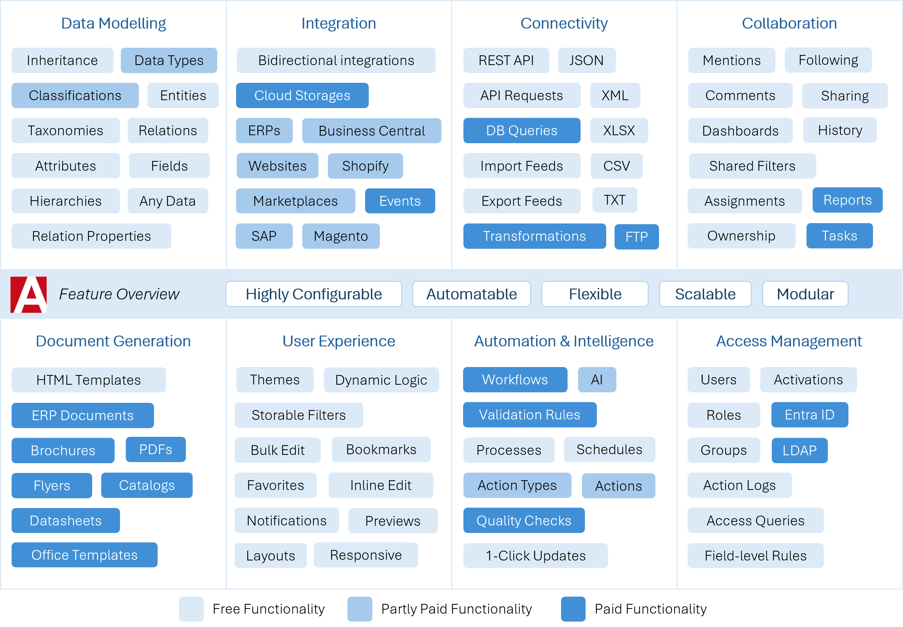
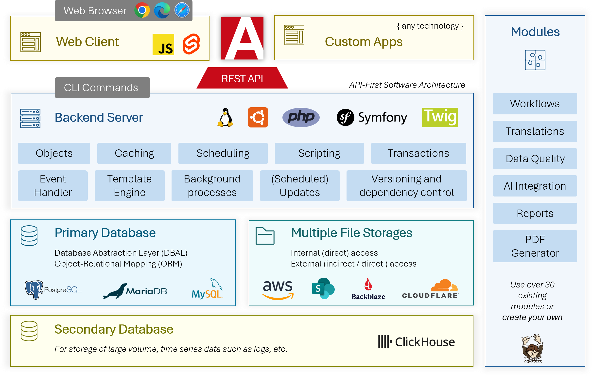
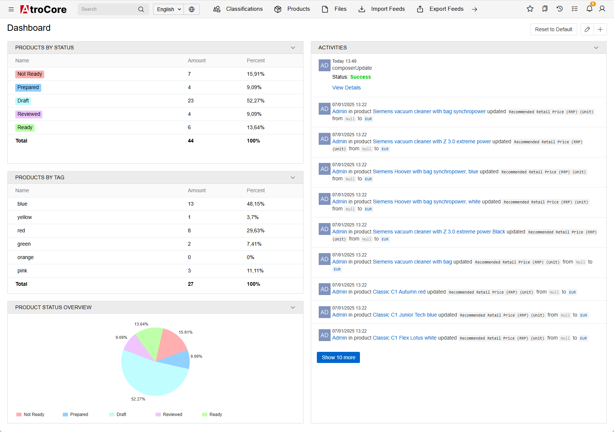
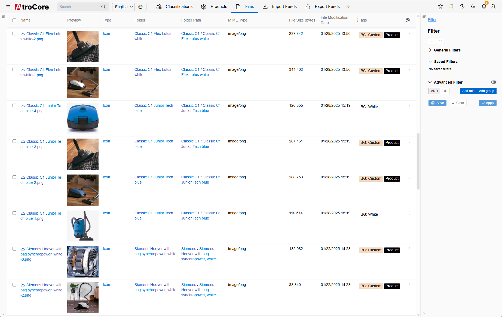
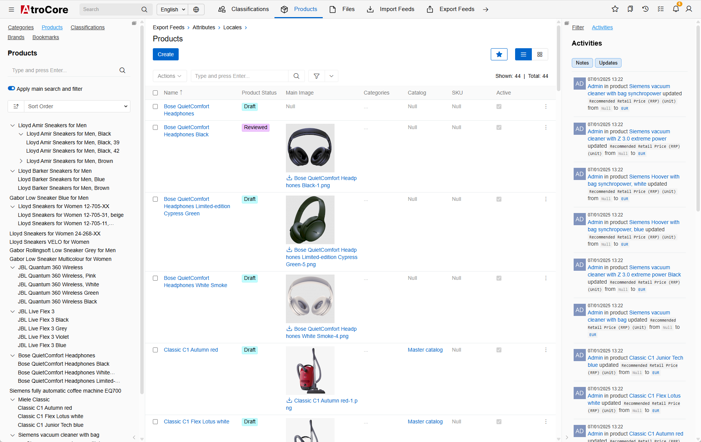
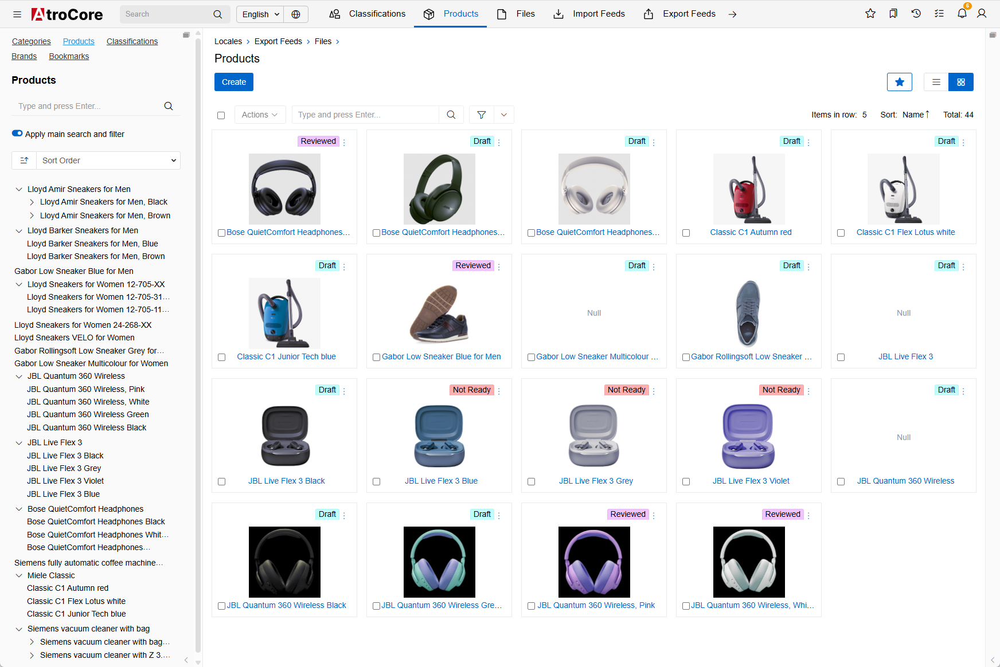
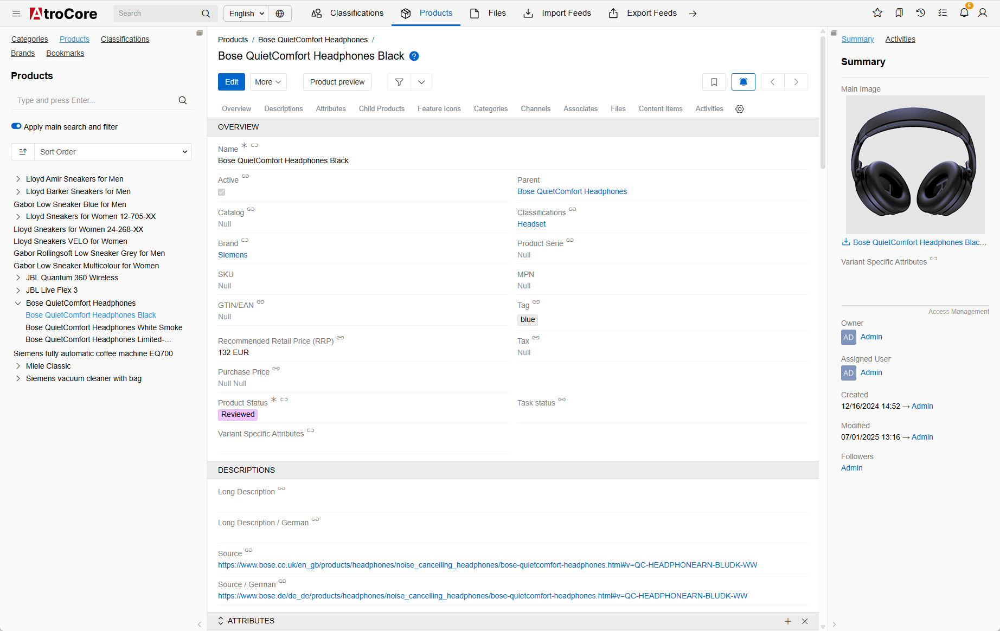
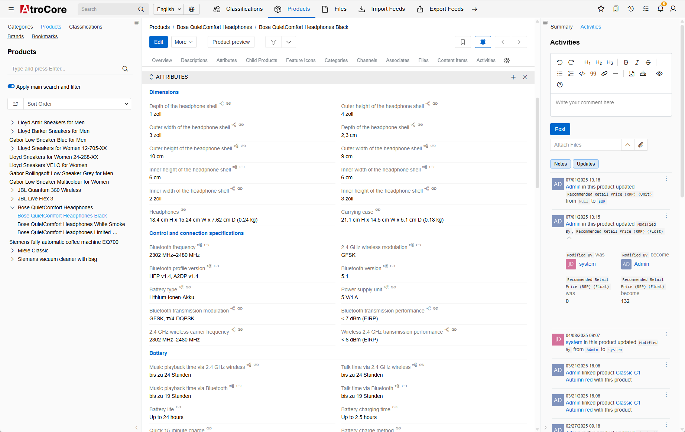
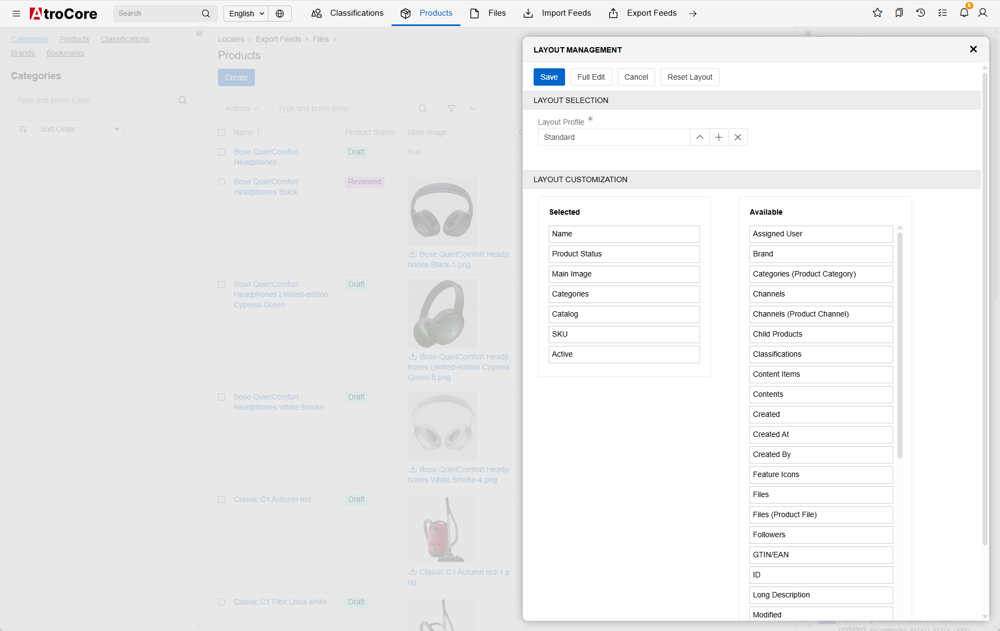
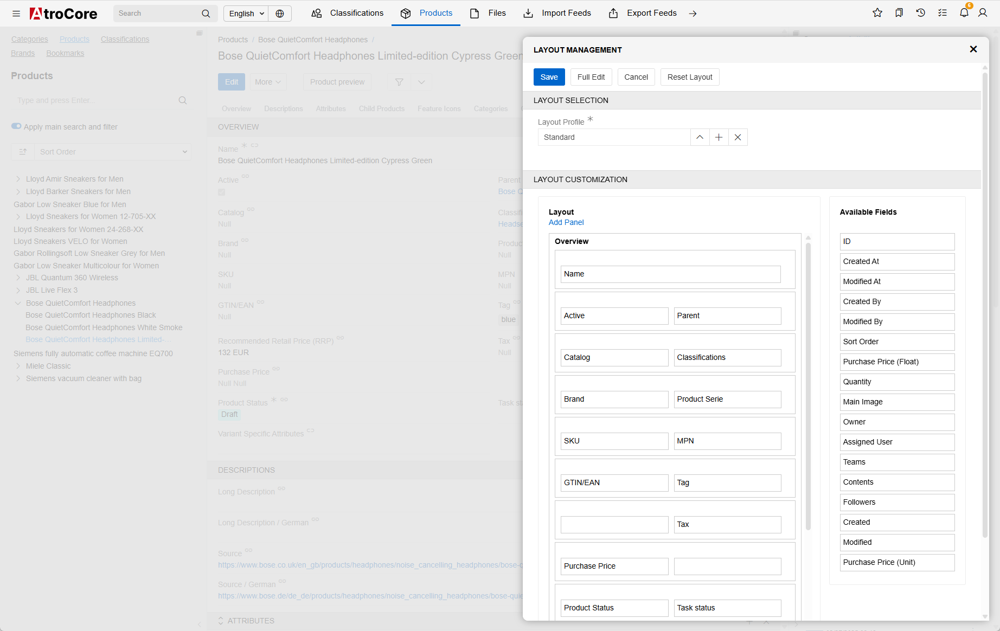

AtroCore is a powerful open-source data platform designed for [Master Data Management (MDM) and System Integration](https://www.atrocore.com/en). Highly configurable and feature-rich out of the box, AtroCore enables cost-effective, agile application development with minimal coding. Ideal for businesses seeking scalable, customizable solutions for managing and integrating enterprise data.
<!--
| Host            | URL                                             |
| ----------------| ----------------------------------------------- |
| Main Repository | https://gitlab.atrocore.com/atrocore/atrocore   |
| Mirror (GitHub) | https://github.com/atrocore/atrocore            | 
-->

AtroCore is a powerful, multi-layered system designed by developers who care about clean architecture and long-term maintainability. Inspired by modern frameworks like Symfony, it’s built with native PHP and enhanced by carefully selected components to solve specific tasks – for example, we use Doctrine DBAL for database interaction. The system primarily works with PostgreSQL, MySQL, or MariaDB as its main database engine. 

To tackle complex and long-running tasks, AtroCore includes a robust Job Manager. This allows you to control the number of workers based on your server’s capacity, ensuring efficient processing without overload. Complementing this, the Scheduled Jobs feature provides a convenient way to configure recurring tasks. AtroCore offers dynamic actions, flexible workflows, and real-time UI customization.

We believe you’ll find Atrocore not only solid and flexible, but exciting to work with.  
Dive into the [Developer Guide](https://help.atrocore.com/developer-guide) to set up, debug, work with the API, and reshape the system using a wide range of tools.

## History
Our software has been in active development since 2018. It all began with a simple idea: to create a better open-source PIM solution for our customers.

We are now able to confidently assure our customers that their requirements, extending well beyond just PIM, can be fully addressed without compromise. Our software offers a robust, comprehensive, and highly flexible toolbox designed to meet a wide range of business needs.

## Use Cases:

- Master Data Management
- Product Information Management
- System Integration Platform
- Business Process Management
- Data Warehouse Software
- Digital Asset Management
- Reference Data Management
- Low-code Platform for Custom Business Apps

### Free vs Paid

Every user, from small businesses to large enterprises, uses the same free core: AtroCore. This core can be extended with additional free and premium modules as needed.
We also offer SaaS Editions, hosted in the cloud, which include some or all premium modules depending on the edition.

- The core modules, including AtroCore, AtroPIM, Import, Export, and several others, are open-source and freely available. These free modules are more than enough for the needs of most users.
- Selected enterprise-level features, such as AI integration, advanced reporting, and automated data quality management, are offered through Premium Modules.

## Feature Overview

Please refer to [this page](https://www.atrocore.com/en/atrocore) to read the full feature description.

Please note that you currently need to install the PIM module to use Attribute Management.

## For Whom Is AtroCore?

AtroCore is the best fit **for businesses**, who want to:

* Unify all types of data across the organization
* Improve overall data quality
* Address custom business challenges with tailored solutions
* Store diverse data types and streamline associated business processes
* Synchronize any data across multiple third-party systems
* Extend and enhance the capabilities of existing software infrastructure
* Deliver added value and an optimal experience for employees, customers, and partners.

### Who is our Typical Adopter?

Companies whose needs go beyond the limitations of standard software solutions.

## Software which extends AtroCore

The following full-fledged software products are already available on the AtroCore basis:
* [AtroPIM (Product Information Management)](https://github.com/atrocore/atropim)

## Technologies

## Integrations

AtroPIM has a REST API and can be integrated with any third-party system, channel or marketplace. 
You can also use import and export functions or use our modules (import feeds and export feeds) to get even more flexibility.

We offer the following native paid integrations:

- **Multichannel Tools:** Channable, ChannelPilot, ChannelAdvisor and others
- **ERPs:** Odoo, SAP, SAP Business One, Business Central, Xentral, Infor and others
- **Marketplaces:** Amazon, Otto
- **E-Commerce Platforms:** Adobe Commerce (Magento 2), Shopware, Prestashop, WooCommerce, Shopify, Sylius and others.

Read [this article](https://store.atrocore.com/en/atrocore-integrations-for-erp-ecommerce-marketplaces) to better understand how our integrations work.

You can **build your own fully automated integration** with any third-party system via its REST / GraphQL API using our free modules: 
- Import: HTTP Requests and/or 
- Export: HTTP Requests.

Please [contact us](https://www.atrocore.com/contact), if you want to know more.

## What Are the Advantages of Using It?

* API-first development approach
* Really quick time-to-market and low implementation costs
* Highly configurable 
* Extensible - you can use our or write your own modules
* Open source (licensed under GPLv3), free with some Premium Modules
* REST API everything, incl. your custom configurations
* Web-based and platform independent
* Based on modern technologies
* Good code quality
* Modern mobile-friendly UI
* Easy to install, maintain and support.

## Requirements

* Dedicated (virtual) Linux-based server with root permissions. 
* Ubuntu as Operating System is recommended but not required.
* PHP 8.1 - 8.4.
* PostgreSQL 14.9 (or above, recommended) or MySQL 5.5.3 (or above).

> Please note, system will definitely NOT work on a usual hosting, a managed server hosting should be checked on a case-by-case basis – with a high probability it will NOT work.

## Installation (Getting Started)

Installation Guide is [here](https://help.atrocore.com/installation-and-maintenance/installation).

### Docker Installation

Installation Guide for Docker is [here](https://help.atrocore.com/installation-and-maintenance/installation/docker-configuration).
Docker Image is [here](https://gitlab.atrocore.com/atrocore/docker).

If you want to test AtroCore without PIM, simply uninstall the PIM module after installing the Docker Image.

> We recommend to use Docker Image to play with the system, and standard installation for production environment.

## Screenshots
|                                                                                          |                                                                                          |
| ---------------------------------------------------------------------------------------- | ---------------------------------------------------------------------------------------- |
|                              |                                          |
|                     |                  |
|        |        |
|  |  |

## Public Demo Instance

- URL: https://demo.atrocore.com/
- Login: admin
- Password: admin

## Contributing

- **Report bugs:** please [report bugs](https://github.com/atrocore/atrocore/issues/new).
- **Fix bugs:** please create a pull request in the affected repository including a step by step description to reproduce the problem.
- **Contribute features:** You are encouraged to create new features. Please contact us before you start.

## Localization

Would you like to help us translate UIs into your language, or improve existing translations?
- https://translate.atrocore.com/

## Documentation

- Please visit our Help Center (Documentation) - https://help.atrocore.com/

## Other Resources

- Report a Bug - https://github.com/atrocore/atrocore/issues/new
- Read our Release Notes - https://help.atrocore.com/release-notes/core
- Please visit our Community - https://community.atrocore.com
- Сontact us - https://www.atrocore.com/contact

## 📌Help Us Grow

If you find AtroCore useful:

- ⭐ Star the repo
- 🗣️ Share it with your network
- 🛠️ Contribute to the project

## License

AtroCore is published under the GNU GPLv3 [license](LICENSE.txt).
