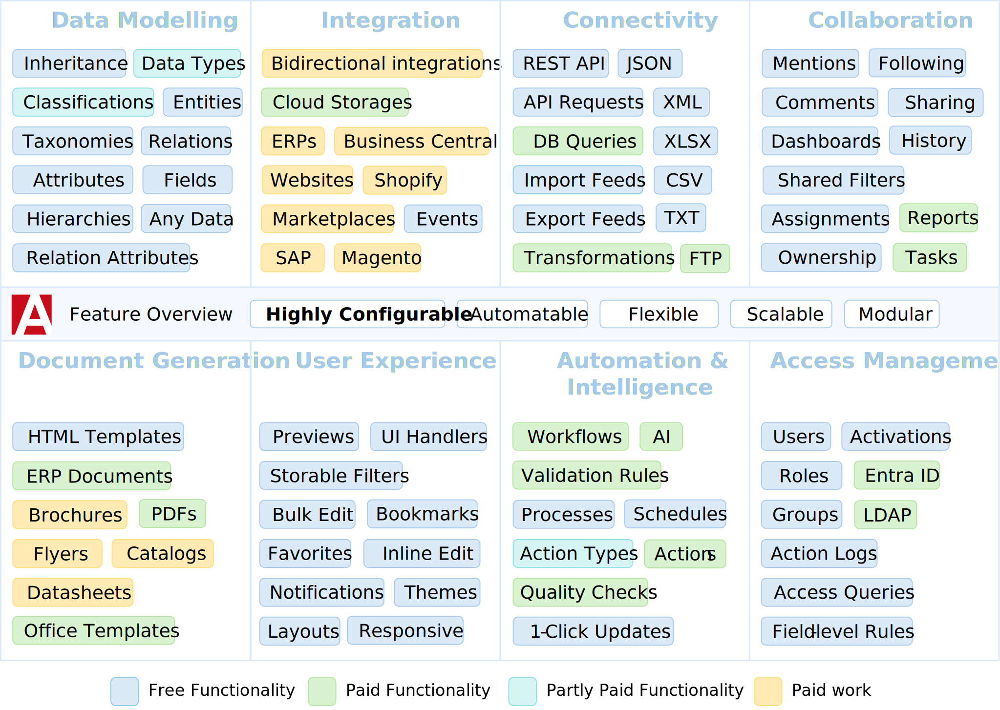
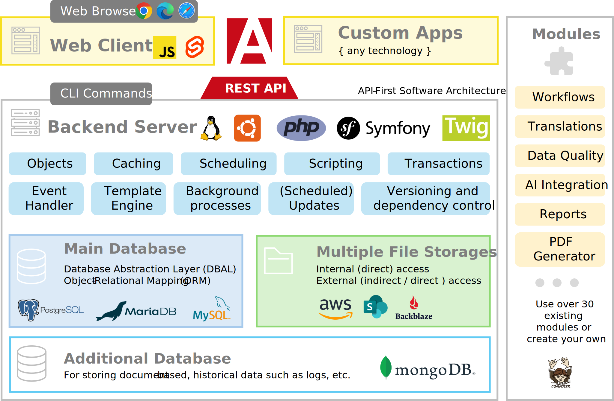

  

This repository is hosted on: https://gitlab.atrocore.com/atrocore/atrocore

GitHub mirror: https://github.com/atrocore/atrocore

> This repository is hosted by GitLab, we use GitHub to host its mirror. 

## What Is AtroCore? 

AtroCore is a open-source Data Platform, Master Data Management and Data Integration software. Thanks to its configuration possibilities it is an excellent tool for cost-effective and timely application development that comes with the powerful out-of-the-box functionality.

### AtroCore Software can be used for:

- Master Data Management
- Product Information Management
- Application Development Platform
- Data Integration Software
- Business Process Management
- Data Warehouse Software
- Enterprise Content Management (ECM)
- Digital Asset Management
- Reference Data Management

## Enterprise Edition?

There is no Enterprise Edition, only the Core, free modules and paid modules.

## Free vs Paid

- The core modules, including AtroCore, PIM, Import, Export, and several others, are open-source and freely available.
- These free modules are sufficient to meet the needs of the vast majority of users.
- Only selected enterprise-level features, such as AI integration, advanced reporting, and automated data quality management, are offered through paid modules.

## Feature Overview

Please refer to [this page](https://www.atrocore.com/en/atrocore) to read the full feature description.

Please note that you currently need to install the PIM module to use Attribute Management.

## For Whom Is AtroCore?

AtroCore is the best fit **for businesses**, who want to:

* Unify all types of data across the organization
* Improve overall data quality
* Address custom business challenges with tailored solutions
* Store diverse data types and streamline associated business processes
* Synchronize any data across multiple third-party systems
* Extend and enhance the capabilities of existing software infrastructure
* Deliver added value and an optimal experience for employees, customers, and partners.

### Who is our Typical Customer?

Companies whose needs go beyond the limitations of standard software solutions.

## Software which extends AtroCore

The following full-fledged software products are already available on the AtroCore basis:
* [AtroPIM (Product Information Management)](https://github.com/atrocore/atropim)

## Technologies

## Integrations

AtroPIM has a REST API and can be integrated with any third-party system, channel or marketplace. 
You can also use import and export functions or use our modules (import feeds and export feeds) to get even more flexibility.

We offer the following native paid integrations:

- **Multichannel Tools:** Channable, ChannelPilot, ChannelAdvisor and others
- **ERPs:** Odoo, SAP, SAP Business One, Business Central, Xentral, Infor and others
- **Marketplaces:** Amazon, Otto
- **E-Commerce Platforms:** Adobe Commerce (Magento 2), Shopware, Prestashop, WooCommerce, Shopify, Sylius and others.

Read [this article](https://store.atrocore.com/en/atrocore-integrations-for-erp-ecommerce-marketplaces) to better understand how our integrations work.

Please [contact us](https://www.atrocore.com/contact), if you want to know more.

You can **build your own fully automated integration** with any third-party system via its REST / GraphQL API using our free modules: 
- Import: Http Requests and/or 
- Export: Http Requests.

## What Are the Advantages of Using It?

* API-first development approarch
* Really quick time-to-market and low implementation costs
* Highly Configurable
* Extensible - you can use our or write your own modules
* Open source (licensed under GPLv3), free with some enterprise-level paid modules
* REST API for your custom data model
* Web-based and platform independent
* Based on modern technologies
* Good code quality
* User-friendly and mobile-friendly
* Easy to maintain and support

## Requirements

* Dedicated (virtual) Linux-based server with root permissions. 
* Ubuntu as Operating System is recommended but not required.
* PHP 8.1 - 8.4.
* MySQL 5.5.3 (or above) or PostgreSQL 14.9 (or above).

> Please note, system will definitely NOT work on a usual hosting, a managed server hosting should be checked on a case-by-case basis – with a high probability it will NOT work.

## Installation

Installation Guide is [here](https://help.atrocore.com/installation-and-maintenance/installation).

Installation Guide for Docker is [here](https://help.atrocore.com/installation-and-maintenance/installation/docker-configuration).

## Demo

- URL: https://demo.atropim.com/
- Login: admin
- Password: admin
> This is a Demo Instance of AtroCore with a PIM module installed (AtroPIM Demo).

## License

AtroCore is published under the GNU GPLv3 [license](LICENSE.txt).

## Contributing
- **Report bugs:** please [report bugs](https://github.com/atrocore/atrocore/issues/new)
- **Fix bugs:** please create a pull request in the affected repository including a step by step description to reproduce the problem.
- **Contribute features:** You are encouraged to create new features. Please contact us before you start.

## Resources

- Report a Bug - https://github.com/atrocore/atrocore/issues/new
- Please visit our Help Center (Documentation) - https://help.atrocore.com/
- Read our Release Notes - https://help.atrocore.com/release-notes/pim
- Please visit our Community - https://community.atrocore.com
- Сontact us - https://www.atrocore.com/contact
