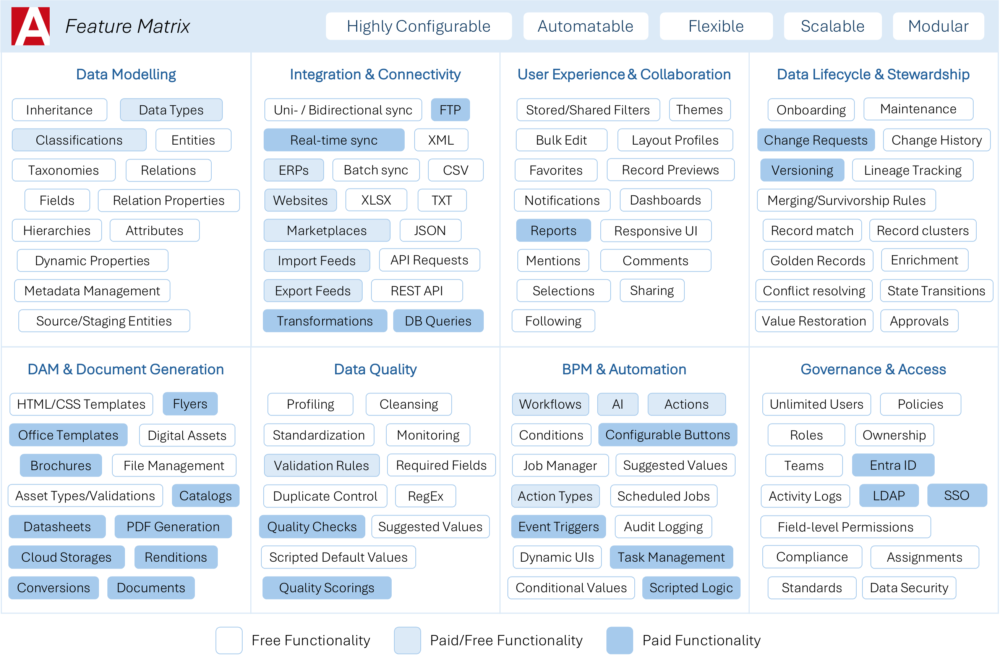
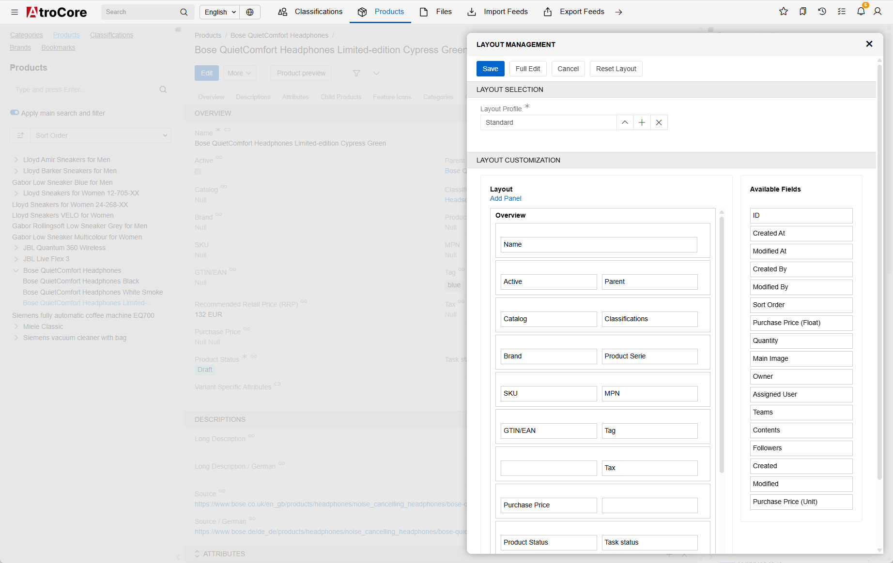

AtroCore is a powerful open-source data platform designed for [Master Data Management (MDM) and System Integration](https://www.atrocore.com/en). Highly configurable and feature-rich out of the box, AtroCore enables cost-effective, agile application development with minimal coding. Ideal for businesses seeking scalable, customizable solutions for managing and integrating enterprise data.
<!--
| Host            | URL                                             |
| ----------------| ----------------------------------------------- |
| Main Repository | https://gitlab.atrocore.com/atrocore/atrocore   |
| Mirror (GitHub) | https://github.com/atrocore/atrocore            | 
-->

AtroCore is a powerful, multi-layered system designed by developers who care about clean architecture and long-term maintainability. Inspired by modern frameworks like Laminas / Mezzio, Symfony, it’s built on open PHP standards (PSR-7, PSR-11, PSR-15) and enhanced by carefully selected best-of-breed components to solve specific tasks – for example, we use Doctrine DBAL for database interaction and FastRoute for HTTP routing. The system primarily works with PostgreSQL, MySQL, or MariaDB as its main database engine.

To tackle complex and long-running tasks, AtroCore includes a robust Job Manager. This allows you to control the number of workers based on your server’s capacity, ensuring efficient processing without overload. Complementing this, the Scheduled Jobs feature provides a convenient way to configure recurring tasks. AtroCore offers dynamic actions, flexible workflows, and real-time UI customization.

We believe you’ll find Atrocore not only solid and flexible, but exciting to work with.  
Dive into the [Developer Guide](https://help.atrocore.com/developer-guide) to set up, debug, work with the API, and reshape the system using a wide range of tools.

## Evolution

Active development of our software began in 2018, driven by a clear mission: to engineer a highly customizable, open-source Product Information Management (PIM) solution that overcomes the limitations of rigid enterprise platforms.

Today, our software has evolved into a robust, comprehensive ecosystem built on a highly flexible, modular architecture. This adaptable framework allows us to confidently assure our clients that their requirements – extending far beyond standard PIM functions – can be fully accommodated without compromise. By offering a versatile technical toolbox, we enable organizations to seamlessly scale, integrate, and customize their data models to meet complex, ever-changing business demands.

## Our Customers

Our customers are manufacturers, wholesalers, and distributors that manage complex and business critical data across products, assets, and processes. They rely on AtroCore to handle large and sophisticated data models, extensive product portfolios, and complex variant, classification, and integration requirements.

From mid market companies to global enterprises, organizations choose AtroCore when their needs go beyond the limitations of standard software solutions and when flexibility, scalability, and seamless integration with existing software landscapes are essential.

We are proud to work with leading international brands and market leaders, including:

* Acer
* Dallmayr
* Bridgestone
* AEG
* Ryobi
* Milwaukee
* Dirt Devil

## Use Cases:

- Master Data Management
- Product Information Management
- System Integration Platform
- Business Process Management
- Data Warehouse Software
- Digital Asset Management
- Reference Data Management
- Compliance
- Low-code Platform for Custom Business Apps

### Free vs Paid

Every business, from small startups to large enterprises, use the exact same powerful, open-source core: AtroCore. Because our free core modules – including AtroPIM, Import, and Export – are incredibly feature-rich, the **free version is more than enough to satisfy the needs of the vast majority of users**.

You only need to expand your system with paid Premium Modules if your business scales to require highly specialized, enterprise-grade capabilities.

For teams that prefer a managed cloud environment, we offer hosted SaaS plans.

## Feature Overview

Please refer to [this page](https://www.atrocore.com/en/atrocore) to read the full feature description.

Please note that you currently need to install the PIM module to use Attribute Management.

## For Whom Is AtroCore?

AtroCore is the best fit **for businesses**, who want to:

* Unify and manage all types of data across the organization from a single platform
* Improve data quality, consistency, and governance
* Centralize data from multiple systems and eliminate data silos
* Build tailored business applications and address custom business requirements
* Store and manage complex and diverse data structures and relationships
* Model, automate, and streamline data-driven business processes and workflows
* Synchronize and distribute data across any third party systems and channels
* Integrate existing software and extend its capabilities without replacing it
* Create a scalable and flexible foundation for future digital initiatives
* Reduce manual work and improve operational efficiency through automation
* Enable cross departmental collaboration and transparency
* Deliver added value and an optimal experience for employees, customers, partners, and end users.

## Software which extends AtroCore

The following full-fledged software products are already available on the AtroCore basis:
* [AtroPIM (Product Information Management)](https://github.com/atrocore/atropim)

## Technologies

- Backend: PHP, powered by enterprise-grade Symfony and Laminas components.
- Frontend: JavaScript, migrating from legacy Backbone.js to a modern, reactive Svelte architecture.
- Database: PostgreSQL, MySQL, and MariaDB, managed via the Doctrine DBAL abstraction layer.
- API: Fully standardized using OpenAPI (Swagger) specifications.
- Update Management: Driven by Composer for seamless dependency and version handling.

### Standards & Components

AtroCore is built around **open standards**, not framework lock-in. We adopt components from the PHP ecosystem where they are the best fit for the task – and replace them when better options exist.

**HTTP layer** follows [PSR-7](https://www.php-fig.org/psr/psr-7/) (HTTP messages) and [PSR-15](https://www.php-fig.org/psr/psr-15/) (middleware and request handlers) strictly. Every request passes through a typed middleware pipeline dispatched via [FastRoute](https://github.com/nikic/FastRoute). Handlers are registered via PHP attributes and documented automatically as OpenAPI 3.0. A route that is not fully documented is simply not registered – incomplete API definitions cannot exist at runtime. Every request and response is automatically validated against the OpenAPI schema, so the API documentation is always a truthful contract, not a wishful description.

**Dependency injection** is powered by [Laminas ServiceManager](https://github.com/laminas/laminas-servicemanager) – a [PSR-11](https://www.php-fig.org/psr/psr-11/) compliant container. We are part of the Laminas ecosystem where it makes sense, but we are not tied to it. We take the best from it.

**Database** access goes through [Doctrine DBAL](https://www.doctrine-project.org/projects/dbal.html), supporting PostgreSQL (recommended), MySQL, and MariaDB.

## Integrations

AtroPIM has a REST API and can be integrated with any third-party system, channel or marketplace. 
You can also use import and export functions or use our modules (import feeds and export feeds) to get even more flexibility.

We offer the following native paid integrations:

- **Multichannel tools**: Channable, ChannelPilot, Lengow, Feedonomics, Productsup, Channelengine, ChannelAdvisor, and others
- **ERPs**: SAP S/4 HANA, Odoo, SAP Business One, Oracle Fusion, Business Central, Acumatica, Infor, Oracle Netsuite, Xentral, Infor, Epicor. Work4all, and others
- **E-Commerce Platforms**: Adobe Commerce (Magento 2), Bigcommerce, Saleor, Commercetools, Sap Commerce Cloud, Salesforce Commerce Cloud, Shopware, Prestashop, WooCommerce, Shopify, Sylius, Vendure,  and others
- **Marketplaces**: Amazon, Otto.

Read [this article](https://store.atrocore.com/en/atrocore-integrations-for-erp-ecommerce-marketplaces) to better understand how our integrations work.

You can **build your own fully automated integration** with any third-party system via its REST / GraphQL API using our free modules: 
- Import: HTTP Requests and/or 
- Export: HTTP Requests.

Please [contact us](https://www.atrocore.com/contact), if you want to know more.

## Why Developers Choose AtroCore?

* API first architecture with complete REST API coverage, including custom configurations and data models
* Rapid development and quick time to market with low implementation costs
* Highly configurable and adaptable to virtually any business use case
* Easily extensible through modules, plugins, and custom development
* Open source (GPLv3 licensed) with a free core and optional Premium Modules
* Flexible data model that can be tailored without modifying the core code
* Web based and platform independent
* Built on modern, proven technologies and development standards
* Clean, maintainable, and well structured codebase
* Modern, responsive, and mobile friendly user interface
* Easy to install, maintain, upgrade, and support
* Seamless integration with third party systems through REST APIs and webhooks
* Suitable for building custom business applications, data management solutions, and integration platforms
* Scalable architecture for projects ranging from small implementations to enterprise deployments

## System Requirements

- Linux-based **root or managed server** (recommended: Ubuntu LTS). 
- **Minimum Ressources:**
  - 2 vCPU
  - 4 GB RAM
  - 80 GB SSD Storage
- **Software**:
  - Apache Web Server or Nginx
  - PHP 8.1 - 8.4.
  - PostgreSQL 14.9+ (recommended) or MySQL 5.5+ or MariaDB 5.5+.

> Please note that AtroCore/AtroPIM will not run on standard shared hosting environments due to its technical requirements and resource needs. Managed server hosting can be suitable, but each provider and configuration should be evaluated individually. In most cases it will work.

## Installation (Getting Started)

Installation Guide is [here](https://help.atrocore.com/installation-and-maintenance/installation).

### Docker Installation

Installation Guide for Docker is [here](https://help.atrocore.com/installation-and-maintenance/installation/docker-configuration).

Docker Image is [here](https://github.com/atrocore/docker).

If you want to test AtroCore without PIM, simply uninstall the PIM module after installing the Docker Image.

> We recommend to use Docker Image to play with the system, and standard installation for production environment.

## Screenshots
|                                                                                          |                                                                                          |
| ---------------------------------------------------------------------------------------- | ---------------------------------------------------------------------------------------- |
|                              |                                          |
|                     |                  |
|        |        |
|  |  |

## Public Demo Instance

- URL: https://demo.atrocore.com/
- Login: admin
- Password: admin

## Contributing

- **Report bugs:** please [report bugs](https://github.com/atrocore/atrocore/issues/new).
- **Fix bugs:** please create a pull request in the affected repository including a step by step description to reproduce the problem.
- **Contribute features:** You are encouraged to create new features. Please contact us before you start.

## Localization

Would you like to help us translate UIs into your language, or improve existing translations?
- https://translate.atrocore.com/

## Documentation

- Please visit our Help Center (Documentation) - https://help.atrocore.com/

## Other Resources

- Report a Bug - https://github.com/atrocore/atrocore/issues/new
- Read our Release Notes - https://help.atrocore.com/release-notes/core
- Please visit our Community - https://community.atrocore.com
- Сontact us - https://www.atrocore.com/contact

## 📌Help Us Grow

If you find AtroCore useful:

- ⭐ Star the repo
- 🗣️ Share it with your network
- 🛠️ Contribute to the project

## License

AtroCore is published under the GNU GPLv3 [license](LICENSE.txt).
