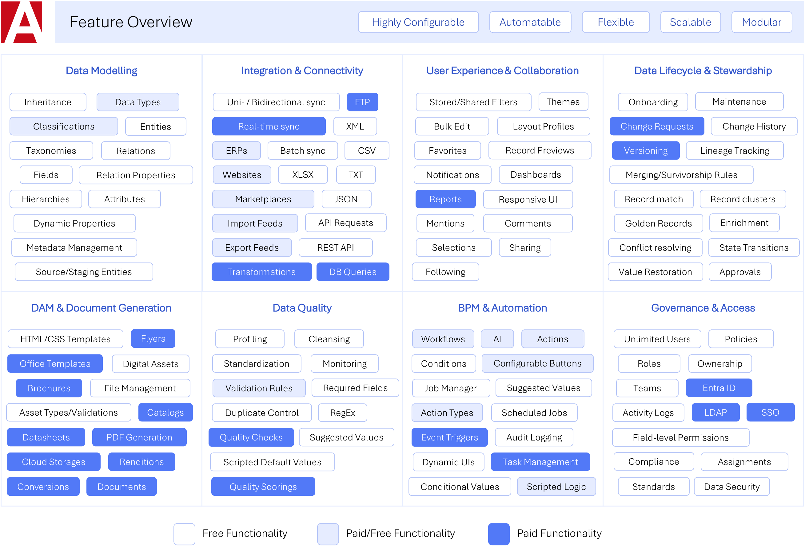
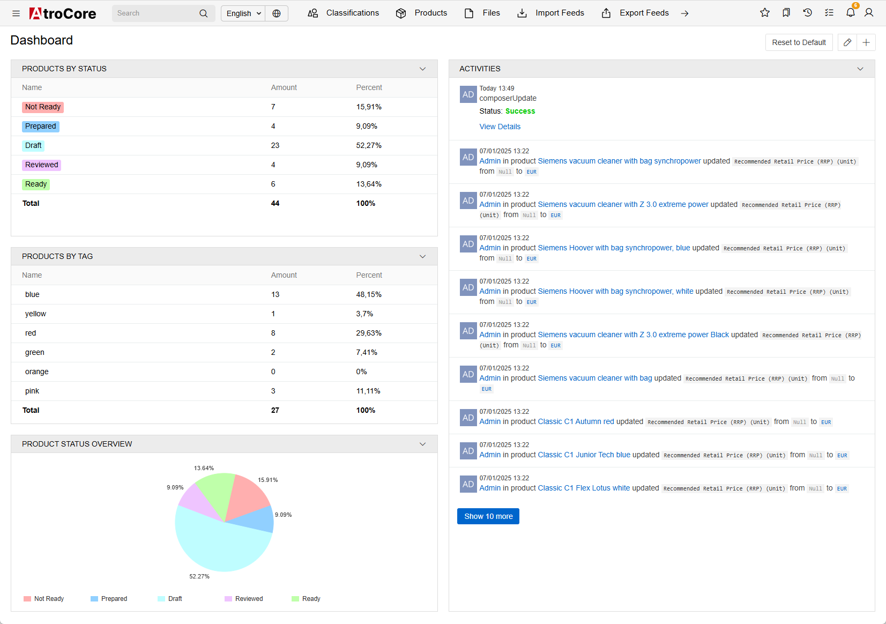
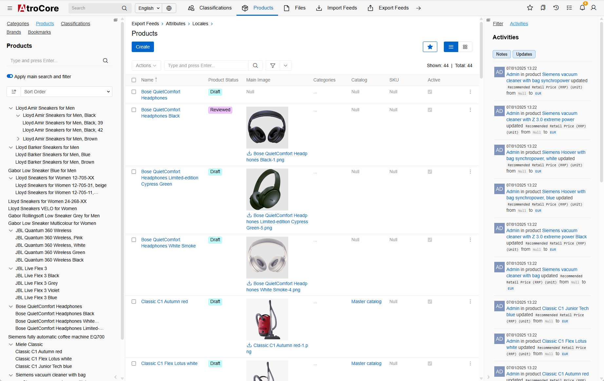
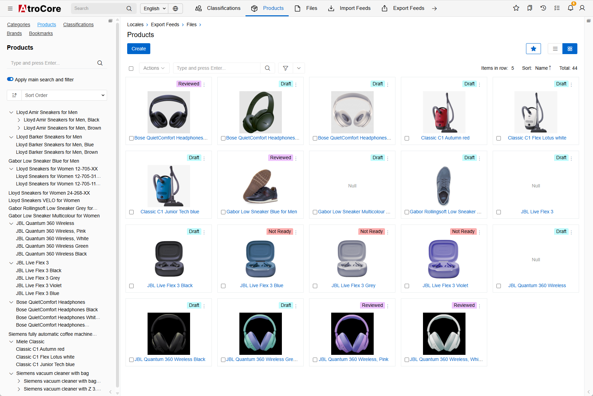
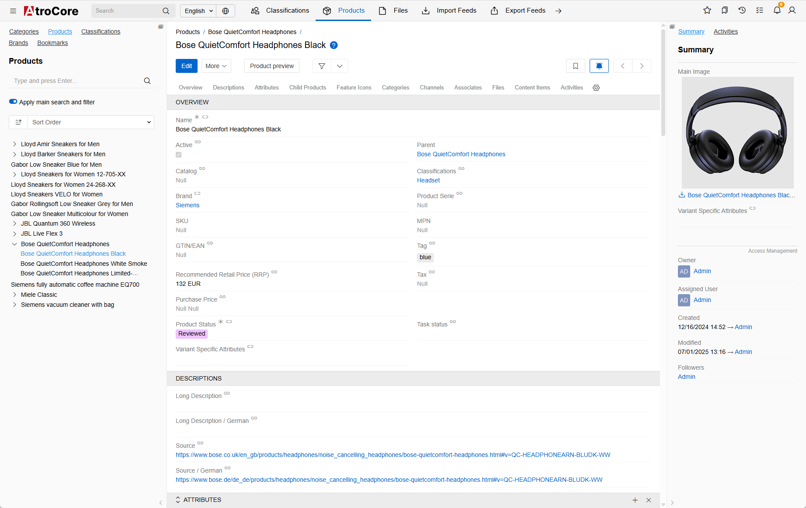
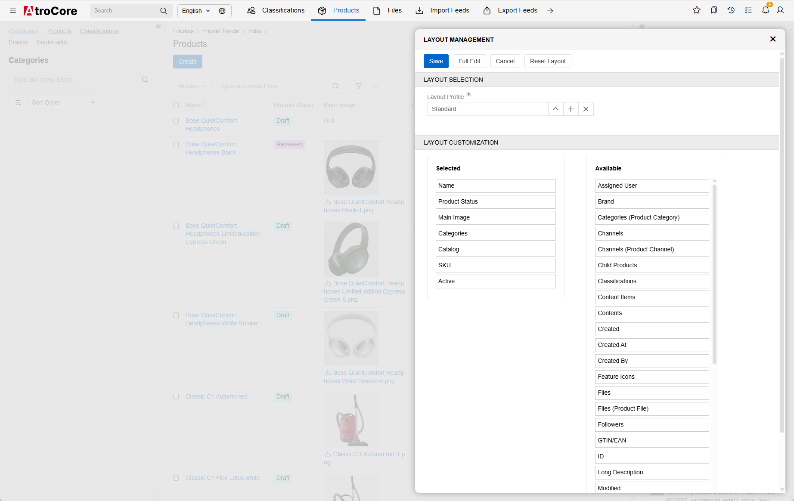

    

<b><a href="https://www.atrocore.com">AtroCore</a> is an open-source Business Application Platform for managing complex business data, integrating systems, automating processes, and building flexible business applications.</b>

Highly configurable and feature-rich out of the box, AtroCore enables cost-effective, agile business application development with no or minimal coding. Ideal for businesses seeking scalable, customizable solutions for managing and integrating enterprise data.

 

## What AtroCore Does

AtroCore covers four capabilities on one platform and one data model. Most projects start with one of them and add the others over time.

### Manage complex business data

Define your own entities, attributes, relations, hierarchies, and classifications without modifying core code. AtroCore is designed for data models that standard software cannot represent: deep hierarchies, thousands of attributes, variants, multi-language content, units of measure, and multi-currency values. Data inheritance, validation rules, change history, and fine-grained access control apply to every entity you create.

### Integrate systems

The REST API covers 100% of platform functionality, including entities and fields you added yourself. Import and export modules handle files and HTTP requests, so you can connect to any system that exposes a REST or GraphQL API. Native integrations for ERP, e-commerce, marketplace, DAM, CMS, and PLM systems are available as Premium Modules.

### Automate processes

Configurable actions, workflows, and scheduled jobs let you model business logic without custom development. The Job Manager runs long-running and high-volume tasks in the background, with worker counts you control based on server capacity. Notifications keep users and systems informed of state changes.

### Build business applications

Data model, user interface, permissions, and automation are configured in the admin panel rather than coded. Layouts adjust based on logic you define, record previews are customizable with HTML and CSS, and dashboards are personalized per user. When configuration is not enough, the module system and the API let developers extend the platform without forking it.

 

## Who AtroCore Is For

From mid-market companies to global enterprises, organizations choose AtroCore when their needs go beyond the limitations of standard software solutions and when flexibility, scalability, and seamless integration with existing software landscapes are essential.

AtroCore fits organizations that need to:

- Unify and manage data of any type across the organization from a single platform
- Improve data quality, consistency, and governance
- Centralize data from multiple systems and eliminate data silos
- Store and manage complex data structures and relationships
- Model and automate data-driven processes and workflows
- Synchronize and distribute data across third-party systems and channels
- Extend existing software instead of replacing it
- Build tailored business applications for requirements that standard software does not cover
- Create a scalable foundation for future digital initiatives
- Enable cross-departmental collaboration and transparency
- Handle very large datasets datasets without loss of performance.

In this [demo video](https://vimeo.com/1215540661) we demonstrate an instance with 50+ million products and 1+ billion attribute values (20 attributes per product).

 

## Solutions

### Master Data Management

AtroCore is a complete MDM system in its own right, not an MDM extension to another application. You model golden records for any domain: products, suppliers, customers, materials, locations, or assets. Source data is imported from multiple systems, normalized against your reference data and units, validated, and distributed onward through the REST API or scheduled exports. Classifications, hierarchies, and inheritance keep large domains structured, while access control, change history, and action history make ownership and auditability explicit.

### Product Information Management

[AtroPIM](https://github.com/atrocore/atropim) is the primary application built on AtroCore and is available as a free module. It adds product-specific structures such as catalogs, categories, product families, variants, and channel-specific content on top of the platform, and inherits every platform capability including the API, automation, and access control.

### System Integration Platform

Because the API covers all functionality and the data model is yours to define, AtroCore is often deployed as the layer between systems that were never designed to talk to each other. It consolidates data from ERP, PLM, e-commerce, and other sources, applies your rules, and pushes results to the channels that need them.

### Further use cases

- Digital Asset Management and file management
- Business Process Management
- Reference Data Management
- Data warehousing and reporting
- Compliance and regulatory data management
- Low-code platform for custom business applications

 

## Feature Overview

### Modularity – Free Core, Free Modules and Premium Modules

Every business, from small startups to large enterprises, runs on the same powerful, open-source core: AtroCore. The free core modules provide a comprehensive set of features, making the free version more than sufficient for the vast majority of users.

As your requirements grow, you can extend the platform with paid Premium Modules that add specialized and enterprise-grade capabilities.

### Data modeling and quality

- Configurable data model
- Flexible attribute management
- 20+ data types including nested attributes
- Classifications for all entities
- Hierarchies and data inheritance
- Bidirectional associations
- Unit management with automatic conversion
- Multi-currency support
- Content localization
- Digital asset and file management

### Integration and data exchange

- Complete REST API coverage, including custom entities and fields
- Import and export modules for files and HTTP requests
- Native integrations available as Premium Modules
- Extensible with custom modules

### Automation and operations

- Configurable actions and workflows
- Scheduled jobs
- Background job management with configurable workers
- System and email notifications
- Change and action history
- Updates with dependency management

### Interfaces and access

- Fully customizable user interfaces
- Logic-based automatic layout adjustments
- Personalized dashboards and layouts
- Customizable record previews using HTML and CSS
- Advanced filtering and saved searches
- Bulk data and relation editing
- Fine-grained access control
- Responsive, mobile-friendly interface

The full feature description is available [here](https://www.atrocore.com/en/atrocore).

### Product Development Roadmap

- Check out our [roadmap](https://community.atrocore.com/t/product-roadmap/237).

 

## Integrations

With a REST API covering 100% of its functionality, AtroCore connects to external systems, sales channels, and marketplaces.

Native integrations are available as Premium Modules in the following categories:

| Category | Examples |
| --- | --- |
| ERP | SAP S/4HANA, SAP Business One, Odoo, Oracle Fusion, Microsoft Dynamics 365 Business Central, Acumatica, Infor, Oracle NetSuite, Xentral, Epicor, work4all |
| E-commerce | Adobe Commerce (Magento 2), Shopware, Shopify, BigCommerce, Saleor, commercetools, SAP Commerce Cloud, Salesforce Commerce Cloud, PrestaShop, WooCommerce, Sylius, Vendure |
| Marketplaces | Amazon, OTTO |
| Multichannel and feed tools | Channable, ChannelPilot, Lengow, Feedonomics, Productsup, ChannelEngine, ChannelAdvisor |
| DAM | Cloudinary, Bynder, Canto, CELUM |
| CMS and DXP | Contentful, TYPO3, Strapi, Adobe Experience Manager, Drupal, Acquia, Optimizely, Sitecore, Sanity, Storyblok |
| PLM and PDM | Autodesk Fusion Manage, Aras Innovator, SOLIDWORKS PDM, OpenBOM, Propel PLM, Autodesk Vault, Teamcenter, Windchill |

Beyond this list, you can build a fully automated integration with any system that exposes a REST or GraphQL API using the free **Import: HTTP Requests** and **Export: HTTP Requests** modules.

[Contact us](https://www.atrocore.com/contact) to discuss a specific system.

 

## Architecture and Standards

AtroCore is built on open PHP standards rather than framework lock-in. Components from the PHP ecosystem are adopted where they fit the task and replaced when better options appear.

**HTTP layer.** Follows [PSR-7](https://www.php-fig.org/psr/psr-7/) for HTTP messages and [PSR-15](https://www.php-fig.org/psr/psr-15/) for middleware and request handlers. Every request passes through a typed middleware pipeline dispatched via [FastRoute](https://github.com/nikic/FastRoute). Handlers are registered through PHP attributes and documented automatically as OpenAPI 3.0. A route that is not fully documented is not registered, so incomplete API definitions cannot exist at runtime. Requests and responses are validated against the OpenAPI schema, which keeps the documentation an accurate contract.

**Dependency injection.** Powered by [Laminas ServiceManager](https://github.com/laminas/laminas-servicemanager), a [PSR-11](https://www.php-fig.org/psr/psr-11/) compliant container.

**Database.** Access goes through [Doctrine DBAL](https://www.doctrine-project.org/projects/dbal.html), supporting PostgreSQL (recommended), MySQL, and MariaDB.

**Background processing.** The Job Manager handles long-running tasks with a configurable number of workers. Scheduled Jobs cover recurring tasks.

| Layer | Technology |
| --- | --- |
| Backend | PHP, with Symfony and Laminas components |
| Frontend | JavaScript, migrating from Backbone.js to Svelte |
| Database | PostgreSQL, MySQL, MariaDB via Doctrine DBAL |
| API | OpenAPI (Swagger) specifications |
| Updates | Composer for dependency and version handling |

The [Developer Guide](https://help.atrocore.com/developer-guide) covers setup, debugging, API work, and extending the system.

 

## Deployment

Every deployment model runs the same open-source core. The choice affects who operates the infrastructure, not which features you get, and you can move between models later.

| Option | You get | You manage |
| --- | --- | --- |
| On-premise | Full control over infrastructure, data location, update schedule, and custom code. Runs on your own server or in your own cloud account. | Server, database, backups, monitoring, updates |
| Hosted SaaS | A managed environment with infrastructure, backups, monitoring, and updates handled for you. | Your data and configuration |

[Contact us](https://www.atrocore.com/contact) to discuss which model fits your requirements.

  

## Why Developers Choose AtroCore?

* API first architecture with complete REST API coverage, including custom configurations and data models
* Rapid development and quick time to market with low implementation costs
* Highly configurable and adaptable to virtually any business use case
* Easily extensible through modules, plugins, and custom development
* Open source (GPLv3 licensed) with a free core and optional Premium Modules
* Flexible data model that can be tailored without modifying the core code
* Web based and platform independent
* Built on modern, proven technologies and development standards
* Clean, maintainable, and well structured codebase
* Modern, responsive, and mobile friendly user interface
* Easy to install, maintain, upgrade, and support
* Seamless integration with third party systems through REST APIs and webhooks
* Suitable for building custom business applications, data management solutions, and integration platforms
* Scalable architecture for projects ranging from small implementations to enterprise deployments

 

## Installation (Getting Started)

- Installation Guide is [here](https://help.atrocore.com/installation-and-maintenance/installation).

### Docker Installation

- Installation Guide for Docker is [here](https://help.atrocore.com/installation-and-maintenance/installation/docker-configuration).
- Docker Image is [here](https://github.com/atrocore/docker).

If you want to test AtroCore without PIM, simply uninstall the PIM module after installing the Docker Image.

> We recommend to use Docker Image to play with the system, and standard installation for production environment.

 

## System Requirements

- Linux-based **root or managed server** (recommended: Ubuntu LTS). 
- **Minimum Ressources:**
  - 2 vCPU
  - 4 GB RAM
  - 80 GB SSD Storage
- **Software**:
  - Apache Web Server or Nginx
  - PHP 8.4 - 8.5.
  - PostgreSQL 14.9+ (recommended) or MySQL 5.5+ or MariaDB 5.5+.

> AtroCore and AtroPIM do not run on standard shared hosting because of their technical requirements and resource needs. Managed server hosting can work, but each provider and configuration should be evaluated individually.

 

## Screenshots
|                                                                                          |                                                                                          |
| ---------------------------------------------------------------------------------------- | ---------------------------------------------------------------------------------------- |
|                              |                                          |
|                     |                  |
|        |        |
|  |  |

 

## Public Demo Instance

- URL: https://demo.atrocore.com/
- Login: admin
- Password: admin

 

## Contributing

- **Report bugs:** please [report bugs](https://github.com/atrocore/atrocore/issues/new).
- **Fix bugs:** please create a pull request in the affected repository including a step by step description to reproduce the problem.
- **Contribute features:** You are encouraged to create new features. Please contact us before you start.

 

## Localization

Would you like to help us translate UIs into your language, or improve existing translations?
- https://translate.atrocore.com/

 

## Documentation

- Please visit our Help Center (Documentation) - https://help.atrocore.com/
- Developer Documentation: https://help.atrocore.com/latest/developer-guide

 

## Other Resources

- Report a Bug - https://github.com/atrocore/atrocore/issues/new
- Read our Release Notes - https://help.atrocore.com/release-notes/core
- Please visit our Community - https://community.atrocore.com (use github account to login)
- Сontact us - https://www.atrocore.com/contact

 

## Help Us Grow

If you find AtroCore useful:

- ⭐ Star the repo
- 🗣️ Share it with your network
- 🛠️ Contribute to the project

 

## License

AtroCore is published under the GNU GPLv3 [license](LICENSE.txt).
