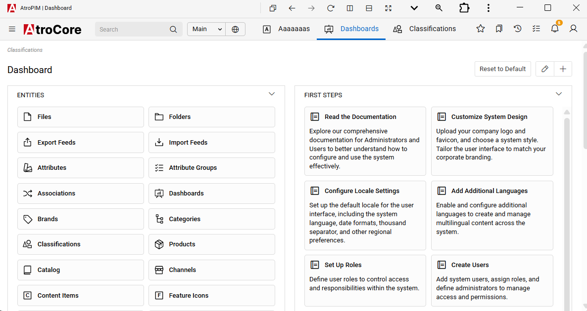

---
title:  Configuring AtroCore
--- 

For high-quality product data, it's essential to properly configure the main entities within the system before beginning its use. The term “entity” is used for modules or tables of structured data that are stored in the system with a specific purpose. So, the categories, channels, associations, catalogs, etc. count as entities. The entities can be linked to one another, for example, a product can belong to several categories at the same time.

The user does not necessarily have to use all available entities. If he does not need some entities, these can simply be deactivated, and vice versa, if further entities are required, these can also be created and linked to existing entities.

In this article, we assume the requirements of an average user who needs all entities. We will outline the necessary configurations for optimal system functionality. Below, we'll explain which entities should be configured to ensure comprehensive and effective system operation.

## Configure attributes

A product attribute determines a certain property of a product. Thanks to the typing of the attributes, their values are also typed. The product attributes are not only used to describe the product in full, but also for the filters to help the end customer find the required product more quickly. This is precisely why the product description with the attributes is very important. Typical attributes for clothing are, for example, size and color.

AtroPIM has 14 attribute types. The use of attribute types is necessary for better typing and corresponding validation of the data in the system. For more information on attributes and their types, please read the [documentation](../../03.administration/12.attribute-management/01.attributes/).

## Configure associations 

Associations are used to store various relationships between the products. Such relationships may appear interesting to potential customers for a variety of reasons - one may want to buy a replacement for an existing product, another may be interested in certain associated products, etc. Associations can be both one-sided (product A is associated with product B, but not the other way around ) as well as bilateral (if product A is associated with product B, then product B is also associated with product A).

With AtroPIM each user can configure the relationship types he intends to use himself. The following types of relationships are pre-configured:

- Replaces
- Is replacement of
- Cross-selling
- Up-selling
- Consist of
- Is part of
- etc.

## Configure Classifications

The definition of a Classification is the first step in segmenting the user's product range. You need Classifications in order to unify the descriptions of the products of the same nature. Classifications determine which attributes a product from this Classification should have.

For more information on the configuration of the Classifications, read the [article](../../03.administration/12.attribute-management/04.classifications/).

## Progressive Web App

This feature allows users to install the system as a standalone application (Progressive Web App) for improved accessibility and user experience. All the same options and functionality available in the web version are also available in the PWA.

### Installation Requirements

- The application must be served over HTTPS.
- A valid Web App Manifest and Service Worker must be configured.
- Supported browsers: Latest Chrome and Microsoft Edge.

### Installation Process

- Open the system in a supported browser.
In the URL bar, a prompt to Install Application will appear.
- Click the Install button to add the system as an application.
- After installation, the system will open in a standalone window with a custom title bar.

{.large}

To improve user experience, enable advanced application controls in the title bar by clicking the arrow button at the top right of your app window.