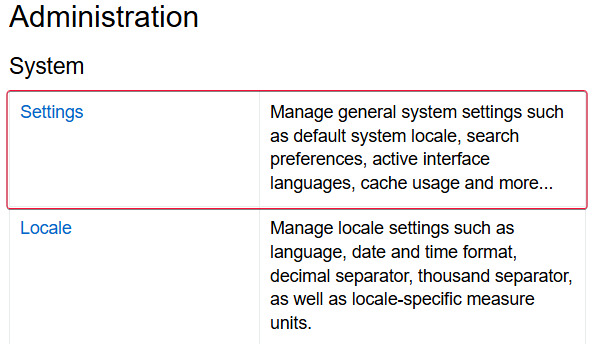
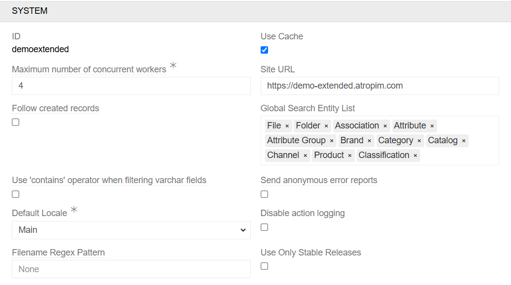
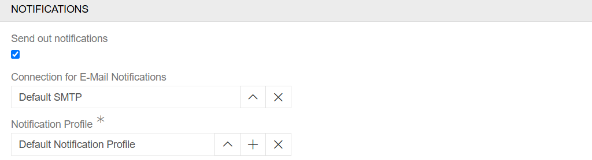
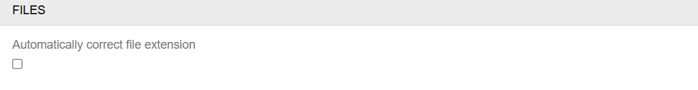
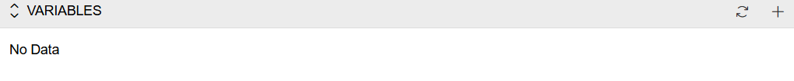

---
title: System Settings
--- 

To visit and edit the system settings, the user must be an administrator and go to the Administration/Settings menu.

{.medium}

The system settings comprise five tabs: System, Security, Notifications, Files and Variables. Some modules may add additional parameters.

## System

The system settings are used to configure the system's main information.

{.medium}

- **ID** - This is the ID used by AtroCore to license modules. It is set during system creation and cannot be changed.
- **Use Cache** - This option controls the breadth of system-wide caching. Some caching occurs regardless of this setting, but enabling it extends caching to additional system components. It must be enabled on the production environment.
- **Maximum number of concurrent workers** - AtroCore system has upper limit on the number of [tasks or processes](../05.system-jobs/docs.md#workers-and-job-processing) that can run simultaneously in the background of a server.
- **Site URL** - You need to specify the domain of the site. This is necessary for technical reasons in different places of the system. Sometimes in export. Sometimes in the file shuffle and so on.
- **Follow created records** - This option enables you to choose whether or not to automatically [follow](../10.notifications/) records created by users.
- **Global Search Entity List** - Select the entities that will be used for the [global search](../../05.toolbar/docs.md#global-search).
- **Use 'contains' operator when filtering varchar fields** - This option allows you to use search operators like '%' during [search](../../11.search-and-filtering/docs.md). If not checked then 'starts with' operator is used. This checkbox affects only text fields.
- **Send anonymous error reports** - This option enables the system to automatically send error reports to the AtroCore team.
- **Default Locale** - This option allows you to set a Default [Locale](../02.locales) for all users.
- **Disable action logging** - AtroCore system has an [Action History](../14.access-management/04.action-history/) that logs all the actions of all users. Of course, such logging takes up a certain resource. If you do not need it, you can simply turn it off.
- **Filename Regex Pattern** - This option allows you to set a PCRE regex pattern that file names must match when renaming a file. Enter the pattern without delimiters. Example: `^[^\\\/:\*\"\?<>%|\s,]{1,64}` restricts file names to 1–64 characters, excluding backslashes, slashes, colons, and other special characters. If left empty, any name is accepted.
- **Use Only Stable Releases** - This option allows you to enable or disable versions of modules that are currently under development. This checkbox is checked by default. It is not recommended to uncheck it for production environment.

## Security

The Security tab is used to configure security and user permission settings.

{.large}

- **ACL Strict Mode** - This option allows access to be forbidden if it is not specified in [roles](../14.access-management/03.roles). If disabled, access to scopes will be allowed if it's not specified in roles.
- **Password Regex Pattern** - This option allows you to set a password pattern.
- **Password expiration period (in days)** - This option allows you to specify the period after which a password change would be required. A change form will then be presented.

## Notifications

The Notifications tab is used to configure notification settings.

{.large}

- **Send out notifications** - This option allows you to send notifications for users. The specifics are configured in profiles.
- **Connection for E-Mail Notifications** - Select an existing [connection](../04.connections) for email notifications. The one provided by AtroCore is just a placeholder.
- **Notification Profile** - Select the rules profile that determines what [email notifications](../10.notifications) are sent and on what conditions. You can use the default profile or create a new one. 

## Files

The Files tab is used to configure file settings.

{.large}

- **Automatically correct file extension** - This option enables the system to add the correct file extension when a file with a non-matching extension is uploaded. For example, a PNG file extension may be mistakenly changed to JPG, but the system will recognize this and change the extension to the one used in the file structure.

## Variables

The Variables tab is used to add global variables for the entire system. For example, this is where fixed currency exchange rates are added.
<!-- TODO: enhance with better described example -->

{.large}