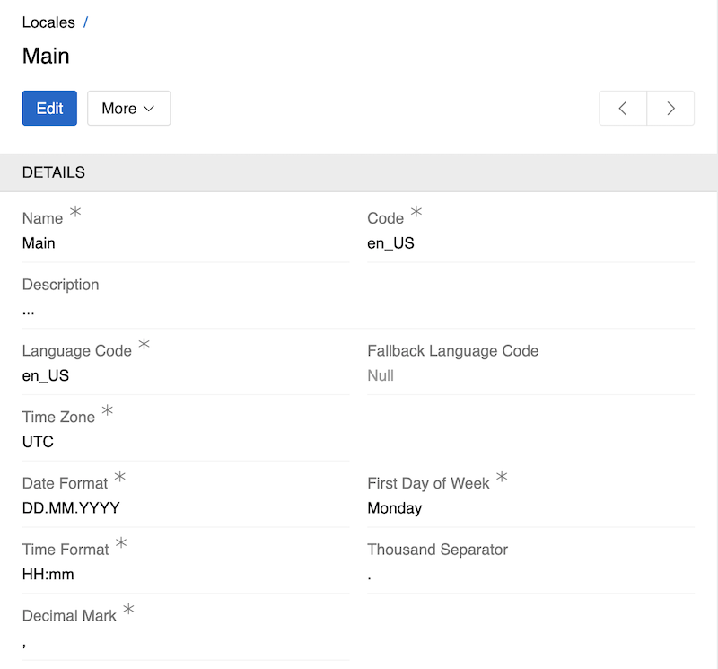

---
title: Locales
--- 

UI multilingualism is managed through the Locales system.

Locale is used to set user interface parameters: language, time zone, date format, separators, etc. By default, one main Locale is created when installing AtroCore and set as Default Locale in [Settings](../01.system-settings/). You can edit it and create new Locales if necessary.

To manage Locales go to `Administrations > Locale`. 

## Locale Fields

- **Name**: The display name for the locale (e.g., "Main", "German", "French"). This is a required field and should be clear and descriptive.
- **Description**: An optional field for adding extra context or notes about the locale and its purpose.
- **Code**: A unique identifier for the locale. By default, this matches the Language Code, but you can modify it, for example, to create multiple locales with the same language but different date or time formats.
- **Language Code**: The main language code for the locale (e.g., "en_US", "de_DE", "fr_FR"). You can select any language, even if it doesn't have built-in translations, and add your own using the [Labels](../13.user-interface/03.labels/) system.
- **Fallback Language Code**: The code for an additional language to use for UI elements if a translation is missing in the main language. Only languages with built-in translations are available here.
- **Time Zone**: The time zone associated with the locale (e.g., "UTC", "Europe/Berlin", "America/New_York"). This setting affects how dates and times are displayed and calculated.
- **Date Format**: The format for displaying dates (e.g., "DD.MM.YYYY", "MM/DD/YYYY", "YYYY-MM-DD"). Controls how dates appear in the interface.
- **Time Format**: The format for displaying times (e.g., "HH:mm", "h:mm A", "HH:mm:ss"). Controls how times are shown in the UI.
- **First Day of Week**: Sets which day is considered the start of the week (Monday or Sunday).
- **Thousand Separator**: Symbol used to separate groups of digits in large numbers (e.g., `.`, `,`, or leave empty for no separator).
- **Decimal Mark**: Symbol used as the decimal separator in numbers (either `.` or `,`).

## Usage

The user can select the [Locale](../02.locales/) in the User Profile or in the [Toolbar](../../05.toolbar/index.md#locale-and-language-switcher).

If no Locale is set for the user, the Default Locale from Settings will be used. 

## Translation Systems

AtroCore uses two separate but interconnected translation systems:

### UI Translation System
Controls the language of user interface elements (buttons, menus, labels, etc.).

**Fallback Logic**: The system first uses the language specified in your selected Locale; if a translation is missing, it uses the Fallback Language Code from your Locale settings, and if no fallback is configured, it displays internal system keys.

**Configuration**: Managed through the [Labels](../13.user-interface/03.labels/) system.

### Data Translation System
Translates data content for link presentations throughout the system. When specific fields are configured as multilingual and contain translations for your selected Locale's language, those translations will be displayed in lists, dropdowns, and other places throughout the system.

**Link Presentation Fields**:
- [Entities](../11.entity-management/03.fields-and-attributes/): Name field
- [Measure Units](../09.measure-units/): Name field
- [List Options](../08.lists/): Option value field

> If a specific field has been designated as the record identifier, it takes priority. If no identifier is preset, the Name field is used. If neither exists, the record's ID is displayed.

**Fallback Logic**: The system first uses the language specified in your selected Locale, and if a translation is missing (there is no field for corresponding language or it's empty), it automatically falls back to the main language (not the Locale's fallback language).

**Configuration**: For information on enabling multilingual fields and understanding what constitutes the "main language," see the [Languages](../03.languages/) article.