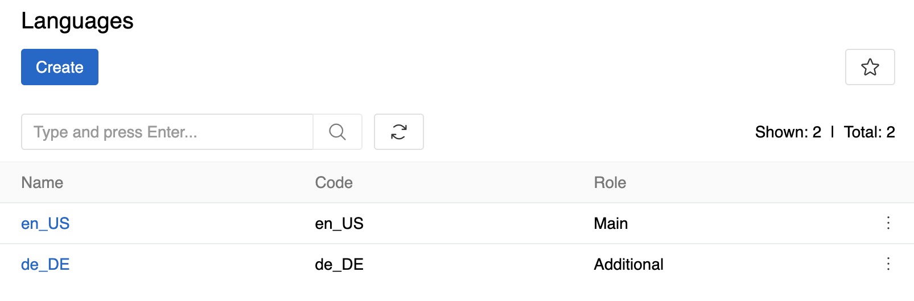

---
title: Languages
--- 

By default, AtroCore has English as the main language, but you can change this and add additional languages.

## Configuration

To enable multilingual functionality you will need at least one additional language. To manage languages go to `Administration > Languages`:

{.medium}

### Language Fields

-   **Name** - set the name of the new language
-   **Code** - select language code from the list
-   **Role** - only one Main language may exist, Additional should be used for languages to be translated into

The system allows only one main language. To change the main language, you need to modify the value of the existing main language item. It is not allowed to change the value of additional languages.

> Languages is a [Reference](../11.entity-management/01.entity-types/index.md#reference) entity. When creating relationships to Languages from custom entities, you can only use Link (single relationship) fields. Multiple-link fields cannot reference Reference entities like Languages. If you attempt to create a Multiple-link field pointing to Languages, the system will display a validation error.

!! When deleting a language, the input field and its value will be removed both from the database and system interface. If a deleted language is restored, the input fields will be restored to the system interface, but with no data in them.

!!! Due to these restrictions, it is strongly recommended to carefully plan your main language selection from the beginning of system configuration, as changing the main language later in the process can be problematic and may require significant data migration efforts.

## Multilingual Fields

The following field types can be made multilingual in the AtroCore system:

- [HTML](../11.entity-management/02.data-types/index.md#html)
- [Markdown](../11.entity-management/02.data-types/index.md#markdown)
- [String](../11.entity-management/02.data-types/index.md#string)
- [Text](../11.entity-management/02.data-types/index.md#text)
- [Array](../11.entity-management/02.data-types/index.md#array)
- [Boolean](../11.entity-management/02.data-types/index.md#boolean)

To create multilingual fields, select the `Multilingual` checkbox when creating or editing fields. For detailed information about field creation and configuration, see [Fields and Attributes](../11.entity-management/03.fields-and-attributes/).

> If your system is already integrated with an external system, and you make a simple field multilingual, you may need to change the mapping to ensure correct work with the external systems.

You can not add multilingual fields to [layouts](../13.user-interface/02.layouts/) individually. They are always displayed after the main language, in the order in which the languages are added.

## Access Rights

You can set separate read/edit permissions for multilingual fields per role. For detailed information about configuring field-level permissions, see [Roles](../14.access-management/03.roles/).
