---
title: Connections
--- 

AtroCore provides a comprehensive connection management system that allows you to integrate with various external services, databases, and APIs. The platform supports multiple connection types to facilitate data exchange, authentication, and communication with external systems.

Connections can be accessed through the administration panel at `Administration > Connections`.

> Many connection types are available only with purchased additional modules. The availability of specific connection types depends on your AtroCore license and the modules you have installed.

The system provides a "Test Connection" feature to verify that your connection configuration is working correctly. This feature is available for most connection types to ensure proper connectivity before using the connection in your workflows.

When creating a connection, you need to configure the following required fields:

- **Name**: A unique identifier for your connection
- **Type**: The connection type - set to "AtroCore" for this connection type

Other fields depends on the connection type.

## Connection Types

### Database Connections

#### PDO SQL

PDO (PHP Data Objects) SQL connections provide a database abstraction layer that offers a consistent API for accessing different database systems. This connection type supports multiple database drivers and provides prepared statements for secure database operations.

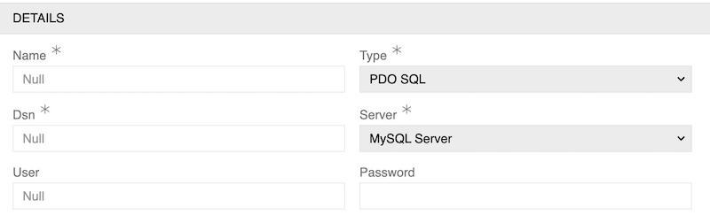

- **Dsn** (required): The Data Source Name that contains the information required to connect to the database
- **Server** (required): The database server type (MySQL Server, PostgreSQL Server or Microsoft SQL Server)
- **User**: The database username for authentication
- **Password**: The database password for authentication

#### MySQL Server

Direct connection to MySQL database servers for data storage and retrieval operations. This connection type enables full CRUD operations, complex queries, and transaction management within the MySQL environment.

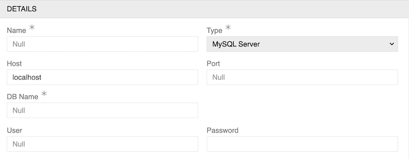

- **Host**: The MySQL server hostname or IP address (defaults to "localhost")
- **Port**: The MySQL server port number (defaults to 3306)
- **DB Name** (required): The name of the MySQL database to connect to
- **User**: The MySQL username for authentication
- **Password**: The MySQL password for authentication

#### PostgreSQL Server

Connection to PostgreSQL database servers, offering advanced features such as complex data types, full-text search capabilities, and robust transaction support. PostgreSQL connections support both basic and advanced database operations.

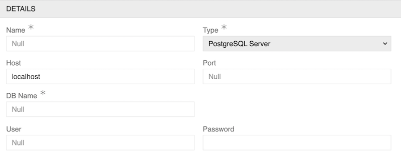

- **Host**: The PostgreSQL server hostname or IP address (defaults to "localhost")
- **Port**: The PostgreSQL server port number (defaults to 5432)
- **DB Name** (required): The name of the PostgreSQL database to connect to
- **User**: The PostgreSQL username for authentication
- **Password**: The PostgreSQL password for authentication

#### Microsoft SQL Server

Integration with Microsoft SQL Server databases, providing access to enterprise-level database features including advanced analytics, reporting services, and comprehensive data management capabilities.

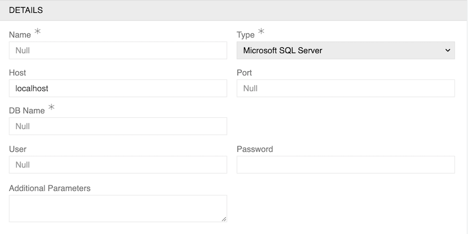

- **Host**: The Microsoft SQL Server hostname or IP address (defaults to "localhost")
- **Port**: The Microsoft SQL Server port number (defaults to 1433)
- **DB Name** (required): The name of the Microsoft SQL Server database to connect to
- **User**: The Microsoft SQL Server username for authentication
- **Password**: The Microsoft SQL Server password for authentication
- **Additional Parameters**: Additional connection parameters for Microsoft SQL Server configuration. Parameters should be specified using the syntax: `param1=value1;param2=value2;param3=value3`. Common parameters include:

  - **Encryption**: Enable/disable encryption (true/false)
  - **TrustServerCertificate**: Trust self-signed certificates (true/false)
  - **ConnectionTimeout**: Connection timeout in seconds
  - **QueryTimeout**: Query timeout in seconds
  - **ApplicationIntent**: Set to "ReadOnly" or "ReadWrite"
  - **MultiSubnetFailover**: Enable/disable multi-subnet failover (true/false)

  For a complete list of supported connection options, refer to the [Microsoft SQL Server PHP Driver](https://learn.microsoft.com/en-us/sql/connect/php/connection-options) documentation.

#### Vertica DB

Connection to Vertica analytics database, optimized for large-scale data warehousing and analytical processing. This connection type supports high-performance queries and real-time analytics operations.

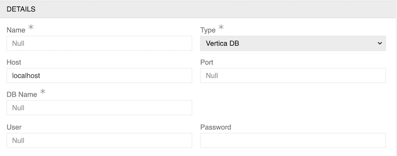

- **Host**: The Vertica server hostname or IP address (defaults to "localhost")
- **Port**: The Vertica server port number (defaults to 5433)
- **DB Name** (required): The name of the Vertica database to connect to
- **User**: The Vertica username for authentication
- **Password**: The Vertica password for authentication

### File Transfer Connections

These connection types (FTP and SFTP) are used by the [Import: Remote File](https://store.atrocore.com/en/import-remote-file/20154) and [Export: Remote File](https://store.atrocore.com/en/export-remote-file/20144) modules to [exchange data](https://help.atrocore.com/latest/data-exchange) with remote files.

#### FTP

File Transfer Protocol connections for uploading and downloading files to/from remote servers. This connection type supports both active and passive modes for file transfer operations.

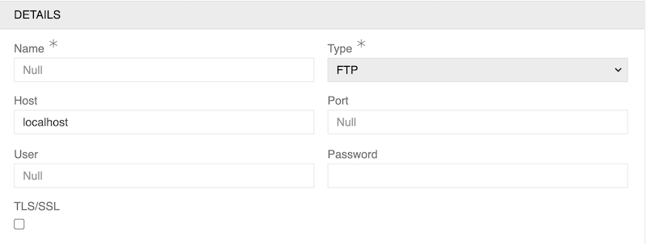

- **Host**: The FTP server hostname or IP address (defaults to "localhost")
- **Port**: The FTP server port number (defaults to 21)
- **User**: The FTP username for authentication
- **Password**: The FTP password for authentication
- **TLS/SSL**: A checkbox to enable TLS/SSL encryption for secure file transfer

#### SFTP

Secure File Transfer Protocol connections that provide encrypted file transfer capabilities. SFTP connections ensure secure data transmission over SSH protocol with authentication and encryption.

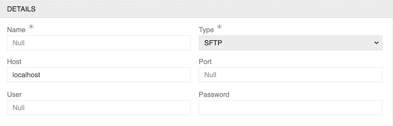

- **Host**: The SFTP server hostname or IP address (defaults to "localhost")
- **Port**: The SFTP server port number (defaults to 22)
- **User**: The SFTP username for authentication
- **Password**: The SFTP password for authentication

### Authentication & Authorization

#### Token Auth API

Token-based API authentication that obtains a session token by POSTing credentials to a login endpoint, then uses the token in subsequent request headers. The payload and headers are defined as [Twig](../../../10.developer-guide/80.twig-tutorial/docs.md) templates.

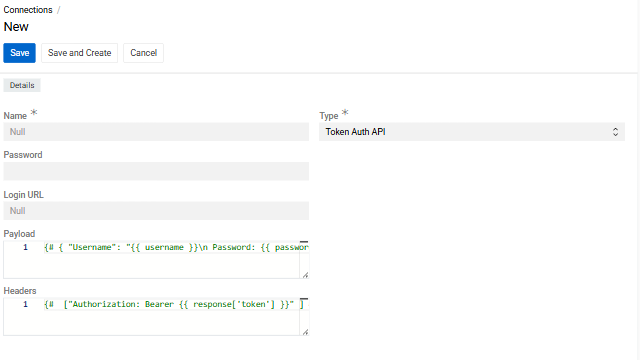{medium}

- **Login URL** (required): The API endpoint URL where credentials are posted to obtain the token
- **Password**: The password used in the payload template (stored encrypted)
- **Payload** (required): A Twig template rendered as a JSON body for the login request. The `{{ password }}` variable is replaced with the decrypted password. Example:

```json
{
    "username": "api_user",
    "password": "{{ password }}"
}
```

- **Headers** (required): A Twig template rendered as a JSON array of HTTP headers for subsequent requests. The full login response is available as `{{ response }}`. Example:

```json
["Authorization: Bearer {{ response['token'] }}"]
```

#### OAuth 2.0

Modern OAuth 2.0 authentication protocol for secure API access and user authorization. This connection type supports various OAuth flows including authorization code, client credentials, and implicit grant types.

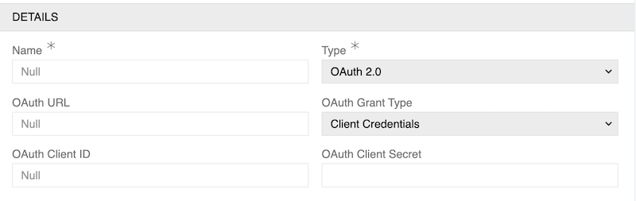

- **OAuth URL** (required): The OAuth provider's authorization server URL
- **OAuth Grant Type** (required): The OAuth grant type to use (Client Credentials)
- **OAuth Client ID** (required): The OAuth client identifier provided by the service
- **OAuth Client Secret** (required): The OAuth client secret provided by the service

#### OAuth 1.0

Legacy OAuth 1.0 authentication protocol for backward compatibility with older systems and APIs that still require this authentication method.

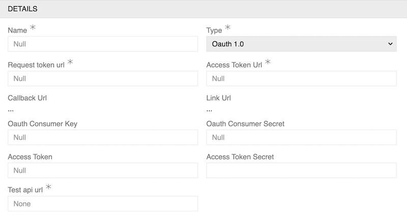

- **Request token url** (required): The OAuth 1.0 request token endpoint URL
- **Access Token Url** (required): The OAuth 1.0 access token endpoint URL
- **Callback Url** (required): The callback URL for OAuth 1.0 flow
- **Link Url** (required): The authorization link URL
- **Oauth Consumer Key** (required): The OAuth 1.0 consumer key
- **Oauth Consumer Secret** (required): The OAuth 1.0 consumer secret
- **Access Token** (required): The OAuth 1.0 access token
- **Access Token Secret** (required): The OAuth 1.0 access token secret
- **Test api url** (required): The API URL to test the OAuth 1.0 connection

#### Otto OAuth

Specialized OAuth implementation for Otto platform integration, providing custom authentication flows and token management specific to Otto services.

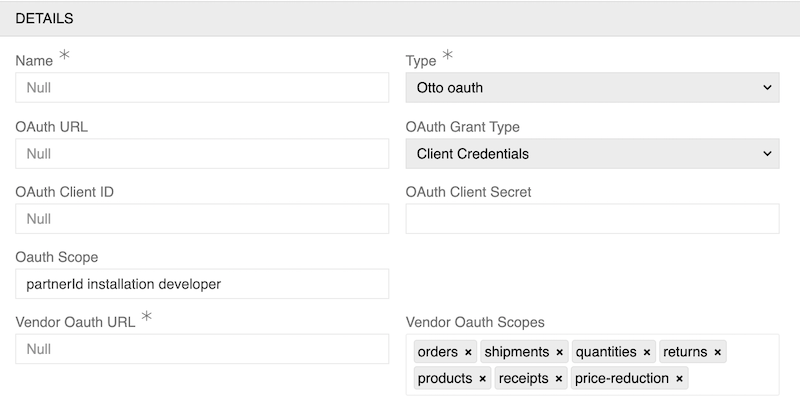

- **OAuth URL** (required): The OAuth provider's authorization server URL
- **OAuth Grant Type** (required): The OAuth grant type to use (Client Credentials)
- **OAuth Client ID** (required): The OAuth client identifier provided by Otto
- **OAuth Client Secret** (required): The OAuth client secret provided by Otto
- **Oauth Scope** (required): The OAuth scope for the application (e.g., "partnerId installation developer")
- **Vendor Oauth URL** (required): The Otto vendor OAuth endpoint URL
- **Vendor Oauth Scopes** (required): Multi-select field for Otto vendor scopes (orders, shipments, quantities, returns, products, receipts, price-reduction)

#### Cookie Session

Session-based authentication using cookies for maintaining user state and authentication across web requests. This connection type manages user sessions and provides persistent authentication.

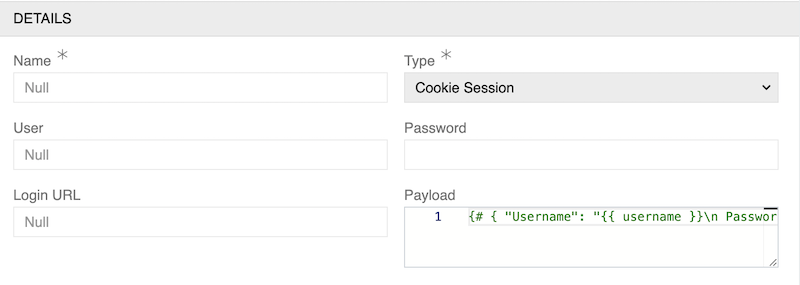

- **User** (required): The username for authentication
- **Password** (required): The password for authentication
- **Login URL** (required): The URL where the login request should be sent
- **Payload** (required): A multi-line text area for defining the login payload structure with placeholders for dynamic values (e.g., `{ "Username": "{{ username }}\n Password: {{ password }}" }`)

### Communication Services

#### SMTP

Simple Mail Transfer Protocol connections for sending emails through mail servers. SMTP connections support various authentication methods and can be configured for different mail delivery requirements.

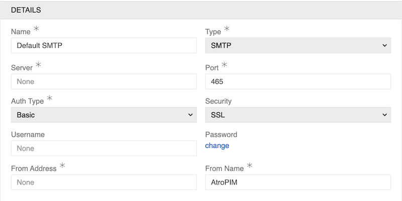

- **Server** (required): The SMTP server hostname or IP address
- **Port** (required): The SMTP server port number (commonly 465, 587, or 25)
- **From Address** (required): The email address that will appear as the sender
- **From Name** (required): The display name that will appear as the sender

Authentication Fields (depends on Auth Type):

**Basic Authentication:**

- **Auth Type**: Set to "Basic"
- **Security**: The security protocol to use (SSL, TLS, or None)
- **Username**: The username for SMTP authentication
- **Password**: The password for SMTP authentication

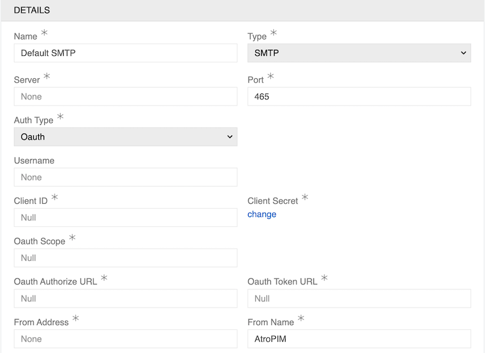

**OAuth Authentication:**

- **Auth Type**: Set to "Oauth"
- **Username**: The username for SMTP authentication
- **Client ID** (required): The OAuth client identifier
- **Client Secret** (required): The OAuth client secret
- **Oauth Scope** (required): The OAuth scope for the application
- **Oauth Authorize URL** (required): The OAuth authorization endpoint URL
- **Oauth Token URL** (required): The OAuth token endpoint URL

### Business Intelligence & Analytics

#### Scope Visio

Integration with Scope Visio business intelligence and analytics platform for data visualization, reporting, and business analytics capabilities.

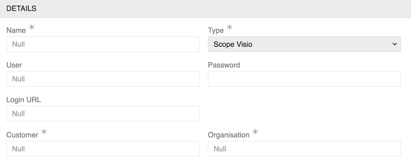

- **User** (required): The Scope Visio username for authentication
- **Password** (required): The Scope Visio password for authentication
- **Login URL** (required): The URL where the Scope Visio login request should be sent
- **Customer** (required): The customer identifier for Scope Visio
- **Organisation** (required): The organization identifier for Scope Visio

### AtroCore Integration

#### AtroCore

Native AtroCore connection type for internal system integration, data synchronization, etc. between different AtroCore instances.

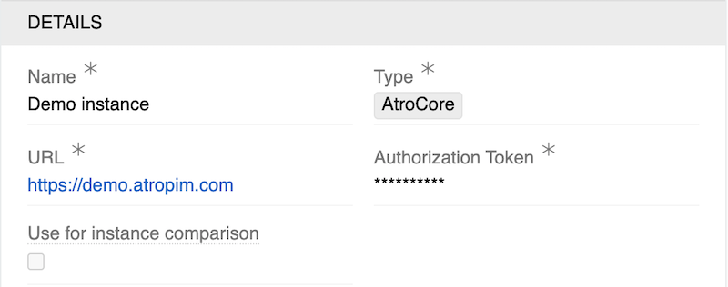{.large}

- **URL** (required): The URL of the target AtroCore instance you want to connect to
- **Authorization Token** (required): The authentication token used to authorize the connection to the target AtroCore instance
<!-- TODO: which module enables 'Use for instance comparison'? -->
- **Use for instance comparison**: A checkbox option that enables this connection to be used for comparing data between different AtroCore instances. Only one instance can be used for comparison.
