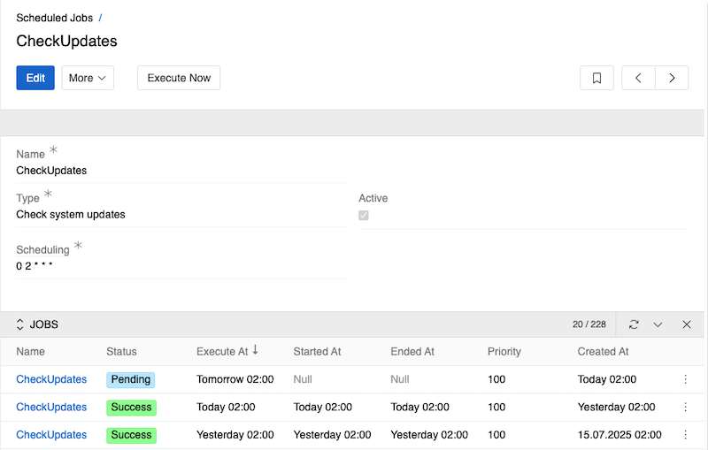
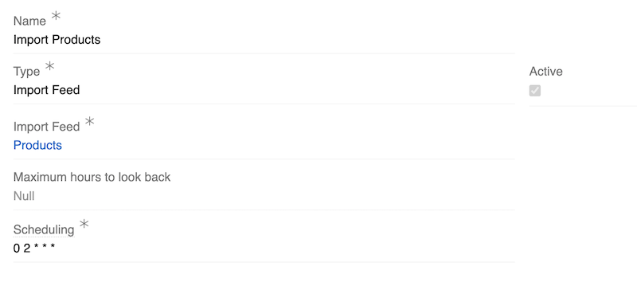
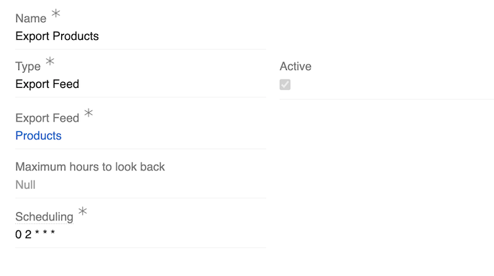
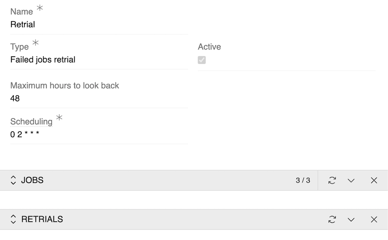
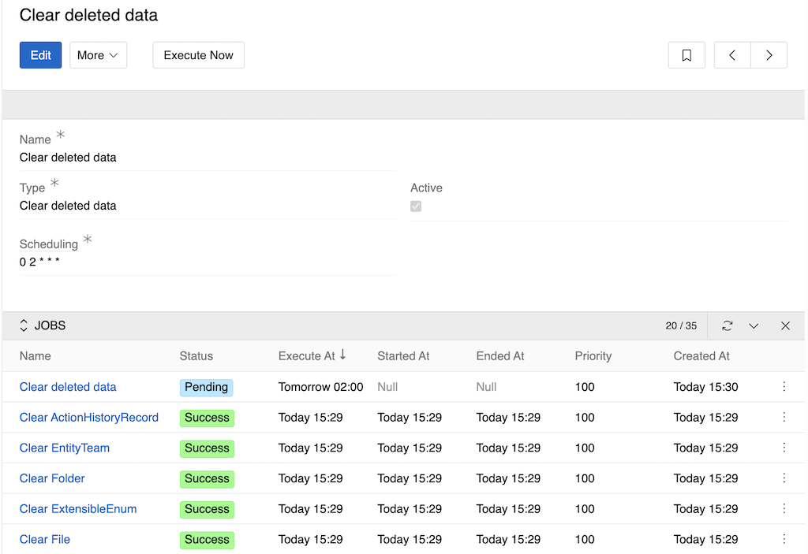
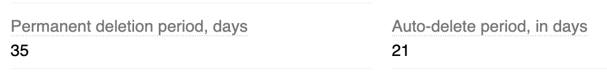
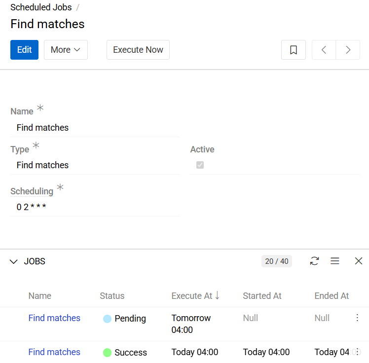

Scheduled Jobs are configurations that automatically create [Jobs](../) at specified intervals. They allow you to orchestrate multiple actions, such as import and export feeds, job retrials, system updates, etc. to be executed automatically by the Job Manager subsystem.

> Some job types are available only with additional modules. To execute custom [Actions](../../06.actions/) on a schedule, use the **Action** job type, available with the [Workflows](https://store.atrocore.com/en/workflows/20194) module. To calculate data quality metrics, the [Data Quality](https://store.atrocore.com/en/data-quality/20218) module is required. The **Refresh Cache for Dynamic Relations** and **Calculate Script Fields** job types are available with the [Advanced Data Management](https://store.atrocore.com/en/advanced-data-management/20113) module.

## Main functions

{.large}

Every job has the following fields:

- **Name**: The name of the job
- **Type**: The type of the Scheduled Job (e.g., "Check system updates", "Import Feed", etc.). Cannot be changed after creation.
- **Scheduling**: Defines frequency of job runs using cron syntax. Press `i` to get the syntax. For example, `0 2 * * *` runs the job daily at 2:00 AM. The time used is system time.
- **Active**: Checkbox to enable or disable the job execution

You can also run the job immediately, regardless of the schedule, by pressing the `Execute Now` button. This creates a job scheduled for current time.

The jobs execution log displays all Jobs that have been created from this scheduled job configuration, showing their execution status, timing, and results.

## Scheduled Jobs types

Scheduled Jobs can provide different job types to execute:

### Check system updates

This job checks for available system updates on the schedule you set. It scans for available updates without actually installing them.

### Update system automatically

This job starts system update on the schedule you set. The settings set by update are taken from the `Modules` menu, so it is essentially pressing the `Update` button on the set time.

### Scan Storage

Performs synchronization of files and folders between external storage (e.g., [S3 Object Storage](https://store.atrocore.com/en/s3-object-storage/20216) or [Microsoft SharePoint](https://store.atrocore.com/en/microsoft-365-connector/20205)) and PIM storage. It updates PIM with changes from the external source, including newly added, modified, or deleted files. This operation can be triggered manually via the `Scan` action or automated using scheduled jobs of type Scan Storage.

### Import Feed

This job starts the selected import feed on the schedule you set. The settings set by the feed are taken from the feed menu, so it is essentially pressing the `Import` button on the set time.

<!-- TODO: what 'Maximum hours to look back' param stands for? -->
{.medium}

### Export Feed

This job starts the selected export feed on the schedule you set. The settings set by the feed are taken from the feed menu, so it is essentially pressing the `Export` button on the set time.

<!-- TODO: what 'Maximum hours to look back' param stands for? -->
{.medium}

### Update currency exchange via ECB

This job inserts current exchange rates taken from ECB to AtroCore currencies. Only currencies and rates supported by ECB are affected by this job.

### Failed jobs retrial

This job looks for the selected jobs done by import and export feeds and/or other scheduled jobs and then starts ones of them that had failed status in the last hours set in `Maximum hours to look back` field.

They will be shown in additional panel Retrials.

{.medium}

### Clear deleted data

Add this job to regularly clean the database of deleted records, relations with deleted records or records that have not been modified for a long time. It will remove garbage from all entities that have required parameters set.

{.large}

Use Scheduled Job `Clear deleted data` to clean up outdated Notifications, Action History, etc. on a regular basis.

The values of parameters `Permanent deletion period, days` and `Auto-delete period, in days` are set in the [configuration](../../11.entity-management/index.md#configuration-fields) of each entity.

{.medium}

With such settings, entity records will be [deleted](../../../08.record-management/index.md#soft-delete) 21 days after the last modification and after another 35 days they will be [deleted permanently](../../../08.record-management/index.md#permanent-delete) from the database.

### Find matches

This scheduled process automatically evaluates new and updated records against the defined [Matching Rules](../../../18.master-data-management/17.matching/index.md#matching-rules).

{.medium}

### Create clusters

This job processes matching results and manages the full lifecycle of [Clusters](../../../18.master-data-management/19.clusters/index.md) – creating new clusters, updating existing ones, and automatically confirming single-item clusters.

On each run, the job:

- Creates clusters for entities that have a Matching configuration with active rules, based on the Matched Score data from the Matching entity.
- Adds new cluster items or reassigns existing ones if matching results have changed since the last run.
- Automatically confirms cluster items where applicable.
