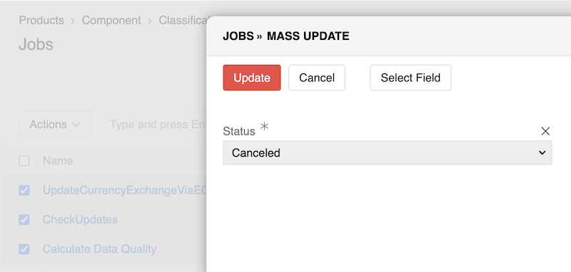
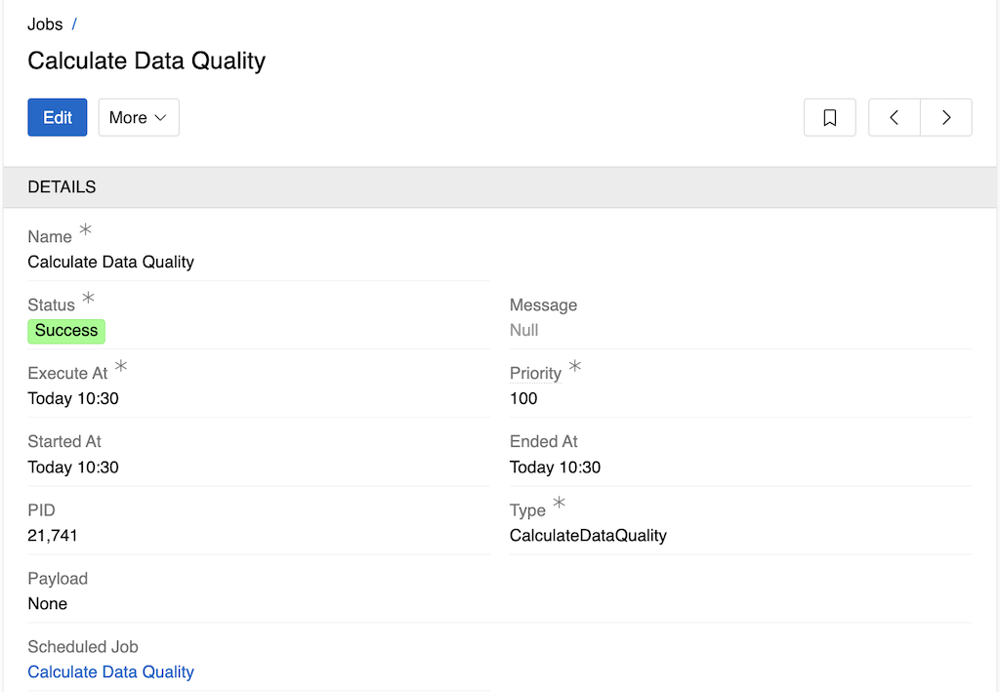

Modern business applications often need to perform heavy or time-consuming operations that would be impractical to execute during normal user interactions. These background tasks include data import/export, bulk operations, scheduled maintenance, and other resource-intensive processes where execution time can't be predicted.

AtroCore handles these requirements through the **Job Manager** subsystem and **Jobs**. The Job Manager is a crucial subsystem designed to manage and execute background tasks, while Jobs are the individual task records that track what needs to be done and when.

System Jobs are tasks that will be executed by background [worker](#workers-and-job-processing) processes, allowing the system to perform automated operations without requiring user interaction. These jobs are created by the system itself, not by any particular user, and handle operations that require significant processing time or involve large amounts of data.

## Job Creation

Jobs can be created in several ways:

- **Scheduled Jobs Configuration**: Jobs are automatically created based on [scheduled job](../05.system-jobs/01.scheduled-jobs/) configurations to run at specified intervals
- **User Actions**: Jobs are created when users perform actions that require background processing, such as:
  - Import and export operations
  - [Mass actions](../../12.mass-actions/) on multiple records
  - Any operations that require long processing time or involve large datasets

## Accessing Jobs

To access the jobs list navigate to `Administration > Jobs` or use the [Job Manager](../../05.toolbar/03.job-manager/).

## Jobs List

The jobs list displays all system jobs with their current status, execution times, and other relevant information.

{.large}

In the jobs list, users can:

- View all jobs and their current statuses
- See jobs details, such as execution times, start/end times, priorities
- Perform mass updates on job statuses and priorities
- Delete jobs

For example, to mass cancel the jobs - select required jobs and change their statuses to 'Canceled' as described in [Mass Actions](../../12.mass-actions/) article.

{.large}

## Job Statuses

Jobs can have the following statuses:

- **Pending**: Job is scheduled and waiting to be executed
- **Running**: Job is currently being executed
- **Success**: Job completed successfully
- **Failed**: Job failed during execution
- **Canceled**: Job was canceled by user or system
- **Awaiting**: Job is waiting for all related jobs to be created before execution begins. This status is used when processing large operations that are split into multiple jobs (chunks) to ensure all chunks are created before any execution starts, preventing conflicts or data inconsistencies

## Workers and Job Processing

Workers are background processes that execute jobs from the queue. The Job Manager supports **multi-threaded execution** via these worker processes, with a default of 6 workers that can be configured via [System settings](../01.system-settings/).

When mass actions involve more than a certain threshold of records, the system automatically creates jobs and distributes them among available workers. The thresholds and limits for job creation and worker processing can be configured by administrators in the config.php file.

For example, with a maximum of 5 configured workers and number of records that can be updated by one worker from 400 to 3000:
- **100 records**: No job is created (processed directly)
- **500 records**: 1 job is created and assigned to 1 worker
- **4000 records**: 2 jobs of 2000 records each, assigned to 2 workers simultaneously
- **18000 records**: 6 jobs of 3000 records each are created, with 5 jobs running simultaneously and the sixth waiting in queue with "Pending" status

The parallel processing by multiple workers dramatically speeds up large operations compared to sequential processing.

## Job Details

Clicking on a job name opens the detailed view where users can examine specific job information and modify job properties.

{.medium}

In the job details view, users can:

- View comprehensive job information including:
  - Job name and type
  - Current status
  - Execution times (scheduled, started, ended)
  - Process ID (PID)
  - Priority level
  - Payload information
  - Associated scheduled job configuration
- Change job status (e.g., cancel a running job)
- Modify job priority (higher number means higher priority)
- Delete the job