Actions in AtroCore are automated operations that can be executed manually through the user interface or automatically via [scheduled jobs](../05.system-jobs/01.scheduled-jobs/) and [workflows](https://store.atrocore.com/en/workflows/20194). They provide a powerful framework for automating business processes, data transformations, integrations, and AI-powered operations.

## Key Features

- **Flexible Execution**: Actions can be triggered manually, automatically via workflows, or through scheduled jobs
- **Entity-Specific**: Actions can be configured to work with specific entities (Products, Files, etc.)
- **User Context**: Actions can [execute as](#basic-configuration) the system user or maintain the same user context
- **Conditional Logic**: Actions support both basic and script-based condition types
- **Data Integration**: Seamless integration with [import feeds](../../../02.data-exchange/01.import-feeds/) and [export feeds](../../../02.data-exchange/02.export-feeds/)

## Creating and Configuring Actions

### Accessing Actions

Navigate to `Administration > Actions` to manage all configured actions in your system.

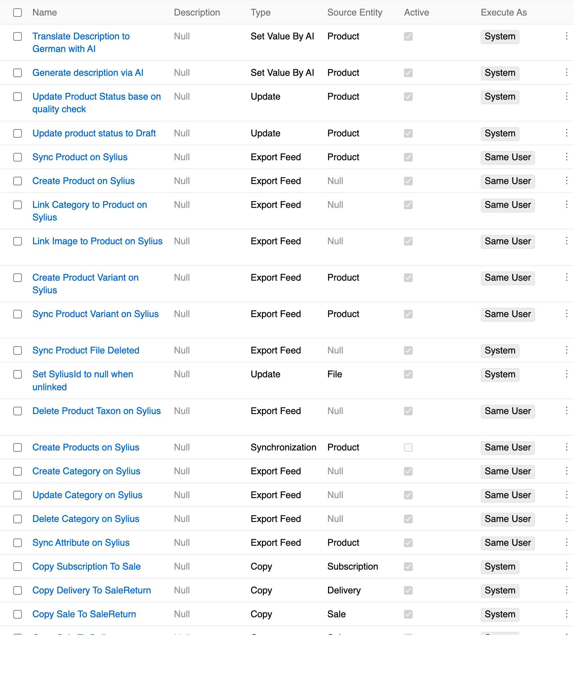{.medium}

### Basic Configuration

All actions share these common configuration fields:

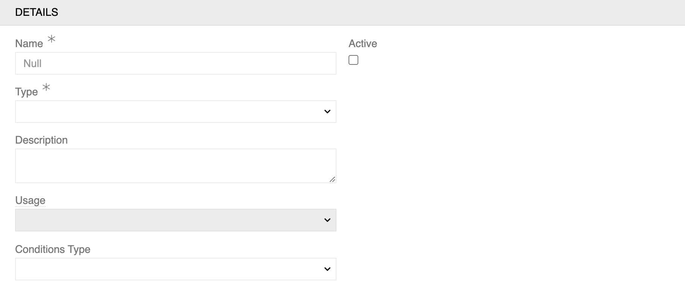{.medium}

- **Name**: Descriptive name for the action
- **Type**: The specific action type (see Action Types section below)
- **Usage**: Defines the action scope. Some usage types are applicable only to specific action types:
  - **Entity action button**: Applies to entire entity types
  - **Record action button**: Applies to individual records
  - **Field action button**: Applies to specific entity fields
  - **On record load**: Applies to individual records when the page loads
- **Conditions Type**: How conditions are evaluated:
  - **Basic**: Simple condition builder
  - **Script**: Custom script conditions following [Twig syntax](../../../10.developer-guide/80.twig-tutorial/docs.md)
- **Active**: Whether the action is enabled
- **Execute As**: Specifies the user context in which the action is executed:
  - **System**: Runs with system-level permissions.
  - **Same User**: Runs with current user [permissions](../14.access-management/01.users/docs.md#role-based-permissions). When selected, the corresponding user appears as a link following System in the **Modified** field for changed records and in the **Created** field for newly created records in the [Summary](../../04.understanding-ui/docs.md#insights-tab) panel of the Side View for changed records.
  
  {.medium}

When **Usage** is selected (any non-empty option), an additional **Source Entity** field appears to specify which entity the action targets.

**Entity action button:**

- **Display** (Single, Dropdown): Defines how the action button appears on the list view header.

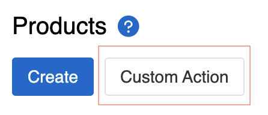{.small}

Single shows a direct button on the list view header.

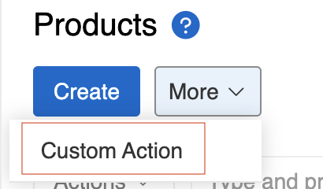{.small}

Dropdown groups the action in a dropdown menu.

**Record action button:**

- **Display** (Single, Dropdown): Defines action button on detail view (also available as single record action in list view)

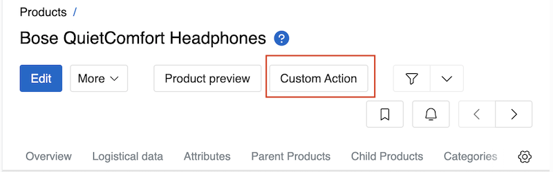{.medium}

Single shows a direct button on the detail view.

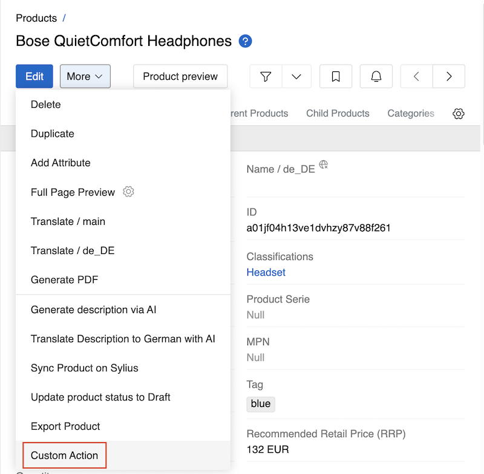{.medium}

Dropdown groups the action in a dropdown menu on the detail view.

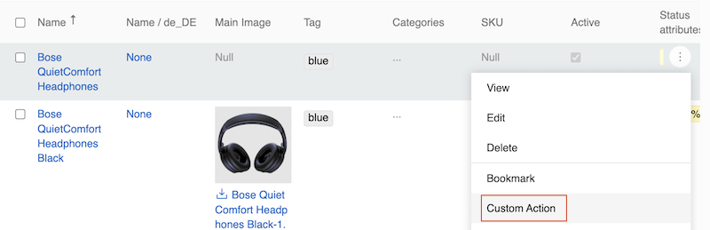{.large}

Actions are also available as [single record actions](../../08.record-management/docs.md#single-record-actions) in list views.

- **Mass actions**: Checkbox to determine if the action will be available as mass action

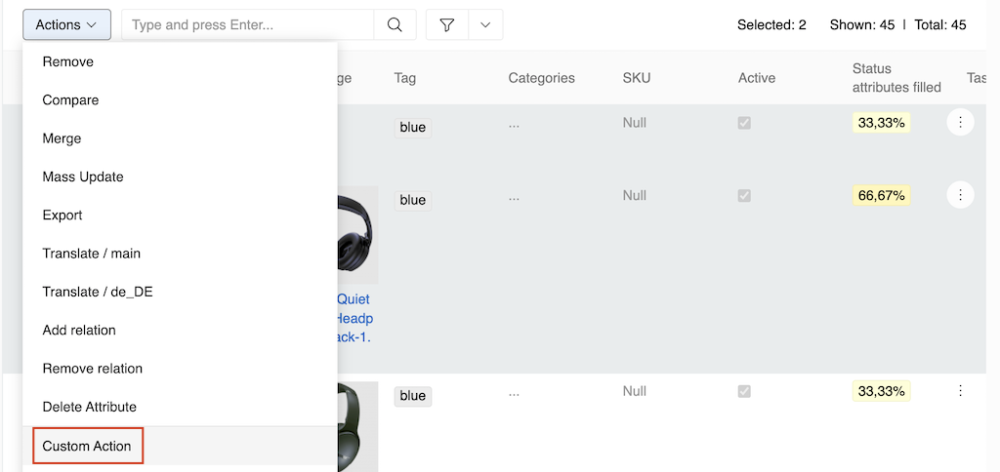{.medium}

When enabled, actions appear in the mass actions menu for selected records. Read [Mass actions](../../12.mass-actions/) for more information.

**Field action button:**

- **Field**: Defines which field the action button will be shown near on detail view

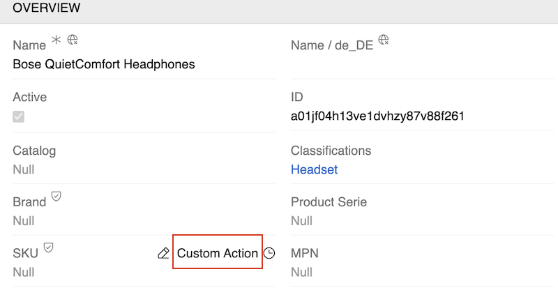{.medium}

Field action buttons appear as buttons next to specific fields on detail pages and are shown when you hover over the field.

### Action Icons

Actions in AtroCore support optional icon assignments to improve usability and visual identification.

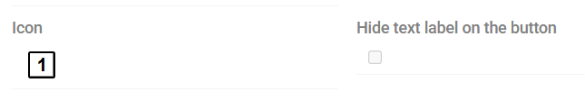{.small}

The Icon field is optional.

- No icon selected – The action is displayed using only its Action Name.
- Icon selected – The action is displayed using the selected icon, followed by the Action Name (consistent with system-defined actions).

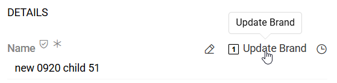{.small}

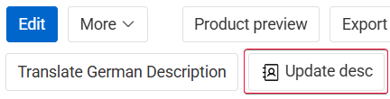{.small}

When an icon is selected, an additional configuration option becomes available:

- Hide Text Label on the Button (checkbox)
  - This checkbox is visible only if an icon has been selected.
  - When enabled, the action is rendered using the icon only, without the Action Name.

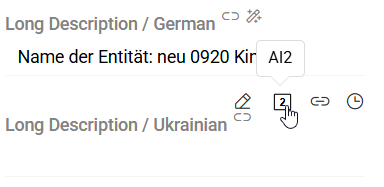{.small}

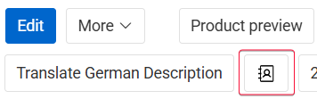{.small}

This behavior applies uniformly to all action types. All action types follow the same rules for icon selection, label visibility, and rendering logic.

### Parameters Panel

Some Action Types provide an additional **Parameters** panel that includes a mandatory field named `Update Type *` or in some cases `Mode`. This field allows the user to select one of two configuration modes: Basic (UI-based configuration) or Script (JSON-based configuration).

This dual-mode approach provides both ease of use for standard configurations and flexibility for advanced, script-driven scenarios.

#### Script

When `Script` option is selected, field values are defined using JSON code:

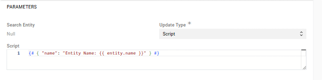{.medium}

- Define field values using JSON syntax with key-value pairs
- Support for [Twig](../../../10.developer-guide/80.twig-tutorial/) templating syntax using `{{ entity.fieldName }}` expressions
- All configuration is done in the Script field
- Provides flexibility for complex field mapping and dynamic values

**Script Helper**

When working in the script editor, right-click anywhere in the editor area to open a context menu with helpful options for quickly adding entity fields or attributes to your script. The context menu provides Add Fields for inserting standard entity fields and Add Attributes for inserting custom attributes, making script creation faster and reducing errors from manual typing.

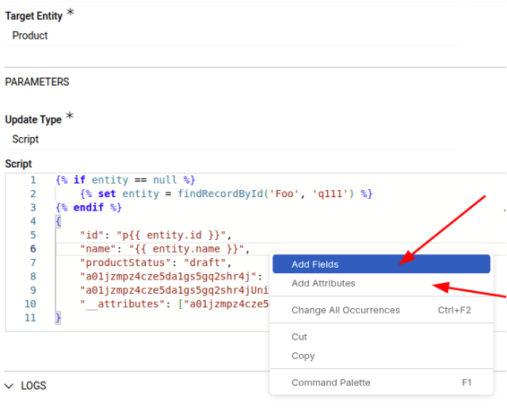{.medium}

#### Basic

When `Basic` option is selected, the configuration is performed through a dedicated panel in the user interface. This panel enables users to define behavior without writing scripts.

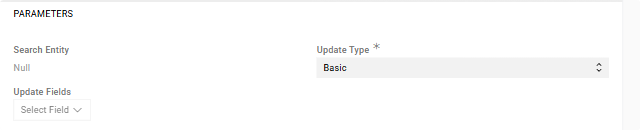{.medium}

- Use **Select Field** to add new fields to the creation template
- Set specific values for each field that will be applied to all created records
- Required fields are marked with an asterisk (*)

## Executing Actions

### Manual Execution

Actions can be executed manually through the user interface:

- **Direct execution**: Use the **Execute** button available on the action's detail page
- **Entity-level actions**: Available on list view headers based on Display configuration
- **Record-level actions**: Available on detail pages and as single record actions in list views
- **Field-level actions**: Available as buttons next to specific fields on detail pages
- **Mass actions**: Available for multiple selected records when Mass Action is enabled

### Automatic Execution

Actions can be triggered automatically through the [Workflows](https://store.atrocore.com/en/workflows/20194) module, which supports both event-driven execution based on entity changes and time-based scheduled execution.

## Monitoring Actions

AtroCore provides comprehensive monitoring capabilities for action executions, allowing you to track performance and review results.
Use [Job Manager](../../05.toolbar/03.job-manager/) and [Action History](../14.access-management/04.action-history/) in Administration to monitor action execution and track their results.

> More detailed information for Import and Export actions can be found in the related Feed documentation, such as [Import Feed](../../../02.data-exchange/01.import-feeds/docs.md#import-executions) and [Export Feed](../../../02.data-exchange/02.export-feeds/docs.md#export-executions).

### Action Execution Panel

> Action Execution records are automatically created by the system whenever an action runs, and they have specific access restrictions to maintain data integrity.

Each action has an `Execution` panel on its detail page that displays recent execution history. This panel provides quick access to monitor how the action has been performing over time.

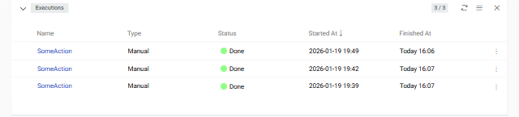{.medium}

From the `Execution` panel menu, you can select `Show List` to view all executions automatically filtered for this specific action. This opens a comprehensive list showing key information for each execution including the execution name, how it was triggered (manually, by scheduled job, incoming webhook, or through a workflow), the current status, and when it started and finished.

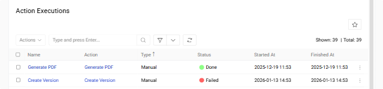{.medium}

Click on any execution name to open its detail view and see complete information about that specific run. The execution detail page provides comprehensive insights into what happened during the execution:

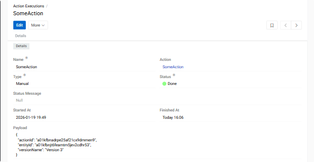 {.medium}

- **Name**: Auto-generated execution identifier.
- **Action**: Link to the source action.
- **Type**: Execution trigger (Manual, Scheduled Job, Incoming Webhook or Workflow).
- **Status**:Current state (Done, Failed, In Progress).
- **Status Message**: Additional details or error information.
- **Started At / Finished At**: Execution timestamps.
- **Payload**:Execution parameters and configuration data using [Script](#script).

Action executions move through different states during their lifecycle and have the following states:

- **Done**:Execution completed successfully
- **Failed**:Execution encountered an error and could not complete
- **In Progress**:Currently executing

For editing, access is limited to the Name field only, both through the user interface.This restriction applies uniformly to ensure that execution data remains accurate.
Action Execution is a [Base](../11.entity-management/01.entity-types/docs.md) type entity, meaning records are not auto-deleted. Users with appropriate permissions can delete execution records, allowing you to manage your execution history according to your organization's data retention policies.

### Action Execution Logs

For actions that perform data operations such as [`Create`](#create), [`Update`](../06.actions/docs.md#update), [`Delete`](#delete), or [`Create or Update`](#create-or-update), the system maintains detailed logs showing individual record-level operations. These logs are essential for understanding exactly what happened during an execution and troubleshooting any issues at the record level.

> `Action Execution Logs` are read-only and implemented as an [Archive](../11.entity-management/01.entity-types/docs.md#archive) entity type.

From the `Execution` panel, use the context menu of the execution record and select `All Logs`.

Each `Action Execution Logs` records provides detailed information about individual operations.

- **ID**:Unique log entry identifier
- **Action Execution**: Execution reference.
- **Type**: Action type performed.
- **Entity Name**: Target entity type.
- **Entity Record**: Specific record affected (click to open).
- **Message**: Error details or additional information.
- **Created At**: When the operation was logged.

## Action Types

> Some Action Types are provided by default, while others become available through additional modules, including both commercial and free extensions.

AtroCore supports various action types, each designed for specific automation scenarios. Below are all available action types and their configurations:

<!-- TODO: review which types are enabled by which module -->

### Data Operations

#### **Create**

> Available with the base AtroCore installation.

Creates new records in the system based on defined templates. This action can be used either within a Workflow or independently.

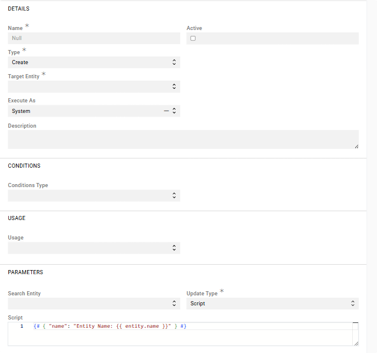{.medium}

**Configuration:**

- **Target Entity**: Entity type for new records
- **Update Type**: Method for record creation ([Basic](#basic) or [Script](#script))
- **Search Entity**: Defines the source entity used for bulk record creation based on filtered search results.

#### **Update**

> Available with the base AtroCore installation.

Modifies existing records based on specified criteria and field values.

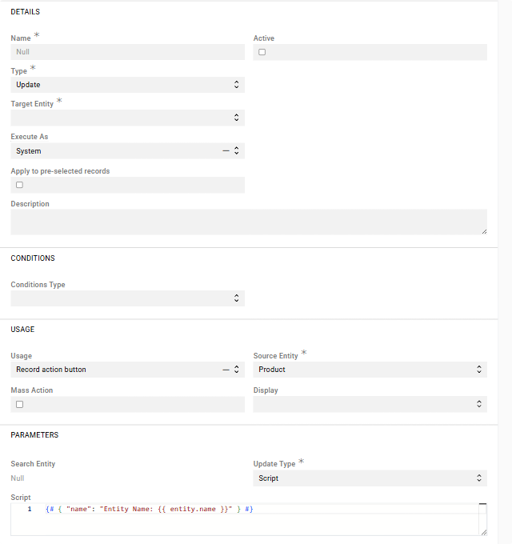{.medium}

**Configuration:**

- **Target Entity**: Entity type for records to update
- **Update Type**: Method for record updating ([Basic](#basic) or [Script](#script))
- **Apply to pre-selected records**: Defines the action scope:
  - **Checked**: Action operates only on the specific record it was triggered from. Source Entity becomes locked to match Target Entity, and Filter Result panel is not available.
  - **Unchecked**: Action can target different entities and use filtering criteria. For example, Source Entity can be "Brand" while the action updates all "Products" associated with that brand.
- **Filter Result**: Available only when "Apply to pre-selected records" is unchecked. Define which records should be updated based on specific criteria and query conditions - see [Search and Filtering](../../11.search-and-filtering) for details

#### **Create or Update**

> Available with the base AtroCore installation.

Create or Update extends the standard Create action by supporting both record creation and record updates. It creates new records or updates existing ones when matching entries already exist in the system, based on the defined templates. This action supports both [Script](#script) and [Basic](#basic) types.

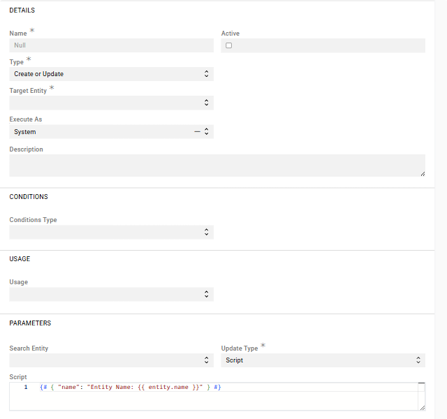{.medium}

#### **Delete**

> Available with the base AtroCore installation.

Removes records from the system based on specified criteria.

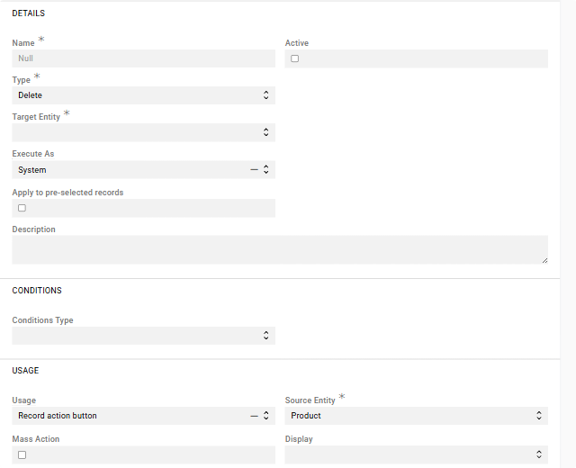{.medium}

**Configuration:**

- **Target Entity**: Entity type for records to delete
- **Apply to pre-selected records**: Defines the action scope:
  - **Checked**: Action deletes only the specific record it was triggered from. Source Entity becomes locked to match Target Entity, and Filter Result panel is not available.
  - **Unchecked**: Action can target different entities and use filtering criteria. For example, Source Entity can be "Category" while the action deletes all "Products" filtered by that category.
- **Filter Result**: Available only when "Apply to pre-selected records" is unchecked. Define which records should be deleted using query conditions - see [Search and Filtering](../../11.search-and-filtering) for details

#### **Suggest value**

Suggests modifications for existing records based on defined templates. The user can then modify the result. These suggested values only appear in the front end and must be saved manually.

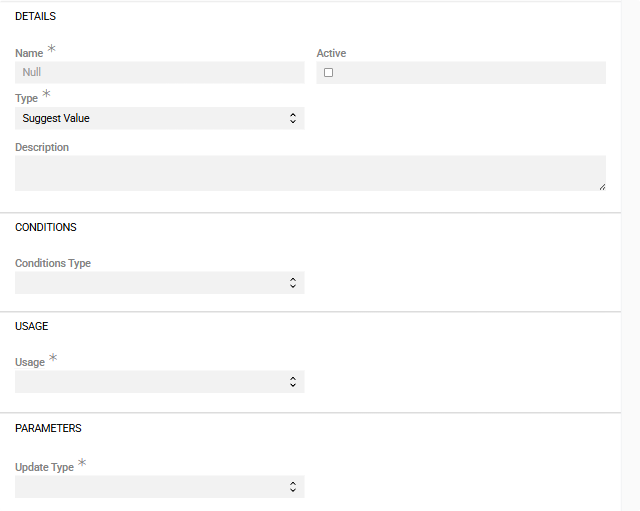{.medium}

**Configuration:**

- **Source Entity**: Entity type for records
- **Update Type**: Method for record updating (Basic or Script)
- **Usage**: Defines when the suggestion is displayed
  - **On field focus**: Displays when user focuses on the field during record editing or inline editing
  - **On field change**: Automatically triggers when the value of the specified field is modified
  - **On record create / update**: Displays when creating a new record or updating an existing record

When using [Script Mode](#script) for Suggest value action additional Twig functions are available:

- "uiRecord": Record data array. Variable contains data that you have on frontend side,
- "uiRecordFromName": The name of the entity from which you open current entity,
- "uiRecordFrom": Record data array of the entity from which you open current entity.

#### **Suggest value by AI**

> Available with [AI Integration](../../../05.pim/11.ai-integration/docs.md) module.

It uses the same method as **Suggest value** action type but uses AI for the suggested data. For implementation details and usage, refer to the [AI Integration documentation](../../../05.pim/11.ai-integration/docs.md#updating-values-in-frontend).

#### **Set value by AI**

> Available with [AI Integration](../../../05.pim/11.ai-integration/docs.md) module.

It uses the same method as **Update** action type but uses AI for the suggested data.For related behavior and configuration, see the [AI Integration documentation](../../../05.pim/11.ai-integration/docs.md#updating-values-in-backend).

#### **Copy**
<!-- TODO: investigate further -->
Duplicates existing records to create new copies.

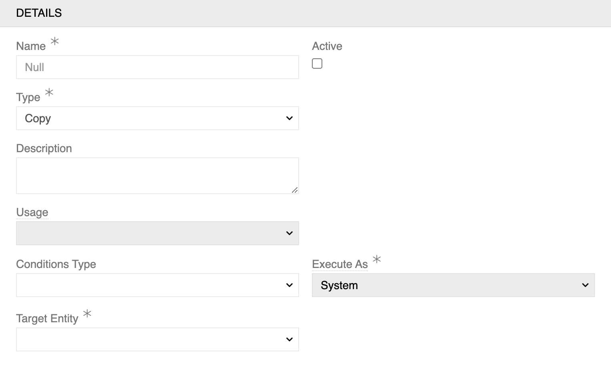{.medium}

**Configuration:**

- **Target Entity**: Entity type to copy

### Data Exchange

#### **Webhook**

> Available with the base AtroCore installation.

Sends HTTP requests (GET) to external systems for integration purposes.

> While this action type can organize outgoing webhook calls, consider using [Export Feeds](../../../03.integration/04.outgoing-webhooks/) instead for more flexible and powerful outbound HTTP integration.

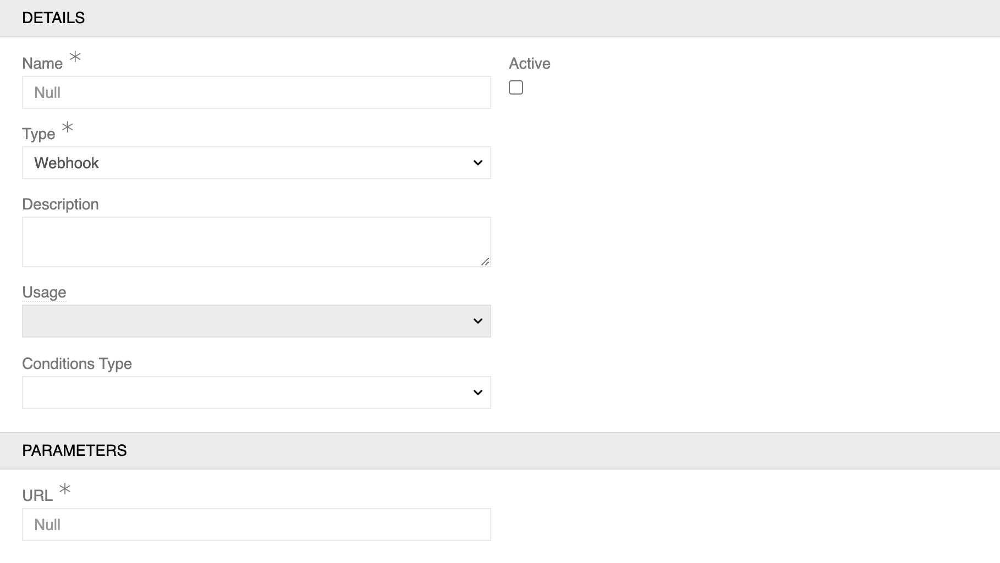{.medium}

**Configuration:**

- **URL**: Target endpoint for the webhook request

#### **Import Feed**

Imports data from external sources using configured import feeds.

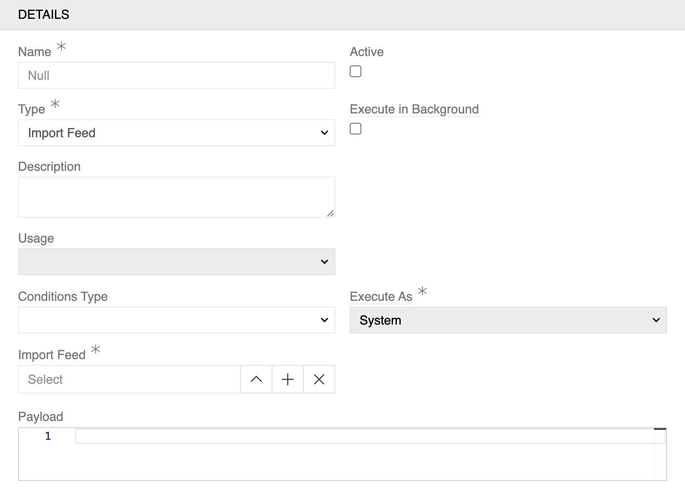{.medium}

**Configuration:**

- **Execute in Background**: Option to run import as background process
- **Import Feed**: Selection of configured import feed
<!-- TODO: enhance with real payload example -->
- **Payload**: Custom data payload for the import with [Twig](../../../10.developer-guide/80.twig-tutorial/) templating syntax

For example, in the image below script {"sourceEntitiesIds": {{ sourceEntitiesIds|json_encode|raw}}} states that only selected records are to be executed.

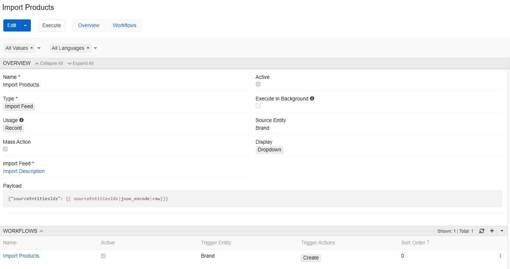{.large}

#### **Export Feed**

Exports data to external destinations using configured export feeds.

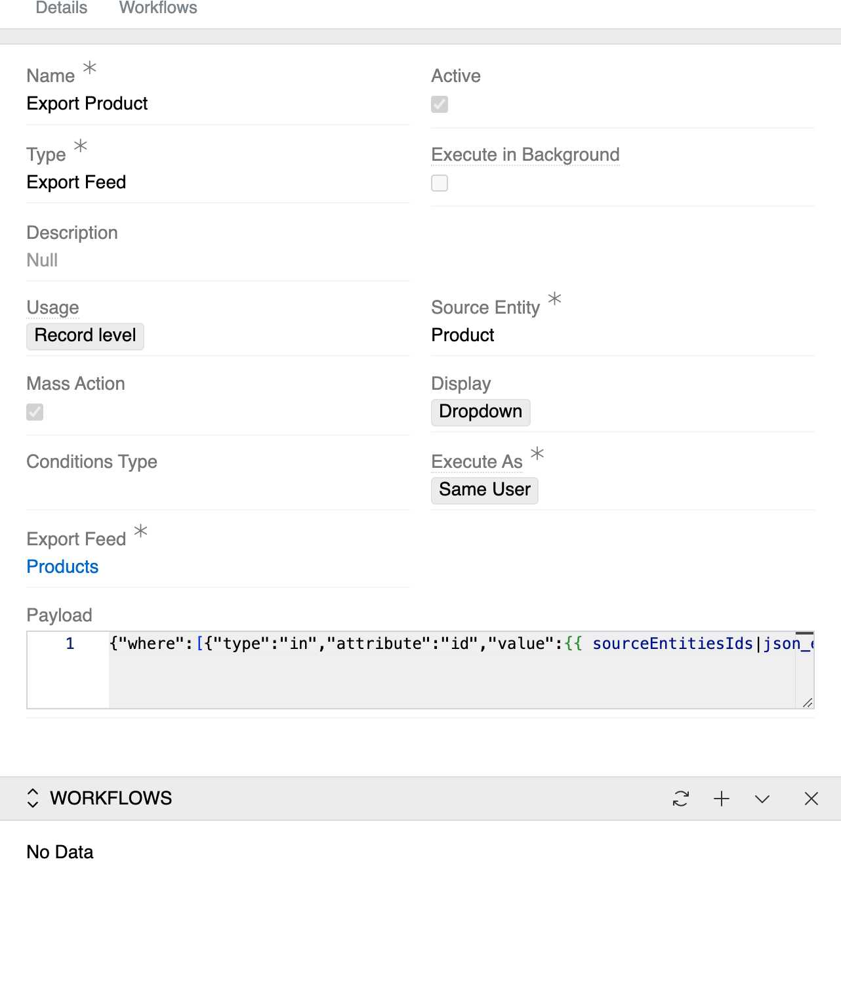{.medium}

**Configuration:**

- **Execute in Background**: Option to run export as background process
- **Export Feed**: Links to a specific Export Feed entity that defines the export format, destination, and data mapping
- **Payload**: Custom data payload for the export with [Twig](../../../10.developer-guide/80.twig-tutorial/) templating syntax

For example, the payload filters all attributes by their ids and transfers to the export only the attribute whose ID matches the triggering record:

    {
      "where": [
        {
          "type": "in",
          "attribute": "id",
          "value": [
            "{{ entity.id }}"
          ]
        }
      ]
    }

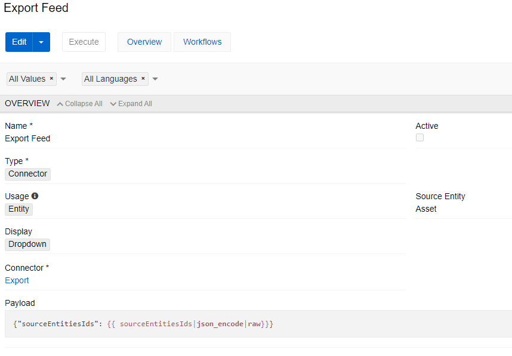{.large}

### Communication

#### **Send E-mail**

> Available with the base AtroCore installation.

Sends emails to specified recipients using configured email templates and connections.
Can be used to notify users about events related to the selected entity in response to some trigger actions (modification, creation or deletion of a new record, change of a certain field, etc.)

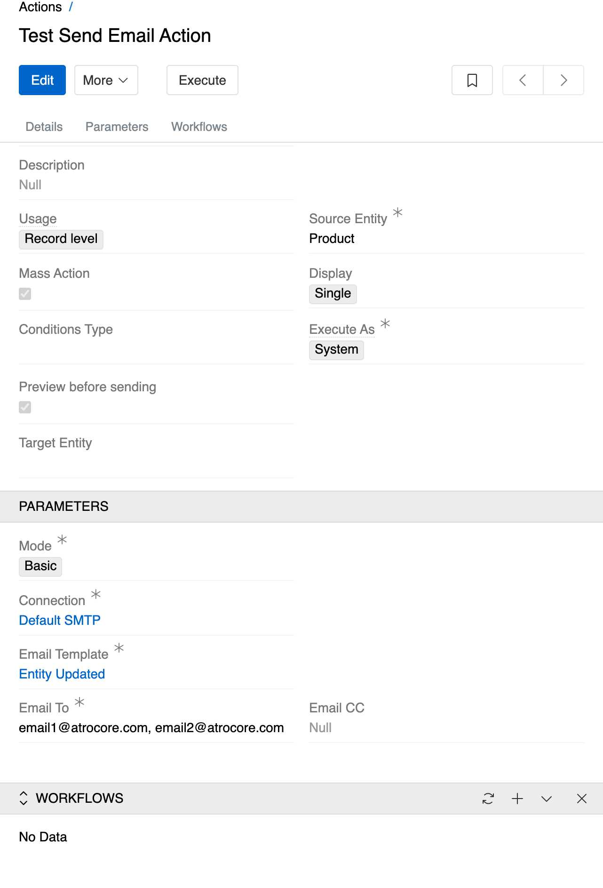{.medium}

> The Get MS Emails action works similarly — it retrieves emails from your Microsoft mailbox and saves them to the Emails entity. This action is available through the [Microsoft 365 Connector](https://store.atrocore.com/en/microsoft-365-connector/20205) module.

**Configuration:**

- **Target Entity**: Entity type that contains recipient information
- **Preview before sending**: Option to review email content before sending
- **Mode**: Email composition method (Basic or Script)
- **Connection**: Email server connection configuration (required) - links to configured SMTP connections

**Basic Mode:**

- **Email Template**: Email template for content and formatting (required) - links to Email Templates, you can choose existing template or create your own
- **Email To**: Primary email recipients (supports multiple addresses)
- **Email CC**: Carbon copy recipients (optional)

**Script Mode:**

Script mode provides advanced email configuration using [Twig](../../../10.developer-guide/80.twig-tutorial/) templating syntax.

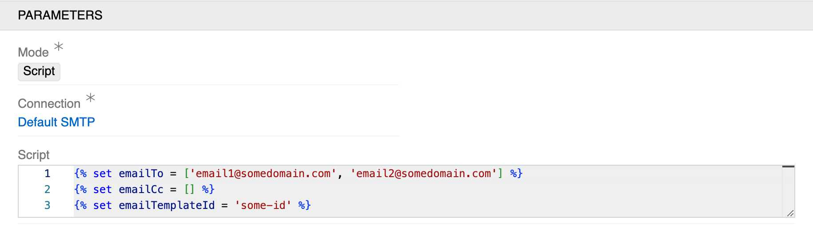{.medium}

For example, you can send an email to all users who are related to the particular record or select a template depending on the kind of changes.

- **Script**: Code editor for dynamic email configuration with Twig variables:
  - `emailTo`: Array of recipient email addresses (e.g., `['email1@domain.com', 'email2@domain.com']`)
  - `emailCc`: Array of CC recipient email addresses (can be empty: `[]`)
  - `emailTemplateId`: ID of the email template to use (e.g., `'some-id'`)

#### **Send Notification**  

Sends internal system notifications to users within the AtroCore application.

Can be used to send notifications to any users of the system in response to a specific trigger (record modification, changing of the specific field, etc.). You can select a specific user from the list of all system users, as well as select users associated with a specific entity.

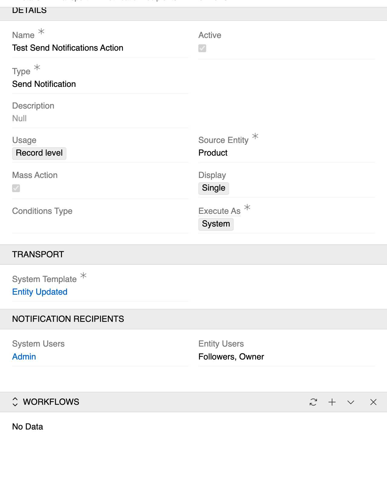{.medium}

**Configuration:**

- **System Template**: Notification template (required) - links to Notification Templates. You can choose any of the pre-configured templates or create your own
- **System Users**: Specific users to receive notifications - links to Users
- **Entity Users**: Role-based recipients related to the entity record. The list of available fields depends on the entity selected in the **Source Entity** field. All user-related fields from the selected entity are presented here (Owner, Assigned User, Followers, etc.)

Notifications can have flexible recipients. This can be achieved using script mode and determine the user ID:

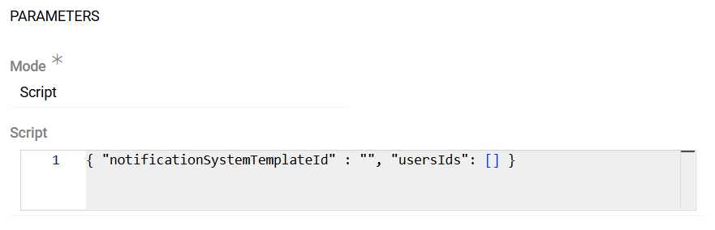{.medium}

Here is an example of a script that determines the user ID:

```



    
        
    


{ "notificationSystemTemplateId" : "systemUpdateEntity", "usersIds": {{ids|json_encode|raw}} }
```

### Utility Actions

#### **Error Message**

Displays custom error messages to prevent operations. Primarily used with "Before" workflow triggers for data validation.

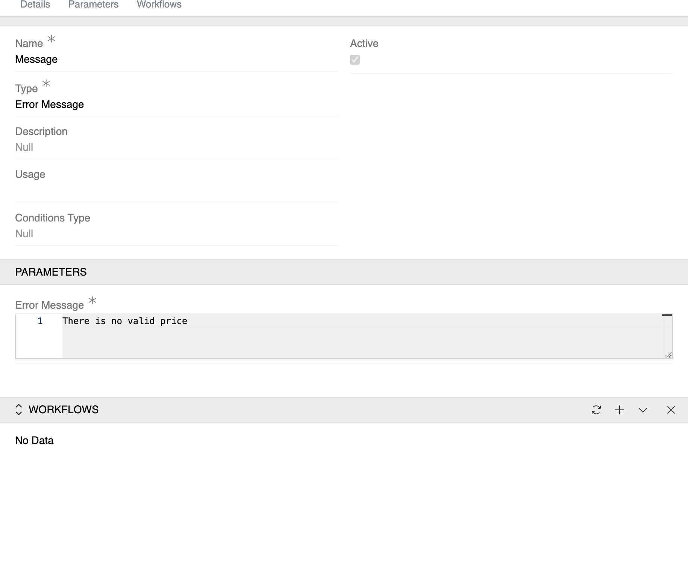{.medium}

**Configuration:**

- **Error Message**: Text content for the error message (supports dynamic content with [Twig syntax](../../../10.developer-guide/80.twig-tutorial/docs.md))

! This action is typically used within [Workflows](https://store.atrocore.com/en/workflows/20194) for conditional error handling.

It is usually set up with an empty **Display** field so it does not appear as an action button, and the error message is shown whenever the action is triggered in the workflow.

#### **Action Set**

Executes multiple actions sequentially in a single operation. When triggered, the `Action Set` executes each enabled action in sequence. Each action must complete before the next begins. Individual actions can be temporarily disabled using the `Active in Action Set` checkbox without removing them from the set.

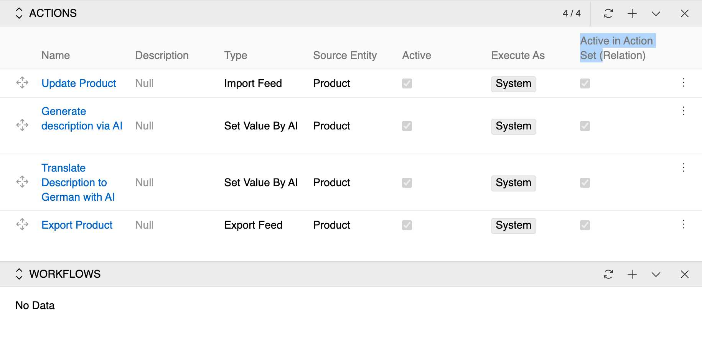{.medium}

**Configuration:**

- **Actions Panel**: Displays all included actions with their details (Name, Type, Source Entity, etc.)
- **Active in Action Set**: Each action has a checkbox to control its participation in action sets
- **Sequential Execution**: Actions execute in the defined order when triggered

**Use Cases:**

- Execute multiple related actions as a single operation (e.g., AI content generation, translation, export)
- Temporarily disable specific actions for testing different scenarios
- Integrate complex workflows while maintaining control over individual components
