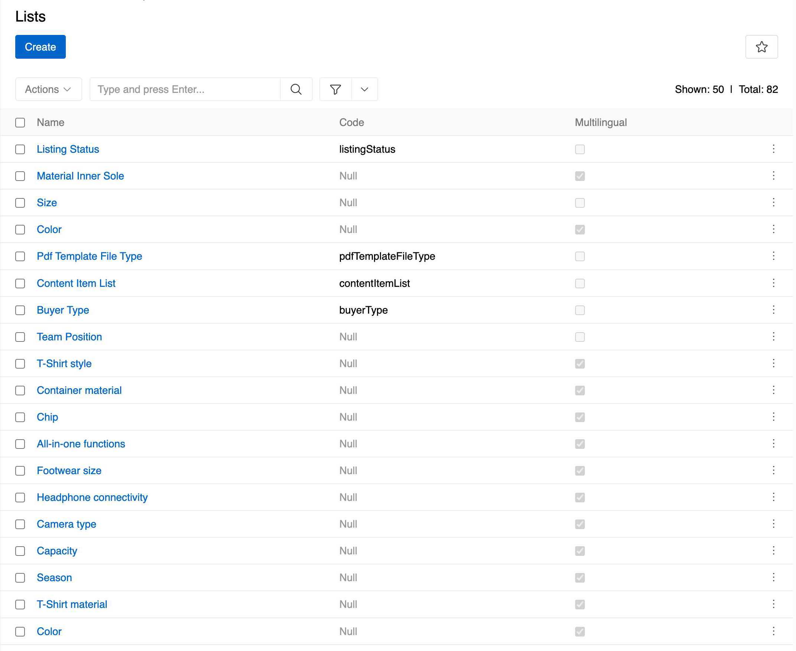
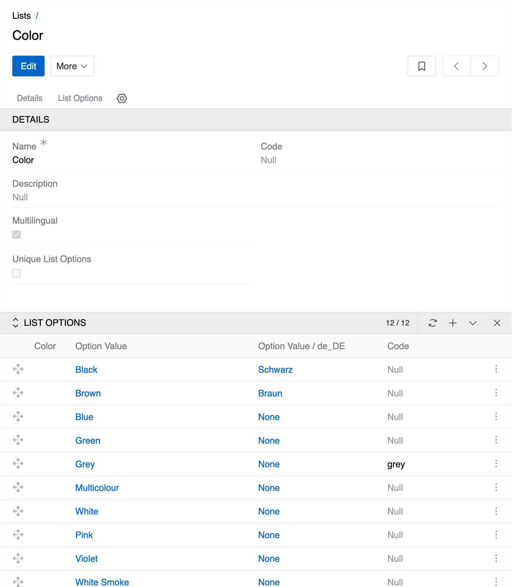
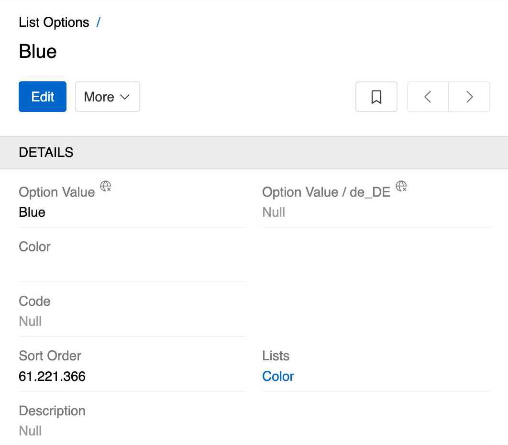

Lists in AtroCore are configurable enumeration values that provide standardized options for various fields throughout the system. They serve as a reference data that can be used across different entities to ensure consistency and data integrity.

Lists can be accessed through `Administration > Lists` and are used to define predefined options for fields such as statuses, types, categories, and other enumerable values.

## Overview

Lists provide a centralized way to manage dropdown options and selection values across your AtroCore system. Each list contains multiple options that users can select from when filling out forms or filtering data.

{.medium}

Lists are particularly useful for:
- **Product attributes** - Colors, sizes, materials, and other product characteristics
- **System statuses** - Active/Inactive states, workflow statuses, and approval states
- **Categorization** - Types, categories, and classification systems
- **Standardized data** - Ensuring consistent values across the system

## List Structure

### List Properties

Each list has the following properties:

- **Name**: The display name of the list (e.g., "Color", "Size", "Gender")
- **Code**: An optional unique identifier for the list
- **Description**: Optional description of the list's purpose
- **Unique List Options**: Ensures that each option within a list is distinct; duplicate option values are not allowed within the same list. Available in [Advanced Data Management](https://store.atrocore.com/en/advanced-data-management/20113) module.

{.medium}

### List Options

Each list contains multiple options that users can select from. List options are managed through the related entity panel in the list's detail view. Navigate to the **List Options** tab to add, edit, or remove options.

**Option Properties**:
- **Option Value**: The display text shown to users
- **Color**: Input field with a color picker for selecting or entering a HEX color code, providing a visual representation of the option
- **Code**: Optional unique identifier for the option
- **Sort Order**: Determines the display order of an option as shown in the list. Lower numbers appear first.
- **Lists**: Reference to the parent list(s). One option can belong to several lists, allowing for flexible categorization and reuse across different contexts

**Configuration Features**:
- **Sort Order**: Use numeric values to arrange options in a meaningful sequence. Lower numbers appear first.
- **Multilingual Support**: Each option can have different values for different languages. This is particularly useful for international deployments.
- **Code Usage**: Codes provide a stable identifier for options, useful for API integration and system configuration.

{.medium}

### Ordering Options

You may need to change the order in which options appear within a list. This can be accomplished directly inside the `List Options` tab.

> This ordering directly controls how options are displayed in dropdown lists throughout the system.

**Ordering Methods**:
- **Drag and Drop**: Options can be reordered by dragging and dropping them into the desired position. This method automatically assigns *Sort Order* values starting from 0 with an increment of 10 for each subsequent option.
- **Sort Order Field**: This integer field on the option determines its position relative to others. In an option's [detail view](../../04.understanding-ui/docs.md#detail-view), set a lower number to position an option before another, or a higher number to position it after. This ordering is respected in dropdown lists.

## Access Control

Lists follow AtroCore's standard access control system with general scopes for 'List' and 'List Options'. Additionally, you can enable more granular access control by configuring advanced access options through the [Access Management panel](../11.entity-management/docs.md#access-management-panel) in Entity Management for both List and List Option entities. This allows you to organize list and list option records accordingly and implement more specific access control based on your organization's needs.

Available permission scopes:
- **List**: Controls access to list records (view, create, edit, delete)
- **List Options**: Controls access to list option records (view, create, edit, delete)

For detailed information about configuring roles and permissions, see [Roles](../14.access-management/03.roles/docs.md).

## API Access

Lists can be accessed and managed through the AtroCore REST API using the `ExtensibleEnum` and `ExtensibleEnumOption` endpoints. 