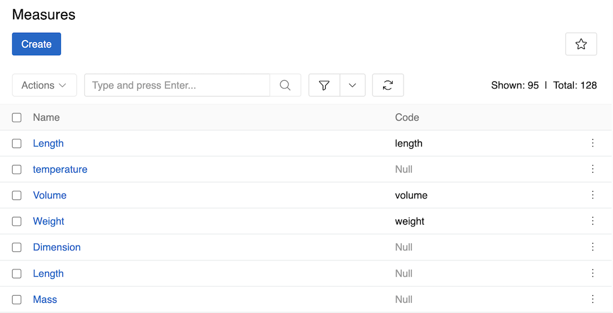
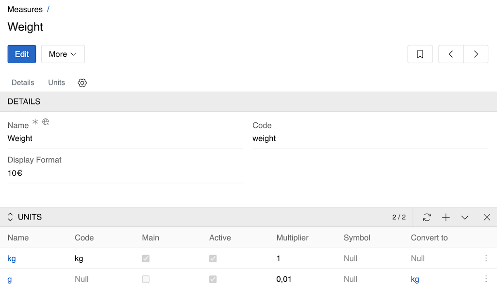
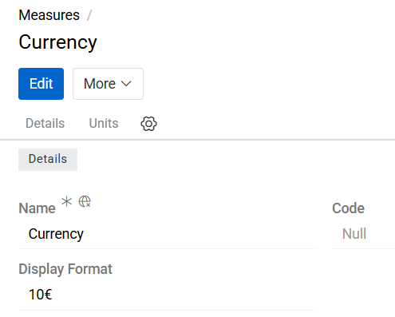
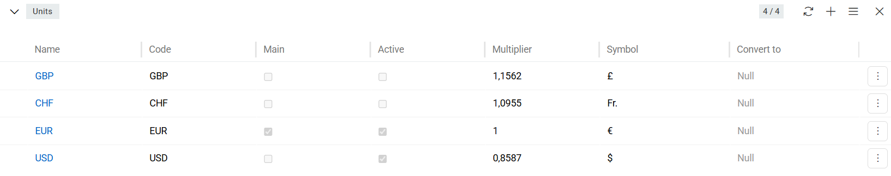

Measure Units system allows you to manage different Measures (e.g., length or weight) and their associated Units (e.g., cm, mm, dm, m) with automatic unit conversion support.

To manage Measures and Units, go to `Administration > Measures`.

{.medium}

## Measure Fields

- **Name**: The display name for the measure (e.g., "Length", "Weight", "Temperature"). This is a required field and should be clear and descriptive.
- **Code**: A unique identifier for the measure (e.g., "length", "weight"). This code is used when referencing the measure in fields and attributes.
- **Display Format**: Controls the visual representation of values in the UI - either "10€" (value before symbol) or "€10" (symbol before value).

Measures are mainly used with numeric fields and attributes ([Float](../11.entity-management/02.data-types/index.md#float), [Integer](../11.entity-management/02.data-types/index.md#integer), [Float Range](../11.entity-management/02.data-types/index.md#float-range), [Integer Range](../11.entity-management/02.data-types/index.md#integer-range)) to define units of measurement  (e.g., a price field = Float + Currency measure). 

You can also create separate fields of type [Measure](../11.entity-management/02.data-types/index.md#measure).

> You can define multiple Measures of a similar kind if you plan to use different Units for different fields. For example, you may create the Measure "Length 1" with "mm" and "cm" as Units and the Measure "Length 2" with "mm", "m" and "km" as Units and assign each Measure to different fields.

## Unit Fields

Units are managed within each Measure's detail view in the "Units" panel:

{.medium}

- **Name**: The display name for the unit (e.g., "Kilogram", "Gram", "Millimeter", "Centimeter"). This is a required field.
- **Code**: A unique identifier for the unit within the measure (e.g., "kg", "g", "mm", "cm").
- **Main**: Indicates if this is the main (default) unit for the measure. Only one unit can be marked as main.
- **Active**: Controls whether the unit is available for use in the system.
- **Multiplier**: The conversion factor used for automatic unit conversion relative to the main unit.
- **Symbol**: The symbol used to represent the unit (e.g., "kg", "g", "mm", "cm").
- **Convert to**: The target unit for automatic conversion when this unit is used.

> The main unit serves as the base unit on which all other units for the current measure are based. Its multiplier is always set to "1", and all other multipliers are calculated relative to it. The main unit cannot be deleted.

## Currency Settings

Currencies are a special type of measure used to represent monetary values and perform currency conversions within the system. To manage Currencies, go to `Administration > Currency`.

{.medium}

Currency records define the available currencies that can be used in currency-type fields, price calculations, imports, exports, and integrations.

### Currency Fields

The Currency entity includes the following standard fields:
- **Name**: Defines the display name of the currency (e.g., Euro, US Dollar, British Pound).
- **Code**: Specifies the unique currency code according to the ISO 4217 standard (e.g., EUR, USD, GBP). This code is used internally for calculations, integrations, and currency conversions.
- **Display Format**: Defines how currency values are displayed throughout the system. The format determines the position of the currency symbol or code relative to the numeric value. For example, a value of ten dollars can be displayed as `$10` (symbol before the value) or `10$` (symbol after the value), depending on the configured format. This setting affects the presentation of currency values in user interfaces, exports, and reports.

### Currency List

The Currency list view follows the same principles and behavior as the Unit list view.

Users can:
- Search for currencies
- Create new currency records
- Edit existing currencies
- Delete obsolete currencies
- Configure currency-specific settings

{.medium}

Currency exchange rates can be configured to enable automatic conversion between different currencies.

## API

For numeric fields with measures, the API returns values in all units of their measure. For example, if a price field is set in USD, the API can return the price converted to all other currencies defined in the Currency measure.
