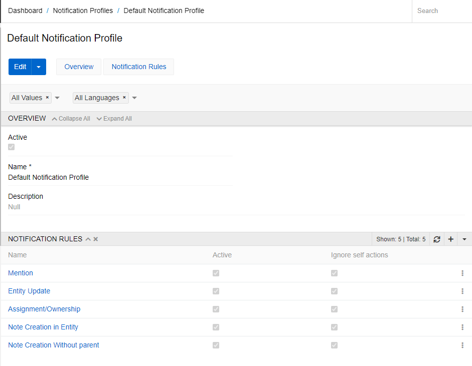
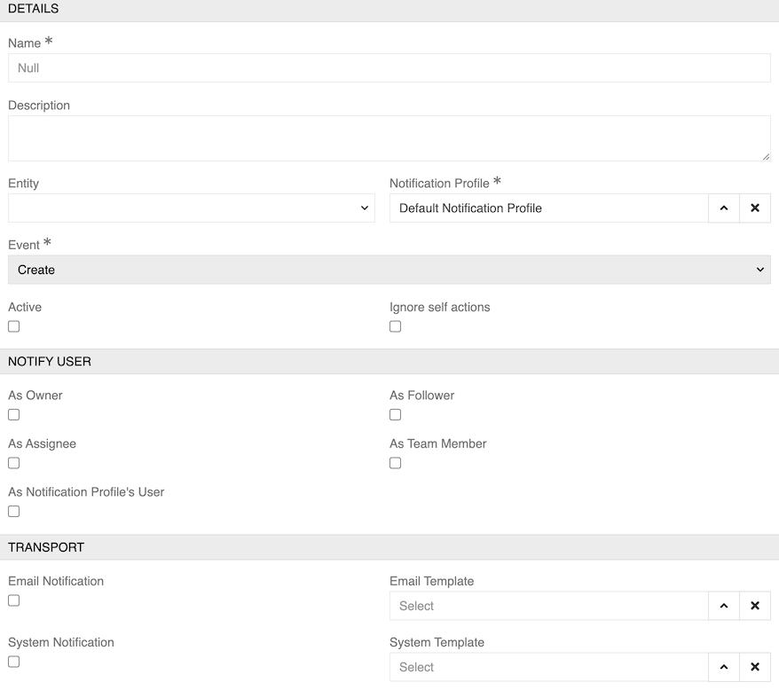
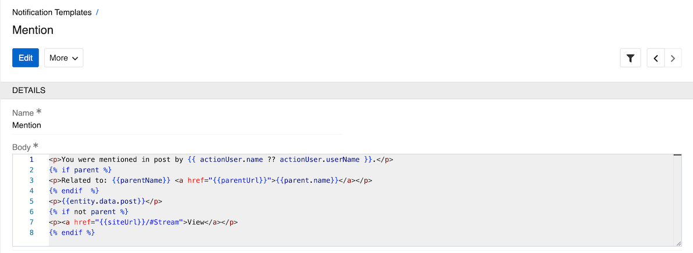
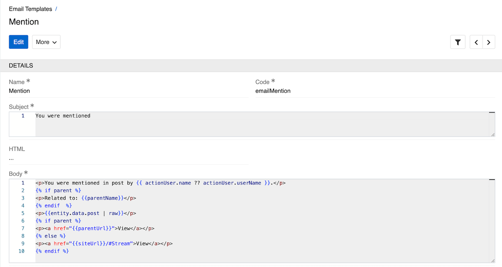

<!-- TODO: describe following records -->

AtroCore provides two types of notifications: system (desktop) and email notifications. You can receive notifications for various events like being mentioned in an [Activities](../../06.activities/)post, changes to records you follow, or when records are addressed to you.

Desktop notifications appear through the bell icon in the toolbar [notifications panel](../../05.toolbar/04.notifications/).

## General Settings

To enable notifications in your system, go to `Administration / Settings` (see [Settings](../01.system-settings/docs.md#notifications)) and select the checkbox `Send out notifications` in the `Notifications` panel. Here you can also select the notification profile and email connection that will be used for sending notifications.

{.medium}

By default, after installing the system "Default Notification Profile" is selected as `Notification Profile`.

To enable email notifications, you also need to set up an SMTP connection. Go to `Administration / Connections` (see [Connections](../04.connections/docs.md#smtp)), create a new connection of type SMTP, and then select it as "Connection for E-Mail Notifications" in the `Administration / Settings`.

{.large}

## User Settings

User notification preferences can be configured in the [User Profile](../../16.user-profile/) as described in [Notifications](../../05.toolbar/04.notifications/).

## Notification Profiles

Notification Profiles are sets of rules that determine how different types of notifications are sent to users using predefined templates. Notification Profiles are available in `Administration / Notification Profiles`.

{.large}

Set a name for the notification profile and activate it. If the profile is inactive, no notifications will be sent. Select notification rules from those that already exist in the system, or create your own rule by clicking the "+" button.

{.large}

The Notification Rule comes with the following preconfigured fields, mandatory are marked with *:

| **Field Name**          | **Description**                                                                                                               |
| ----------------------- | ----------------------------------------------------------------------------------------------------------------------------- |
| Active                  | Activity state of the rule                                                                                                    |
| Name *                  | The notification rule name                                                                                                    |
| Description             | The description of the rule                                                                                                   |
| Entity                  | The entity to which the rule applies. If the rule is system-wide, the entity field can be left empty                          |
| Notification Profile *  | The profile to which the rule applies                                                                                         |
| Event *                 | Events that trigger the sending of notifications                                                                              |
| Ignore self actions     | Remove this checkbox if you do not want to receive notifications about your own actions that you perform in the system        |
| Notify User             | Choose which types of users should receive notifications: Owner, Assignee, Follower, Team Member, Notification Profile's User |
| Email Notification      | Select the checkbox if you want to receive notifications by mail                                                              |
| System Notification     | Select the checkbox if you want to receive desktop notifications                                                              |
| Email Template          | Select the [template](#email-templates) for email notifications                                                               |
| System Template         | Select the [template](#notification-templates) for desktop notifications                                                      |

You can create multiple rules for one Notification Profile. For example, you may need this to create rules with templates in different languages.
No notifications are sent for an inactive Notification Profile. No notifications are sent for an inactive Notification Rule.

## Notification Templates

Notification Templates are used to configure how desktop notifications appear in the system. They are managed through `Administration / Notification Templates`.

{.large}

A Notification Template contains the following fields:

-   **Name** - The name of the template (required)
-   **Body** - The content of the notification using [Twig](../../../10.developer-guide/80.twig-tutorial/) template syntax.

> The `Entity Updated` notification template is only supposed to be used in workflows after an update (i.e. not via a button), otherwise an error will occur.
The same applies to email type notification templates.

## Email Templates

Email Templates define the structure and content of email notifications. They are managed through `Administration / Email Templates`.

{.large}

An Email Template includes:

-   **Name** - The name of the template (required)
-   **Code** - A unique identifier for the template (e.g., "emailMention")
-   **Subject** - The email subject line using [Twig](../../../10.developer-guide/80.twig-tutorial/) template syntax
-   **HTML** - Set the checkbox if you want your content to have HTML formatting
-   **Body** - The content of the email using [Twig](../../../10.developer-guide/80.twig-tutorial/) template syntax.

> Email Templates are only supposed to be used in workflows after an update (i.e. not via a button), otherwise an error will occur.
