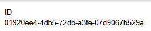
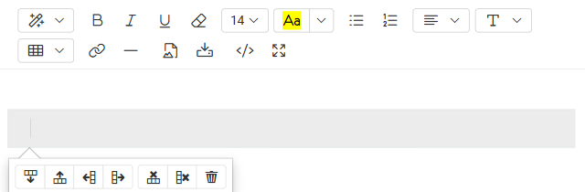
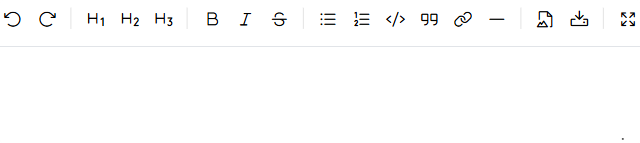

AtroCore supports various data types for entity fields and attributes. Each data type has specific characteristics and use cases. Understanding these data types helps you design effective entity structures and ensures data integrity.

## Identifiers

Each entity record has a unique ID, which is set automatically when a new record is created. AtroCore uses **UUID v7** identifiers.

This type of identifiers is time-sortable, meaning newly created records appear at the top of the list by default.

When creating a record through the user interface, IDs are assigned automatically and cannot be set manually. However, custom IDs can be provided when creating records via [import](../../../../02.data-exchange/01.import-feeds/docs.md).

## Numeric Data Types

### Auto-increment

> **Field only** - Not available for attributes

Automatically generates a unique, sequential integer value for each record. The value is assigned by the database engine when a record is saved and cannot be manually set, inherited, or modified.

This field type has no configuration options beyond the [common field required fields](../03.fields-and-attributes/docs.md#required-fields) and tooltip.

The field behaves as a regular integer field for read purposes. It can be used in search, filtering, sorting, and scripts. It can also be used in conditions (including conditional options and basic conditions in actions), but only on already-saved records — since the value is assigned on first save, conditions depending on this field are not evaluated during initial record creation.

When an Auto-increment field is added to an entity that already contains records, the database automatically populates existing records with sequential values. The assignment order is determined by the database. No custom renumbering logic is applied at the application level.

### Float

Used for decimal numbers with fractional parts.

**Configuration options:**

- **Disable null value**: Prevents the field from being set to null
- **Database Index**: Adds a database index for faster searching/filtering
- **Unique**: Field value must be unique within the entity
- **Measure**: Unit of measurement for the field value
- **Min, Max**: Minimum and maximum allowed values
- **Amount of digits after comma**: Number of decimal places to display
- **Default**: Sets a default value for the field

### Float Range

Defines a range of decimal values with minimum and maximum bounds. Useful for setting acceptable value ranges.

**Configuration options:**

- **Database Index**: Adds a database index for faster searching/filtering
- **Measure**: Unit of measurement for the field value
- **Amount of digits after comma**: Number of decimal places to display
- **Default From, Default To**: Sets default range values

### Integer

Whole numbers without decimal places.

**Configuration options:**

- **Disable null value**: Prevents the field from being set to null
- **Database Index**: Adds a database index for faster searching/filtering
- **Unique**: Field value must be unique within the entity
- **Measure**: Unit of measurement for the field value
- **Min, Max**: Minimum and maximum allowed values
- **Disable formatting**: Disables number formatting (e.g., thousand separators)
- **Default**: Sets a default value for the field

> If your data is not truly an integer but a numeric string with a specific format, consider using the **String** type with a Regex pattern instead of **Disable formatting** option.

### Integer Range

Defines a range of whole numbers with minimum and maximum bounds. Useful for age ranges, quantity limits, etc.

**Configuration options:**

- **Database Index**: Adds a database index for faster searching/filtering
- **Measure**: Unit of measurement for the field value
- **Default From, Default To**: Sets default range values

## Character Data Types

### Email

> **Field only** - Not available for attributes

Specifically designed for email addresses with built-in validation.

**Configuration options:**

- **Database Index**: Adds a database index for faster searching/filtering
- **Unique**: Field value must be unique within the entity
- **Remove leading and trailing whitespaces**: Trims whitespace from the beginning and end of the value
- **Max length**: Maximum number of characters allowed
- **Count bytes instead of characters**: Counts bytes instead of characters for **Max length** validation
- **Regex pattern**: Regular expression for input validation
- **Default**: Sets a default value for the field

### HTML

Rich text content with HTML markup support. Allows formatting, links, and embedded content.

**Configuration options:**

- **Multilingual**: Allows field values to be set per language
- **Disable null value**: Prevents the field from being set to null
- **Max length**: Maximum number of characters allowed
- **Count bytes instead of characters**: Counts bytes instead of characters for **Max length** validation
- **Disable Displayed Text Shortening**: Prevents automatic shortening of displayed text
- **Min height (px)**: Sets the minimum height of the input field in pixels
- **Symbol amount to be displayed**: Limits the number of symbols shown in the UI
- **Height (px)**: Sets the height of the input field in pixels
- **Use iframe in view mode**: Displays the field content in an iframe in view mode
- **HTML Sanitizer**: Enables HTML sanitization for input
- **Default Value Type**: Options: Basic, Script. Determines how the default value is set
- **Default**: Sets a default value for the field

**HTML Toolbar**

{.medium}

The editor toolbar provides the following controls:

| Button | Description |
|---|---|
| **Style** | Sets the text block style: Normal, Quote, Code, or Headings (H1–H6) |
| **Bold** | Makes selected text bold |
| **Italic** | Makes selected text italic |
| **Underline** | Underlines selected text |
| **Remove Font Style** | Resets selected text to default styling, removing all inline formatting |
| **Font Size** | Changes the font size of selected text |
| **Recent Color** | Sets background color or text color using a color picker |
| **Unordered List** | Creates a bulleted (unordered) list |
| **Ordered List** | Creates a numbered (ordered) list |
| **Paragraph** | Controls selected text alignment (left, center, right, justify) and indentation (outdent/indent) |
| **Line Height** | Adjusts the vertical spacing between lines of the selected paragraph |
| **Table** | Inserts a table — see detail description below |
| **Link** | Opens the `Insert Link` dialog to add a hyperlink with display text and URL |
| **Insert Horizontal Rule** | Inserts a horizontal divider line (`
`) |
| **Select Existing Image** | Opens the `Files` window to embed an image already uploaded to AtroCore |
| **Upload Image** | Opens an `Upload` window to upload and embed an image from your local file system |
| **Code View** | Switches to raw HTML source view for direct editing of the markup |
| **Full Screen** | Expands the editor to full screen for easier editing; click again to exit |

**Working with Tables**

Tables are a powerful way to display structured data, comparisons, or legends directly in an HTML field.

**Inserting a table:**

- Click the **Table** button in the toolbar.
- A grid will appear — hover over it to select the number of rows and columns (similar to Microsoft Word), then just click on it to insert.

**Editing a table:**

Once inserted, click on any cell to reveal the context menu with the following options:

- **Add Row Above** — inserts a new row above the selected cell's row.
- **Add Row Below** — inserts a new row below the selected cell's row.
- **Add Column Left** — inserts a new column to the left of the selected cell's column.
- **Add Column Right** — inserts a new column to the right of the selected cell's column.
- **Delete Row** — removes the entire row of the selected cell.
- **Delete Column** — removes the entire column of the selected cell.
- **Delete Table** — removes the entire table.

### Markdown

Text content with Markdown syntax support. Provides lightweight formatting options for documentation and notes.

**Configuration options:**

- **Multilingual**: Allows field values to be set per language
- **Disable null value**: Prevents the field from being set to null
- **Count bytes instead of characters**: Counts bytes instead of characters for length validation
- **Disable Displayed Text Shortening**: Prevents automatic shortening of displayed text
- **Min height (px)**: Sets the minimum height of the input field in pixels
- **Max height (px)**: Sets the maximum height of the input field in pixels
- **Symbol amount to be displayed**: Limits the number of symbols shown in the UI
- **Default Value Type**: Options: Basic, Script. Determines how the default value is set
- **Default**: Sets a default value for the field

**Markdown Toolbar**

{.medium}

| Button | Description |
|---|---|
| **Undo** | Reverts the last change made in the editor |
| **Redo** | Reapplies the last undone change |
| **Headings** | Inserts a heading at the cursor — H1 (`#`), H2 (`##`), or H3 (`###`) |
| **Bold** | Wraps selected text in `**double asterisks**` to make it bold |
| **Italic** | Wraps selected text in `*single asterisks*` to make it italic |
| **Strikethrough** | Wraps selected text in `~~tildes~~` to render it as strikethrough |
| **Generic List** | Inserts an unordered (bulleted) list item using `*` prefix |
| **Numbered List** | Inserts an ordered (numbered) list item |
| **Code** | Wraps selected text in backticks for inline code, or triple backticks for a code block |
| **Quote** | Inserts a blockquote using `>` prefix |
| **Create Link** | Inserts a link template `[display text](url)` at the cursor |
| **Insert Horizontal Line** | Inserts a horizontal divider (`---`) |
| **Select Existing Image** | Opens the `Files` window to embed an image already uploaded to AtroCore |
| **Upload Image** | Opens an `Upload` window to upload and embed an image from your local file system |
| **Toggle Fullscreen** | Expands the editor to full screen for easier editing; click again to exit |
| **Toggle Preview** | Switches between edit mode and a rendered preview of the Markdown output |
| **Markdown Guide** | Opens the Markdown syntax reference documentation |

! Use the **Toggle Preview** button to switch from editing to a rendered view of your Markdown without saving. This is useful for checking formatting before committing changes. Toggle it again to return to the editor.

### String

Short text fields for names, titles, and brief descriptions. Limited character count for concise information.

**Configuration options:**

- **Multilingual**: Allows field values to be set per language
- **Disable null value**: Prevents the field from being set to null
- **Database Index**: Adds a database index for faster searching/filtering
- **Unique**: Field value must be unique within the entity
- **Measure**: Unit of measurement for the field value
- **Remove leading and trailing whitespaces**: Trims whitespace from the beginning and end of the value
- **Max length**: Maximum number of characters allowed
- **Count bytes instead of characters**: Counts bytes instead of characters for **Max length** validation
- **Regex pattern**: Regular expression for input validation
- **Default Value Type**: Options: Basic, Script. Determines how the default value is set
- **Default**: Sets a default value for the field

### Text

Long-form text content for descriptions, notes, and detailed information. Supports multi-line content.

**Configuration options:**

- **Multilingual**: Allows field values to be set per language
- **Disable null value**: Prevents the field from being set to null
- **Max length**: Maximum number of characters allowed
- **Count bytes instead of characters**: Counts bytes instead of characters for **Max length** validation
- **Disable Displayed Text Shortening**: Prevents automatic shortening of displayed text
- **Symbol amount to be displayed**: Limits the number of symbols shown in the UI
- **Minimum number of rows of textarea**: Sets the minimum number of rows for textarea input
- **Maximum number of rows of textarea**: Sets the maximum number of rows for textarea input
- **Use disabled textarea in view mode**: Displays the field as a disabled textarea in view mode
- **Default Value Type**: Options: Basic, Script. Determines how the default value is set
- **Default**: Sets a default value for the field

### URL

Web addresses with validation.

**Configuration options:**

- **Multilingual**: Allows field values to be set per language
- **Disable null value**: Prevents the field from being set to null
- **Database Index**: Adds a database index for faster searching/filtering
- **Unique**: Field value must be unique within the entity
- **Max length**: Maximum number of characters allowed
- **Count bytes instead of characters**: Counts bytes instead of characters for **Max length** validation
- **Strip**: Removes protocol and domain from the URL
- **Default**: Sets a default value for the field
- **URL Label**: Sets a label for the URL. The "Open link" and "View" labels are available. If nothing is selected, the URL is shown without a label

## Date / Time Data Types

### Date

Calendar dates without time information. Date values are selected via a picker interface.

**Configuration options:**

- **Database Index**: Adds a database index for faster searching/filtering
- **Unique**: Field value must be unique within the entity
- **Use numeric format**: Displays the value using the format defined in your `Locale` settings. The default Locale uses `MM/DD/YYYY` format (e.g., `11/13/2025`).

### Date-time

Combined date and time information. The date-time picker allows precise time selection, including seconds, for both data entry and filtering.

**Configuration options:**

- **Database Index**: Adds a database index for faster searching/filtering
- **Unique**: Field value must be unique within the entity
- **Use numeric format**: Displays the value using the format defined in your `Locale` settings. The default Locale uses `MM/DD/YYYY HH:mm` format (e.g., `11/13/2025 14:30`).

> For dates close to the current date, a relative format is used:
- `Today` / `Today HH:mm` - for the current date
- `Yesterday` / `Yesterday HH:mm` - for the previous dayTo change the date display or time formats, configure the `Date Format` or `Time Format` fields in your [Locale](../../02.locales/docs.md) settings. This allows you to standardize date formatting across your organization or customize it for different regions.
- `Tomorrow` / `Tomorrow HH:mm` - for the next day

! To change the date display or time formats, configure the `Date Format` or `Time Format` fields in your [Locale](../../02.locales/docs.md) settings. This allows you to standardize date formatting across your organization or customize it for different regions.
<!-- TODO: check if (and how) it is working -->
<!-- - **Show Editor Too**: Displays both date and time editors in the UI -->
## Reference Types

### File

References to uploaded files (images, documents, etc).

**Configuration options:**

- **File Type**: Restricts allowed file types for upload - see [File Management](../../15.file-management/docs.md#file-types) for details
- **Preview size**: Options: Small, Medium, Large. Sets the preview size for files
- **Default**: Sets a default value for the field

### Language Code

> **Field only** - Not available for attributes

Single language selection from predefined options.

**Configuration options:**

- **Disable Empty Value**: Prevents the field from being set to an empty value
- **Is sorted (alphabetically)**: Enables automatic alphabetical sorting of values

### Language Codes

> **Field only** - Not available for attributes

Multiple language selection.

**Configuration options:**

- **Is sorted (alphabetically)**: Enables automatic alphabetical sorting of values

### Link

Reference to another entity record. Creates relationships between different entities. See [Fields and Relations](../07.fields-and-relations/docs.md) for more details.

> Entities of the [Base](../01.entity-types/docs.md#base), [Reference](../01.entity-types/docs.md#reference) and [Hierarchy](../01.entity-types/docs.md#hierarchy) types are the only ones that can be linked.

**Configuration options:**

- **Dropdown**: Displays the field as a dropdown selection in the UI.
- **Records per page (select dialog)**: Sets the number of records shown per page when selecting a value via the dialog.
- **Filter Results**: Specifies the [selectable values](../03.fields-and-attributes/docs.md#filter-results) for the field.

!! Avoid setting **Records per page (select dialog)** too high – it may slow down or freeze the user's browser.

### List

> The List field can be replaced with a Link field in the entity view, following the same migration approach as for [attribute](../../12.attribute-management/01.attributes/docs.md#how-to-migrate-to-link-and-multiple-link).

Single selection from a customizable list of options. Used for categories, statuses, and enumerated values.

**Configuration options:**

- **List**: Specifies the [list](../../08.lists/) of selectable values for the field
- **Dropdown**: Displays the field as a dropdown selection in the UI
- **Disable Empty Value**: Prevents the field from being set to an empty value
- **Default**: Sets a default value for the field

### Measure

> **Field only** - Not available for attributes

Single selection from a customizable list of measure units.

**Configuration options:**

- **Measure**: Specifies the [list](../../09.measure-units/) of selectable values for the field
- **Dropdown**: Displays the field as a dropdown selection in the UI
- **Disable Empty Value**: Prevents the field from being set to an empty value
- **Default**: Sets a default value for the field

### Multi-value List

> The Multi-value List field can be replaced with a Multiple Link field in the entity view, following the same migration approach as for [attribute](../../12.attribute-management/01.attributes/docs.md#how-to-migrate-to-link-and-multiple-link).

Multiple selections from a customizable list. Allows multiple categories or tags per record.

**Configuration options:**

- **List**: Specifies the [list](../../08.lists/) of selectable values for the field
- **Dropdown**: Displays the field as a dropdown selection in the UI
- **Default**: Sets a default value for the field
- **Records per page (select dialog)**: Sets the number of records shown per page when selecting a value via the dialog.

!! Avoid setting **Records per page (select dialog)** too high – it may slow down or freeze the user's browser.

### Multiple Link

Multiple references to other entity records. Creates relationships between different entities. See [Fields and Relations](../07.fields-and-relations/) for more details.

!! **Reference Entity Restriction:** Multiple-link fields do not support entities of type [Reference](../01.entity-types/docs.md#reference). If you attempt to create a Multiple-link field pointing to a Reference entity, the system will display a validation message and prevent field creation.

!! **Required Field Restriction:** Multiple-link fields cannot be marked as [required](../03.fields-and-attributes/docs.md#required). This configuration option is not available for this field type.

**Configuration options:**

- **Log the change as a record activity**: Records changes in this field as Activity.
- **Filter Results**: Specifies the [selectable values](../03.fields-and-attributes/docs.md#filter-results) for the field.
- **Records per page (select dialog)**: Sets the number of records shown per page when selecting a value via the dialog.

!! Avoid setting **Records per page (select dialog)** too high – it may slow down or freeze the user's browser.

Common configuration options **Create no record activity** and **No recording as modification** on the other hand are not available for Multiple link field.

## Other Data Types

> The **Script** data type, which allows calculating field and attribute values dynamically via scripts, is available with the ["Advanced Data Management"](https://store.atrocore.com/en/advanced-data-management/20113) module.

### Array

Array of strings.

**Configuration options:**

- **Multilingual**: Allows field values to be set per language
- **Empty string value is not allowed**: Prevents saving an empty string as a value

### Boolean

True/false values. Used for flags, toggles, and simple yes/no decisions.

**Configuration options:**

- **Multilingual**: Allows field values to be set per language
- **Allow null value**: When enabled, the field or attribute can be set to null in addition to true/false. When disabled, null is not permitted.
- **Default**: Sets a default value for the field

> When **Allow null value** is enabled, the boolean field or attribute appears as a dropdown with options: Null, Yes, No. When disabled, it appears as a checkbox (true/false only).

### Color

> **Field only** - Not available for attributes

Color values with picker interface.

**Configuration options:**

- **Database Index**: Adds a database index for faster searching/filtering
- **Unique**: Field value must be unique within the entity
- **Disable Empty Value**: Prevents the field from being set to an empty value
- **Default**: Sets a default value for the field

### Currency List

> **Field only** - Not available for attributes

!! **Legacy**: for new fields consider using List or Measure types instead

Single currency selection from predefined options.

**Configuration options:**

- **Is sorted (alphabetically)**: Enables automatic alphabetical sorting of values

### Static List

> **Field only** - Not available for attributes

A Static List is a single-select field type that allows users to choose exactly one value from a predefined set of options. All options are defined directly within the field configuration. These options are referenced by code, do not have IDs, and cannot be reused in other fields.

**Configuration options:**

- **Options**: A list of predefined values available for selection
- **Is sorted (alphabetically)**: Enables automatic alphabetical sorting of values

Static List options can have color as well as [List](#list) options.

### Static Multi-value List

> **Field only** - Not available for attributes

A Static Multi-value List is a multi-select field type that allows users to select one or more values from a predefined list. As with the Static List, options are field-specific, code-based, and do not have IDs.

**Configuration options:**

- **Options**: The predefined set of selectable values
- **Is sorted (alphabetically)**: Enables automatic alphabetical sorting of values

Static Multi-value List options can have color as well as [Multi-value List](#multi-value-list) options.
