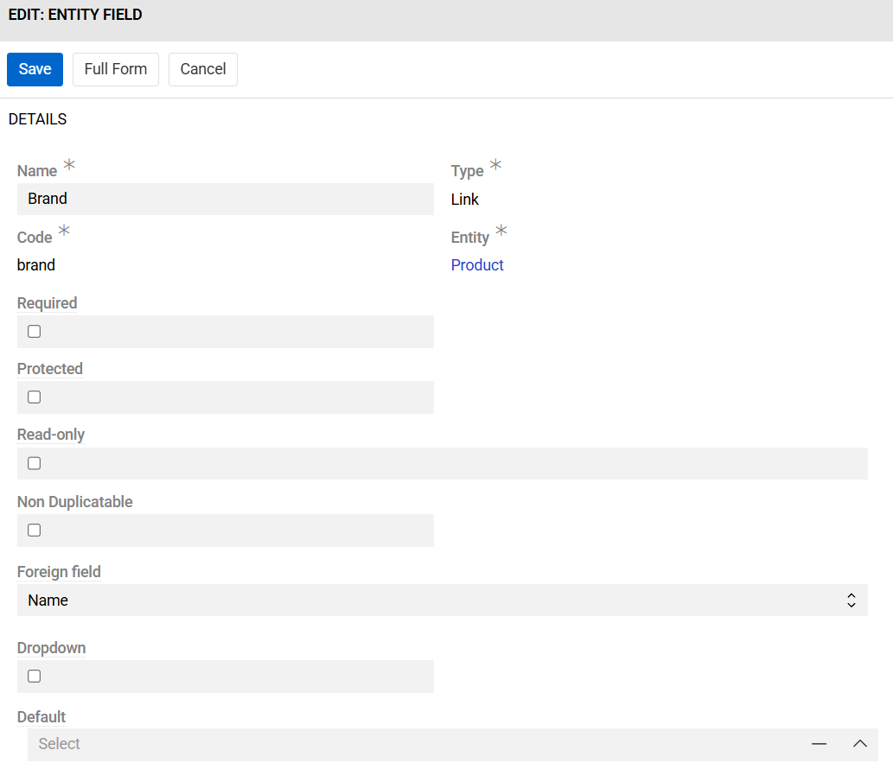
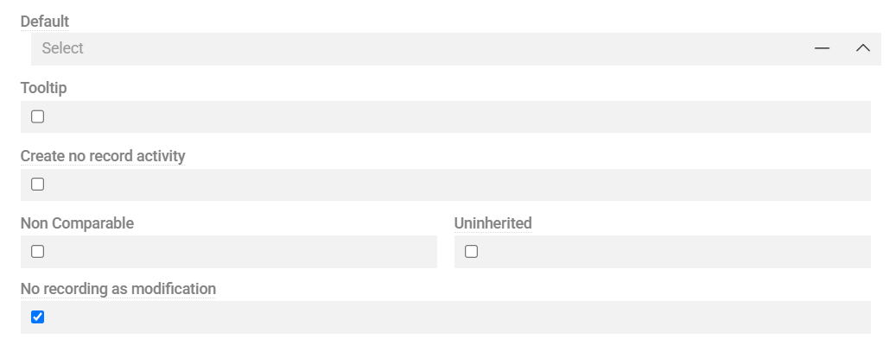
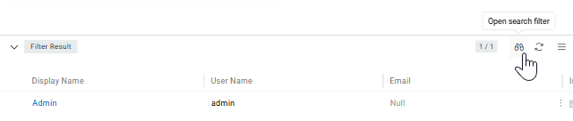
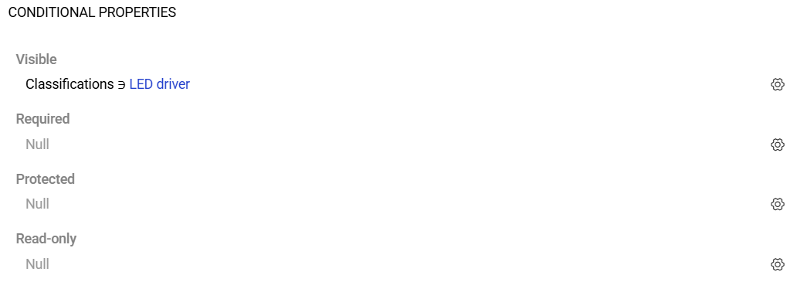
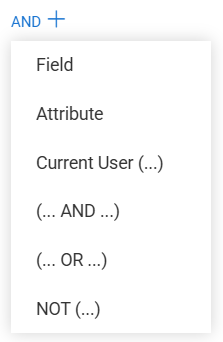
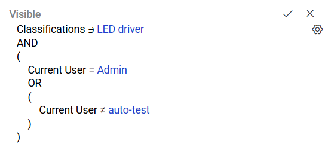

Entities are created with a default set of system fields, which provide the basic structure for data management. You can enhance entities by adding custom fields of various types or modifying existing ones. Field customization is available for both predefined entities (such as Product) and custom entities created by users.

> For detailed information about each data type and its specific configuration options, see [Data Types](../02.data-types/).

## Field Types and Restrictions

Field modification restrictions apply based on field origin:

-   **Predefined fields** in predefined entities cannot be deleted
-   **Default fields** (like Name, Description) in any entity cannot be deleted
-   **System fields** (like ID, Created At, Created By, etc.) have restrictions on property modification. Some properties (like tooltip) can be customized, while critical properties cannot be changed

The Fields panel in an Entity record displays all fields contained within the entity, providing a comprehensive view of the entity's data structure.

{.medium}

{.medium}

> **UI Display**: It is up to [Layouts](../../13.user-interface/02.layouts/) settings how the field (either custom or predefined) will look like in the UI. Layouts control field positioning, visibility, presentation in forms and lists, and overall user interface appearance.

> **Access Control**: Field-level access permissions can be configured through [Roles](../../14.access-management/03.roles/).

## Creating Fields

### Required Fields

When creating a new field, the following fields must be configured:

| **Field Name** | **Description**                                                                                                                          |
| -------------- | ---------------------------------------------------------------------------------------------------------------------------------------- |
| Name           | Field name in the main language. Can be localized — see [Labels](../../13.user-interface/03.labels/docs.md#alternative-editing-methods). |
| Code           | Unique field identifier within the entity. Initially duplicates the field name but can be customized.                                    |
| Type           | Defines the field's data type and behavior. The available configuration options vary depending on the selected type                      |
| Entity         | The entity to which the field belongs.                                                                                                   |

> Code, Type, Entity values cannot be changed after field creation.

### Configuration Options

Additional configuration options are available when creating fields.

The following options are available for all or most field types:

-   **Required**: Field must be filled in (Not available for [Multiple Link](../02.data-types/docs.md#multiple-link) fields).

> A field cannot be marked as required if there is at least one empty record for that field in the entity. To work around this restriction, set a Default value when creating the field (it will be populated to all existing records), or manually fill all empty records if the field already exists.

-   **Read-only**: Field is not editable in the UI.
-   **Non Comparable**: Field is excluded from [comparison](../../../09.comparison-and-merge/) operation.
-   **Uninherited**: Field value is not inherited in entity [hierarchies](../04.hierarchies-and-inheritance/).
-   **Tooltip**: Enables contextual help for the field, supporting text and links. Can be localized — see [Labels](../../13.user-interface/03.labels/docs.md#alternative-editing-methods).
-   **Create no record activity**: Changes in this field are not displayed as [Activity](../../../06.activities/).
-   **No recording as modification**: Changes to this field will not update the `Modified at` timestamp.
-   **Protected**: Field value is read-only from UI and from API.
-   **Disable Value Lock**: Prevents the field from being locked during modification via the UI when [Enable Value Lock](../06.advanced-data-management/docs.md#field-value-lock) is activated for the entity (available only if the Advanced Data Management module is installed)

For detailed information about configuration options specific to each data type, see [Data Types](../02.data-types/docs.md).

The `Relation management` panel is available for [Link](../02.data-types/docs.md#link) and [Multiple Link](../02.data-types/docs.md#multiple-link) field types. This panel provides additional configuration options for managing relationships between entities, including:

-   **Entity selection**: Choose which entity to link to
-   **Relationship configuration**: Set up how the relationship behaves
-   **Display options**: Configure how related records appear in the interface

For detailed information about configuring relationships and using the Relation management panel, see [Fields and Relations](../07.fields-and-relations/).

### Filter Results

For [Link](../02.data-types/docs.md#link) and [Multiple Link](../02.data-types/docs.md#multiple-link) data types, a **Filter Result** panel is available. This panel appears only for these two types and shows which options will be available to the user based on the configured filter.

The Filter affects the available options displayed on the frontend. The API validates selected values according to the filter and prevents saving invalid options. 

> This validation applies only to user-initiated changes. If a change is performed by the system (for example, during import), validation is skipped for performance reasons.

{.medium}

To set or change the **Filter Results**, press the filter button in the header. Set the necessary filter in the right panel as described in [Search and filtering](../../../11.search-and-filtering) and apply it by pressing the `Apply Search` button. Results appear in the **Filter Results** panel.

### Field Behavior and Validation

Fields can be configured with various behavior controls and validation rules to ensure data quality and user experience:

- **Type-specific options**: Each data type includes built-in configuration options (e.g., validation rules, display formats, behavior settings). See [Data Types](../02.data-types/) for advanced configuration details.
- **Data quality rules**: Apply comprehensive data quality validation through the [Data Quality](../../../15.data-quality/) module, which provides advanced validation, cleansing, and monitoring capabilities.

## Conditional Properties

Certain field options can be dynamically controlled using Conditional Properties. These properties define how a field behaves based on specific conditions or context. One or more conditional properties can be applied simultaneously.

{.medium}

Conditional properties are configured through the [Basic conditions type](#basic-conditions-type). This functionality enables administrators to define specific field properties that are applied automatically to [list](../../../04.understanding-ui/docs.md#list-view) and [detail](../../../04.understanding-ui/docs.md#detail-view) views when predefined conditions are met.

### Visible

Specifies whether the field should be displayed in the user interface when defined conditions are met. When the condition evaluates to true, the field becomes visible to the user. Otherwise, it remains hidden. This property is useful for dynamically adjusting form layouts and displaying only relevant fields based on user input or record state.

### Required

Specifies whether the field must contain a value when defined conditions are met. When the condition evaluates to true, the field becomes mandatory. This property is typically used to enforce data integrity for specific business scenarios.

### Protected

Determines whether the field should be protected from modification when certain conditions are met. When active, the field remains visible but cannot be edited, regardless of user permissions via API or AI. This property is often used to prevent critical data from being changed after a record reaches a certain state or approval stage.

### Read-only

Specifies that the field should be displayed in a non-editable state in the UI when certain conditions are met. In this mode, users can view the field's value, but cannot modify it.

### Disabled options

This property only appears for **List** and **Multi-value list** type fields. It specifies that the selected options should be disabled when certain conditions are met.

## Fields vs Attributes

While this article focuses primarily on **fields**, it's important to understand the distinction between fields and attributes in AtroCore:

**Fields** are standardized data points that are consistent across all records within an entity. They provide uniform and constant information such as name, description, and other essential data that applies universally to all records of that entity type. Fields ensure consistency and facilitate efficient data management and retrieval.

**Attributes** are dynamic characteristics that can vary between individual records of an entity. Unlike fields, attributes are not automatically applied to all records - they can be selectively assigned to specific groups or individual records as needed. This makes attributes ideal for describing characteristics that vary across records, such as size, color, or functionality.

> For detailed information about attributes and their management, see [Attribute Management](../../12.attribute-management/).

## Basic conditions type

The Basic condition type enables administrators to define conditional logic for applying property values to records. Conditions are evaluated whenever a record is created or updated, and the resulting property updates are applied only when all defined criteria are satisfied.

Basic conditions support the use of logical operators AND(), OR(), and NOT(), allowing construction of complex rule sets that combine field-based criteria, attribute-based criteria, and user-related criteria.

{.small}

### Condition Components

Each Basic condition consists of one or more of the following elements:

Field

Allows defining a rule based on the value of a specific field in the entity. The following comparison operators are available:
- Equals / Not Equals — checks whether the field value matches or does not match the specified value.
- Is Empty / Is Not Empty — checks whether the field contains no value or contains value.
- Contains / Does Not Contain — checks whether the field contains or not the specified value.
- Greater Than Or Equals / Less Than Or Equals — checks whether the field value is greater/lesser than or equal to, the specified value (applicable to numeric, date, and comparable field types).

> **Auto-increment fields**: Conditions based on an [Auto-increment](../02.data-types/docs.md#auto-increment) field are only evaluated on already-saved records. During initial record creation, no value exists yet, so the condition will not be triggered.

Attribute

Allows defining a rule based on an attribute linked to the current entity (applicable only if the entity supports attributes). Supported conditions include but are not limited to:
- Equals / Not Equals — compares the attribute value against a specified value.
- Is Empty / Is Not Empty — checks whether an attribute value is set.
- Contains / Does Not Contain — checks whether an attribute contains or not the specified value.
- Is Linked / Is Not Linked — verifies whether an attribute is linked to the record.
- Greater Than Or Equals / Less Than Or Equals — checks whether an attribute value is greater/lesser than or equal to, the specified value (applicable to numeric, date, and comparable attribute types).

Current User

Enables applying property updates based on information about the currently logged-in user. Supported conditions include:
- Is Empty / Is Not Empty — verifies presence of user context.
- Equals / Not Equals — checks if the current user matches a specified user.
- Is In / Not In — checks if the user is one of the selected user(s).
- Is In / Not In Team — checks membership in selected team(s).

### Example

In the configuration shown below, the condition specifies:

- The field Classifications must include the option LED driver.
- The current user must be Admin.
- The current user must not be auto-test.

When all these criteria evaluate to true, the property values defined for the Basic conditions type are applied.

{.small}