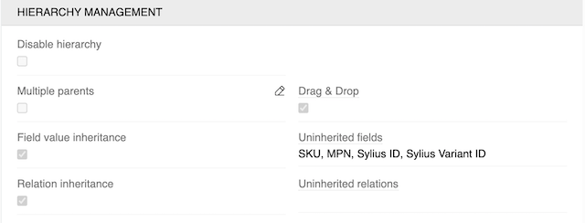
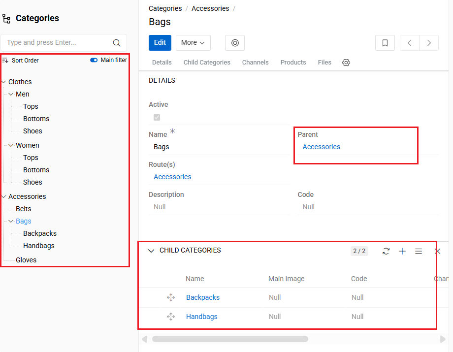
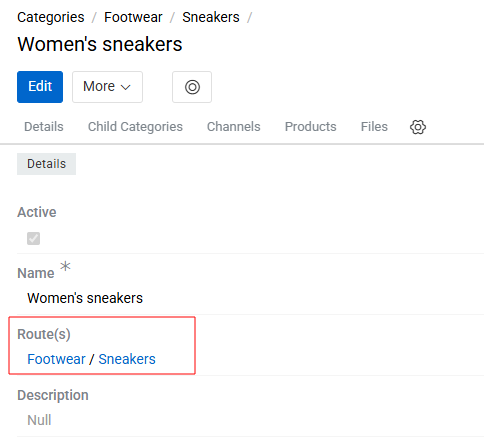
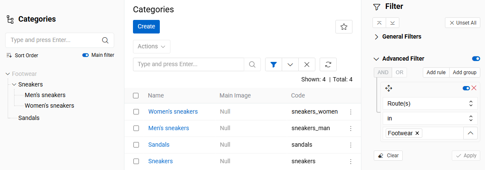
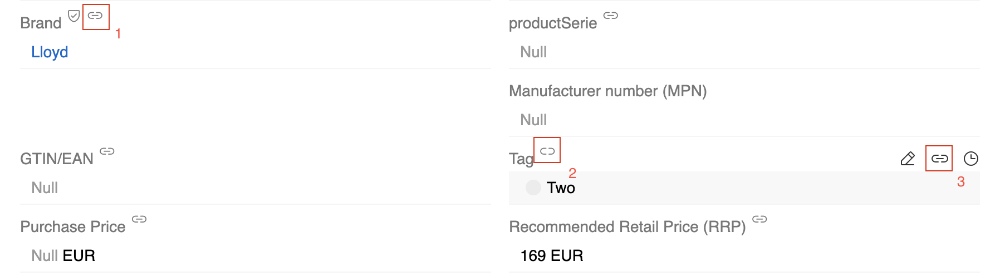
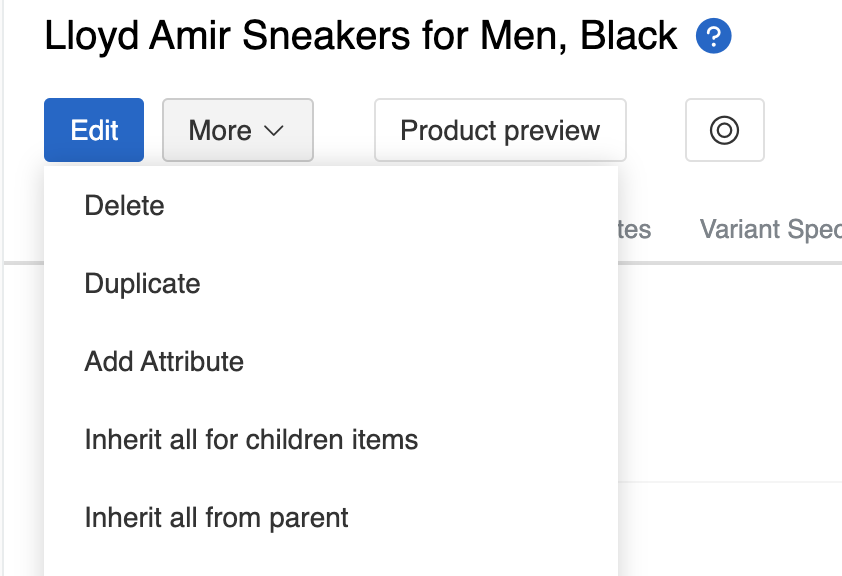

Hierarchies and inheritance allow you to create parent-child relationships between entities, where child records can inherit field values and relations from their parent records. This is particularly useful for organizing related data, such as product variants that share common characteristics with their parent product.

> Hierarchy settings are only available for entities of type "Hierarchy". The entity [type](../01.entity-types/) cannot be changed after creation.

To configure hierarchy settings, go to `Administration > Entities` and either:
- Create a new entity of type "Hierarchy" 
- Edit an existing entity of type "Hierarchy"

{.large}

## Hierarchy Management Settings

The Hierarchy Management panel provides several options to control how inheritance works within your entity hierarchy:

### Core Hierarchy Settings

- **Disable Hierarchy** - Makes a hierarchical entity behave like a basic entity by changing the layout and disabling inheritance functionality. Existing parent-child relationships are preserved but not displayed or used for inheritance.

- **Multiple Parents** - Allows child records to have multiple parent records. By default, each child can only have one parent. When multiple parents are enabled, inheritance is disabled as the system cannot determine which parent's values to inherit.

> Multiple parent relationships should be used sparingly and only in exceptional cases. Consider carefully whether such complex structures are necessary, as they can significantly complicate data management and user experience.

- **Drag & Drop** - Enables drag-and-drop functionality for reordering hierarchy items in the left sidebar of the entity list view. This works when the left panel is sorted by 'Sort order' (which is the default sorting).

### Inheritance Configuration

- **Field Value Inheritance** - When enabled, child records automatically inherit field values from their parent records. This is useful for sharing common data like descriptions, categories, or specifications across related items.

> Field inheritance behavior depends on the context: new child records created from a parent's 'Child records' panel are pre-filled with parent values, and previously inherited values in child records are automatically updated when parent values change.

- **Uninherited Fields** - Specifies which fields should not be inherited from parent records. These fields maintain their own unique values in each child record. Common examples include SKU, MPN, and other unique identifiers that must remain distinct for each record.

> Field inheritance is controlled at the field configuration level using the Uninherited option (see [Field Configuration Options](../03.fields-and-attributes/docs.md#configuration-options)).

- **Relation Inheritance** - When enabled, child records inherit relations from their parent records. This allows child records to automatically be associated with the same related entities as their parents.

- **Uninherited Relations** - Specifies which relations should not be inherited from parent records. This field is optional and can be left empty if you want all relations to be inherited.

## Hierarchy in Entity Records

Once hierarchy settings are configured, the hierarchical structure becomes visible and manageable directly within entity records. The interface provides multiple ways to view and interact with the hierarchy.

{.large}

The [left sidebar](../../../04.understanding-ui/docs.md#left-sidebar) displays the complete hierarchy tree, allowing you to navigate through parent-child relationships. This tree view shows:

- **Current selection** - The currently selected entity is highlighted in the tree
- **Add to filter icon** - Appears when an item or a category is selected. Click to add the selected item to the global entity filter. This allows you to quickly build complex filters based on hierarchy navigation.
- **Sort Order dropdown** - When set to "Sort order", enables drag-and-drop functionality for reordering hierarchy items
- **Caret/Arrow icon** - Click to expand or collapse the hierarchy structure, revealing or hiding parent-child relationships
    - **Plus (+) icon** - Click to load and display all items of the current entity type that are related to this tree item.
    - **Minus (-) icon** - Click to collapse and hide all loaded entity items related to this tree item.
- **Relation lines** - Visual connectors between hierarchy related records.
- **Child entities** - Direct children are listed beneath their parent.

The [detail view](../../../04.understanding-ui/docs.md#left-sidebar) provides specific hierarchy information:

- **Parent field** - Shows the direct parent of the current entity
- **Child entities panel** - Lists all direct child entities

All hierarchical entities contain a Route(s) field. This field always displays the full path to the record within the hierarchy. If a record has multiple parents, several routes will be shown accordingly.

{.medium}

The Route(s) field can also be used in filters to search for records by their parent records at any hierarchy level. This allows you to find all records that belong to a specific parent or to any parent in a selected hierarchy branch.

{.medium}

> You can discover more about using `Hierarchy` in the [Search and Filtering](../../../11.search-and-filtering/docs.md#left-sidebar-search) documentation.

## Field Inheritance in Practice

When `Field Value Inheritance` is enabled, child records automatically inherit field values from their parent records. Inheritance occurs in two scenarios:

1. **New record creation** - When creating a new child record from the **Child entities panel** of a parent, the new record's fields are pre-filled with values from the parent record.

2. **Parent value changes** - When a parent record's field value changes, all child records that previously inherited that field value will have their values updated to match the new parent value.

{.medium}

### Field Inheritance States

Fields in child records can have three different states:

- **Inherited fields** (marked with icon 1) - These fields have values inherited from the parent record. Their values match the parent's values and are automatically updated when the parent changes.

- **Non-inherited fields** (marked with icon 2) - These fields have their own values that differ from the parent. In edit mode, these fields show an "Inherit from parent" button (icon 3) that allows you to manually replace the current value with the parent's value.

- **Excluded fields** (no icons) - These fields are marked as `Uninherited` and never inherited from parent records. They maintain their own independent values.

### Manual Inheritance Actions

In addition to automatic inheritance, you can manually update inheritance for all fields using the action buttons in the entity detail view:

{.medium}

- **Inherit all from parent** - Updates all inheritable fields in the current record with values from its parent record. This overwrites any existing values in the current record.

- **Inherit all for children items** - Updates all inheritable fields in all child records with values from the current record. This overwrites any existing values in the child records.

> These manual actions will overwrite existing field values, unlike automatic inheritance which only affects empty fields.

## Use Cases

Hierarchies and inheritance are particularly useful for:

- **Product Management** - Creating product variants that share common characteristics with a parent product
- **Organizational Structures** - Managing departments, teams, or organizational units with shared attributes
- **Content Management** - Organizing content with shared metadata or relationships
- **Categorization** - Creating category hierarchies where subcategories inherit properties from parent categories
