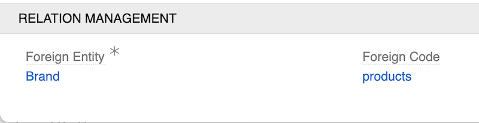
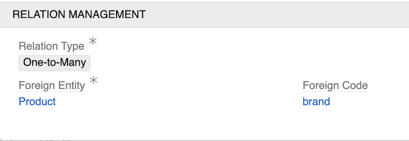
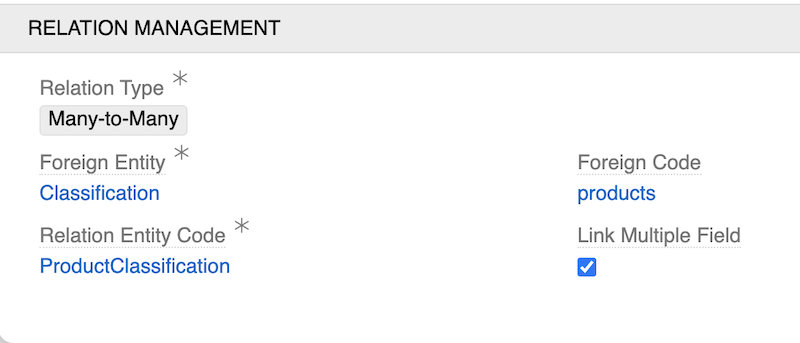

---
title: Fields and Relations
--- 

AtroCore supports relationship fields that connect entities together. These relationship fields are separate from the [hierarchy system](../04.hierarchies-and-inheritance/) used for parent-child record structures.

There are three main relationship patterns: **Many-to-One**, **One-to-Many** and **Many-to-Many**.

When you create any relationship field, the system automatically creates a corresponding field on the related entity for navigation in both directions.

## Many-to-One Relationships

Use Many-to-One relationships when multiple records need to reference a single record from another entity.

**Common use cases:** Products → Brand, Orders → Customer, Items → Category

To create a Many-to-One relationship, create a [Link](../02.data-types/index.md#link) field in the [Fields panel](../index.md#fields-panel) of the required Entity. The Relation Management panel will appear where you configure:

- **Foreign Entity** - the related entity which records are referenced in the current field
- **Foreign Code** - the code name used for the field created in the related entity for the backward relationship (this field will have type Multiple Link and "One-to-Many" Relation Type)

Example of Relation Management settings for Brand field in Product:

## One-to-Many Relationships

Use One-to-Many relationships when one record needs to connect to multiple records, but those records should only connect back to one record.

**Common use cases:** Brand → Products, Customer → Orders, Category → Items

Create a [Multiple Link](../02.data-types/index.md#multiple-link) field and select "One-to-Many" as the Relation Type. This ensures records on the "many" side can only be linked to one record on the "one" side.

Configure:
- **Foreign Entity** - the related entity which records are referenced in the current field
- **Foreign Code** - the code name used for the field created in the related entity for the backward relationship (this field will have type Link)

Example of Relation Management settings for Product field in Brand:

## Many-to-Many Relationships

Use Many-to-Many relationships when records on both sides can connect to multiple records on the other side.

**Common use cases:** Products ↔ Classifications, Users ↔ Teams, flexible cross-connections

Create a Multiple Link field and select "Many-to-Many" as the Relation Type. This automatically creates a [Relation entity](../01.entity-types/index.md#relation) to manage the connections between records.

Configure:
- **Foreign Entity** - the related entity which records are referenced in the current field
- **Foreign Code** - the code name used for the field created in the related entity for the backward relationship (this field will have type Multiple Link and "Many-to-Many" Relation Type as well)
- **Relation Entity Code** - the code name for the automatically created Relation entity
- **Link Multiple Field** - check for handy editing (values will be always shown in list views, can be configured as a field instead of a panel in layouts for details view) 

> Don't use `Link Multiple Field` if you expect a large number of related records, as this may lead to performance degradation in list views and layout rendering.

Example of Relation Management settings for Classification field in Product:

