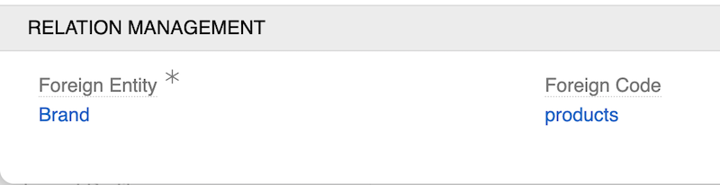
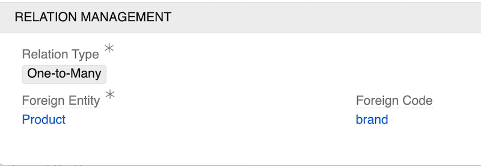
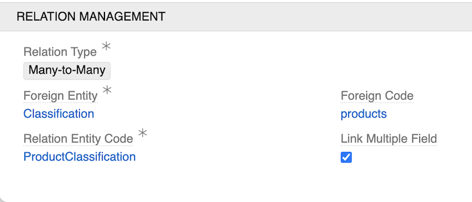

---
title: Fields and Relations
--- 

AtroCore supports relationship fields that connect entities together. These relationship fields are separate from the [hierarchy system](../04.hierarchies-and-inheritance/) used for parent-child record structures.

There are four relationship patterns: **One-to-One**, **Many-to-One**, **One-to-Many** and **Many-to-Many**.

When you create any relationship field, the system automatically creates a corresponding field on the related entity for navigation in both directions.

## One-to-One Relationships

Use One-to-One relationships when a record extends exactly one record of another entity and neither record may be used twice.

**Common use cases:** Product ↔ Amazon Product, Employee ↔ Employment Contract, Product ↔ Warranty

Create a [Link](../02.data-types/index.md#link) field and select "One-to-One" as the Relation Type.

Configure:

- **Foreign Entity** - the related entity which records are referenced in the current field
- **Foreign Code** - the code name used for the field created in the related entity for the backward relationship (this field will have type Link and "One-to-One" Relation Type as well)

The relation is kept in a single database column and that column gets a unique index, so a record on the other side can be used only once.

### The owning field and the mirror field

A One-to-One relation is stored in one place only. The field you create keeps the value, the field created on the related entity mirrors it.

Say you sell your products on Amazon and keep the marketplace-specific data in a separate `Amazon Product` entity. You create the Link field `product` on **Amazon Product**, with Foreign Entity `Product` and Foreign Code `amazonProduct`. This gives you two fields:

- **Amazon Product > Product** - the **owning field**. Its value is stored in the Amazon Product record.
- **Product > Amazon Product** - the **mirror field**. It stores nothing on its own: it shows the owning field and, when edited, writes into the Amazon Product record.

Editing the mirror field is therefore an edit of the related record, and everything configured for the owning field and its entity applies:

- **Access rights.** To change `Amazon Product` on a product, the user needs edit access to the Amazon Product record and to its `Product` field. For that reason a mirror field is not offered in the [field level permissions](../../14.access-management/03.roles/index.md#field-level-permissions) of a role - its access rights are the ones of the owning field.
- **Required.** If the owning field is required, the relation cannot be cleared from the mirror side, because that would leave the Amazon Product record without a required value.
- **Read-only state, conditional properties, validation and workflows** of the owning field and of its entity apply as well, regardless of the side the change comes from.

!! Decide where the relation is stored before you create the field. The Relation Type, the Foreign Entity and the Foreign Code cannot be changed afterwards - to store the relation on the other side you have to delete the field and create it again, which drops the values you have already collected.

### Where to store the relation

Store the relation on the entity that cannot exist without the other one. An Amazon Product only makes sense for an existing Product, so `Amazon Product > Product` is the right place for it: it can be made required, and the people who maintain the marketplace data have edit access to those records anyway.

Build it the other way round - create the field on Product - and the value ends up in the Product record. A user who may edit Amazon Products but not Products then cannot connect an Amazon Product to its Product at all, while a user who may edit Products can rewire marketplace data they have no access to.

### Both records are updated

Whichever side the change is made from, both records are saved: `Modified At` and `Modified By` are updated on the product and on the Amazon product. If [Activities](../../../06.activities/index.md) are enabled for the entities, the change is recorded in the stream of both records as well. The history stays complete and it does not matter whether the relation was edited through the owning or through the mirror field.

## Many-to-One Relationships

Use Many-to-One relationships when multiple records need to reference a single record from another entity.

**Common use cases:** Products → Brand, Orders → Customer, Items → Category

To create a Many-to-One relationship, create a [Link](../02.data-types/index.md#link) field in the [Fields panel](../index.md#fields-panel) of the required Entity. The Relation Management panel will appear where you configure:

- **Foreign Entity** - the related entity which records are referenced in the current field
- **Foreign Code** - the code name used for the field created in the related entity for the backward relationship (this field will have type Multiple Link and "One-to-Many" Relation Type)

Example of Relation Management settings for Brand field in Product:

## One-to-Many Relationships

Use One-to-Many relationships when one record needs to connect to multiple records, but those records should only connect back to one record.

**Common use cases:** Brand → Products, Customer → Orders, Category → Items

Create a [Multiple Link](../02.data-types/index.md#multiple-link) field and select "One-to-Many" as the Relation Type. This ensures records on the "many" side can only be linked to one record on the "one" side.

Configure:
- **Foreign Entity** - the related entity which records are referenced in the current field
- **Foreign Code** - the code name used for the field created in the related entity for the backward relationship (this field will have type Link)

Example of Relation Management settings for Product field in Brand:

## Many-to-Many Relationships

Use Many-to-Many relationships when records on both sides can connect to multiple records on the other side.

**Common use cases:** Products ↔ Classifications, Users ↔ Teams, flexible cross-connections

Create a Multiple Link field and select "Many-to-Many" as the Relation Type. This automatically creates a [Relation entity](../01.entity-types/index.md#relation) to manage the connections between records.

Configure:
- **Foreign Entity** - the related entity which records are referenced in the current field
- **Foreign Code** - the code name used for the field created in the related entity for the backward relationship (this field will have type Multiple Link and "Many-to-Many" Relation Type as well)
- **Relation Entity Code** - the code name for the automatically created Relation entity
- **Link Multiple Field** - check for handy editing (values will be always shown in list views, can be configured as a field instead of a panel in layouts for details view) 

> Don't use `Link Multiple Field` if you expect a large number of related records, as this may lead to performance degradation in list views and layout rendering.

Example of Relation Management settings for Classification field in Product:

