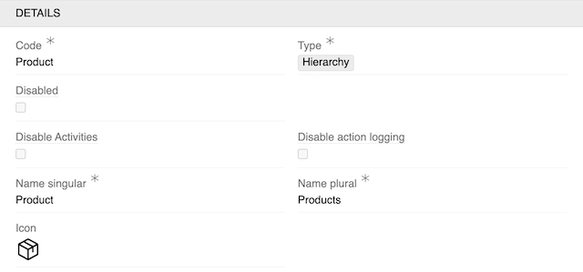
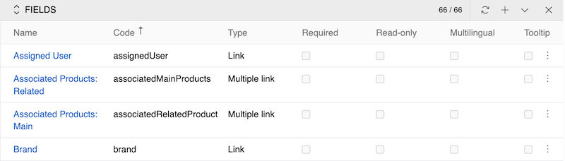
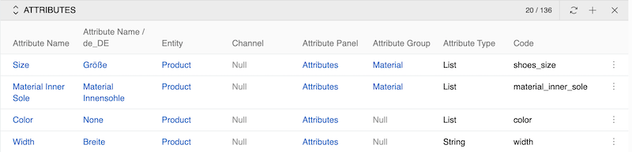

AtroCore offers highly flexible, scalable and configurable mechanisms that enable customers to manage and use their data efficiently without being tied to rigid structures.
You have the opportunity to create your own data structure on your environment according to your own needs. This is what the Entity Manager is for.
It allows you to create and delete new entities (tables) and relationships between them, add fields to entities, and configure entity parameters.

## Entity configuration

To manage entities, go to `Administration / Entities`. Here you can create new entities and configure existing ones.

{.large}

For an entity, the following record actions are available: Delete (available only for custom entities) and Duplicate. When an entity is duplicated, all of its fields are copied as well, except for fields of the [Multiple Link](02.data-types/docs.md#multiple-link) type.

### Required fields

The following fields must be filled when creating an entity:

| **Field Name** | **Description**                                                                         |
| -------------- | --------------------------------------------------------------------------------------- |
| Type           | Type of the entity. [Base](01.entity-types/docs.md#base), [Hierarchy](01.entity-types/docs.md#hierarchy), [Archive](01.entity-types/docs.md#archive) and [Reference](01.entity-types/docs.md#reference) types are available for entities |
| Code           | Entity name                                                                             |
| Name Singular  | Singular name of the entity that will be displayed in the interface                     |
| Name Plural    | The name of the entity in the plural that will be displayed in the interface            |

> Code and Type cannot be changed after entity creation.

For detailed information about entity types and their capabilities, see [Entity Types](../11.entity-management/01.entity-types/).

### Configuration fields

After creating an entity, you can configure the following fields in the Details panel:

<!-- TODO: enhance Status field description -->

| **Field Name**                             | **Description**                                                                                                                                                                    |
| ------------------------------------------ | ---------------------------------------------------------------------------------------------------------------------------------------------------------------------------------- |
| Disabled                                   | This option makes the entity unavailable for editing. When it is activated, the entity is available only in view mode                                                              |
| Disable Activities                         | Disable [activity](../../06.activities/) tracking for this entity                                                                                                                  |
| Disable action logging                     | Disable [action](../14.access-management/04.action-history/) logging for this entity                                                                                               |
| Icon                                       | Icon to be displayed before the entity name in the [navigation menu](../13.user-interface/01.navigation/) and [favorites](../../05.toolbar/02.favorites/). If not set, the first letter of the entity name is used. See [User interface](../13.user-interface/) for how to enable or disable this. |
| Archivable                                 | Enable this option to be able to archive entity records (the "Archive" field of the Boolean type is automatically added)                                                           |
| Activable                                  | This property allows you to activate and deactivate entity records (the "Active" field of the Boolean type is automatically added)                                                 |
| Default order field                        | A field by which records are sorted in the list view. By default records are sorted by [ID](../11.entity-management/02.data-types/docs.md#identifiers)                             |
| Default order direction                    | Order of sorting, possible options: Ascending, Descending (by default)                                                                                                             |
| Status field                               | Updates of this field are logged in stream                                                                                                                                         |
| Delete without confirmation                | If checked, the individual record is deleted without user confirmation. Deletion of multiple records is still to be confirmed                                                      |
| Permanent deletion period, days            | Records for this entity are permanently deleted XX days after the deletion date. This field is not used in [Relation](../../03.administration/11.entity-management/01.entity-types/docs.md#relation) entity type. See [Scheduled Jobs](../05.system-jobs/01.scheduled-jobs/docs.md#clear-deleted-data) for details. |
| Auto-delete period, in days                | Records that exist longer than the specified period will be deleted from the system. This field is used in [Archive](../../03.administration/11.entity-management/01.entity-types/docs.md#archive) entity type. See Scheduled Jobs for details.                                                                |
| Relations effecting modification date/time | Changes in these relations will cause the update of "Modified At" date and time                                                                                                    |
| Duplicatable relations                     | Select the relationships that should be duplicated when duplicating an entity                                                                                                      |
| Hide field type filters                    | Hide field type filters in the interface                                                                                                                                           |
| Text Filter fields                         | If left empty, all text fields will be used for [searching records in list views](../../11.search-and-filtering/) and [global search](../../05.toolbar/docs.md#global-search). If specified, only the selected fields will be searchable for this entity. |
| Non Comparable Fields                      | Fields that should not be used for [comparison](../../09.comparison-and-merge/docs.md#compare-records)                                                                             |
| No record activity logging for fields      | Disable activity logging for specific fields                                                                                                                                       |
| Log record activity for relations          | Enable activity logging for specific relations                                                                                                                                     |
| Has Attributes                             | Enable [attributes](../12.attribute-management/) for this entity                                                                                                                   |
| Has Associates                             | Enable [associations](../11.entity-management/08.associations/) for this entity |
| Disable direct attribute linking           | When enabled, [attributes](../12.attribute-management/) can only be added to records via classification and not manually. Only shown when `Has Classifications` is enabled. See [Classifications](../12.attribute-management/04.classifications/docs.md#enabling-classifications-for-an-entity)                                                                                            |
| Link Attributes with the Classification automatically           | When an [attribute](../12.attribute-management/docs.md) is directly linked to a record that is already assigned to a Classification, it is also automatically added to that Classification. Only available when Has Attributes is enabled and Disable direct attribute linking is disabled. See [Classifications](../12.attribute-management/04.classifications/docs.md#enabling-classifications-for-an-entity) for details.                                                                                            |
| Single Classification only           | When enabled, only one [classification](../12.attribute-management/04.classifications/docs.md) can be added to record. See [Classifications](../12.attribute-management/04.classifications/docs.md#enabling-classifications-for-an-entity) |

### Access Management panel

In this panel, you configure access control settings for the entity:

| **Field Name**       | **Description**                                                                        |
| -------------------- | -------------------------------------------------------------------------------------- |
| Enable Owner         | Enable owner-based [access control](../14.access-management/03.roles/) for this entity |
| Enable Assigned User | Enable assigned user-based access control for this entity                              |
| Enable Teams         | Enable [team](../14.access-management/02.teams/)-based access control for this entity  |

### Hierarchy Management panel

For Hierarchy type entities, an additional panel is available:

See [Hierarchy Entity Type](../11.entity-management/01.entity-types/docs.md#hierarchy) for details.

### Fields panel

The Fields panel allows you to add and configure fields for the entity.

For detailed information about field types, configuration, and management, see [Fields and Attributes](../11.entity-management/03.fields-and-attributes/).

### Attributes panel

The Attributes panel allows you to add and configure attributes for the entity.

For detailed information about attribute types and configuration, see [Fields and Attributes](../11.entity-management/03.fields-and-attributes/).

## Working with entity records

For information about creating, editing, and deleting records within entities, see the [Record Management](../../08.record-management/) documentation.
