An **Attribute** is a standalone entity in AtroCore. It has its own fields that define its specific characteristics. Therefore, before assigning an Attribute to a Product (or any other entity), you must first create the Attribute, define its type, and configure any additional properties, if needed.

An Attribute must be linked to a specific entity at the time of its creation. Once set, this binding cannot be changed. The Attribute will only be available for records of that specific entity.

Attributes can be assigned to individual records or applied in bulk. For bulk assignments, [Classifications](../04.classifications/docs.md) should be used. It is a convenient way to assign multiple attributes to products or other entities that share common properties. They help streamline the process when dealing with groups of records that require the same set of attributes.

## Attribute fields

The Attribute entity comes with the following preconfigured fields; mandatory are marked with *:

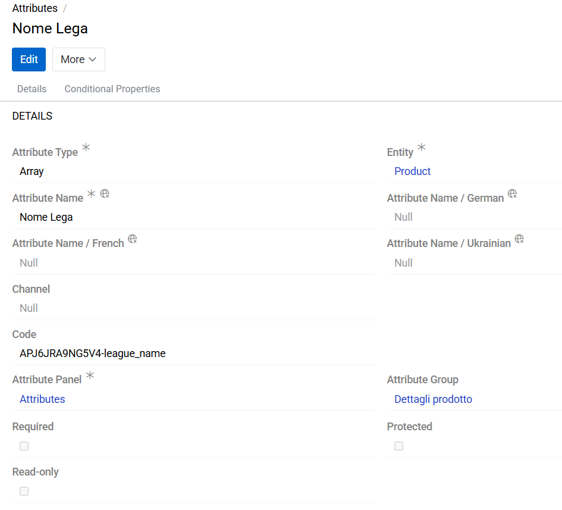{.large}

| **Field Name**           | **Description**                   |
|--------------------------|-----------------------------------|
| Attribute Type *					   | Attribute types are predefined in the system and can be defined via the drop-down menu                |
| Entity *                 |Defines the entity for which the attribute can be used. One attribute can be linked to only one entity and the value of this field cannot be changed in the future.                     |
| Code                    | Unique attribute code, consisting of small letters (a..z), numbers (0..9) and underscore symbol ("\_")        |
| Attribute Name *      | Attribute name, can be set in different [languages](../../03.languages/docs.md)                    |
| Channel                  | Allows you to set channel-specific attribute values. If a channel is added to an attribute, its name will be automatically added to the attribute name on the record page (for example, Image / Amazon). [Channels](../../../../05.pim/06.channels/docs.md) are only available with the PIM module installed.
| Attribute Group          | [Attribute group](../02.attribute-groups/docs.md) name               |
| Attribute Panel *        | [Attribute panel](../03.attribute-panels/docs.md) name                 |
| Required                 | When checked the attribute will be marked as required as soon as it is assigned.|
| Read-only                |  If checked, the attribute value is generated by the system and cannot be changed by the user
| Sort Order               |   Determines the sequence in which attributes are displayed on the record page they are linked to    |
| Sort Order in Attribute Group  |  Defines the position of an attribute within the Attribute Group. If both values (including Sort Order) are set, the system will prioritize the Sort Order in Attribute Group when rendering grouped 
| Full Width                | Defines how much space the attribute takes up on the record page. If the checkbox is unchecked, the attribute will be displayed in one of two columns. If checked, the attribute will span the full width of the page.   |
| Multilingual               | If the checkbox is selected, when adding an attribute to a record, a separate field will be added for each of the languages |
| Protected               | If the checkbox is selected, the field value becomes read-only in both the UI and the API. 'Protected' property on the [Classifications](../04.classifications/docs.md) attribute, has a higher priority than on the 'Attribute'.  |
| No recording as modification               | Selecting the checkbox means that changes to the attribute value on the record page will not affect the modification date of the record.  |

The above fields are common to all attributes. There are also some specific fields that are typical only for certain types.

An attribute is a standard entity in AtroCore, for which the same functionality is available as for other entities: creation, editing in in-line or global mode, mass actions, deletion, and restoring. You can read more about record management [here](../../../08.record-management/docs.md).

Attribute records can be searched and filtered according to your needs. For details refer to the [Search and Filtering](../../../11.search-and-filtering/docs.md) article in this user guide.

## Attribute Codes

It happens that you have to use attributes with the same name for different products. For example, the "size" attribute for shoes is not the same as the "size" attribute for outerwear. Such attributes can be of different types as well as have different possible values. In order to distinguish such attributes, an informative attribute code can be given, which should be unique for each attribute. For the example above, the following codes could be used: `size_footwear` and `size_clothes`.

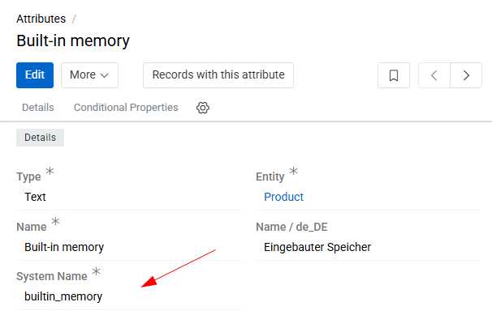{.medium}

The attribute code is also used to reference attribute values in [script-type](../../../../10.developer-guide/80.twig-tutorial/) fields and serves as the key name for attributes in [API](../../../../10.developer-guide/10.rest-api/) responses. If code is not specified, the attribute's unique ID is used as a fallback.

## Available Attribute Types

Attributes are automatically validated according to their type. For a complete list of available data types, see the [Data Types](../../11.entity-management/02.data-types/) documentation.

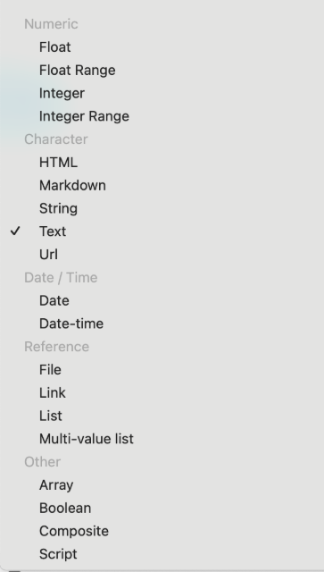{.small}

> Some data types available for entity fields are not supported for attributes (e.g., Email, Language Code, Color, etc).

> Attribute type Script is provided by an additional module [Advanced Data Management](https://store.atrocore.com/en/advanced-data-management/20113).

Once an attribute has been created, its type cannot be changed to another type available in the system, with the following exceptions:

- Any attribute type can be changed to the Script type.
- The List type can be changed to Multi-value List.

All other type changes are not allowed. When changing the attribute type to Script, the attribute values will be changed to Null. Please use this feature with care.

## Add attributes to a record

There are several ways to link attributes to records of an entity. You can:

- Add individual attributes directly from the record page
- Add attributes to multiple records at once by [mass update](../../../12.mass-actions/docs.md#mass-update-to-attributes)
- Apply a set of attributes using a [Classification](../04.classifications/docs.md#enabling-classifications-for-an-entity)
- Import attributes together with their values

You can add attributes to a record using the `Add Attribute` action. This action is available for all entities that support attributes.

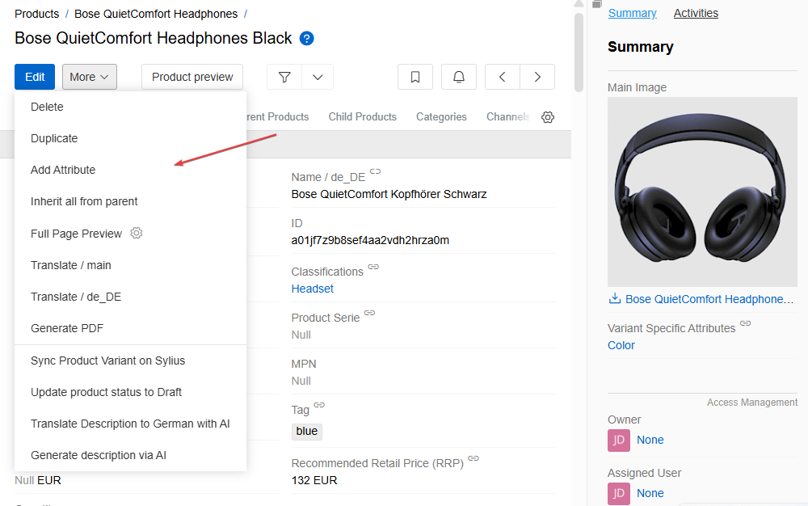{.medium}

When triggered, it opens a list of all available attributes for the current entity.

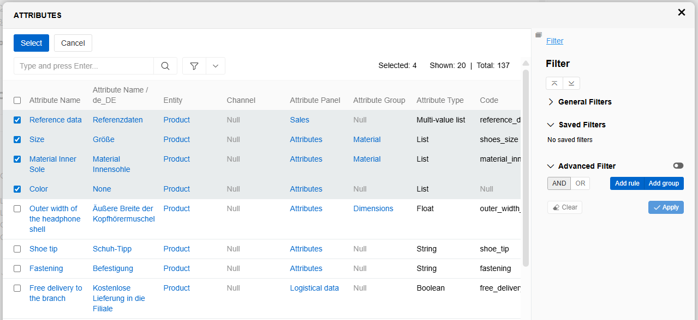{.medium}

Select one or more attributes from the list and click "Select". The selected attributes will be immediately added to the record and displayed in the corresponding Attribute Panel.

If the record already includes an Attribute Panel, you can also add new attributes by clicking the `+` button on the right side of the panel's header.

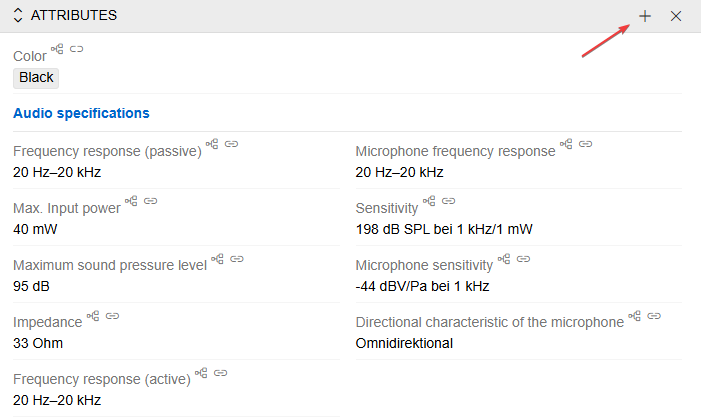{.medium}

Newly added attributes appear on the record page with empty values. To set the value, click the pencil icon next to the attribute. This enables [in-line editing mode](../../../08.record-management/docs.md#in-line-editing), which allows you to edit the value of a single attribute.

If you want to edit values for multiple attributes at once, click the `Edit` button in the header of the record page to activate [full edit mode](../../../08.record-management/docs.md#full-edit-mode).

If you have a list of the records attributes with predefined values, it is convenient to set them using import. Learn more about adding attributes via import [here](../../../../02.data-exchange/01.import-feeds/docs.md#attributes).

You can also disable the ability to add attributes directly to records for the particular entity. In this case, users will only be able to add attributes via the Classification. To do this, select option [`Disable direct attribute linking`](../../11.entity-management/docs.md#configuration-fields) in Entity Manager.

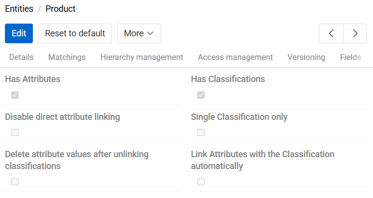{.medium}

You can then add attributes to layouts. To learn how to do this, go to the [Attributes](../../12.attribute-management/01.attributes/docs.md) page.

## Channel-specific Attributes

The channel functionality is provided by the [PIM](../../../../05.pim/06.channels/docs.md) module and is primarily used in products for exporting data to various destinations.

There are cases where the same product attribute may have different values depending on the channel. In such scenarios, it is recommended to use attributes with the same name but linked to different channels.

Such a need for channel-specific attributes can exist for various reasons:

- Different units of measurement or data typing in different countries.
- Need for different descriptions according to marketing or SEO needs.
- Legal requirements in certain countries etc.

If the PIM module is installed, a "Channel" field will be available on the attribute page. Use this field to specify the channel to which the attribute applies.

When an attribute is linked to a channel, the name of that channel will be displayed alongside the attribute name on the product page.

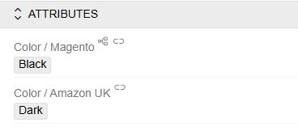{.large}

## Variant-specific attributes

Variant-specific attributes are used to represent the characteristics that differentiate child product records.

For example, on a marketplace, a product may have several variants that differ by color, weight, size, etc. In AtroCore, this use case is handled through inheritance: a parent product is created, and its child products (i.e., variants) inherit all attributes from the parent except those that are different for child records.

To ensure the system understands which attributes distinguish one variant from another during export, these attributes must be added to the "Variant Specific Attributes" panel (you can also display it as a fields).

If you do not need this panel, you can simply hide it from the [layout](../../../03.administration/13.user-interface/02.layouts/docs.md).

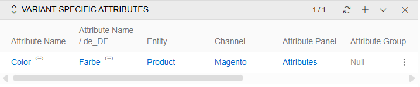{.large}

## Multilingual Attributes

It is possible to set the selected attributes as multilingual attributes. This makes it easy and convenient to manage the translations of product descriptions. The multilingual property is only applicable to text attribute types (Text, String, HTML and Markdown).

To make an attribute multilingual, select the corresponding checkbox on the attribute page.

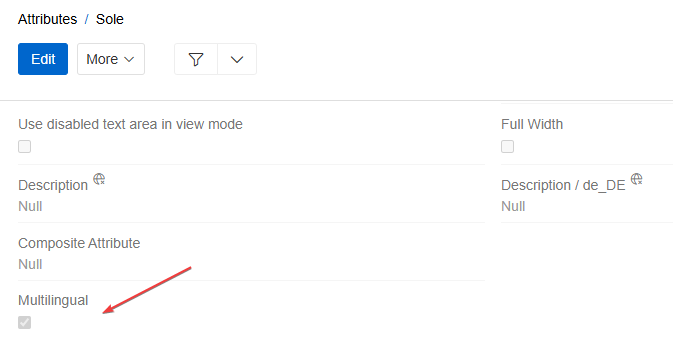{.large}

When you make an attribute multilingual, additional fields are automatically added for all languages of the environment.  

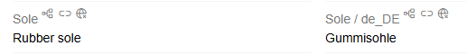{.medium}

You can control which languages for fields and attributes will be displayed in the interface using the language switcher in the page header. Read more about multilingualism in AtroCore [here](../../03.languages/docs.md).

## Numeric attribute types

There are two types of attributes for displaying numeric data in AtroCore: Integer and Float. And also the ranges of these two types (Integer Range and Float Range).
For all numeric attribute types, you can specify a minimum and maximum allowable value.

If you specify these fields for the attribute, the value of the attribute when entered will be validated according to them. If the entered value is not within the valid range, the error message "Value shouldn't be greater (less) then ..." will appear on the screen.

For float or float range attributes, you can also specify the number of decimal places allowed. If you leave of this field empty, the number of decimal places is limited to 12 digits by default.

Numeric data types (as well as the String type) can have units of measurement. In order to be able to add units to an attribute value, you need to link a [Measure](../../../03.administration/09.measure-units/docs.md) to that attribute. If your attribute does not have units of measurement, leave this field empty.

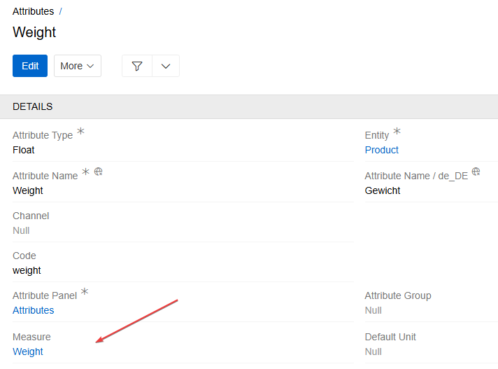{.medium}

## Attribute of Text, String, HTML and Markdown type

There are four types of attributes for displaying text-related data in AtroCore: [Text](../../11.entity-management/02.data-types/docs.md#text), [String](../../11.entity-management/02.data-types/docs.md#string), [HTML](../../11.entity-management/02.data-types/docs.md#html) and [Markdown](../../11.entity-management/02.data-types/docs.md#markdown).

Attributes of these types can have max length. You can count it in characters or bytes (if option "Count Bytes instead of Characters" is selected on attribute page). If the text length is exceeded, an error message "Text field length exceeded"
is displayed when trying to save. This function can be switched off if the max length is not defined.

All text-related attributes have option `Disable Null Value`, which determines whether the attribute can or cannot have a value of Null.

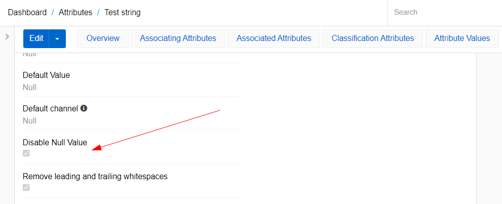{.large}

If this checkbox is not selected, the attribute can be set as null or empty. If the checkbox checked, the attribute can only have an empty value. A value of null is displayed in the view and edit mode using a placeholder "Null". Empty value is displayed as empty field in the view mode and as "None" in edit mode.

View mode:

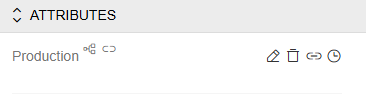{.small}

Edit mode:

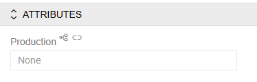{.small}

By default, the attribute is added to the product with Null value. To change it to a empty, you need to write a single space. Then the placeholder "Null" will disappear in the edit mode, which means that the attribute will be saved with empty value. If you delete text from an attribute, it gets the value empty. To get Null, you need to click the backspace button again.
Note that the values null and empty are different for the system. Therefore, if a parent product has an attribute value of Null and a child product has an attribute value of empty, this attribute will be marked as uninherited.

The attribute of type String also has option "Remove leading and trailing whitespaces". It allows you to remove extra spaces before and after the text. If the option is not selected, the spaces are highlighted with a special character in the view mode.

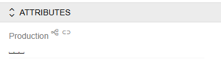{.small}

## Attribute of Date and Date-time type

There are two types of attributes for displaying time-related data in PIM: Date and Date-time. For Date attribute you select a date on a calendar in pop-up or type it. For Date-time attribute you can also select time in pop-up or type it.

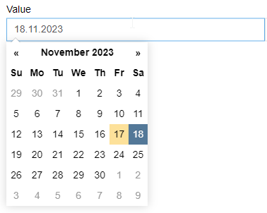{.large}

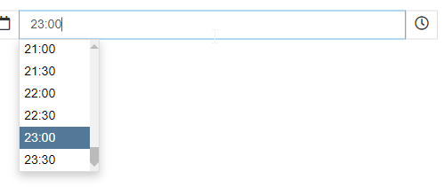{.large}

The date and time is set in Universal time but the presentation of it is localized to your current selected time zone. This helps with integration issues and also with actualizing data when the time zone is changed.

You can set a Default Date for both types of attributes. This is a function that will move the date and/or time forward or backwards as you set. So, for the example below, if you select Date-time as 10th November 12:00 it will be set in attribute value as 14th November 11:00.

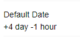{.large}

> For Date attributes the time defaults are not applicable.

## Attribute of Bool type

The Bool attribute type is used for true/false values — flags, toggles, and simple yes/no decisions.

The **Allow null value** option determines whether the attribute can hold a Null state in addition to Yes/No.

If this checkbox is not selected (default), the attribute can only be **Yes** or **No**, and is displayed as a checkbox.

If this checkbox is selected, the attribute can also be set to **Null** (no value set), and is displayed as a dropdown with options: Null, Yes, No.

## Attributes of List and Multi-value List type

!! **List** and **Multi-value List** attribute types remain available but will be deprecated in a future release. For new implementations, it is recommended to use **Link** and **Multiple Link** attribute types instead. See the [migration guidance](#how-to-migrate-to-link-and-multiple-link) below.

List and Multi-value List attribute types are used to represent characteristics whose possible values are known in advance.

The value of such an attribute is selected from a predefined list.

- A **List** attribute allows selection of only one value.
- A **Multi-List** attribute allows selection of multiple values.

For both attribute types, the List field is mandatory and must be specified when creating the attribute. This field links the attribute to a predefined set of options, which must be created beforehand. The list defines the range of valid values that can be selected for the attribute. Read more about the List entity [here](../../08.lists/docs.md).

### Allowed Options setting

A single List can be reused across multiple attributes or fields of type List or Multi-value List. However, in some cases, not all list options are relevant for every attribute.

For example, an attribute like Material might use the same list, but require different options depending on context:

- For clothing: Linen, Cotton, Wool
- For jewelry: Gold, Silver, brass.

However, for both attributes that characterize the material, the same list can be used. To avoid displaying irrelevant options when selecting a value for an attribute, you can configure the `Allowed Options` setting.

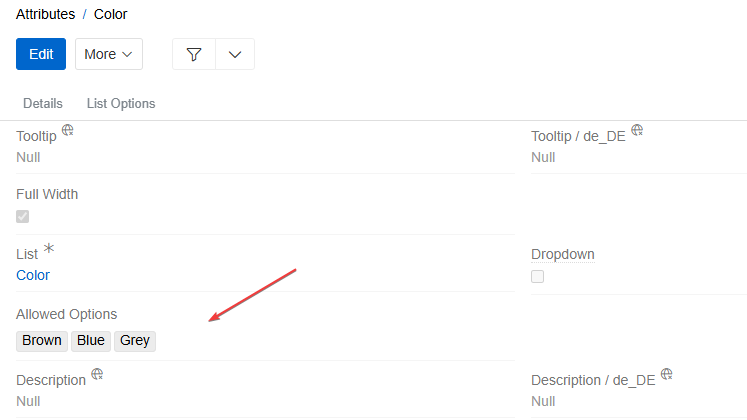{.large}

On the attribute page, use the `Allowed Options` field to define which values from the list are valid for that specific attribute. Only the specified options will be shown when a user selects a value for the attribute.

This setting can also be defined per classification, allowing even more granular control over which options are visible in specific contexts.

### How to migrate to Link and Multiple Link

To replace a **List** attribute, create a new attribute with **Attribute Type** set to `Link`. To replace a **Multi-value List** attribute, set **Attribute Type** to `Multiple Link`.

In both cases, set the **Linked Entity** field to `List Options`. Once selected, a **List** field will appear — select the same list that was used in the original attribute. After saving, the system automatically configures a filter so that only options from the selected list are shown.

The selected list acts as a built-in filter: it is not visible in the UI filter panel, but only options belonging to that list appear when selecting a value. 

> The `Allowed Options` configured on the original List or Multi-value List attribute or other additional filter conditions can be reflected in the `Filter Results` panel on the new Link or Multiple Link attribute. For further configuration, see [Filter Results](../../11.entity-management/03.fields-and-attributes/docs.md#filter-results).

To apply the new attribute to records, follow the steps described in [Add attributes to a record](#add-attributes-to-a-record).

> For bulk replacement, [export](../../../../02.data-exchange/02.export-feeds/docs.md) the records, update the attribute type and name to match the newly created attribute, then reimport them via [import](../../../../02.data-exchange/01.import-feeds/docs.md).

## Attributes of Link and Multiple Link type

[Link](../../11.entity-management/02.data-types/docs.md#link) and [Multiple Link](../../11.entity-management/02.data-types/docs.md#multiple-link) enable creating relationships between entities through attributes, providing more flexible data modeling capabilities.

> Entities of the Base and Hierarchy types are the only ones that can be linked.

Link and Multiple Link attributes support the same configuration options as their corresponding field types. Multiple Link also provides access to [Relations](../../11.entity-management/07.fields-and-relations/docs.md) configuration options.

- **Dropdown**: Displays the attribute as a dropdown selection in the UI
- **Linked Entity**: Select the entity to be linked
- **Entity Field**: Select a field to represent the entity
- **Filter Results**: Specifies the [selectable values](../../11.entity-management/03.fields-and-attributes/docs.md#filter-results) for the attribute.
- **Records per page (select dialog)**: Sets the number of records shown per page when selecting a value via the dialog.

!! Avoid setting **Records per page (select dialog)** too high – it may slow down or freeze the user's browser.

Link attributes create optional relationships between different entities, allowing you to establish connections through attribute values rather than dedicated field relationships that exist for all records.

## Attributes of Composite type  

A **Composite Attribute** allows you to group several individual attributes into one unit. When added to a record, all included attributes are applied at once, ensuring data consistency.

Attributes included in a composite can still be added individually and will appear as regular attributes.

When added through a Composite, attributes appear grouped in a bordered block and cannot be removed separately — only by deleting the Composite attribute.

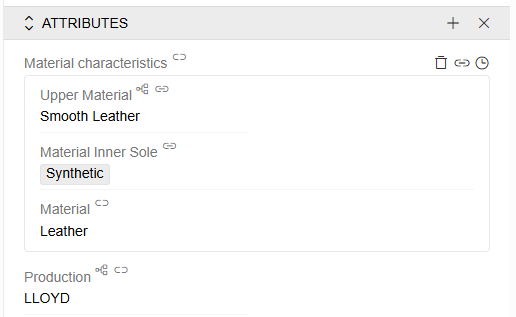{.medium}

 **Nested attributes** are configured via the `Nested Attributes` panel on the Composite attribute page.

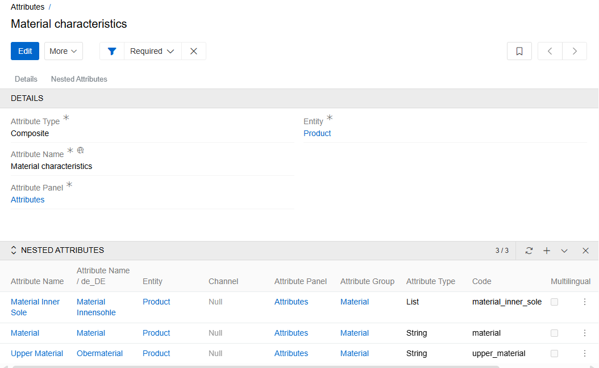{.medium}

Reverse linking is also possible: on an individual attribute's page, you can select a Composite Attribute it belongs to via the `Composite Attribute` field.

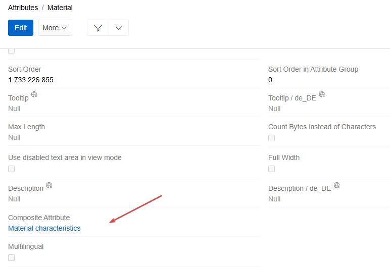{.medium}

Composite attributes cannot be imported or exported. In all other ways, they behave like standard attributes.

## Conditional Properties for Attributes

Certain attribute options can be dynamically controlled using Conditional Properties. These properties define how a field behaves based on specific conditions or context. One or more conditional properties can be applied simultaneously.

The configuration of conditional properties for attributes is the same as for [fields](../../11.entity-management/03.fields-and-attributes/docs.md#conditional-properties).

## Filters

The Attribute list view provides the following filters in the filter panel:

**Only My**
Shows only attributes created by or assigned to the currently logged-in user.

**Not linked with any record**
Only attributes that are not linked to the record of the entity they belong to are shown. This is useful for identifying unused attributes that can be reviewed or cleaned up - for example, after removing records or reorganising the data model.

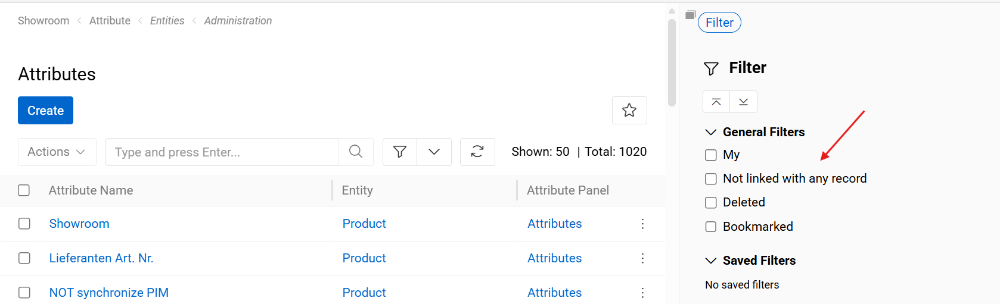

## Records with this attribute

On the detail page of an Attribute, an action button **"Records with this attribute"** is available when the attribute has an entity type assigned.

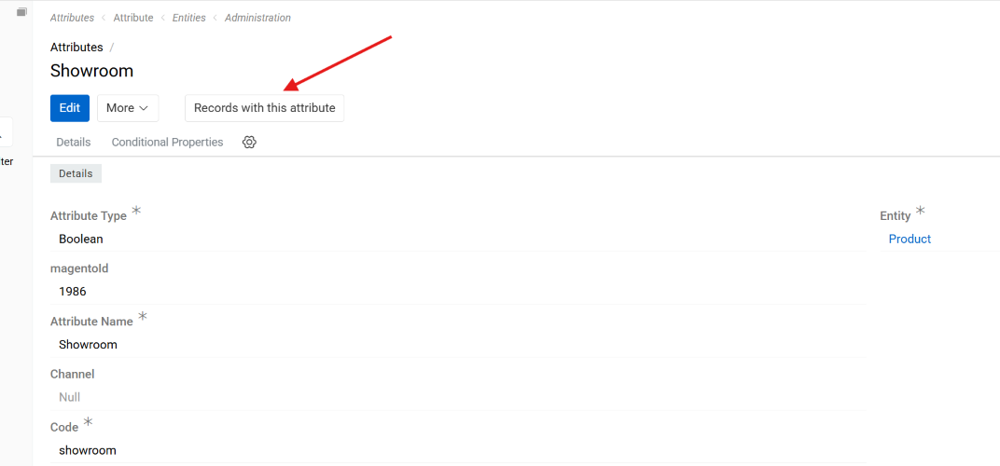

Clicking on it opens a list view of the relevant entity (e.g. Products) in a new tab. This view is pre-filtered to show only records that have a value (including an empty value) for this attribute. The filter is applied automatically and does not need to be configured manually.

This is useful for quickly auditing which records are using a specific attribute, or for navigating from the attribute definition directly to its related data.
