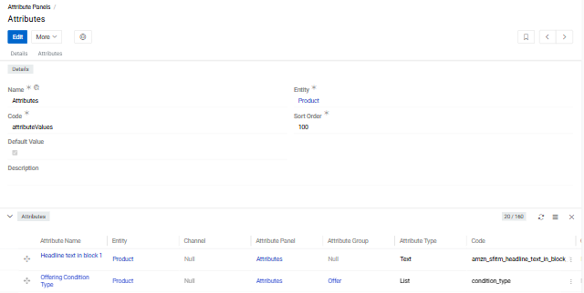
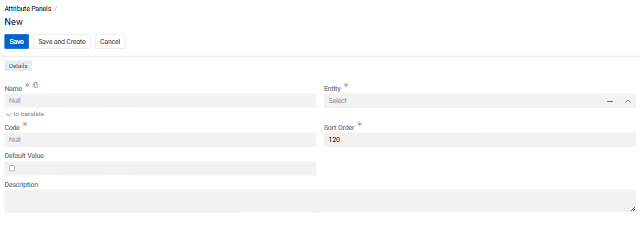
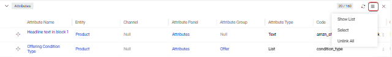
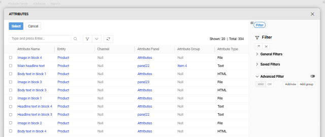

**Attribute Panels** provide an additional layer of structure for displaying [attribute](../01.attributes/) values on a record's detail page. Each panel appears as a separate section and groups its attributes by [Attribute Group](../02.attribute-groups/).

{.medium}

> An Attribute Panel is required for every attribute. [Attribute Groups](../02.attribute-groups/) are optional and can also be assigned at the individual attribute level.

You can use:

- the built-in **Attributes** panel — displays attribute values for all attributes not assigned to any custom panel
- custom Attribute Panels — display only the attributes explicitly assigned to them
- or both in combination

**Attribute Panels** are accessible from the [Navigation Menu](https://help.atrocore.com/latest/atrocore/administration/user-interface/navigation).

## Creating an Attribute Panel

You can create a panel directly when creating an attribute by clicking `+` next to the **Attribute Panel** field. Alternatively, navigate to **Attribute Panels** in the navigation menu and click **Create**.

{.medium}

- **Name** — Display name, available in multiple languages
- **Code** — Unique identifier
- **Entity** — The entity whose attributes this panel will organize
- **Sort Order** — Controls the order of panels on the entity record detail view (ascending)
- **Default** — When checked, this panel is pre-selected as the default for new attributes
- **Description** — Optional notes

After saving, the panel's detail view shows all attributes assigned to it, grouped by their [Attribute Group](../02.attribute-groups/).

## Adding Attributes to a Panel

{.medium}

On the Attribute Panel detail view, open the menu icon in the **Attributes** panel header:

- **Show List** — opens the full attribute list view filtered to this panel
- **Select** — opens a selection dialog where you can choose one or more existing attributes; use the right sidebar to filter the results
- **Unlink All** — removes all attributes from this panel without deleting them

{.medium}

To manage an individual attribute, click the three-dot menu on its row:

- **View** — opens the attribute's detail view
- **Edit** — opens the attribute for editing
- **Unlink** — removes the attribute from this panel without deleting it
- **Delete** — deletes the attribute

## Displaying Attribute Panels on a Record Detail View

Attribute Panels appear automatically on an entity's record detail view as soon as an attribute is assigned to them.

For example, on the [Product](../../../../05.pim/03.products/docs.md) detail page, panels are shown when configured via `Administration > Layouts > Products > Relation panels`. Each panel displays values only for the attributes assigned to it, so use the correct panel when adding attributes to records.

> To adjust panel visibility or order, see [Layouts](https://help.atrocore.com/latest/atrocore/administration/user-interface/layouts).
