**Classification** – a grouping of similar entities, which use similar or same production processes, have similar physical characteristics, and may share customer segments, distribution channels, pricing methods, promotional campaigns, and other elements of the marketing mix.

In Atro system Classifications are used in order to define a set of [attributes](../01.attributes/) that are shared by entity records belonging to a certain family, and to describe the characteristics of these records. For each Classification you can define, which attributes are mandatory and which are optional, so the system can calculate the completeness of your content.

*Please, note that completeness calculation is possible only when a separate **"Data Quality"** module is installed in your system. Please, visit our [store](https://store.atrocore.com/data-quality/10095.1) to learn more about the module and its features.*

One attribute can be used in several Classifications and Classification can have many attributes assigned. Each record can be assigned to only one Classification.

Classifications can be seen as "templates" for creating records with certain attributes quickly. When creating a new record, a Classification is to be chosen and thus, all the attributes to describe this certain record will be automatically linked to the record so the user should decide to fill them or not.

The attributes linked to the record via the Classification can be unlinked from the record after that.

Classifications can be activated or deactivated.

## Classification Fields

The Classification entity comes with the following preconfigured fields; mandatory are marked with *:

| **Field Name**           | **Description**                            |
|--------------------------|--------------------------------------------|
| Active                   | Activity state of the Classification record         |
| Name (multi-lang)        | Classification name					|
| Entity *                 | The entity your Classification is used for               |
| Code                     | Unique value used to identify the Classification. It can only consist of lowercase letters, digits and underscore symbols     |
| Description (multi-lang) | Description of your Classification                  |
| Synonyms (multi-lang)    | Synonyms of your Classification                   |

## How to Create a New Classification?

Before creating a new Classification, you have to convince yourself that it is really necessary in order not to create duplicates.

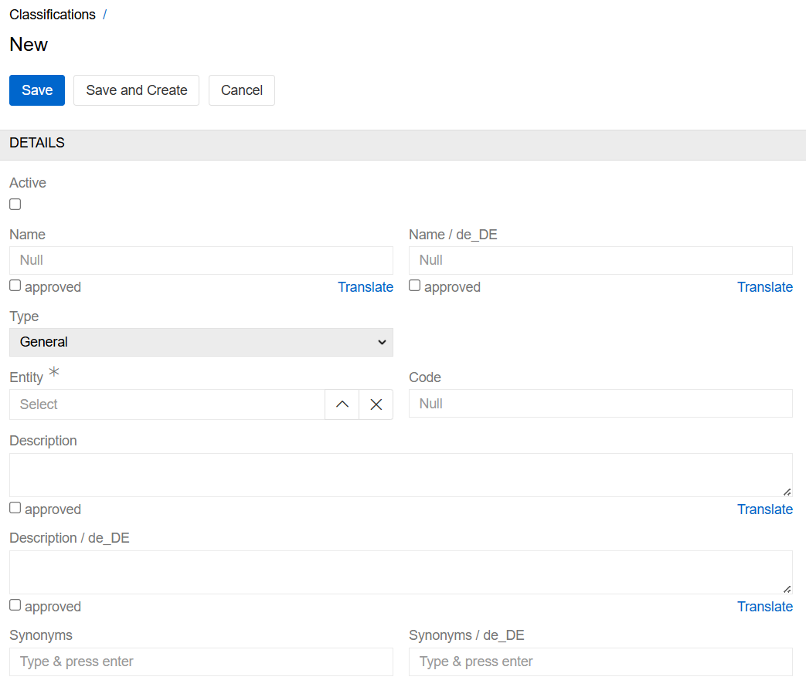{.large}

We would recommend naming the Classifications clearly and meaningfully so that it is clear which attributes are used there.

If you name Classifications with the same or similar names, you can describe in detail in the `Description` field what the difference is and for which products a particular Classification can be used. At work, you can distinguish these families by the code because it is unique.

When creating a new classification, an existing classification can be duplicated, copying all of its attributes.

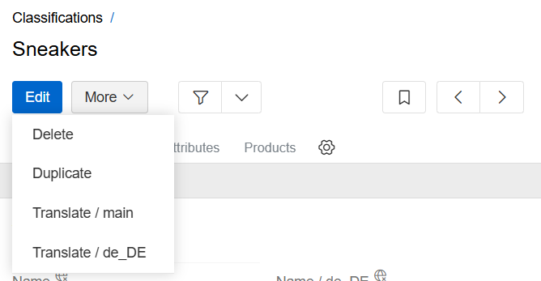{.medium}

Unnecessary attributes can be removed from the Classification after they have been created, the new ones are added. Using this option allows you to save a lot of time in system configuration.

For example, if you have received a new clothing collection that should use a new attribute, eg “Style”, which was not available in the old collections, you can create a new Classification “Clothing New” based on the Classification “Clothing” and add this attribute to the new Classification as a mandatory attribute.

## How to create Classification Records?

To create a new Classification record, click `Classifications` in the navigation menu to get to the Classification [list view](#listing), and then click the `Create` button. The common creation window will open.

Enter the desired name for the classification record being created, and activate it if necessary. The code is generated automatically based on the entered name, but can be changed using the keyboard. Most classification fields are optional and can be left blank.

Click the `Save` button to finish the Classification record creation or `Cancel` to abort the process.

If the Classification code is not unique, the error message will appear notifying you about it.

## Listing

To open the list of Classification records available in the system, click the `Classifications` option in the navigation menu:

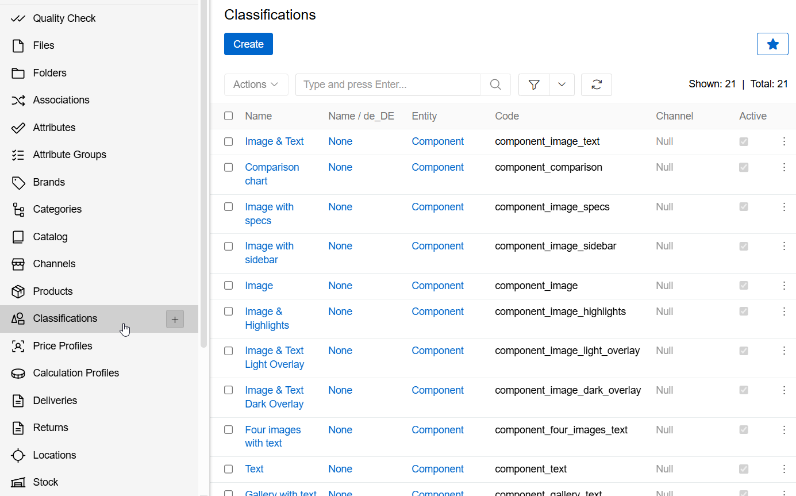{.large}

To change the order of the classification records in the list, click on any of the sortable column titles. This will sort the column in ascending or descending order.

Classification records can be searched and filtered according to your needs. For details on the search and filtering options, refer to the [**Search and Filtering**](../../../11.search-and-filtering/) article in this user guide.

To view the details of a classification record, click on the name of the corresponding record in the list of classifications. The [detail view](../../../04.understanding-ui/docs.md#detail-view) page will open showing the Classification records and the records of the related entities. Alternatively, select the `View` option from the single record actions menu to open the [quick detail](../../../04.understanding-ui/docs.md#quick-detail-view-small-detail-view) pop-up.

### Mass Actions

The following mass actions are available for Classification records on the list view page:

- Remove
- Compare
- Merge
- Mass update
- Export
- Translate
- Add relation
- Remove relation

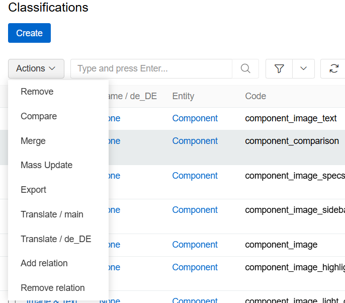{.medium}

Some actions are only available after purchasing additional modules.

For details on these actions, refer to the [**Mass Actions**](../../../04.understanding-ui/docs.md#mass-actions) section of the **Views and Panels** article in this user guide.

### Single Record Actions

The following single record actions are available for Classification records on the list view page:

- View
- Edit
- Delete
- Bookmark

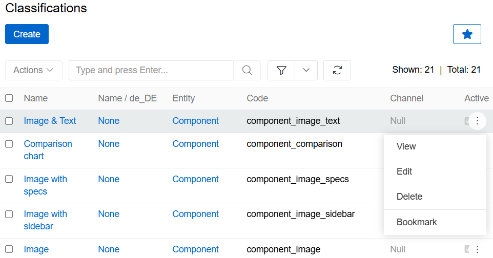{.medium}

For details on these actions, please, refer to the [**Single Record Actions**](../../../04.understanding-ui/docs.md#single-record-actions) section of the **Views and Panels** article in this user guide.

## Editing

To edit the Classification, click the `Edit` button on the [detail view](../../../04.understanding-ui/docs.md#detail-view) page of the currently open Classification record; the following editing window will open:

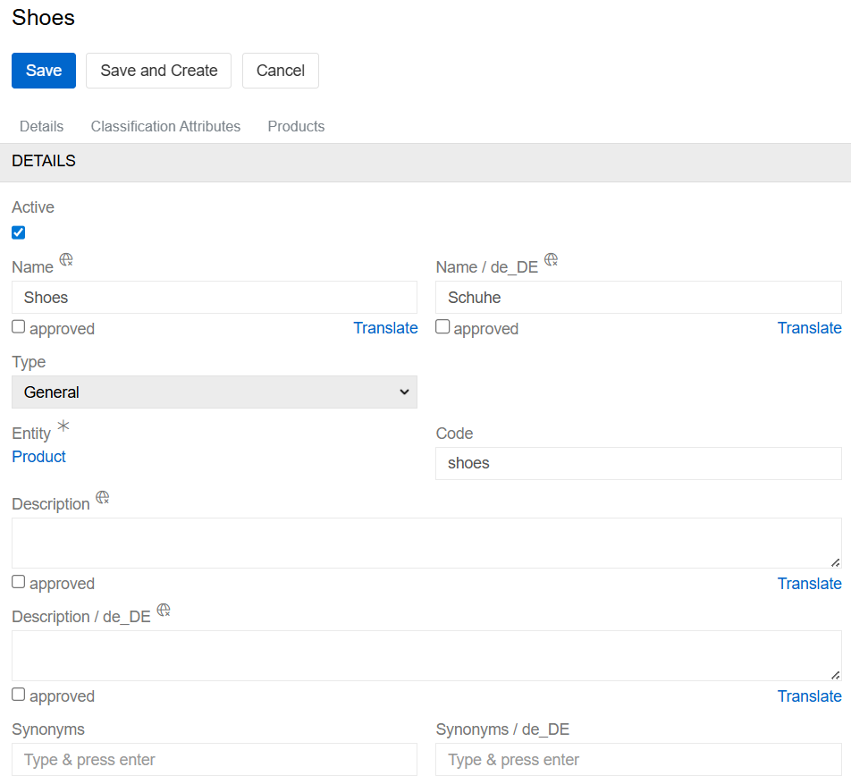{.large}

Here edit the desired fields and click the `Save` button to apply your changes. Entity can not be edited after creation.

Besides, you can make changes in the Classification record via [in-line editing](../../../08.record-management/docs.md#in-line-editing) on its detail view page.

Alternatively, make changes to the desired Classification record in the [quick edit](../../../04.understanding-ui/docs.md#quick-edit-view) pop-up that appears when you select the `Edit` option from the single record actions menu on the Classifications list view page:

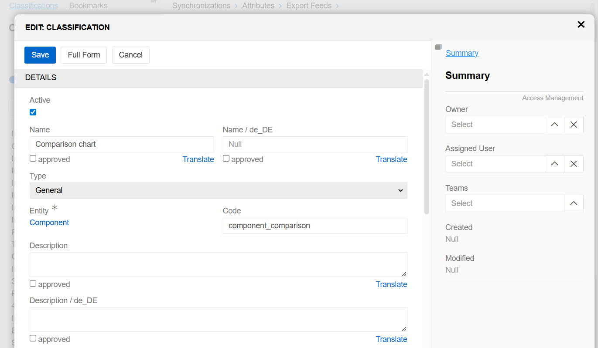{.large}

## Removing

To remove the Classification record, use the `Remove` option from the actions menu on its detail view page

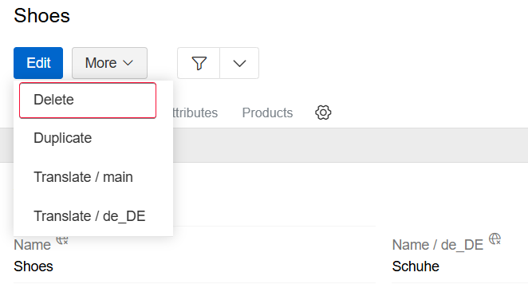{.small}

or from the single record actions menu on the Classifications list view page:

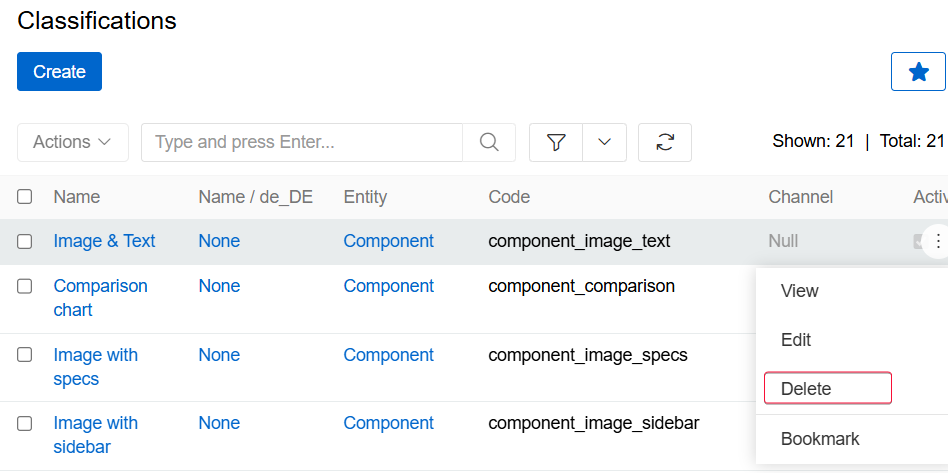{.medium}

By default, it is not possible to remove the Classification, if it is used in products.

## Duplicating

Use the `Duplicate` option from the actions menu to go to the Classification creation page and get all the values of the last chosen Classification record copied in the empty fields of the new Classification record to be created. Modifying the Classification code is required, as this value has to be unique.

## Working With Entities Related to Classifications

Relations to [attributes](../01.attributes/) and [products](../../../../05.pim/03.products/) are available for all Classifications by default. The related entities records are displayed on the corresponding panels on the Classification [detail view](../../../04.understanding-ui/docs.md#detail-view) page. If any panel is missing, please, contact your administrator as to your access rights configuration.

In order to relate more entities to classifications, you will first need to select entities that can have attributes and classifications. To do so, go to `Entity Manager` in Administration/Entities and select the desired entity. Then, in edit mode, check the `Has attributes` checkbox. The `Has classifications` checkbox will then appear; check this too:

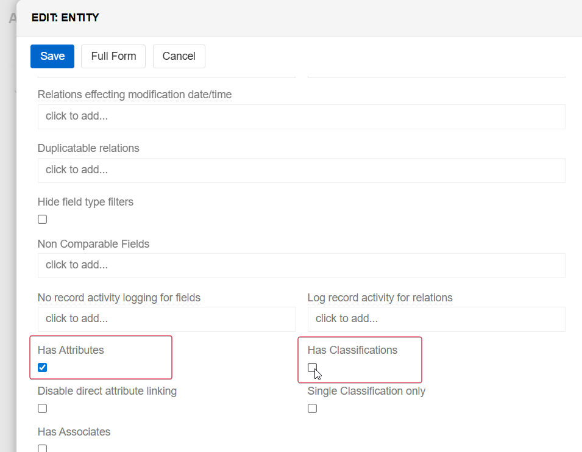{.medium}

Once classifications have been enabled for an entity, you can select an option to delete all classification attributes when the classification is removed from the entity. To do so, go to Administration/Entities and select the entity for which classifications are already enabled. You will then be able to select the 'Delete attribute values after unlinking classifications' checkbox.

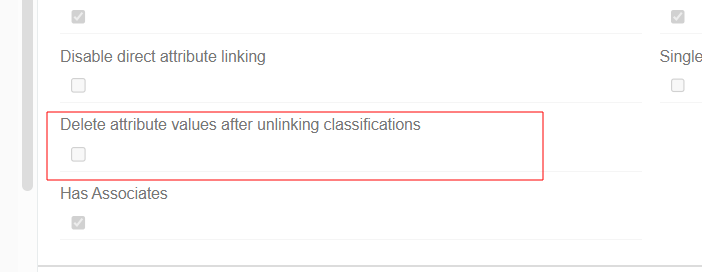{.medium}

### Attributes

Attributes that are linked to the Classification record are shown on the `Classification Attributes` panel within the Classification detail view page and include the following table columns:

- Attribute
- Required
- Audit Completeness (available only with ["Data Quality"](https://store.atrocore.com/en/data-quality/20219) module)
- Default Value

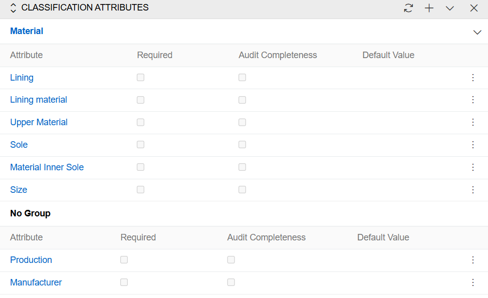{.large}

This panel allows you to link attributes to the given classification record, either by selecting existing attributes or by creating new ones. Only attributes linked to the same entity as the current classification are available for selection.

To create new attributes to be linked to the currently open Classification record, click the `+` button located in the upper right corner of the `Classification Attributes` panel:

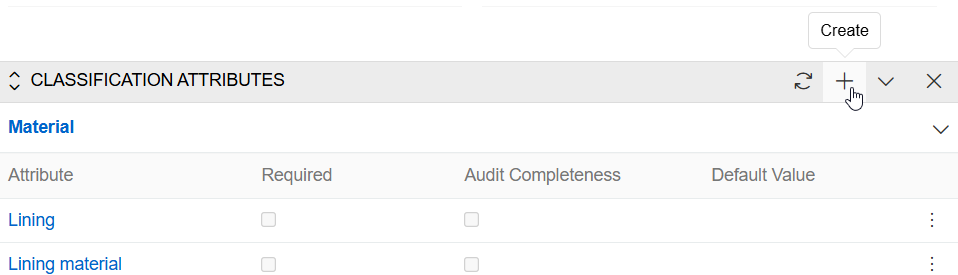{.medium}

In the Classification attribute creation pop-up that appears, click the select action button to open the "Attributes" pop-up and select the attribute from the existing ones by clicking its name or use the `Create Attribute` button to create a new attribute:

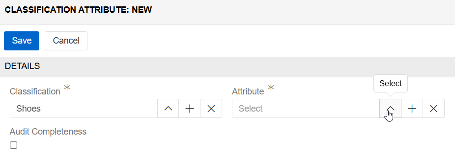{.medium}

Return to the Classification attribute creation pop-up, define the owner, team and assigned user for the selected attribute (if enabled) and make it required and/or audit completeness by setting the corresponding checkbox, if needed. Here ypu can also select allowed options and default value of the Classification attribute:

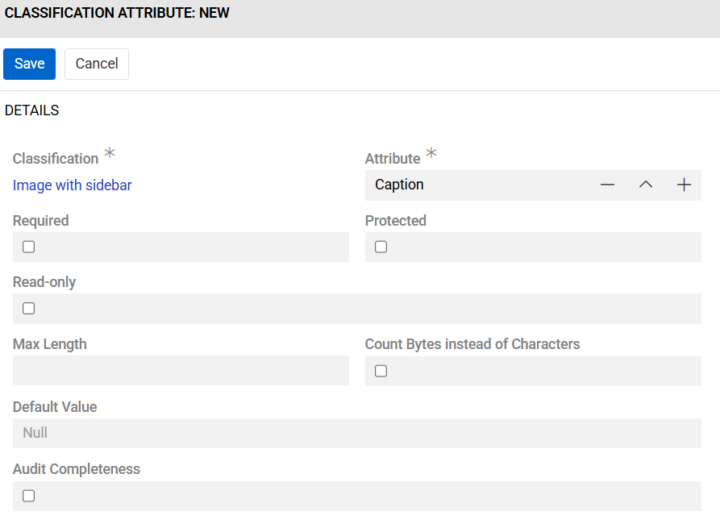{.large}

Click the `Save` button to complete the Classification attribute creation process or `Cancel` to abort it.

> When the attribute is linked to the Classification record, it is automatically linked to all records belonging to the given Classification.

When you are trying to link to the Classification record the attribute, which is already linked to the entity record belonging to the given Classification, entity record attribute becomes Classification attribute. Its value (or values) is preserved in the entity record.

> Attributes, which are added to the Classification record, are of higher priority, whereas custom product attributes adapt to the changes made in the Classification attributes. The interrelations between Classifications and product records can be configured and structured even more with the help of the ["Advanced Classification"]((https://store.atrocore.com/advanced-classification/20109)) module.

To assign an existing attribute (or several attributes) to the Classification record, use the `Select` option from the actions menu:

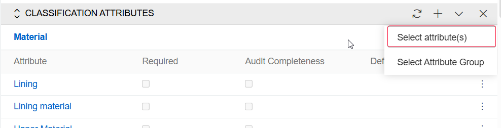{.medium}

In the "Attributes" pop-up that appears, choose the desired attribute (or attributes) from the list and press the `Select` button to link the item(s) to the Classification record.

AtroPIM supports linking to Classifications not only separate attributes, but also [attribute groups](../../../03.administration/12.attribute-management/02.attribute-groups/). For this, use the `Select Attribute Group` option from the actions menu, and in the "Attribute Groups" pop-up that appears, select the desired groups from the list of available attribute groups.

Please, note that attributes linked to Classifications are arranged by attribute groups correspondingly. Their placement depends on the configuration and the sort order value of the attribute group to which they belong. The attribute records that don't belong to any Classification, are placed at the bottom of the `Classification Attributes` panel in `No Group`.

Attributes linked to the given Classification record can be viewed, edited, deleted and retained for records or deleted and from records via the corresponding options from the single record actions menu on the `Classification Attributes` panel:

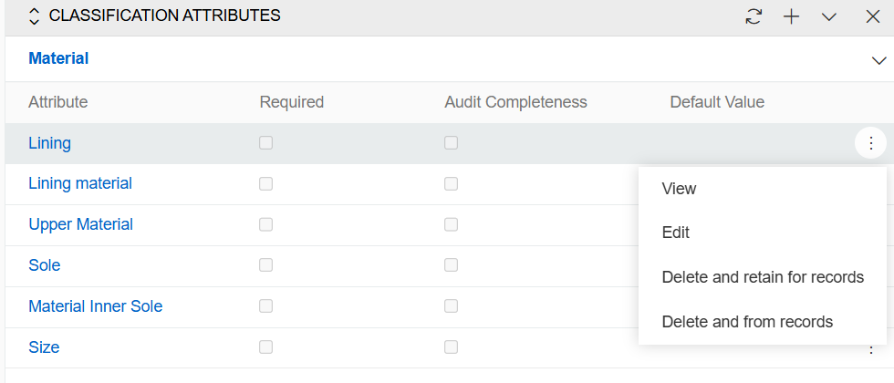{.medium}

When the attribute is deleted and retained for records, it still remains in the entity record. However, when you unlink the *required* attribute from the Classification record, the given attribute becomes non-required in the entity record.

The attribute record is deleted and from records from the Classification only after the action is confirmed:

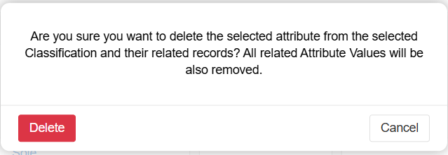{.medium}

> Removing the attribute record from the Classification leads to removing it from the entity record as well.

Additionally, you can unlink attribute groups on the `Classification Attributes` panel. To do this, use the `Delete and retained for records` option from the attribute group actions menu located to the right of the desired attribute group name, and confirm your decision in the pop-up that appears:

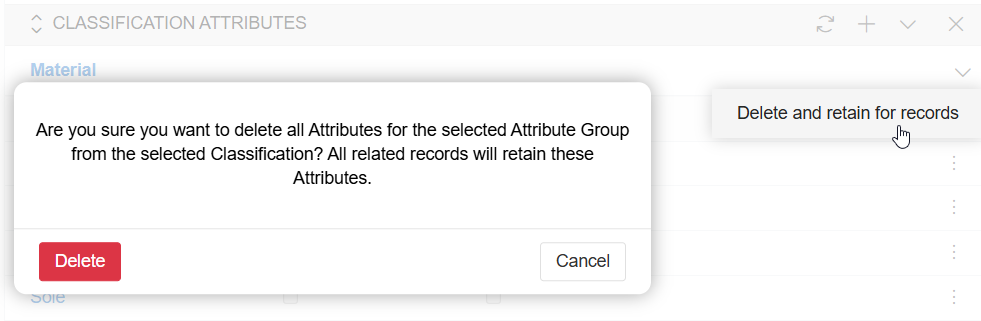{.medium}

To view the attribute/attribute group record from the `Classification Attributes` panel, click its name in the attributes list. The [detail view](../../../04.understanding-ui/docs.md#detail-view) page of the given attribute/attribute group will open, where you can perform further actions according to your access rights.

### Entity records

Entity records linked to the classification are displayed on the detail view page of the entity panel. These records use the entity's list view. The product record is used as an example:

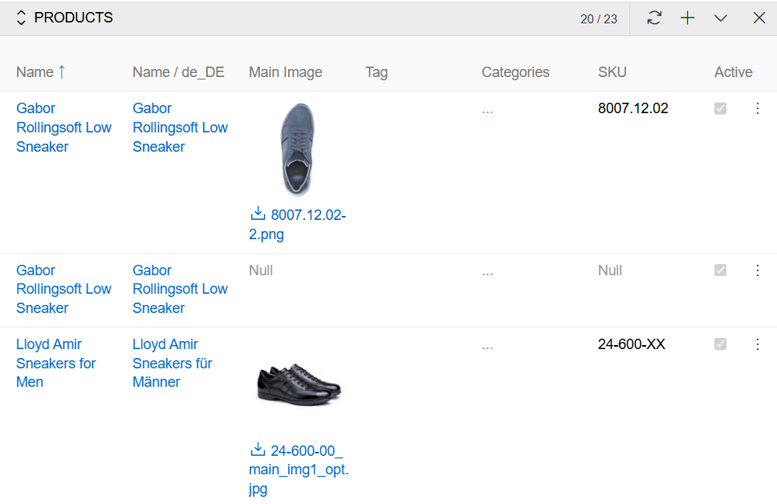{.large}

This panel allows you to create new entity records within the currently open Classification record. To do this, click the '+' button and enter the necessary data in the pop-up that appears to create the entity record.

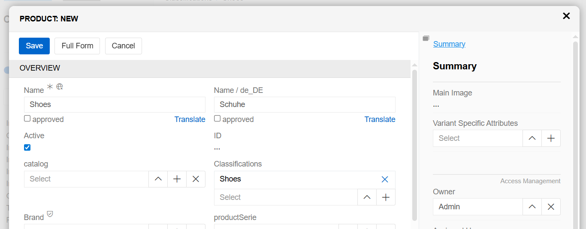{.large}

Click the `Save` button to complete the entity record creation process or `Cancel` to abort it.

To see all entity records linked to the given Classification, use the `Show full list` option:

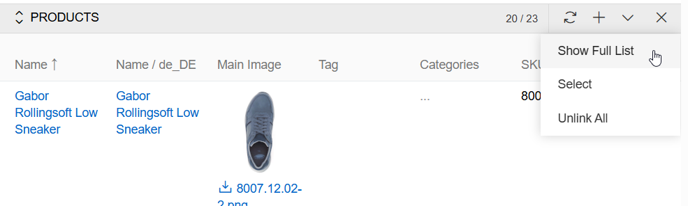{.medium}

Then the record page opens, where all entity records [filtered](../../../11.search-and-filtering/) by the given Classification are displayed.

The entities linked to the given classification record can be viewed, edited, unlinked or removed via the `Single Record Actions` menu on the entity panel and any single record action available for these records.

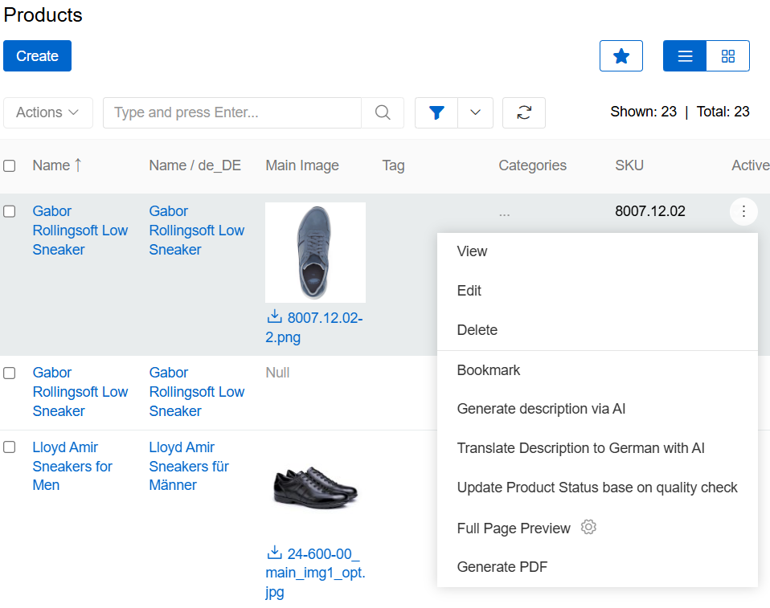{.large}

To view the related entity record from the entity panel, click on its name in the records list. The [detail view](../../../04.understanding-ui/docs.md#detail-view) page of the given record will open, where you can perform further actions according to your access rights.
