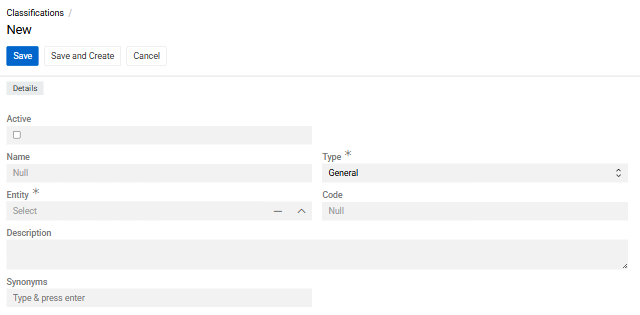
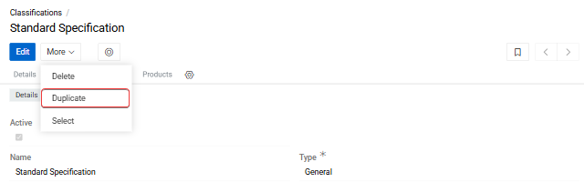
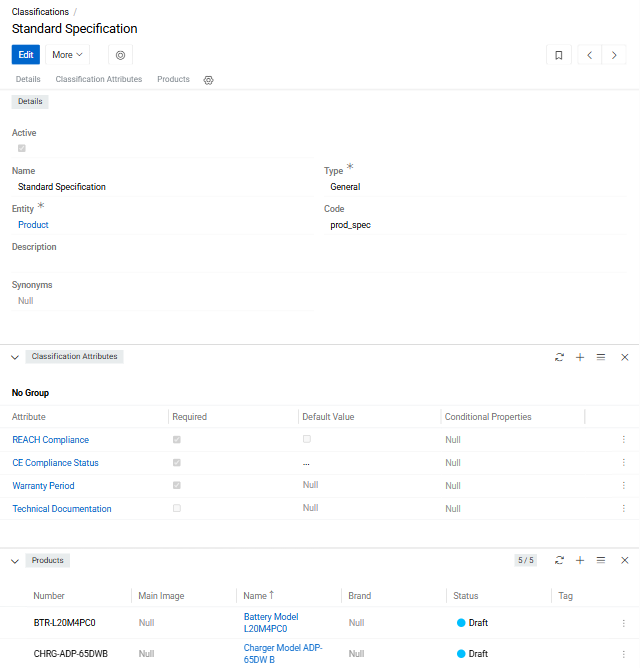

A **Classification** is a template that defines a set of [attributes](../01.attributes/) shared by a group of entity records. It describes what data should be collected for records of a given type and controls which attributes are mandatory and which are optional.

Classifications are most commonly used with [Products](../../../../05.pim/03.products/) but can be enabled for any entity via the [Entity Manager](../../11.entity-management/index.md). One attribute can be used in multiple Classifications, and one Classification can have many attributes. Each record can be assigned to multiple Classifications.

> When a Classification is selected on a record, all attributes defined in that Classification are automatically linked to the record. Attributes linked via a Classification can be unlinked from the record afterwards.

Classifications can be activated or deactivated.

**Available Extensions**:

- **[Data Quality](https://store.atrocore.com/en/data-quality/20218)** — Tracks content completeness — how fully attribute values are filled across records
- **[Advanced Classification](https://store.atrocore.com/en/advanced-classification/20110)** — Adds more control over attribute inheritance and classification-to-record relationships
- **[ETIM Classification](https://store.atrocore.com/en/etim-classification/20132)** — Enables working with the industry-standard ETIM product classification system
- **[Translations](https://store.atrocore.com/en/translations/20191)** — Provides automatic translation of multilingual fields such as name and description

## Creating a Classification

{.large}

[Navigate](../../13.user-interface/01.navigation/index.md) to **Classifications** in the navigation menu and click `Create`:

{.medium}

- **Active** — Whether the Classification is enabled and applied to records
- **Name** — Display name; supports multiple languages
- **Entity** — The entity this Classification applies to. For [Listings](../../../../05.pim/14.listing/index.md) a **Channel** field will also appear. Cannot be changed after creation.
- **Code** — Unique identifier consisting of lowercase letters, digits, and underscores
- **Description** — Optional description of the Classification's purpose; supports multiple languages
- **Synonyms** — Optional alternative names; supports multiple languages

> Name Classifications clearly so it is obvious which attributes they contain. If names are similar, use the **Description** field to clarify the difference.

An existing Classification can be **duplicated** to use as a starting point — all attributes are copied. Unnecessary attributes can then be removed and new ones added.

{.medium}

## Managing Classification Attributes

After saving, the detail view opens with two panels: **Classification Attributes** and **Products**.

{.medium}

### Adding Attributes

Open the panel menu (three horizontal lines) in the **Classification Attributes** panel header to access the following options:

- **Select Attribute(s)** — opens a selection widget to choose one or more existing [attributes](../01.attributes/index.md)
- **Select Attribute Group** — assigns all attributes belonging to an [Attribute Group](../02.attribute-groups/index.md) at once

Use the filter sidebar within each widget to narrow down the results.

To create and immediately link a new attribute, click the `+` icon in the panel header. The attribute creation widget will open — see [Attribute Fields](../01.attributes/index.md#attribute-fields) for field descriptions.

> Only attributes linked to the same entity as the Classification are available for selection.

Attributes not assigned to any group appear under **No Group** at the bottom of the panel.

The panel displays the following columns:

- **Attribute**
- **Required**
- **Default Value**

### Attribute Actions

Click the three-dot menu on any attribute row to access:

- **View** — opens the attribute's detail view
- **Edit** — opens an editor to configure classification-level settings, including whether the attribute is required, its default value, and any conditional properties (see [Attribute Fields](../01.attributes/index.md#attribute-fields))
- **Delete and retain for records** — removes the attribute from the Classification but keeps it on existing records
- **Delete and from records** — removes the attribute from the Classification and from all linked records (requires confirmation)

{.medium}

> When an attribute is linked to a Classification, it is automatically linked to all records of that Classification. If the attribute already exists on a record, it becomes a Classification attribute and its existing value is preserved.

> Classification attributes have higher priority than directly added record attributes. Changes to Classification attributes propagate to all linked records.

To unlink an entire Attribute Group, use **Delete and retained for records** from the group's actions menu:

{.medium}

## Managing Linked Records

The **Products** panel (or the relevant entity panel) shows all records assigned to this Classification.

{.large}

Use the `+` icon to create a new record directly within this Classification. Open the panel menu to **Select** existing records or use **Unlink All** to remove this Classification from all currently linked records.

Each record row supports: **View**, **Edit**, **Unlink**, **Delete**.

To see all linked records in a full list view pre-filtered by this Classification, use **Show full list**:

{.medium}

## Enabling Classifications for an Entity

By default, Classifications are available for Products. To enable them for another entity, go to `Administration > Entities`, (see [Entity Management](../../11.entity-management/index.md)) open the entity in edit mode, check **Has Attributes**, then check **Has Classifications**:

{.medium}

Once **Has Classifications** is enabled, the following additional options become available for that entity:

- **Delete attribute values after unlinking classifications**. When enabled, all Classification attribute values are removed from a record when that Classification is unlinked from it. When disabled, the attribute values are kept on the record even after the Classification is removed.

{.medium}

- **Disable direct attribute linking**. When enabled, attributes can only be added to records via a Classification — users cannot link attributes to records manually. This enforces that all attributes on a record come from an assigned Classification, which is useful when strict data governance is required.
- **Single Classification only**. When enabled, a record can be assigned to only one Classification at a time. Attempting to add a second Classification will replace the existing one. Use this when your data model requires exactly one classification template per record.
- **Link Attributes with the Classification automatically**. When enabled, if a user directly links an attribute to a record, and that record is already assigned to a Classification, the attribute will also be automatically added to that Classification. This keeps Classifications in sync with attributes that editors add on individual records. This option is only available when **Has Attributes** is enabled and **Disable direct attribute linking** is disabled.
