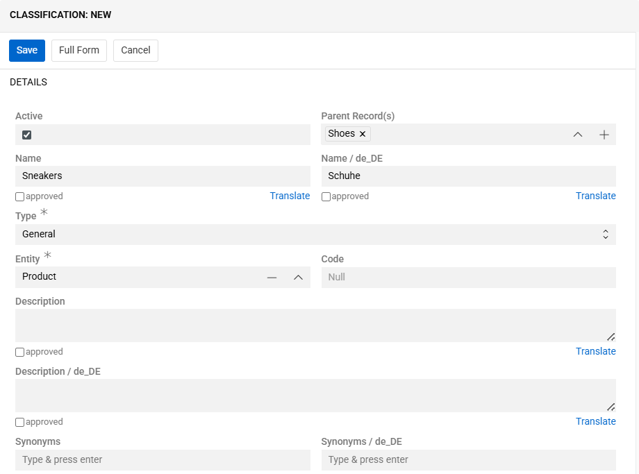
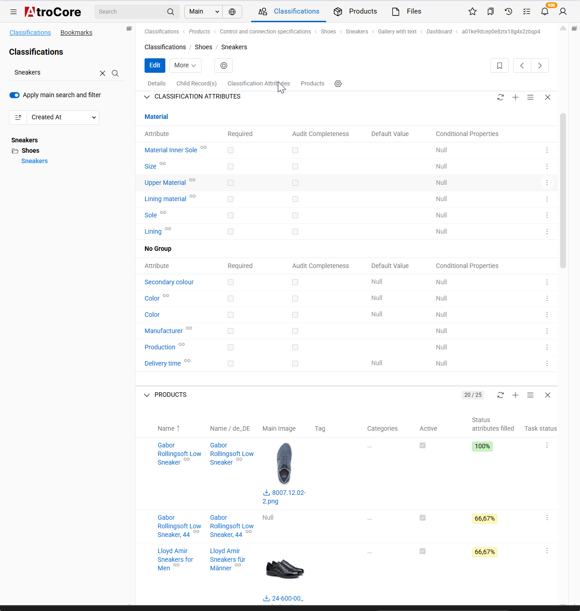
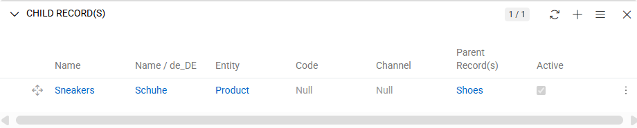
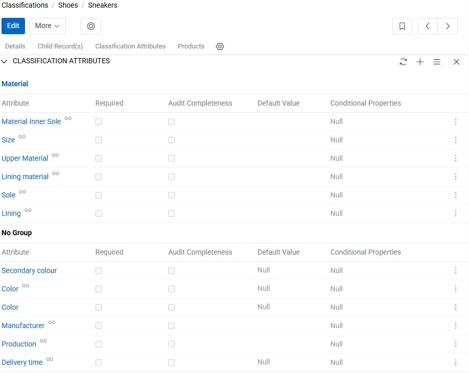
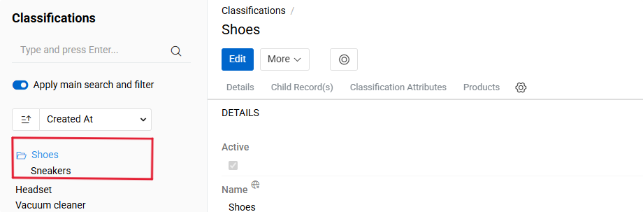

The ["Advanced Classification"](https://store.atrocore.com/en/advanced-classification/20110) module extends the base [Classification](../04.classifications/docs.md) functionality by introducing hierarchical structures with parent-child relationships and automatic attribute inheritance from parent to child classifications.

The `Advanced Classification` module provides additional functionality for better product classification. By default, Classifications in Atro are flat, independent entities. This module adds:

- **Parent-Child Relationships** - create multi-level Classification hierarchies
- **Automatic Attribute Inheritance** - child Classifications automatically inherit attribute configurations from their parents

By default, Classifications in Atro are independent entities without hierarchical connections. This module enables the creation of structured classification trees where child classifications automatically inherit attribute configurations from their parents. When attributes are modified in a parent classification, these changes propagate to all child classifications. Attributes can still be customized at each hierarchical level by adding new ones, removing inherited ones, or adjusting their configuration such as whether they are required.

This approach simplifies managing similar product groups that share common characteristics while maintaining their specific attributes. For example, create "Shoes" as a parent classification and "Sneakers" and "Derby" as children. Adding attributes to the parent automatically makes them available in child classifications, while each child can have additional unique attributes.

## Creating Classifications with Hierarchy

To create a classification within a hierarchy, open the `Classifications` and either click `Create` or open an existing classification that should serve as the parent. When creating from a parent, use the Children panel and click the `+` button to open the creation modal.

{.large}

Provide the required fields, such as Name and Code. To define the hierarchy, select a value in the Parent field. The new classification will inherit attributes from the selected parent. If no parent is selected, the classification is created at the top level.

> Each classification can have only one parent classification.

After completing the fields, mark the classification as Active to make it available in the system.

> Additional language fields become available after configuring languages in `Administration / Languages`. To see more about it click [here](../../03.languages/docs.md).

### Fields

The Advanced Classification functionality extends the standard Classification entity with the following field:

| **Field Name** | **Description** |
|----------------|-----------------|
| Parent | The parent classification from which this classification inherits attribute configurations |

All remaining fields (Active, Name, Code) follow the definitions and behavior specified in the [Classifications](../04.classifications/docs.md) documentation.

## Detail view

In order to view the Classification details, click on its name in the list. Click the `Edit` button if you need to make any changes. Its detail view displays three main panels below the overview: Children, [Attributes](../01.attributes/), and Products.

{.large}

These panels provide access to all elements related to the classification, including its child classifications, assigned attributes, and associated products. In the **Advanced Classification** view, a separate panel is available for managing child classifications, which is not present in the standard Classification view.

{.large}

## Understanding Attribute inheritance
Child classifications automatically inherit all attribute configurations from their parent classification. Inherited attributes are marked in the Classification Attributes panel with a floating chain icon, indicating that they originate from the parent classification. 

{.large}

Inherited configurations include whether an attribute is required, allowed options, and default values. These settings can be adjusted in a child classification without impacting the parent. However, any attributes added to or modified in the parent classification are automatically reflected in all of its child classifications. When the parent classification is changed, attributes from the newly selected parent are applied accordingly. 

## Classification tree

The module enables hierarchical product filtering. On the Products list page, access the left panel and select Classifications. The system displays classifications in a tree structure reflecting the parent-child hierarchy.

{.large}
