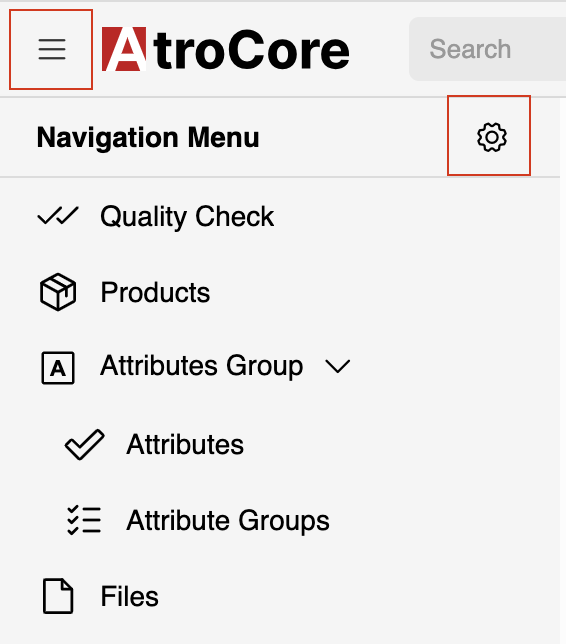
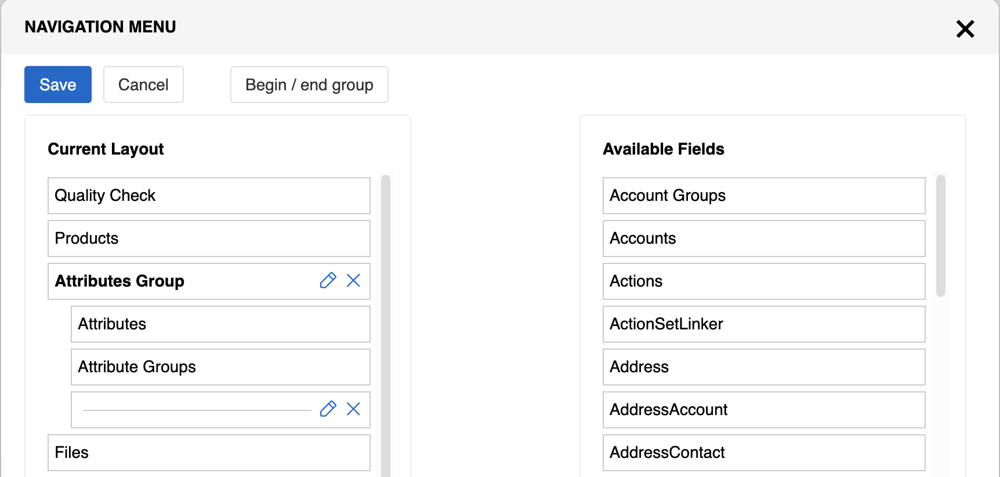
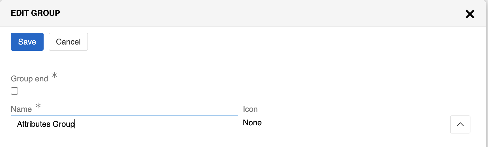
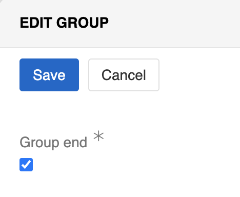
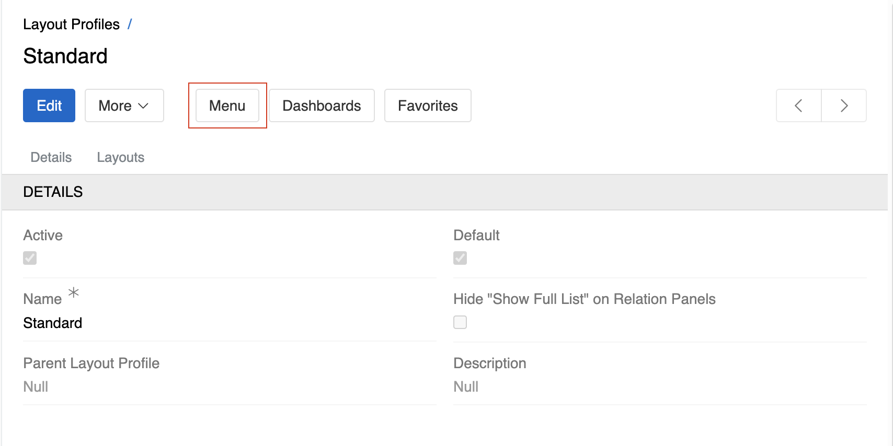

The **Navigation Menu** in AtroCore provides quick access to all available entities and serves as the primary way to navigate through the system. It can be customized by administrators to organize entities into logical groups and improve user experience.

## Overview

The navigation menu appears as a collapsible sidebar that can be accessed by clicking the hamburger menu icon in the top-left corner of the interface. It displays all entities that users have access to, allowing them to quickly navigate to list views for different data types.

{.small}

The navigation menu serves several key purposes:
- **Quick Access**: Provides direct navigation to entity list views
- **Entity Organization**: Groups related entities together for better workflow
- **User Experience**: Simplifies navigation for both new and experienced users
- **Access Control**: Only shows entities that the current user has permission to view. See [Access management](../../14.access-management/) for details.

## Navigation Configuration

Administrators can customize the navigation menu to better suit their organization's needs and workflows. The configuration interface allows you to organize entities into logical groups, reorder menu items, and control which entities appear in the navigation.

<!-- TODO: describe quick create from navigation menu; think about moving partially to 'user section' -->

### Accessing Configuration

To configure the navigation menu, click the settings button (gear icon) in the top-right corner of the navigation panel. This opens the navigation configuration interface where you can customize the menu structure.

{.medium}

### Configuration Interface

The navigation configuration interface consists of two main sections:

**Available Fields**: Contains all entities that are not currently included in the navigation menu. These entities can be added to the menu by dragging them to the Current Layout section.

**Current Layout**: Shows the entities and groups currently displayed in the navigation menu. This section represents the actual structure that users will see when they open the navigation.

### Creating Groups

Groups allow you to organize related entities together in the navigation menu, creating a more structured and intuitive user experience. Groups appear collapsed in the navigation menu, and users click on the group name to expand it and see the contained entities.

#### Adding Groups

To create a group:

1. Click the **Begin/end group** button in the Current Layout section
2. This creates a group container that can hold multiple entities
3. Drag entities from Current Layout or directly from Available Fields into the group
4. Click the pencil icon next to the group to edit its name and icon

{.medium}

#### Group Configuration

Each group can be customized with:
- **Group Name**: Descriptive name that appears in the navigation
- **Group Icon**: Visual identifier for the group
- **Entity Order**: The sequence in which entities appear within the group

#### Ending Groups

To close a group, use the end group option which provides a checkbox to confirm the group closure:

{.small}

### Managing Navigation Items

#### Reordering Items

You can rearrange the order of entities and groups in the Current Layout section by dragging and dropping them up or down. This determines the sequence in which they appear in the navigation menu.

#### Adding and Removing Items

- **Adding Entities**: Drag entities from Available Fields to Current Layout or into existing groups
- **Removing Entities**: Drag entities from Current Layout back to Available Fields
- **Removing Groups**: Click the X button next to a group to remove it (entities inside the group remain in Current Layout)

### Entity Display in Navigation

Each entity in the navigation menu is represented by:

- **Icon**: Uses the icon specified in the entity's [Icon field](../../11.entity-management/docs.md#configuration-fields) (navigation icons are enabled by default but can be disabled in User Interface settings)
- **Fallback**: If icons are disabled or not set, displays the first letter of the entity name
- **Label**: Shows the [plural name](../../11.entity-management/docs.md#required-fields) specified in the entity's Name Plural field

> The appearance of navigation items can be controlled through the [User Interface settings](../../13.user-interface/) where you can enable or disable navigation menu icons system-wide.

## Layout Profiles

The navigation menu can be customized per [Layout Profile](../02.layouts/docs.md#layout-profiles), allowing administrators to create different navigation configurations for different user groups or departments.

{.medium}

### Configuration Flow

1. **Create Layout Profiles**: Create multiple profiles (e.g., "Sales Team", "Marketing Team") through `Administration > Layout Profiles`
2. **Configure Navigation**: Click the **Menu** button for each profile to configure its navigation
3. **Assign to Users**: Assign profiles to users through their settings

This allows different teams to see customized navigation layouts tailored to their workflows.

## Best Practices

When configuring the navigation menu, consider these recommendations:

- **Logical Grouping**: Group related entities together (e.g., all CRM-related entities in one group)
- **User Workflows**: Organize entities based on how users typically work with them
- **Frequency of Use**: Place commonly accessed entities at the top of the menu
- **Consistent Naming**: Use clear, descriptive names for groups and ensure entity names are user-friendly
- **Icon Selection**: Choose meaningful icons that help users quickly identify different sections

