---
title: Layouts
--- 

The **Layouts** system in AtroCore allows you to customize the user interface for any entity by configuring how fields, panels, and relationships are displayed across different view types. Access layouts through `Administration > Layouts`.

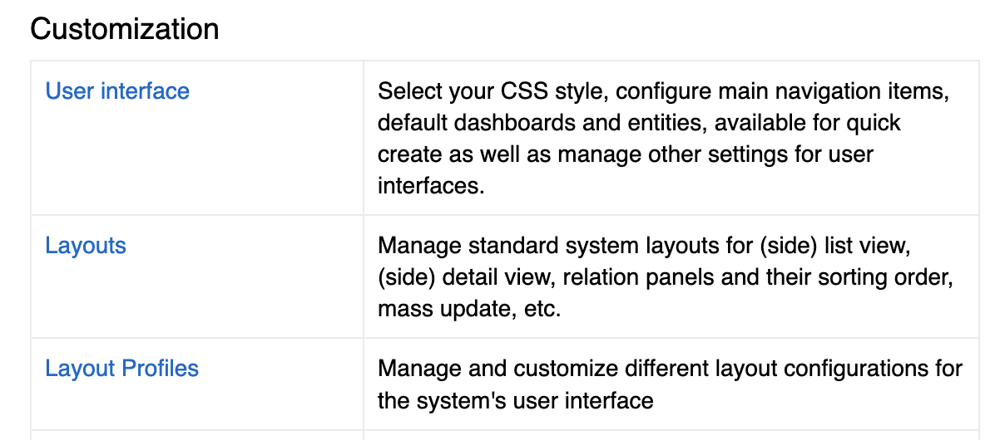{.medium}

## Overview

Layouts control the presentation of data in AtroCore's user interface. You can customize:

- **Field positioning** in forms and lists
- **Panel organization** in detail views  
- **Relationship displays** in relation panels
- **Navigation elements** in side panels

## Configuration Options

### Layout Profile
Select the [layout profile](#layout-profile) to customize. The **Standard** profile is the default configuration used system-wide.

### Entity Selection
Choose from any available entity in your AtroCore installation, including:
- Core entities (Account, Contact, Product, etc.)
- [Custom entities](../../11.entity-management/) created through `Administration > Entities`
- Module-specific entities

### View Types

#### List
Configure which fields or attributes appear in list/table views and their order. 

>Adding more attributes may worsen performance, but this will not be noticeable for a couple of attributes.

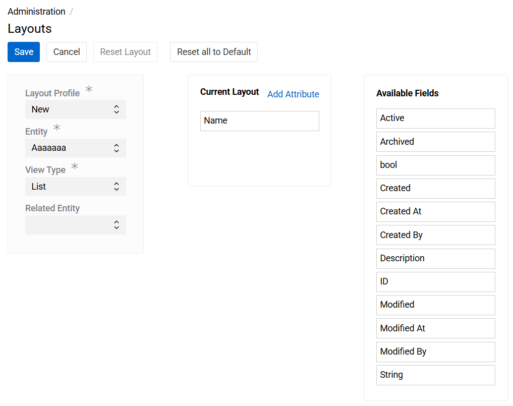{.medium}

**Configuration:**
- **Selected:** Fields currently displayed in the list
- **Available:** Fields that can be added to the list
- Drag fields between sections to customize
- Pressing the cross next to a selected field or attribute will deselect it.

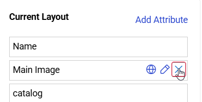{.medium}

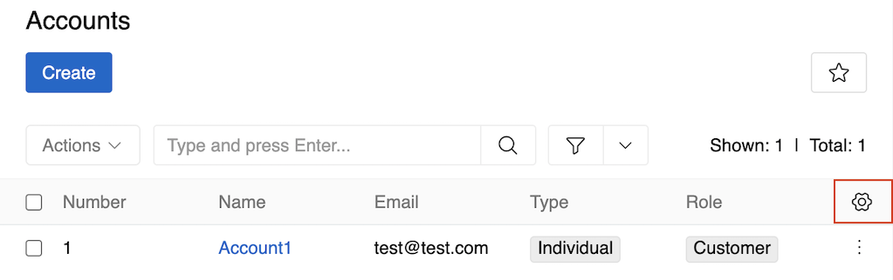{.medium}

You can also access list view configuration directly from an entity's list view. Hover over the upper right corner of the list table to reveal the configuration button.

#### Details  
Design form layouts using a visual panel-based editor.

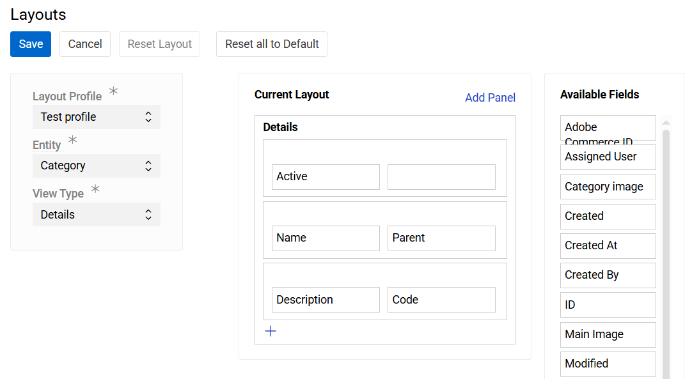{.medium}

**Configuration:**
- **Selected:** Fields currently displayed in the form
- **Available:** All entity fields except Multiple Link fields (which are usually shown as separate panels)
- Drag fields between sections to customize

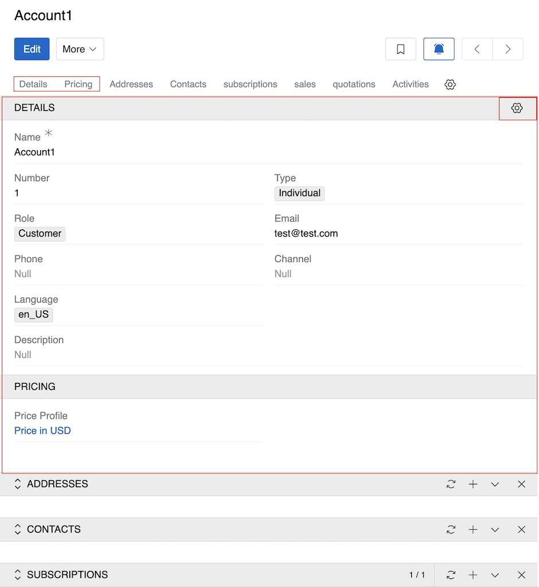{.medium}

For field and panel management, see [Field Management](#field-management) and [Panel Management](#panel-management) sections.

You can also access detail view configuration directly from an entity's detail view. Hover over the upper right corner of the first panel to reveal the configuration button.

> The [Activities](../../../06.activities/) panel appears last (after [Relations](#relations) panels) in the detail view if enabled for the entity. Its position is fixed and cannot be changed in the layout.

#### Summary

The **Summary** View allows you to customize what information appears in the Summary panel of the [Insights](#insights) group in the right sidebar of the details view. Available fields include all entity fields and some additional system fields.

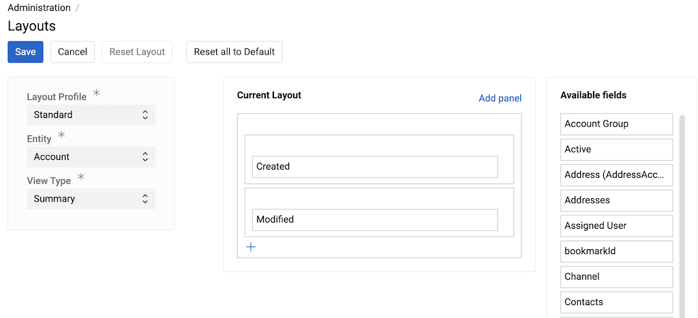{.medium}

You can also access Summary view configuration directly from an entity's detail view. Hover over the panel name - `Summary` - to reveal the configuration button.

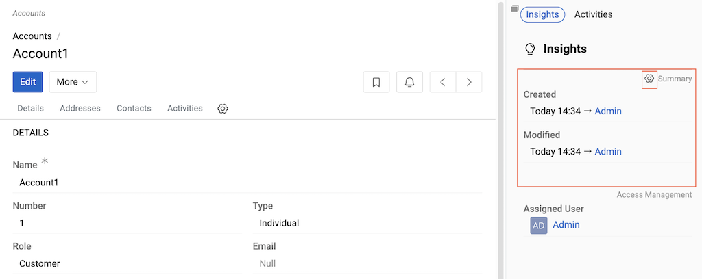{.medium}

### View Groups

Configure collections of navigation items and panels (tabs in the detail view and blocks in sidebars), defining what is shown and in which order.

#### Relations

Control which [relationships](../../11.entity-management/07.fields-and-relations/) appear in detail views and their order.

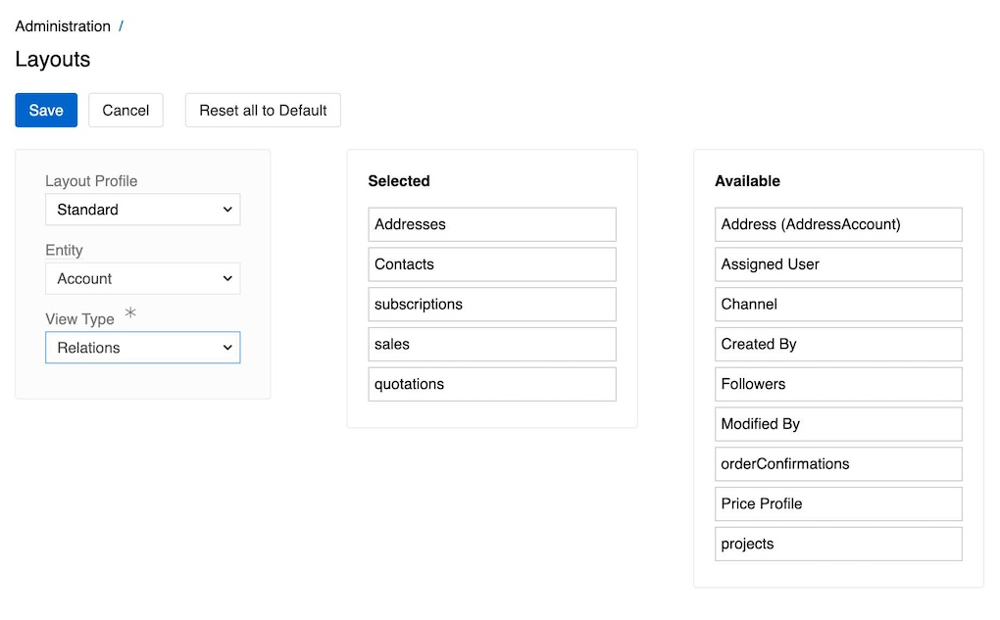{.medium}

**Configuration:**
- **Selected:** Relationships displayed in the entity's detail view
- **Available:** All possible relationships for the entity
- Relationships appear as separate tabs/panels in the detail view

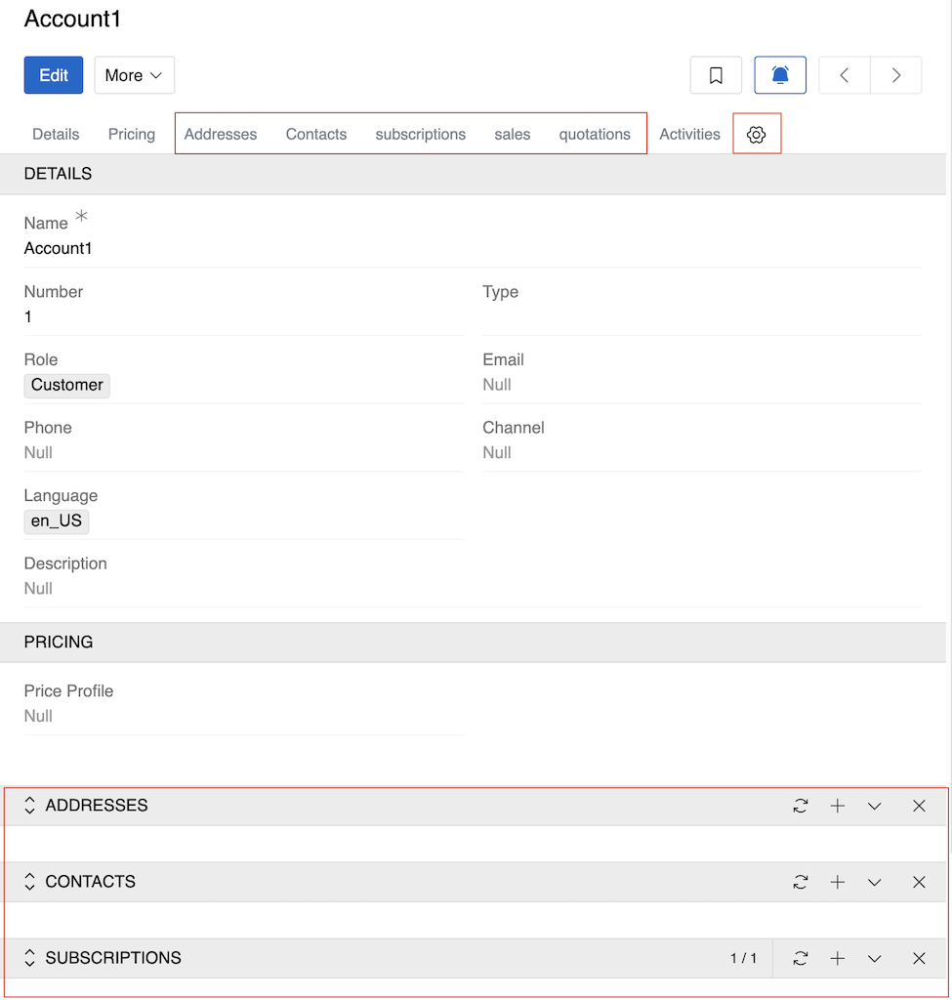{.medium}

You can also access relations view configuration directly from an entity's detail view. The configuration button is found at the end of the panel navigation toolbar.

> The [Activities](../../../06.activities/) panel is not one of the relations - it always appears last in the detail view if enabled for the entity. Its position is fixed and cannot be changed in the layout.

#### Navigation

Configure the entity-specific left sidebar

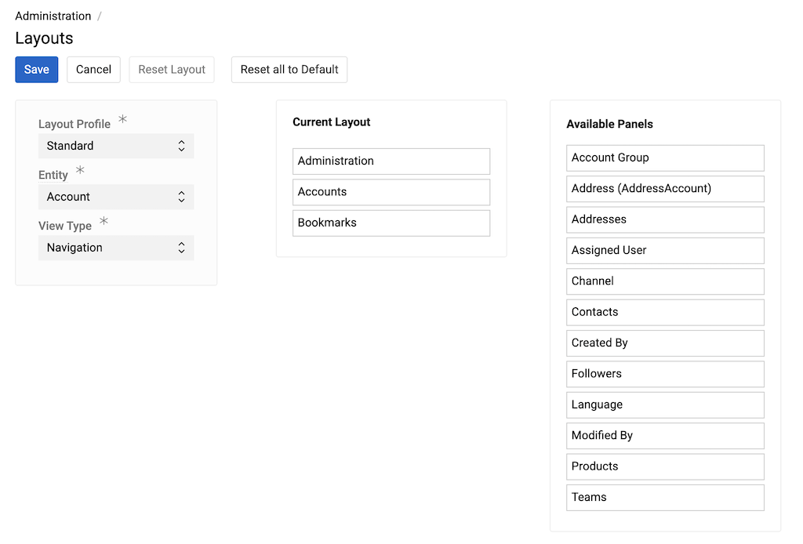{.medium}

The left sidebar appears the same for both List view and Detail view. By default, it shows the selected entity itself and [bookmarks](../../../05.toolbar/01.bookmarks/). Available fields include the entity itself, Bookmarks, and all fields of type [Link](../../11.entity-management/02.data-types/index.md#link) or [Multiple Link](../../11.entity-management/02.data-types/index.md#multiple-link).

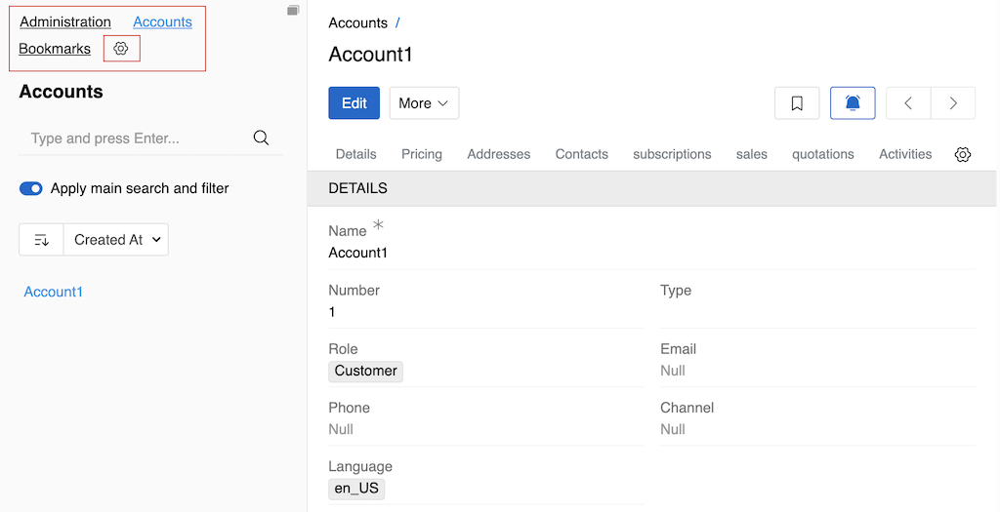{.medium}

> To learn how search works in the left sidebar, see [Left Sidebar Search](../../../11.search-and-filtering/index.md#left-sidebar-search).

You can also access Navigation configuration directly from an entity's list or detail view. Hover over the top of the left sidebar to reveal the configuration button.

#### Insights

Configure side panels in the right sidebar of the selected entity's detail view

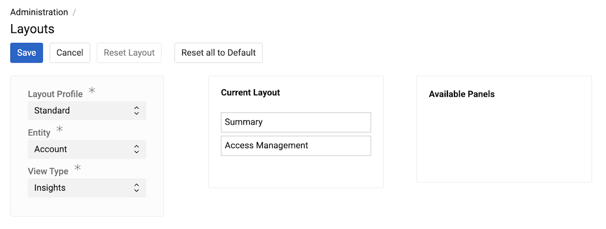{.medium}

The **Insights** View Group contains configurable side panels that display information about the record. By default, Insights contains two side panels:

- **Summary** – displays key record information such as Created, Modified, Followers, etc. See [Summary](#summary) for how to configure it.
- **Access Management** – displays access control settings (if available for the entity: Owner, Assigned User, Teams). The content of this panel is not configurable and depends on the entity settings. If none of these fields is enabled, the Access Management panel is not shown. 

Additional panels may be added by modules or features. For example, if [Matching](../../../18.master-data-management/17.matching/index.md) is enabled for this entity, the **Matched records** panel is added to the Insights tab.

You can configure which panels appear in the Insights view and their order. Any panel can be removed, but the Insights group must contain at least one panel.

You can also access Insights configuration directly from an entity's detail view. Hover over the Insights title to reveal the configuration button.

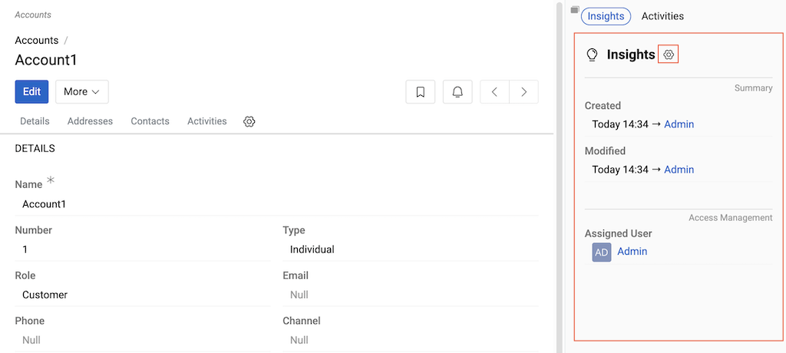{.medium}

## Working with Layouts

### Field Management
**Basic Operations:**
- **Adding Fields:** Drag from "Available Fields" to the desired location
- **Removing Fields:** Drag from layout back to "Available Fields", or click the cross next to a selected field or attribute
- **Reordering:** Drag fields within the layout to new positions

**Panel-Based Layouts (Details View, Summary View):**
For layouts with panels, you work with placeholder rows and cells:

**Setting Up Placeholders:**
- Click the **+** button at the left bottom corner of a panel to add a placeholder row
- Each row contains two cells for two-column layout
- Fields can only be added to existing placeholder cells

**Managing Rows and Cells:**
- **Add fields:** Drag fields from "Available Fields" into empty cells
- **Remove fields:** Click the **X** button in a cell to clear the field (cell remains empty)
- **Delete cells:** After removing a field, click the **-** button to delete the cell completely
- **Delete entire row:** Hover over the row and click the **X** button in the upper right corner
- **Delete individual cell:** Hover over a cell and click the **-** (minus) button at the right end
- **Reorder rows:** Drag and drop rows to rearrange their order

**Layout Behavior:**
- **Switch to single column:** Deleting one cell causes the remaining cell to automatically expand to occupy the full row width
- **Partial width fields:** Rows with one empty cell are saved and display the field in half-width (left or right part)
- **Empty rows:** Rows with both empty cells are not saved

### Panel Management
- **Creating Panels:** Use "Add Panel" to create logical field groupings
<!-- TODO: add link to Styles section after it is created; describe changing style (optional) -->
- **Editing Panels:** Hover over a panel to reveal the pencil button for editing panel name and style
- **Deleting Panels:** Hover over a panel to reveal the X button for deletion
- **Reordering Panels:** Drag and drop panels to rearrange their order in the layout

### Layout Actions
- **Save:** Apply your layout changes
- **Cancel:** Discard unsaved changes
- **Reset Layout:** Restore the current view to default settings
- **Reset all to Default:** Restore all views for the entity to default

### Related Entities
For entities with relationships, select a **Related Entity** to configure how that relationship's data appears when viewing from the parent entity.

**Small List View Configuration:**
The Related Entity setting allows you to configure the so-called **Small List View** - how the selected entity panel will be shown in the related entity's detail view. This is particularly useful for customizing how related data appears in panels. For more information about Small List View, see [Understanding UI - Small List View](../../../04.understanding-ui/index.md#small-list-view).

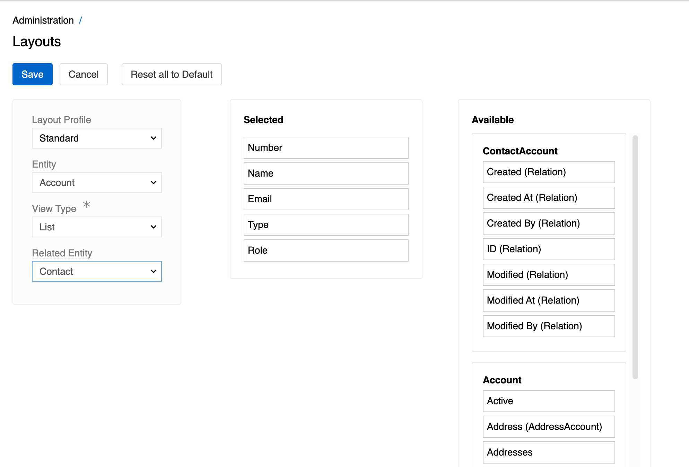{.medium}

**Small Detail View Configuration:**
The Related Entity setting allows you to configure the **Small Detail View** - how the detail form will appear when opened from a panel in the related entity for view, creation, or editing. By default, it uses the same layout as the basic Details view, but you can customize it specifically for the related entity context.

For more information about Small Detail View, see [Understanding UI - Quick Detail View (Small Detail View)](../../../04.understanding-ui/index.md#quick-detail-view-small-detail-view).

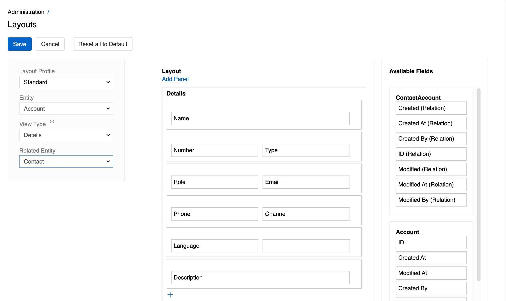{.medium}

**Examples: Account and Contact Relationship**
The screenshots above demonstrate configuration for both List and Detail views when **Account** and **Contact** are related entities:

- **Contact** has a field `Contact.accounts` which appears as a panel on the Contact record detail view
- By default, these panels contain the same fields as the basic List/Detail views of Account
- With Related Entity configuration, you can customize both the Small List View and Small Detail View specifically for Contact

**Many-to-Many vs One-to-Many Relationships:**
- **Many-to-Many** (like Account-Contact): The system creates an additional relation entity (e.g., `ContactAccount`) with its own fields that are also available for layout configuration in both List and Detail views
- **One-to-Many** (like Sale-Account): Only fields of the main entity (Account) are available for customization

For more information about relationship types and their configuration, see [Fields and Relations](../../11.entity-management/07.fields-and-relations/).

## Layout Profiles

Layout Profiles allow you to create different interface configurations for different user groups or purposes. While the **Standard** profile is used by default, you can create additional profiles through `Administration > Layout Profiles`.

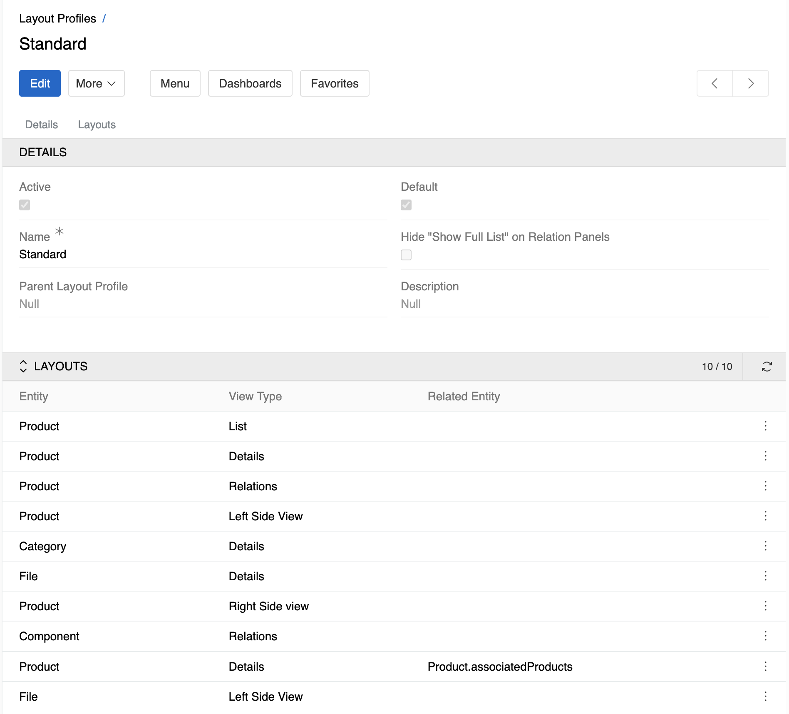{.medium}

**Profile Details:**
- **Active Status:** Toggle whether the profile is currently active
- **Default Profile:** Mark as the system-wide default configuration
- **Name:** Set a descriptive name for the profile (required field)
- **Parent Profile:** Inherit settings from another profile (optional)
- **Description:** Add explanatory text about the profile's purpose
- **Hide "Show Full List" on Relation Panels:** Control visibility of the full list option

**Associated Layouts:**
The profile displays all configured layouts organized by entity and view type.

## Best Practices

### Field Organization
- **Group related fields** into logical panels (e.g., "Contact Information", "Pricing", "Technical Details")
- **Place important fields** in the first panel and towards the top
- **Use two-column layouts** efficiently to maximize screen space
- **Always include required fields** to ensure users can save records and avoid validation errors caused by hidden required fields

### Panel Design
- **Create descriptive panel names** that clearly indicate their purpose
- **Limit panels to 8-10 fields** to maintain usability
- **Consider workflow** when organizing field order

### Relationship Management
- **Prioritize frequently-accessed relationships** in the Selected list
- **Consider user workflow** when ordering relationship tabs
- **Remove unused relationships** to reduce interface complexity

## Notes

- Layout changes apply to all users using the selected Layout Profile
- Changes take effect immediately after saving
- [Custom fields](../../11.entity-management/07.fields-and-relations/) created through `Administration > Entities` automatically appear in Available Fields
- In a [multilingual configuration](../../03.languages/), fields for additional languages are automatically added to layouts and appear directly after the main language field. Their placement cannot be customized
! After making layout changes, refresh your browser page to ensure the changes are properly displayed and avoid any cache-related issues