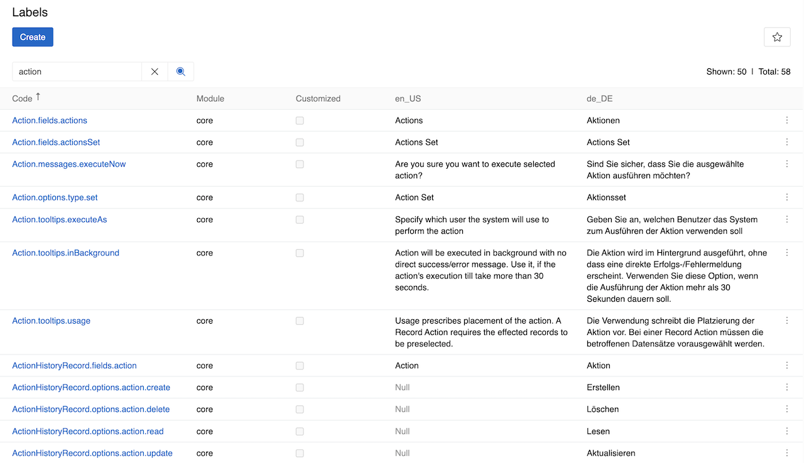
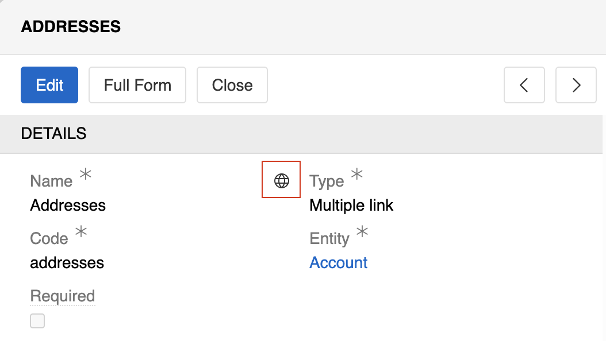
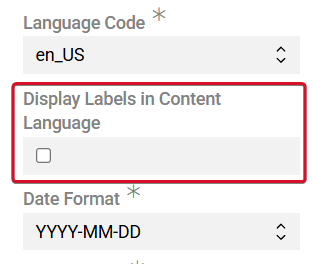
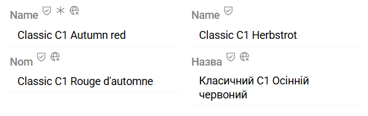
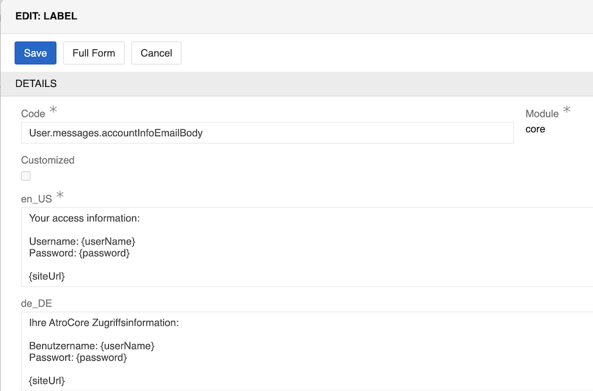

---
title: Labels
--- 

Labels manage user interface translations and text customization across different languages. This feature allows you to customize system messages, field labels, tooltips, and other interface elements.

## Overview

The Labels system provides centralized management of all UI translations. Each label has a unique code and can be translated into multiple languages. Labels are organized by modules and can be customized from their default values.

{.large}

## Managing Labels

Go to `Administration > Labels` to manage system translations. There you can find a list of system-generated labels for core modules, additional modules, or [custom fields](../../11.entity-management/). Use the search bar to find specific labels by their code or content and edit them.

! Clear cache after editing labels to avoid cache-related issues.

### Alternative Editing Methods

For field labels and tooltips, you can also edit labels directly from the field details view:

1. Navigate to the field details page
2. Hover over the **Name** or **Tooltip text** field
3. Click the globe icon that appears on hover
4. Edit the label translations directly

{.medium}

This method opens the label editing interface directly for the specific field, making it easier to edit field-specific translations without searching through the main Labels list.

### Display of labels in content languages

The system supports displaying field and attribute labels in content languages, allowing users to view labels in the same language as the content values.

To enable this functionality:

1. Navigate to `Administration → Locales`.
2. Activate the Display `Labels in Content Language` option.

{.small}

Labels are displayed in the corresponding content language, improving readability and usability for localized data management. This feature is particularly useful in multilingual environments, where product data, attributes, or descriptions are maintained in multiple languages.

{.medium}

## Label Fields

- **Code**: Unique identifier for the label (e.g., `Action.fields.actions`, `Action.messages.executeNow`). Do not change it, as this field must match internal system keys for the label to be used by the application.
- **Module**: Source module that created the label ("core", "pim", etc.). For [custom fields](../../11.entity-management/07.fields-and-relations/), it is "Custom".
- **Customized**: Checkbox indicating if the label has been modified from its default system value. Automatically checked when you edit a label through the interface. Labels with `Customized` setting will not be replaced on system update.
- **Language Columns**: Translation values for each configured locale (e.g., en_US, de_DE). Each locale gets its own column in the table.

{.medium}

## Label Types

Labels can be categorized into different types (reflected in code structure):

- **Field labels** (`Entity.fields.fieldName`): Names of entity fields and attributes
- **Messages** (`Entity.messages.messageName`): System notifications, confirmations, and user-facing messages
- **Tooltips** (`Entity.tooltips.tooltipName`): Help text for interface elements and fields
- **Options** (`Entity.options.optionName`): Dropdown and selection options
- **Actions** (`Entity.actions.actionName`): Button text and action descriptions

The actual list may contain additional label types depending on the modules and features installed in your system.

For some labels (e.g., messages), you can use placeholders for dynamic variables (e.g., `{userName}`, `{password}`, `{siteUrl}`). These placeholders are automatically replaced with actual values when the message is displayed.

> You can only use placeholders that are already defined in the main language version of the label. The system will only recognize placeholders that exist in the original translation.

## Integration with Locales

Labels automatically integrate with the [Locale system](../../02.locales/):

- When you add a new locale, a corresponding column appears in the Labels table
- Labels support all languages configured in your locales
- The system uses fallback languages when translations are missing

## Best Practices

1. **Search efficiently**: Use specific terms to find labels quickly
2. **Maintain consistency**: Keep translations consistent across similar labels
3. **Use fallbacks**: Ensure fallback languages have complete translations