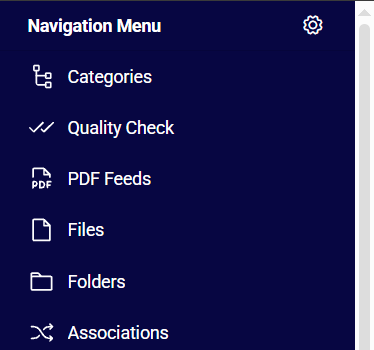
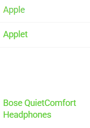

---
title: Styles
--- 

Styles manage the visual appearance of the user interface.

## Overview

The Styles entity provides centralized management of the application's visual theme. It allows administrators to define, customize, and apply consistent styling across the entire user interface.
Styles are stored as individual records and can be created, edited, or deleted. All style-related configuration is performed in `Administration/Styles`.
Each Style record controls specific UI elements through dedicated fields (primarily color settings) and supports the injection of custom code into the document head.

## Style fields

The Styles entity supports multiple configuration options. Below are examples of available style settings and fields:

- **Name**: Human-readable label for the style. This value is displayed in the style selector throughout the application (e.g., in user preferences or administration settings). Recommended to use a descriptive name that clearly identifies the theme or its purpose (e.g., "Corporate Dark Theme").
- **Code**: Unique technical identifier for the style. Used internally by the system for referencing and applying the style. Must be unique across all styles. It is recommended to use lowercase letters, numbers, and underscores only (e.g., corporate_dark).
- **Navigation menu background**: Defines the background color of the main [navigation menu](../../../03.administration/13.user-interface/01.navigation/index.md). Accepts a valid color code (hexadecimal format recommended, e.g., #1a1a2e).

{.small} 
- **Navigation font color**: Specifies the text color used for items in the main navigation menu. Accepts a valid color code. This setting affects readability and contrast of navigation labels.
- **Toolbar background color**: Sets the background color of the [toolbar](../../../05.toolbar/index.md). Accepts a valid color code.

{.small} 
- **Toolbar font color**: Defines the text and icon color used in the toolbar. Accepts a valid color code. Ensure sufficient contrast with the toolbar background color for accessibility.
- **Link color**: Determines the color of all hyperlinks and clickable text elements throughout the interface. Accepts a valid color code.

{.small} 

## Custom Code

### Head Code

The Head Code field allows injection of custom HTML, CSS, JavaScript, or meta tags directly into the `head` section of every page.
Technical notes:
- The provided code is appended at the end of the `head` tag.
- Atrocore does not validate or sanitize the custom code. Incorrect or malicious code may break the user interface, cause rendering issues, or introduce security vulnerabilities.
- Always test custom code thoroughly in a non-production environment before applying it to a live instance.
- Common use cases include adding custom fonts, analytics scripts, meta tags, or overriding styles via `style` blocks.

> Warning: Use this feature with caution. Only administrators with sufficient technical knowledge should modify the Head Code field.