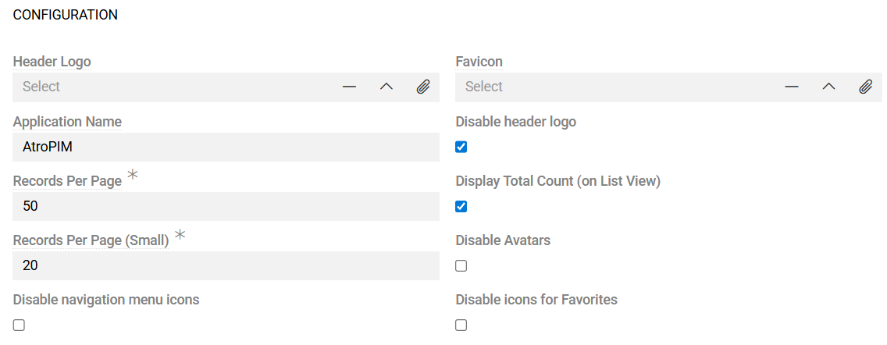
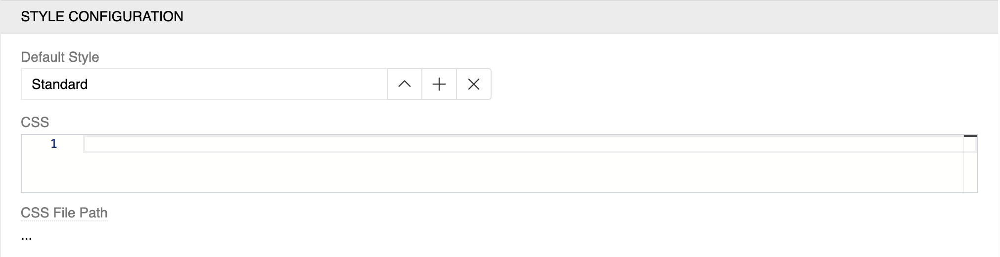

The user interface (UI) includes all visible elements users see and interact with while using AtroCore. 

Common UI settings that affect the overall appearance and behavior of the application are available in Administration - User interface.

## Configuration Panel

The Configuration panel lets you adjust general UI options that influence how the application looks and works.

{.medium}

- **Header Logo**: Upload or select a custom logo for the application header - [home button](../../05.toolbar/index.md#header-logo). Available file types: image/jpeg, image/png, image/gif, image/svg+xml.
- **Disable header logo**: Remove the header logo from the toolbar and don't reserve any space for it.
- **Favicon**: Upload or select a custom favicon for browser tabs. Available file type: image/svg+xml.
- **Application Name**: Set the display name shown as a first part of browser page title (default: "AtroPIM")
- **Records Per Page**: Number of records displayed in [list views](../../04.understanding-ui/index.md#list-view) (default: 50)
- **Display Total Count (on List View)**: Show the total number of records in list view headers
- **Records Per Page (Small)**: Number of records for [small list views](../../04.understanding-ui/index.md#small-list-view) (default: 20)
- **Disable Avatars**: Remove user profile pictures from the interface
- **Disable navigation menu icons**: Removes icons from the [navigation menu](../13.user-interface/01.navigation/). When enabled, no icon is shown; when disabled, the icon from [entity settings](../11.entity-management/index.md#configuration-fields) is used.
- **Disable icons for Favorites**: Remove icons from the [favorites menu](../../05.toolbar/02.favorites/). When enabled, no icon is shown; when disabled, the icon from [entity settings](../11.entity-management/index.md#configuration-fields) is used.

## Style Configuration Panel

The Style Configuration panel allows you to customize the visual appearance of the application through predefined styles and custom CSS.

{.medium}

- **Default Style**: Choose the default visual theme for the application. Out of the box, three styles are available:
  - **Standard**: Default light theme
  - **Light**: Alternative light theme
  - **Dark**: Dark theme for reduced eye strain
  - Custom styles can also be created and selected here

- **CSS**: Write custom CSS code to override default styling. This allows for complete visual customization of the interface.

- **CSS File Path**: The file where your custom CSS styles are stored. Your custom CSS styles will be written to this file automatically, and you can also edit it directly for advanced customization.

## What else you can configure

- **Navigation Menu**: Configure which entities appear and in what order. See [Navigation](../13.user-interface/01.navigation/).

- **Layouts**: Control how information is presented for each entity across views:
  - List View fields and order
  - Details View panels and fields
  - Relations tabs and order
  - Side panels (Navigation and Insights)
  - Related Entity layouts (Small List/Detail views)
  - Layout Profiles for different audiences
  See [Layouts](./02.layouts/index.md).

- **Dashboards**: Configure main pages per role or purpose — see [Dashboards](../../07.dashboards/).

- **Favorites**: Configure which entities appear and in what order. See [Favorites](../../05.toolbar/02.favorites/).

! Keep configurations minimal and focused on actual user needs.

## Related UI areas

- **Toolbar**: Quick access to navigation, search, favorites, bookmarks, notifications, and user menu — see [Toolbar](../../05.toolbar/index.md).
- **Understanding UI**: End‑user view types and behavior — see [Understanding UI](../../04.understanding-ui/).

