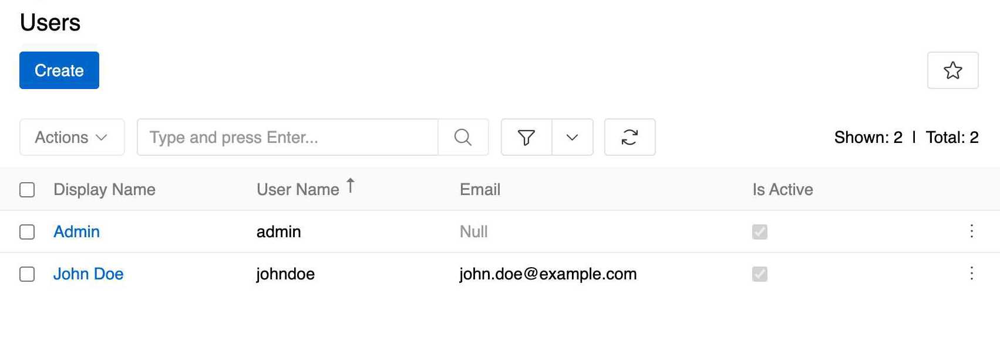
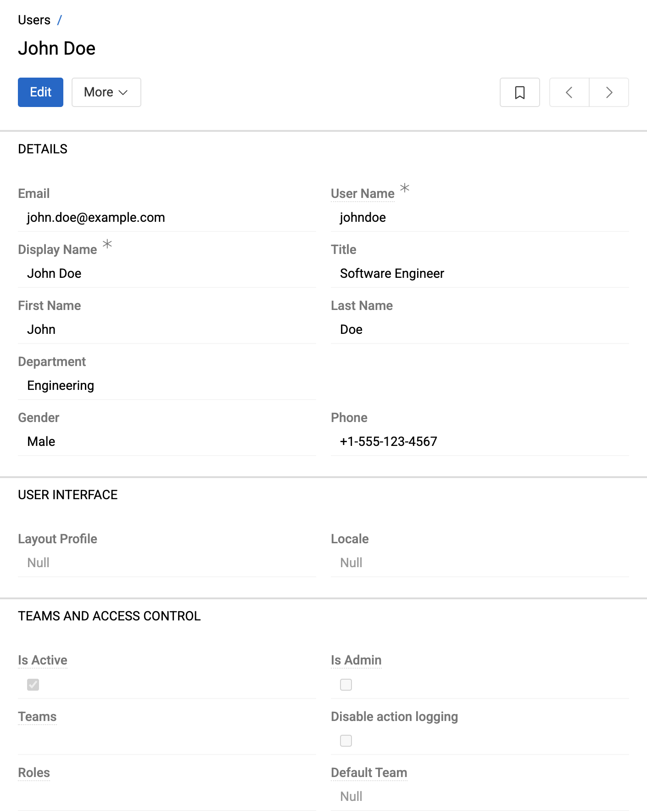
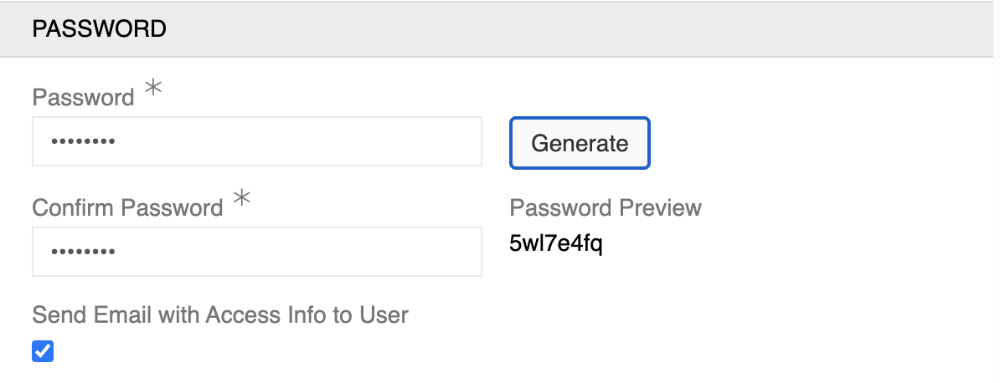
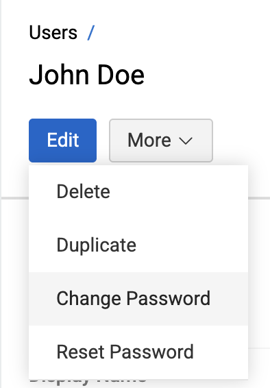
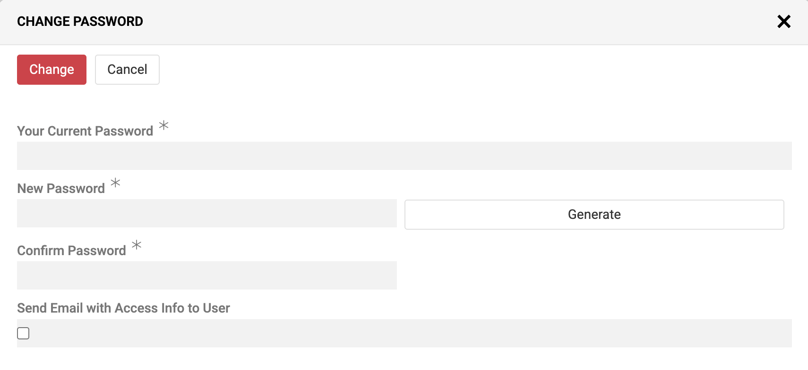
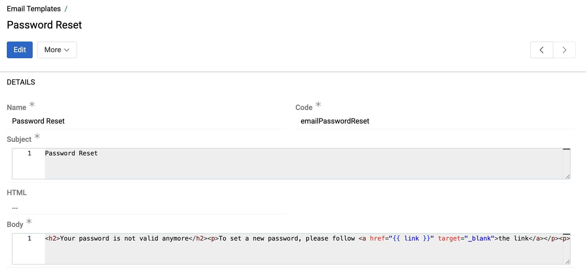
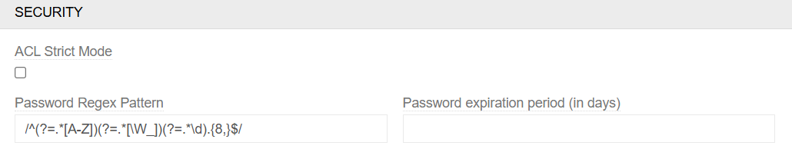

Users in AtroCore are system accounts that provide access to the platform. Each user can be assigned specific roles and teams to control their permissions and access levels throughout the system.

Users can be accessed through `Administration > Users` and are essential for managing who can access the system and what they can do within it.

## Overview

Users provide the foundation for access control in AtroCore. Each user account represents a person who can log into the system and perform actions based on their assigned roles and team memberships.

{.medium}

Users are essential for:
- **System Access** - Providing login credentials and authentication
- **Role-based Permissions** - Assigning specific access rights through roles
- **Team Organization** - Grouping users for collaborative work
- **Audit Trail** - Tracking who performed what actions in the system

## User Properties

{.medium}

### Basic Information

Each user has the following core properties:

- **Email** (*): Primary contact email and login identifier
- **User Name** (*): Unique username for system login
- **Display Name** (*): Name shown throughout the system interface
- **Title**: Professional title or position
- **First Name/Last Name**: Personal name information
- **Department**: Organizational department assignment
- **Gender**: Personal identification - value of [list](../../08.lists/) Gender (Male/Female/Neutral)
- **Phone**: Contact phone number

### Account Settings

**User Interface**:
- **Layout Profile**: Custom [layout configuration](../../13.user-interface/02.layouts/index.md#layout-profiles) for the user's interface

**Access Control**:
- **Is Active**: Controls whether the user can log into the system
- **Is Admin**: Grants administrator privileges with maximum system access
- **Teams**: Assigns user to specific [teams](../02.teams/) for collaborative access
- **Roles**: Defines user permissions through [role](../03.roles/) assignments
- **Default Team**: Sets the primary team for the user
- **Disable Action Logging**: Prevents tracking of user actions in [Action History](../04.action-history/)

**Security**:

The Security section is only visible during user creation and provides essential account setup options:

- **Password** (*): Secure login credential with password strength requirements
- **Confirm Password** (*): Password verification to ensure accuracy
- **Send Email with Access Info to User**: Automatically sends login credentials to the user's email address (requires email configuration)

Button **Generate** allows to automatically generates a secure password for the user. The generated password will be shown in **Password Preview** for verification.

{.medium}

## Password Management

Administrators can manage user passwords through various methods and configure password policies to ensure system security.

### Password Operations

Administrators have the following options for managing user passwords:

- **Change Password**: Modify a user's password by entering a new password directly
- **Reset Password**: Generate a password reset link sent to the user's email address (requires email configuration)

To manage user passwords, administrators should:

1. Navigate to the User entity record for the target user
2. Access available record actions from the user's detail view

{.small}

When the `Change Password` action is selected, the following dialog opens:

{.medium}

The Change Password dialog provides the following options:

- **Your Current Password** (*): Enter the administrator's own password for verification (not the target user's password)
- **New Password** (*): Define the new password with optional **Generate** button for automatic password creation (generated password fills both New Password and Confirm Password fields and is displayed as plain text next to Confirm Password field to copy/share with the user if needed)
- **Confirm Password** (*): Re-enter the new password to ensure accuracy
- **Send Email with Access Info to User**: Optional checkbox to automatically notify the user of their new credentials (requires email configuration)

When using the Reset Password option, the user will be automatically logged out of their account and their current password will become invalid.

### Email Templates Configuration

Password reset and change operations can trigger email notifications to users. Email templates are managed through the `Email Templates` entity and can be customized by administrators.

To modify password-related email templates:

1. Navigate to `Administration > Email Templates`
2. Select the appropriate template:
   - "Password Reset" for password reset notifications
   - "Password Change Request" for password change confirmations

{.large}

3. Modify the email subject and body content as needed
4. Save the template

### Password Policy Configuration

Administrators can enforce password complexity requirements and expiration policies through the `Security` section of [System settings](../../01.system-settings/index.md#security).

{.medium}

- **Password Regex Pattern**: Define minimum character requirements, character types, and complexity rules

Example configuration requires passwords with minimum 8 characters, uppercase letters, and special characters

- **Password Expiration**: Lets you set how long a password remains valid before the user is required to change it. When the expiration period is reached, the user will be prompted with a password change form.

## User Management Features

### Administrator Privileges

The **Is Admin** checkbox grants the user full system access with maximum permissions. Administrators can:
- Access all system areas and functions
- Manage other users, roles, and teams
- Configure system settings and preferences
- Override standard access controls

> Administrator status should be granted carefully as it provides complete system access.

### Team Assignment

Users can be assigned to multiple teams simultaneously, providing flexible organizational structures:
- **Multiple Team Membership**: Users can belong to several teams at once
- **Default Team**: Sets the primary team for the user's default context
- **Collaborative Access**: Team membership affects data visibility and permissions

### Role-based Permissions

Users receive the combined permissions from all their assigned roles:
- **Permission Summation**: Total permissions = sum of all role permissions
- **Flexible Assignment**: Users can have multiple roles for complex access needs
- **Granular Control**: Fine-tuned permissions through role configuration

For detailed information about configuring roles and permissions, see [Roles](../03.roles/index.md).

### Example

Roles 1 and 2 are assigned to the user.

With role 1 he has access and authorizations to entities A and B. With role 2 he has access and authorizations to entities B and C. Since the user is assigned both roles, he receives access and authorizations to entities A, B and C.

## Personal Account Management

Every AtroCore user can view and edit their own account data (if such authorizations are set for their role). 

For detailed information about changing passwords and managing personal account settings, see [User Profile](../../../16.user-profile/).