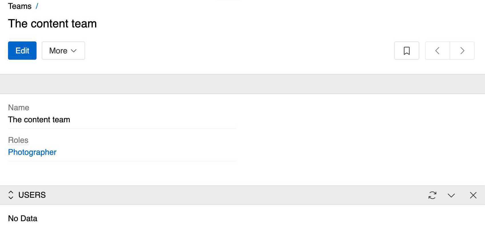
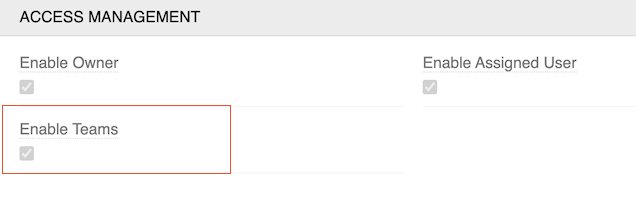

Teams in AtroCore are organizational units that group users for collaborative work and access control. Teams can be assigned to entities to control data visibility and permissions across the system.

Teams can be accessed through `Administration > Teams` and are essential for organizing users and controlling access to system data.

## Overview

Teams provide a flexible way to organize users and control data access in AtroCore. Each team can contain multiple users, and users can belong to multiple teams simultaneously.

{.medium}

Teams are essential for:
- **Collaborative Work** - Grouping users with similar responsibilities
- **Access Control** - Controlling data visibility and permissions
- **Project Organization** - Managing teams for specific projects or regions
- **Data Segregation** - Ensuring users only see relevant data

## Team Properties

Each team has the following properties:

- **Name** (*): Display name of the team
- **Roles**: Assigned roles that define the team's permissions
- **Users**: Team members who belong to this team

## Team Assignment

Teams can be assigned to entity records to manage data access and visibility. The `Enable Teams` option in an entity’s settings controls whether team assignment is available for that entity.

For details on enabling this option, see [Entity management](../../11.entity-management/index.md#access-management-panel).

{.medium}

Enabling this option automatically creates a Teams field (type: [Multiple link](../../11.entity-management/02.data-types/index.md#multiple-link)) for the entity. Add this field to the desired layouts — see [Layouts](../../13.user-interface/02.layouts/). Once added, you can assign teams to records and use this for access control.

For detailed information about configuring roles and permissions, see [Roles](../03.roles/index.md).

## Best Practices

A correct team configuration gives your employees access only to the entities and fields they need to perform their tasks. This enables optimal organization of work and increases efficiency.

For quality product descriptions and other collaborative work, cooperation between different teams and employees is essential. Teams should be designed to reflect actual organizational structures and project requirements. 