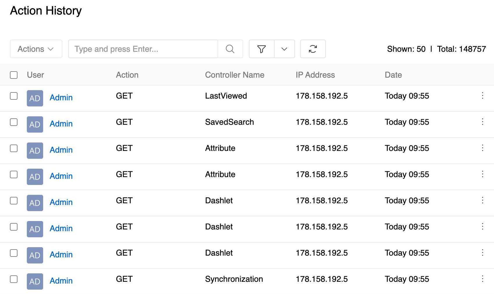
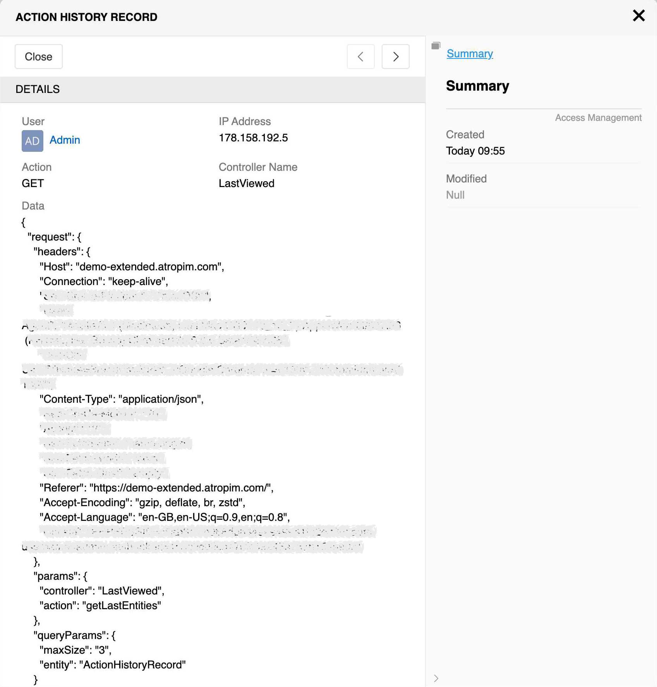

Action History provides a comprehensive audit trail of all user activities within the system. It tracks both actions made from UI and direct API calls. Each record captures:

- **User**: The user who performed the action
- **Action**: The type of action (GET, POST, etc.)
- **Controller Name**: The system component or entity accessed
- **IP Address**: The IP address from which the action was performed
- **Date**: The date and time when the action occurred
- **Data**: Additional action-specific data (if available)

Access Action History via `Administration > Access Management > Action History`.

The Action History list displays all recorded actions:

{.medium}

You can [search and filter](../../../11.search-and-filtering/) them as usual.

[Open](../../../08.record-management/docs.md#opening-records) a record to see detailed information about a specific action:

{.medium}

Records cannot be added or modified manually - you can only view, delete, or export them.

> Action History logging can be disabled entirely in [System Settings](../../01.system-settings/) or for a particular entity in [entity configuration](../../11.entity-management/).

> To automatically clean up old Action History records, use the [Clear deleted data](../../05.system-jobs/01.scheduled-jobs/docs.md#clear-deleted-data) scheduled job.
