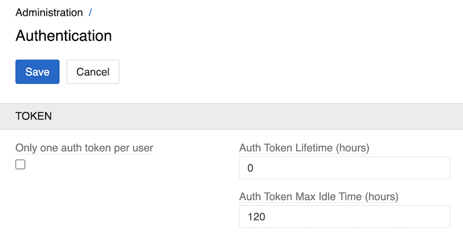

---
title: Authentication
--- 

The Authentication page allows you to configure security settings related to user authentication tokens and session management.
To set them go to `Administration > Authentication`.

{.medium}

- **Only one auth token per user**: when enabled, users won't be able to be logged in on multiple devices simultaneously.
- **Auth Token Lifetime (hours)**: defines the lifetime period for authentication tokens. Set to 0 (no expiration) by default.
- **Auth Token Max Idle Time (hours)**: defines how long since the last access tokens can exist. Set to 120 hours (5 days) by default.

For LDAP authentication, see [LDAP authentication](https://store.atrocore.com/en/ldap/20164).
