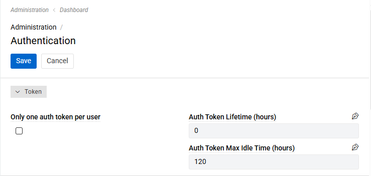
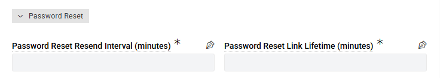

---
title: Authentication
--- 

The Authentication page allows you to configure security settings related to user authentication tokens, session management and password reset.
To set them go to `Administration > Authentication`.

{.medium}

- **Only one auth token per user**: when enabled, users won't be able to be logged in on multiple devices simultaneously.
- **Auth Token Lifetime (hours)**: defines the lifetime period for authentication tokens. Set to 0 (no expiration) by default.
- **Auth Token Max Idle Time (hours)**: defines how long since the last access tokens can exist. Set to 120 hours (5 days) by default.

For LDAP authentication, see [LDAP authentication](https://store.atrocore.com/en/ldap/20164).

## Password Reset

The *Password Reset* panel controls the password reset links that users request with **Forgot Password?** on the login page and that administrators send with the [Reset Password](../01.users/index.md#password-operations) action.

<!-- To Do: add screenshot of the Password Reset panel -->
{.medium}

- **Password Reset Resend Interval (minutes)**: defines how long a user has to wait before requesting another password reset link. Set to 1 minute by default.
- **Password Reset Link Lifetime (minutes)**: defines how long the password reset link sent by email stays valid. Set to 15 minutes by default.

The minimum value for both settings is 1 minute.

If a user requests a new link before the resend interval has passed, the request is rejected with a message telling the user how many minutes to wait. The resend interval does not apply to the **Reset Password** action of administrators.

Only the most recent password reset link of a user is valid – each new link replaces the previous one. A link also stops working once the password has been changed with it. A change of the link lifetime applies to links that have already been sent.

! Password reset works only if the **Connection for E-Mail Notifications** is set in the [system settings](../../01.system-settings/index.md#notifications). Otherwise, the **Forgot Password?** link is not shown on the login page.

## Rate Limit

The *Rate Limit* panel protects the login and the password reset request from automated abuse. Clients that send too many requests receive the status `429 Too Many Requests` and have to wait before trying again.

- **Rate Limit: Requests**: how many requests one IP address may send to a limited endpoint within the period. Set to 3 by default.
- **Rate Limit: Period (seconds)**: the length of that period. Fractions are allowed, for example `0.5`. Set to 1 second by default.
- **Max Source IPs Per User**: how many different IP addresses may be used for the same user name within 60 seconds when logging in. Set to 5 by default.

The login is limited per IP address and per user name; the password reset request per IP address. All other API requests are not limited. Users behind one shared address (for example an office network) share the limit of that address, so raise **Rate Limit: Requests** if many of them open the application at the same moment.

For details, including how to limit requests in the web server in addition, see [Rate Limiting](../../../../08.security/02.rate-limiting/index.md).
