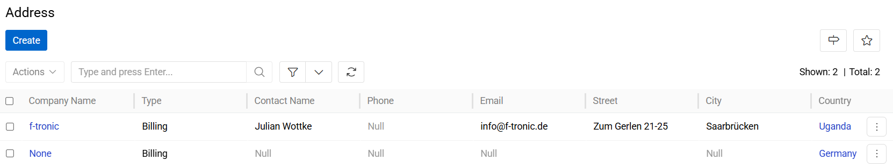
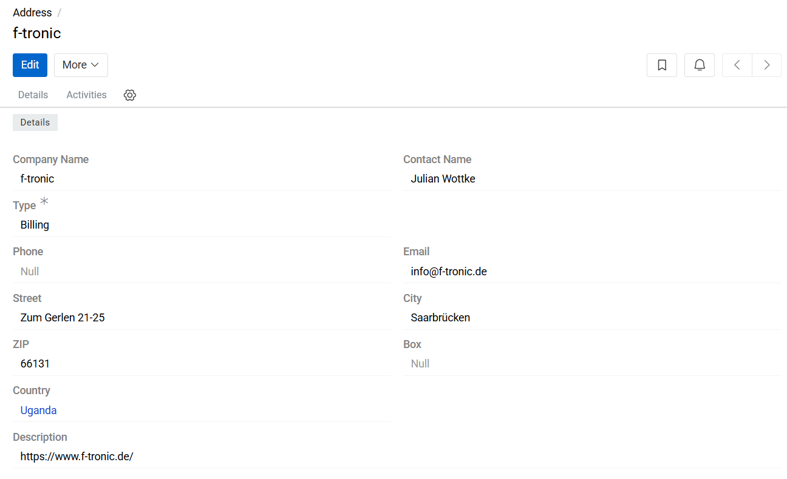

---
title: Address
--- 

## Overview

The Address entity provides centralized management of all company, supplier, buyer, and seller addresses used within the system.
Addresses are stored as structured records and can be reused across entities and business processes. Each address record has a unique identifier and can be customized independently from default values.

{.large}

The Address entity is typically used in workflows related to:
- Order processing
- Deliveries and logistics
- Billing and invoicing
- Supplier and partner management
- ERP and external system integrations

## Managing Addresses

To manage address records, navigate to: `Administration > Addresses`. The Address list view displays all existing address records available in the system.

Users can:
- Search for addresses by code, company name, contact details, or address content
- Create new address records
- Edit existing addresses
- Remove obsolete address records

The search bar supports quick filtering for efficient navigation in large address datasets.

## Address Fields

- **Company Name**: Specifies the legal or commercial name of the company associated with the address.
- **Contact Name**: Defines the contact person related to the address record.
- **Type**: Defines the purpose of the address. Supported values include:
  - Billing — used for invoicing and financial documents
  - Delivery — used for shipping and logistics operations
- **Phone**: Stores the primary phone number associated with the address.
- **Email**: Stores the contact email address associated with the address.
- **Street**: Defines the street name and building number.
- **City**: Specifies the city of the address.
- **ZIP**: Defines the ZIP or postal code.
- **Box**: Specifies an additional post office box or mailbox identifier, if applicable.
- **Country**: Defines the country associated with the address record.
- **Description**: Optional field used to store additional comments or administrative notes related to the address.

{.large}