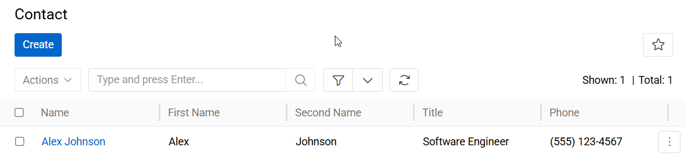
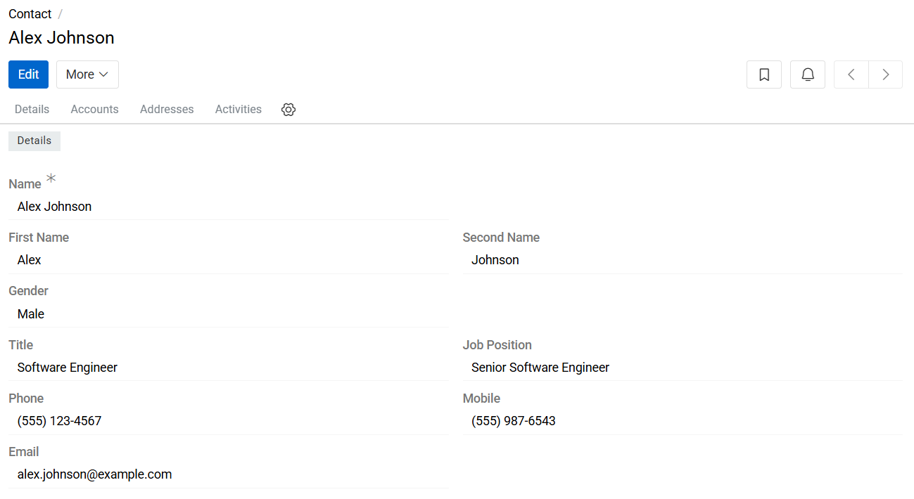

---
title: Contact
--- 

## Overview

The Contact entity provides centralized management of all contact persons within the system.
Contacts are stored as structured records and can be reused across entities and business processes. Each Contact record has a unique identifier and can be customized independently from default values.

{.large}

The Contact entity is typically used in workflows related to:

- Order processing
- Deliveries and logistics
- Billing and invoicing
- Supplier and partner management
- ERP and external system integrations

## Managing Contacts

To manage Contact records, navigate to: `Administration > Contacts`. The Contacts list view displays all existing Contact records available in the system.

Users can:

- Search for Contacts
- Create new Contact records
- Edit existing Contacts
- Remove obsolete Contact records

The search bar supports quick filtering for efficient navigation in large contact datasets.

## Contacts Fields

- **Name**: Defines the full display name of the Contact record.
- **First Name**: Specifies the first name of the contact person.
- **Second Name**: Specifies the last name or surname of the contact person.
- **Gender**: Defines the gender of the contact person. Available values depend on system configuration.
- **Title**: Specifies the professional or formal title of the contact (e.g., Mr., Mrs., Dr., Prof.).
- **Job Position**: Defines the role or position of the contact within the associated organization.
- **Phone**: Stores the primary phone number associated with the contact.
- **Mobile**: Stores the mobile phone number of the contact.
- **Email**: Stores the primary email address associated with the contact.

{.large}