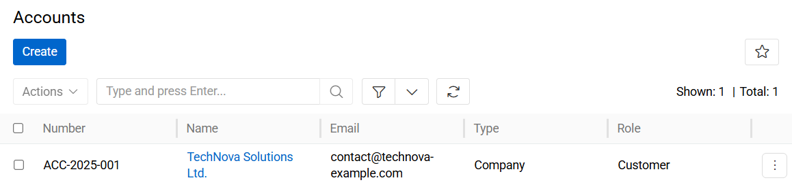
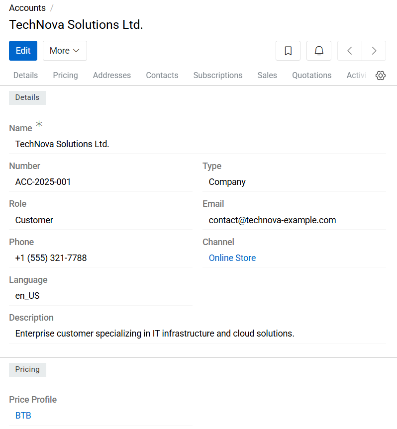
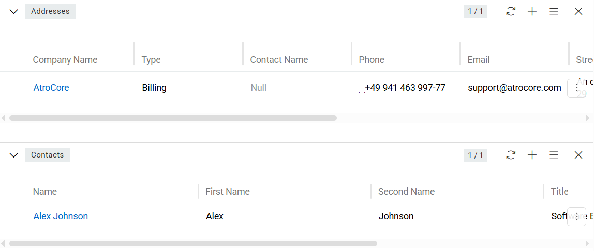

---
title: Account
--- 

## Overview

The Account entity provides centralized management of all customer, supplier, and business partner accounts within the system.

{.large}

Account records are used to store organizational or individual business information and serve as the primary entity for commercial and communication-related processes.

The Account entity is commonly used in:
- Customer and supplier management
- Sales and quotation workflows (if Sales module is activated)
- Subscription management (if Sales module is activated)
- ERP and external system integrations
- Billing and communication processes

## Managing Accounts

To manage Account records, navigate to: `Administration > Accounts`. The Account list view displays all existing address records available in the system.

Users can:
- Search for accounts by name, number, email, phone, or related data
- Create new Account records
- Edit existing Accounts
- Remove obsolete Account records

The search bar supports quick filtering and navigation within large account datasets.

## Account Fields

- **Name**: Defines the display name of the Account.
- **Number**: Specifies the internal or external account number used for identification.
- **Type**: Defines the account type. Default values include:
  - Company — organizational or legal entity
  - Individual — private person or individual customer
- **Role**: Defines the business role of the Account within the system. Default values include:
  - Customer
  - Supplier
- **Email**: Stores the primary email address associated with the Account.
- **Phone**: Stores the primary phone number associated with the Account
- **Channel**: Reference to the related [Channel](../../../../05.pim/06.channels/index.md) record.
- **Language**: Defines the [language code](../../../03.administration/03.languages/index.md#language-fields) associated with the Account. This value may be used for localized communication, content rendering, or export configuration.
- **Description**: Optional field used for additional administrative notes or comments related to the Account

{.large}

## Related Records

Account records can be linked to:
- [Address](../01.address/index.md)
- [Contacts](../02.contact/index.md)

These relationships allow centralized management of communication and delivery information associated with the Account.

{.large}

If the [Sales](https://store.atrocore.com/en/sales/20183) module is installed, Account records are also be used within this module.