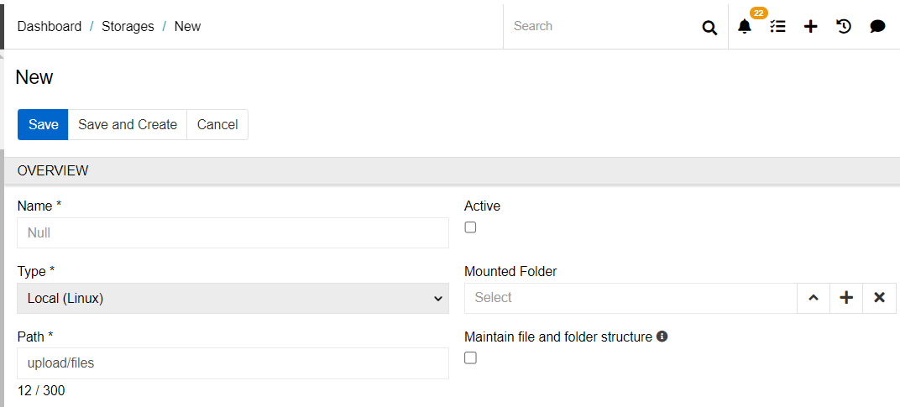
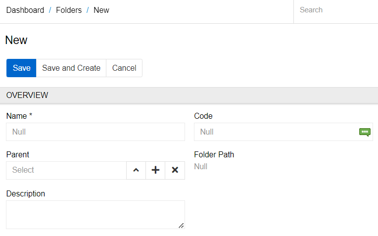
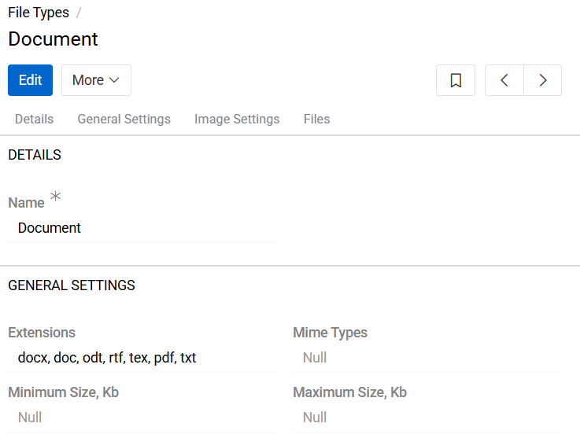
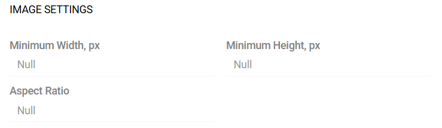
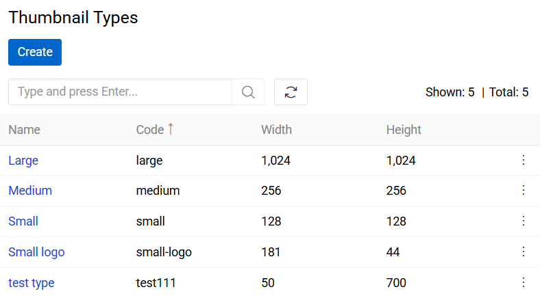
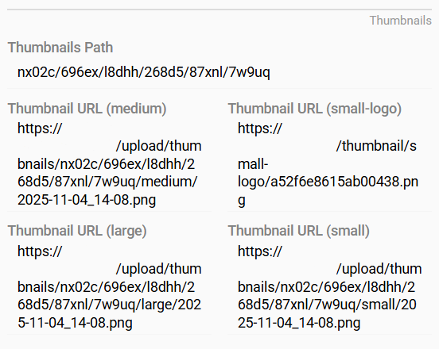

Administrators have comprehensive control over the file management system, including storages, folders, file types, and validation rules.

## Storages

You can manage storages in the `Administration > Storages` menu.

This is the location where the file is stored. Each file can have only one Storage, while many files and folders can be stored in the same Storage. By default, only Local (Linux) Storage is available to the user. Other types are available after installing paid modules. For example, MS SharePoint Storage is provided with the Microsoft 365 Connection module, and S3 storage is available via the [S3 Object Storage](https://store.atrocore.com/en/s3-object-storage/20216) module. The Base Storage exists in the system by default. All newly created folders and files are placed in it if no other Storage is specified. Files and folders cannot be moved from one Storage to another after creation.

The Storage contains the following fields:

{.large}

- **Name** - the name of the Storage
- **Active** - to be able to work with a Storage, it must be active. If it is inactive, you can not add a new folder or file to it. Files that were added before deactivation will not be deleted and will remain attached to the related entity record (e.g. Product), but will not be available for downloading or viewing.
- **Type** - the type of the Storage.
- **Mounted Folder** - the root folder of the Storage. All folders and files that need to be located in this Storage should be created inside this folder (or its child records).
- **Path** - the actual path on the server where the files will be stored. The path of two Storages cannot be the same. But one Storage path can be included in another.
- **Maintain file and folder structure** - a checkbox that allows you to synchronize the structure of the Storage in AtroCore with the structure on the server. If the checkbox is activated, all folders and files will be stored on the server in the same path as specified in the AtroCore system. The value of the checkbox cannot be changed after the Storage is created.

The Storage page also contains panels with files and folders. The folder specified as Mounted Folder is present in the folder panel by default.

## Folder Management

You can manage folders in the `Administration > Folders` menu.

The Folder contains the following fields:

{.large}

- **Name** - the name of the Folder
- **Code** - the code of the Folder
- **Parent** - a link to the parent Folder. Specify here the root folder or another folder of the Storage if you want to create a folder inside it
- **Folder Path** - the folder tree that forms the path to this Folder. The field will be filled in automatically after saving the changes
- **Description** - description of the Folder

## File Types

You can manage file types in the `Administration > File Types` menu.

All files in AtroCore can be categorized by type. Administrators can define custom file types and configure specific validation rules for each type. The Type field is optional. Each file record can be assigned to only one file type.

By default, the following file types are available in AtroCore: Presentation, Graphics, Archive, Video, Audio, Icon, Image, Spreadsheet, Document, and File. Administrators may create additional types, modify validation parameters or priority for existing types, or remove them as required.

Each File Type configuration includes the following sections:

### General Settings

{.large}

- **Extensions** - defines the list of permitted file extensions (e.g., jpg, png, pdf). Files whose extensions are not included in this list will not be accepted for upload under this file type.
- **Mime Types** - specifies the allowed MIME types (e.g., image/jpeg, application/pdf). MIME type validation ensures that the uploaded file’s actual content type corresponds to the declared file format.
- **Maximum Size, Kb** - defines the maximum permissible file size, in kilobytes, for this file type. Files exceeding this threshold will be rejected.
- **Minimum Size, Kb** - defines the minimum permissible file size, in kilobytes, for this file type. Files smaller than this limit will not be accepted.

Enter information or leave these fields blank to determine the validation rules for files.

{.large}

### Image Settings

Additional configuration parameters can be defined for file types classified as Image.

- **Minimum Width, px** - specifies the minimum allowed image width, in pixels. Images with a smaller width will be rejected.
- **Minimum Height, px** - specifies the minimum allowed image height, in pixels. Images with a smaller height will be rejected.
- **Aspect Ratio** - defines the required image aspect ratio (e.g., 16:9, 1:1). Uploaded images that do not match the defined ratio will not pass validation. This setting is used to maintain consistent image proportions across the system.

## Thumbnail configuration

The Thumbnail Configuration feature enables users to define and manage image thumbnail generation within the AtroCore system. Thumbnails are used to optimize the display of images across the interface and external systems.

### System-defined Thumbnail Types

AtroCore provides the following predefined thumbnail types:

| **Thumbnail Type** | **Size (Width x Height, px)** |
| -------------- | ------------------------- |
| Large          | 1024 × 1024               |
| Medium         | 256 × 256                 |
| Small          | 128 × 128                 |
| Small Logo     | 181 × 44                  |

These thumbnail types are available by default and have fixed dimensions.

{.medium}

> The Large (1024 × 1024) thumbnail type is used internally by AtroCore for image preview and processing. Other thumbnail types (Medium, Small, Small Logo) are typically generated for integration with external systems or exports.

### Custom Thumbnail Types

Administrators can define custom thumbnail types by navigating to
`Administration > Thumbnail Types` and creating new records.

For each custom thumbnail type, the target dimensions must be specified. These types can be used for system-specific UI adjustments or for compatibility with external platforms that require specific image sizes.

### Thumbnail Generation

Thumbnails are generated on demand — they are created only when explicitly requested (e.g., when a thumbnail is displayed or processed). This approach reduces storage usage and produces only the thumbnail files that are actually needed.

### Thumbnail Storage

The `Thumbnails Path` field displays the directory path on the server where the generated thumbnails for a specific image are stored. This is useful for server-side file management or debugging purposes.

### Display in UI Layout

Thumbnails are not included in the default user interface layout. However, they can be added to pages through the  [Layout Management](../../03.administration/13.user-interface/02.layouts/docs.md) if needed.

{.medium}