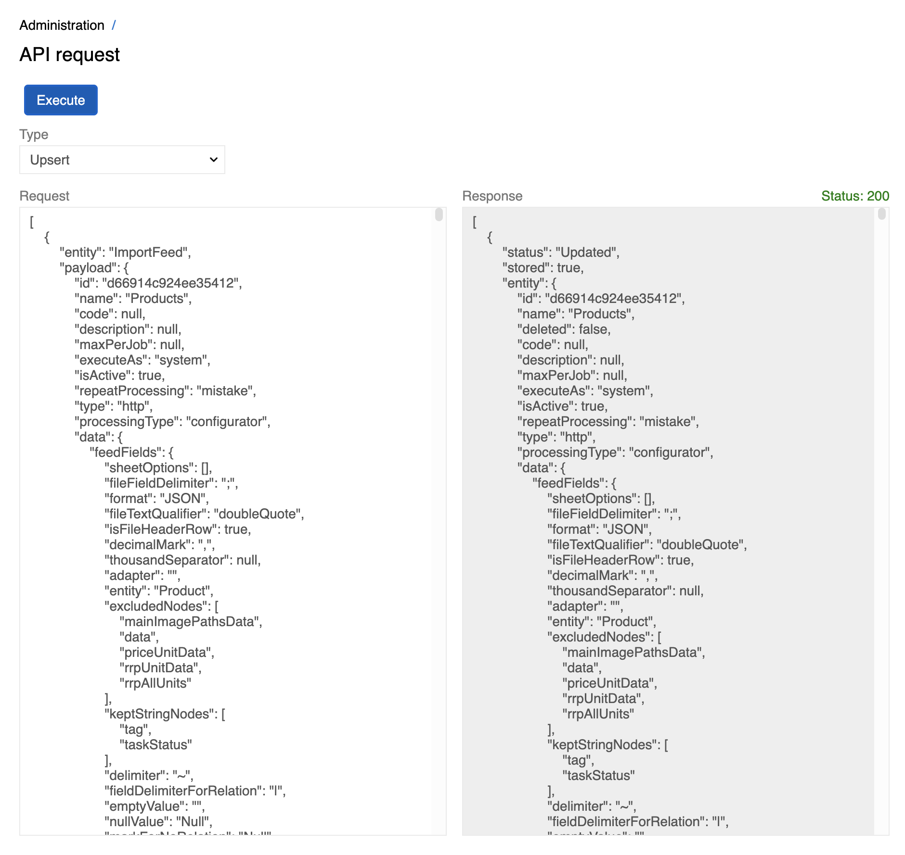
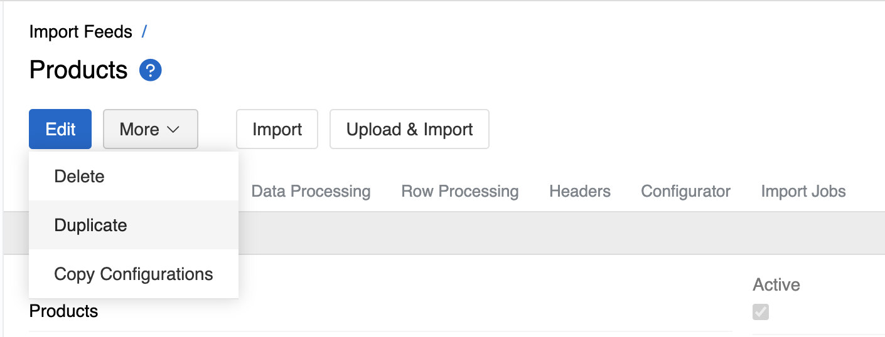

---
title: API Request
taxonomy:
    category: docs
--- 

API Request is a general-purpose tool for executing Upsert operations with valid JSON payloads that match specific entity schemas. It creates or updates records of the target entity type. It can be found in Administration → Tools.

After execution, the tool displays the request status and provides a response field showing the result of the operation.

{.medium}

## Primary Use Case: Copying Feed Configurations

The tool is particularly useful for copying [Import Feeds](../../../../02.data-exchange/01.import-feeds/) and [Export Feeds](../../../../02.data-exchange/02.export-feeds/) between different AtroCore instances.

1. **Source Instance**: Use the "Copy Configuration" action on the feed you want to replicate
2. **Target Instance**: Navigate to Administration → Tools → API Request
3. **Execute**: Paste the copied JSON into the Request field and click Execute

For detailed information about copying feed configurations, see [Copying Feed Configurations](../../../../02.data-exchange/11.copying-feed-configurations/).

{.medium}