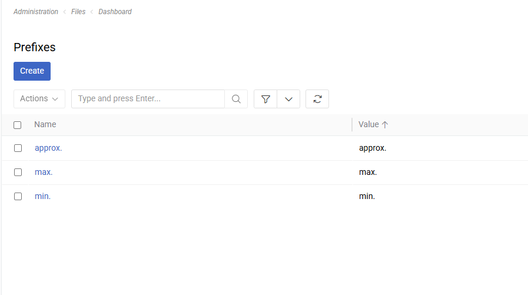

Prefixes allow you to attach a short label **before** a field value — for example `approx.`, `min.`, `max.`, or `Dr.`. They can be used on [Float](../11.entity-management/02.data-types/index.md#float), [Integer](../11.entity-management/02.data-types/index.md#integer), and [String](../11.entity-management/02.data-types/index.md#string) fields and attributes.

To manage Prefixes, go to `Administration > Prefixes`.

{.medium}

## Prefix Fields

- **Name**: A human-readable label for the prefix (e.g., "Approximate", "Doctor"). Used for identification in the admin panel.
- **Value**: The string displayed before the field value in the UI (e.g., `approx.`, `Dr.`). This is what end users see.

## Enabling Prefixes on a Field

To enable prefix selection on a field:

1. Go to `Administration > Entity Manager` and open the entity.
2. Edit a **Float**, **Integer**, or **String** field.
3. Check the **Enable Prefix** option and save.

> The **Enable Prefix** option is only available for `Float`, `Integer`, and `String` field types when **Is Multilingual** is turned off.

Once enabled, a prefix dropdown appears before the value input when editing the record. In detail and list views, the selected prefix value is displayed immediately before the field value (e.g., `approx. 3.5` or `Dr. Smith`).

When combined with a [Measure](../09.measure-units/index.md), the prefix appears first: `approx. 3.5 kg`.

## Restricting Available Prefixes

By default, all Prefix records are available in the dropdown. To limit which prefixes are selectable for a specific field, use the **Allowed Prefixes** panel on the field or attribute configuration — this lets you apply filter conditions that restrict the visible prefixes.

{.medium}

If no filter is configured, all Prefix records are shown.

## Prefixes on Attributes

Prefixes work the same way on [attributes](../12.attribute-management/01.attributes/index.md). Enable the **Enable Prefix** checkbox on an `int`, `float`, or `varchar` attribute (only when **Is Multilingual** is off). The prefix selection then appears on every record that has that attribute assigned.

## Display

| Context | Example |
|---------|---------|
| Edit mode | Prefix dropdown + value input (+ unit dropdown if Measure is set) |
| Detail view | `approx. 3.5` or `approx. 3.5 kg` |
| List view | `approx. 3.5` or `approx. 3.5 kg` |

The **Value** field of the Prefix record is used for display (not **Name**). This allows you to keep a descriptive admin name (e.g., "Approximate") while showing a concise label to users (e.g., `approx.`).
