The AtroCore system comes with a user-friendly configurable [interface](../03.administration/13.user-interface/docs.md) that includes a number of views and panels, where **entity records** are displayed and managed.

Views can be shown in the main or pop-up window. They consist of the panels, which can be configured by the administrator. Usually these are structured in a way to provide you with key information on the record management.

> If you want to make changes to some entity (e.g. add new fields, modify its views or relations), please, contact your administrator.

## List View

The list view is a default view page that appears when any entity is selected in the navigation menu, where the records belonging to this entity are displayed. It has its own layout, which can be configured by the administrator.

The list view page shows a table of records with main fields configured for each entity and includes:

- *[left sidebar](#left-sidebar) (1);*
- *[taskbar](../05.toolbar/docs.md) (2);*
- *[breadcrumb navigation](#breadcrumb-navigation) including the page name (3);*
- *[search and filtering panel](../11.search-and-filtering/docs.md) (4);*
- *records list (5).*

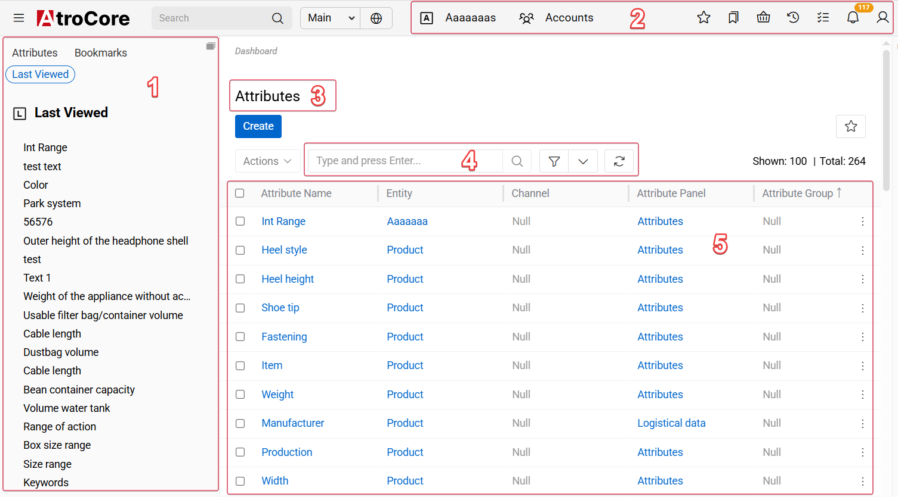{.large}

Here you can change entity records order in the list by clicking any sortable column title; this will sort the column either ascending or descending. Users can adjust the size of the columns. Please, note that the default order of entity records is predefined in the Entity Manager. To change it, please, contact the administrator.

The total number of entity records and the number of current records on the list page are displayed on the list view page:

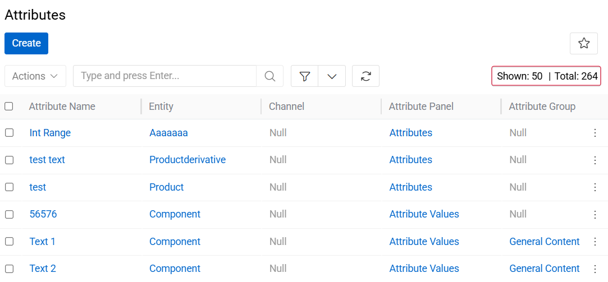{.medium}

On the list view page, you can perform actions with separate or multiple entity records at once via the [single record](#single-record-actions) and [mass actions](#mass-actions) menus correspondingly.

To edit the fields data on the list view page, use [in-line editing](../08.record-management/docs.md#in-line-editing).

If they are allowed to edit layouts or create custom layouts, users can configure what they can see in the list view by clicking the edit button and entering [layout management](../03.administration/13.user-interface/02.layouts/docs.md#list).

Users can edit records and add or delete attributes via list view using [in-line editing](../../01.atrocore/08.record-management/docs.md#in-line-editing).

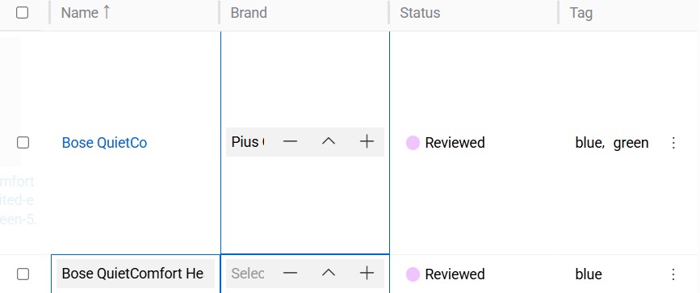{.medium}

## Plate View

The plate view is a variant of the [list view](#list-view), in which all entity records are displayed as plates:

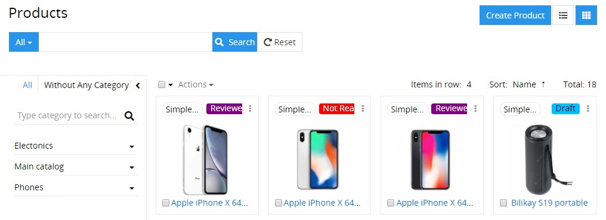{.large}

To switch to this view, click the plates icon located in the upper right corner of the list view page of entity records.

The [mass actions](#mass-actions) and [singe record actions](#single-record-actions) are also available here, just like for the list view.

You can configure the plate view layout by selecting the desired item number to be displayed in a row (1–6) and defining the record field to be used for sorting via the corresponding drop-down menus:

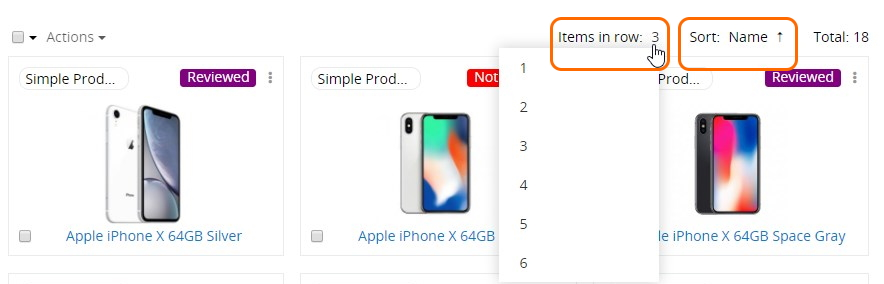{.large}

Within the AtroPIM system the plate view is available only for [products](../../05.pim/03.products/).

## Kanban View

> Available with [Projects](https://store.atrocore.com/en/projects/20225) module.

The Kanban view is a variant of the [list view](#list-view) that displays records as cards organized by their current status.

To switch to this view, click the grid icon in the upper right corner of the list view page.

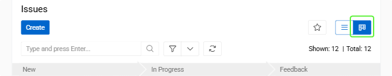{.medium}

### Mass Actions

Mass actions allow you to perform operations on multiple selected entity records simultaneously, improving efficiency when managing large datasets. You can select records using checkboxes and apply various operations like removal, updates, exports, and relationship management.

> For detailed information about record selection methods, available mass actions, and step-by-step instructions, see the [Mass Actions](../12.mass-actions/) documentation.

### Single Record Actions

To see the actions available for separate records in the list, click the single record actions menu icon located on the right of the record:

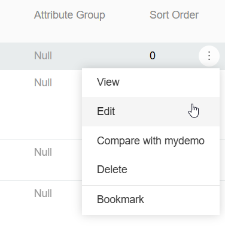{.small}

Each record has a three-dot menu that provides access to various operations. The available actions depend on the entity type and your user permissions.

> For detailed information about what each action does and when to use them, see the [Single Record Actions](../08.record-management/docs.md#single-record-actions) section in Record Management.

> To modify the single record actions list, please, contact your administrator.

## Small List View

Small list views are panels and pop-up windows with data on the entities related to the given entity record, shown in the main window always together with the [detail view](#detail-view). Each entity may have as many related entities as needed in accordance with the administrator's configurations. Users can adjust the size of the columns.

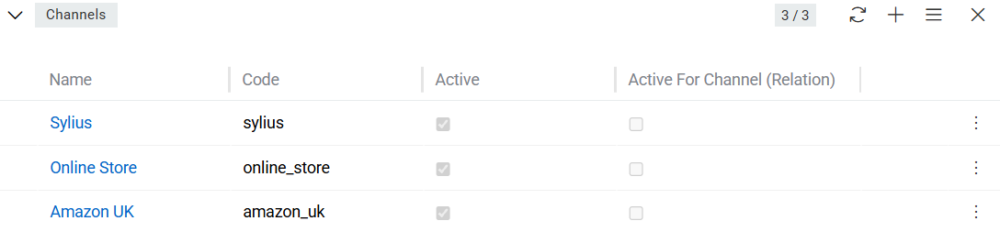{.medium}

The following actions are available for the small list view panels:

- **General actions** – applicable to all records on the related entities panel:

  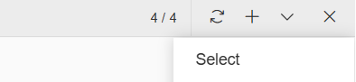{.small}

  - *Refresh* – to refresh the related entities list on the panel;
  - *Create* – to create a new record for the related entity;
  - *Select* – to create a relation between the entity record, which is opened in the main window and the entity record, which was chosen in the pop-up window.

*Please, keep in mind that choosing some record in the pop-up window will reassign it to the entity record, which is opened in the main window. The previous relation will be dropped, if the relation is one-to-many.*

- **Single record actions** – applicable to each record of the related entities separately. The list of actions here is usually the same as on the list view for this entity.
    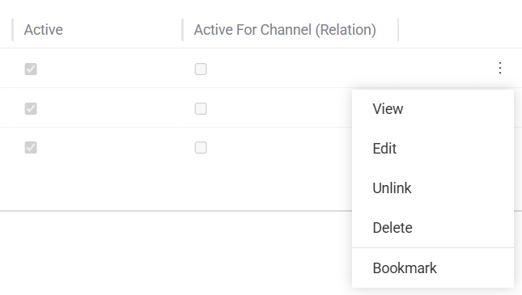{.medium}

- [**Mass actions**](../12.mass-actions) – actions that are performed on multiple or all records in a list simultaneously. In a small list, the same mass actions are available as those accessible to the user in a list view.

Users can edit records and add or delete attributes via small list view using [in-line editing](../../01.atrocore/08.record-management/docs.md#in-line-editing).

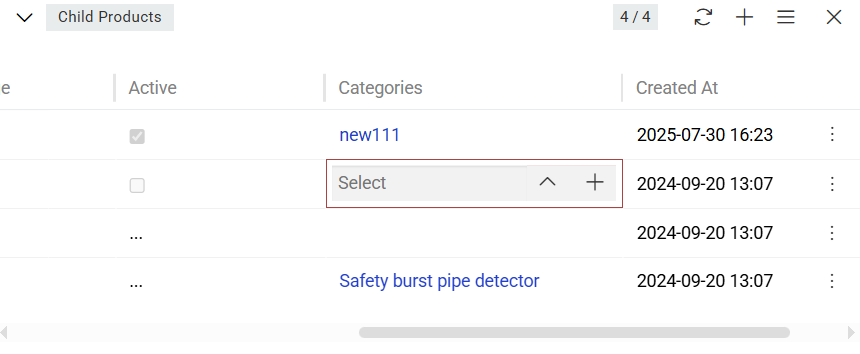{.medium}

## Detail View

> [Deleted](../08.record-management/docs.md#deleting-records) records are not accessible through the standard record view and their detailed information remains unavailable until the record is [restored](../08.record-management/docs.md#restoring-records).

The detail view page appears when the  entity record name is clicked in the corresponding list of records or from the `Full Form` button in [Small List View](#small-list-view). It has its own layout, which can be configured by the administrator.

The detail view page shows detailed information about the selected entity record and all its relations and includes:

- *[Left sidebar](#left-sidebar) (1);*
- *[taskbar](../05.toolbar/) (2);*
- *[breadcrumb navigation](#breadcrumb-navigation) including the page name (3);*
- *actions and tabs panel (4);*
- *record details, where detailed information about the currently open entity record is displayed (5).*

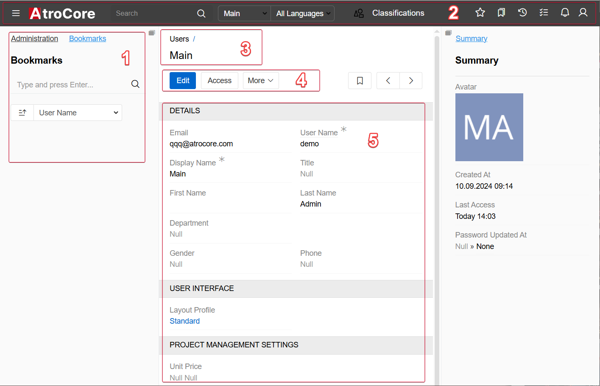{.large}

The detail view page may also include:

- the `OVERVIEW` panel and some other panels that are either default for a certain entity or configured by the administrator:

  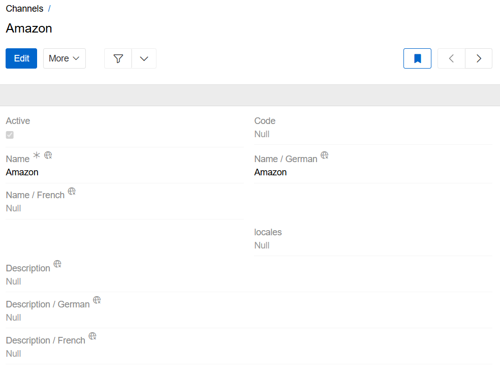{.medium}

- several [small list views](#small-list-view) for the related records, if these were configured by the administrator:

  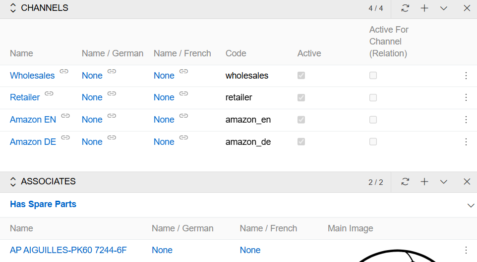{.medium}

- [side view](#side-view) with additional information concerning record management and activity stream, if activated for the entity.

  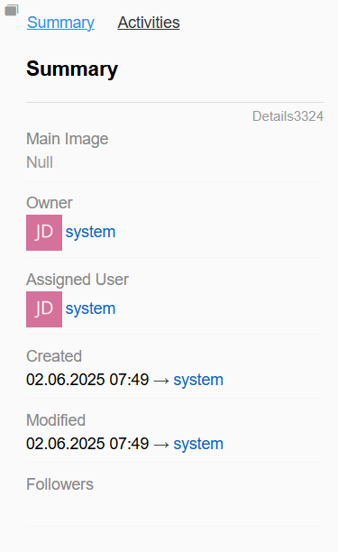{.medium}

Navigation through the existing entity records can be done on the detail view pages using the corresponding buttons:

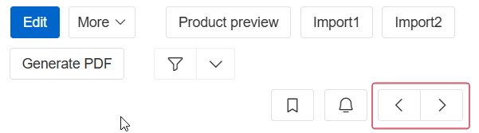{.small}

To edit the fields data on the detail view page, use [in-line editing](../08.record-management/docs.md#in-line-editing).

### Main Actions

The following actions are available for all entity records by default on the detail view page:

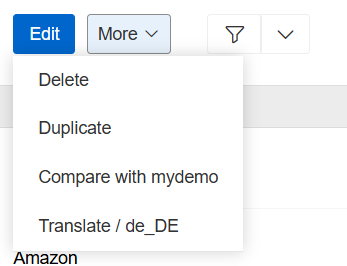{.small}

- **Edit** – click the `Edit` button to make changes in the given record.
- **Delete** – select the `Delete` option from the actions menu to remove the given record.
- **Duplicate** – select the `Duplicate` option from the actions menu to go to the record creation page and enter the unique values for the record fields to be used for duplication.

Some actions, such as **Translate** and  **Compare** are added by modules. In this case by [Translations](https://store.atrocore.com/en/translations/20191) module.

### Create View

The Create View page is used to create entity records and has the same layout as the Detail View page, with minor system-configured exceptions. To access the Create Entity page, click the Create button on the entity records [List View](#list-view) page and enter the record details.

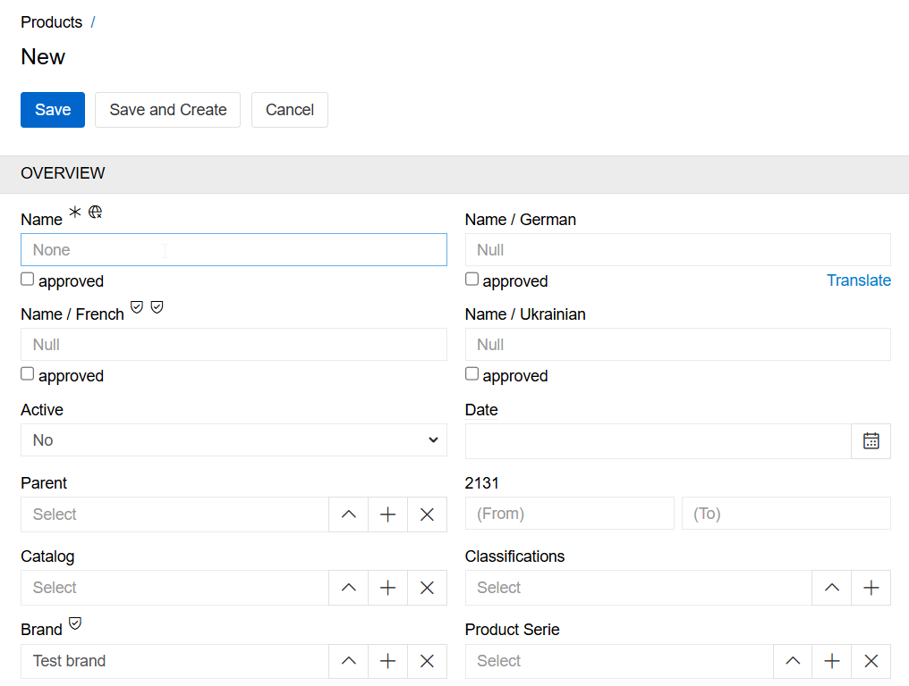{.large}

Click the `Save` button to complete the record creation, `Save and Create` to complete the record creation and start a new one or `Cancel` to abort the operation.

In all other cases, i.e. when the `+` button is used, you will be taken to the [quick create view](#quick-create-view) page that will be opened in a pop-up window.

### Edit View

The edit view page is shown in the main window and uses the layout of the [detail view](#detail-view) page. To access it, click the `Edit` button on the detail view page:

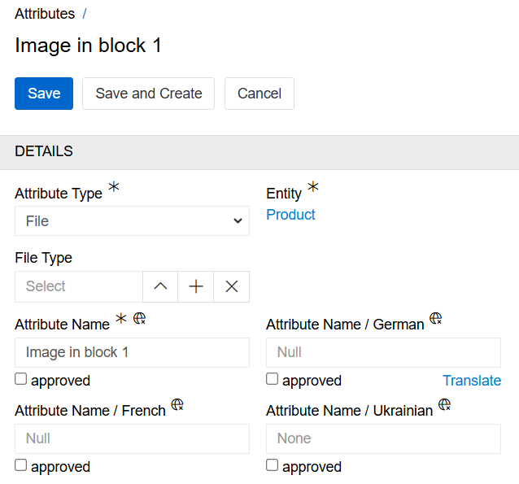{.medium}

> For detailed information about editing processes and workflows, see the [Editing Records](../08.record-management/docs.md#editing-records) section in Record Management.

## Quick Detail View (Small Detail View)

The quick detail view is shown in a pop-up window:

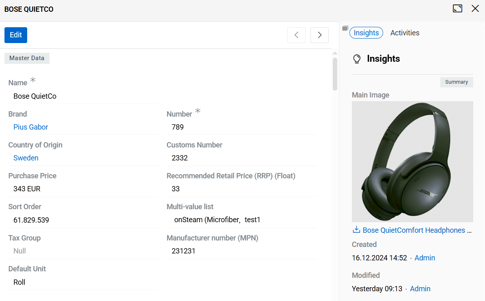{.medium}

It is typically used to display the details of a record for a related entity, or when the 'View' option is selected from the 'Single record actions' menu on the 'List view' page. It uses the same layout as the [detail view](#detail-view) page, but with some restrictions.

In the quick detail pop-up, click the `Full Form` button to open the common [detail view](#detail-view) page.

{.small}

### Quick Create View

The quick create view is shown in a pop-up window and uses the layout of the [quick detail view](#quick-detail-view-small-detail-view) page. It is usually applicable for creating records for the related entities:

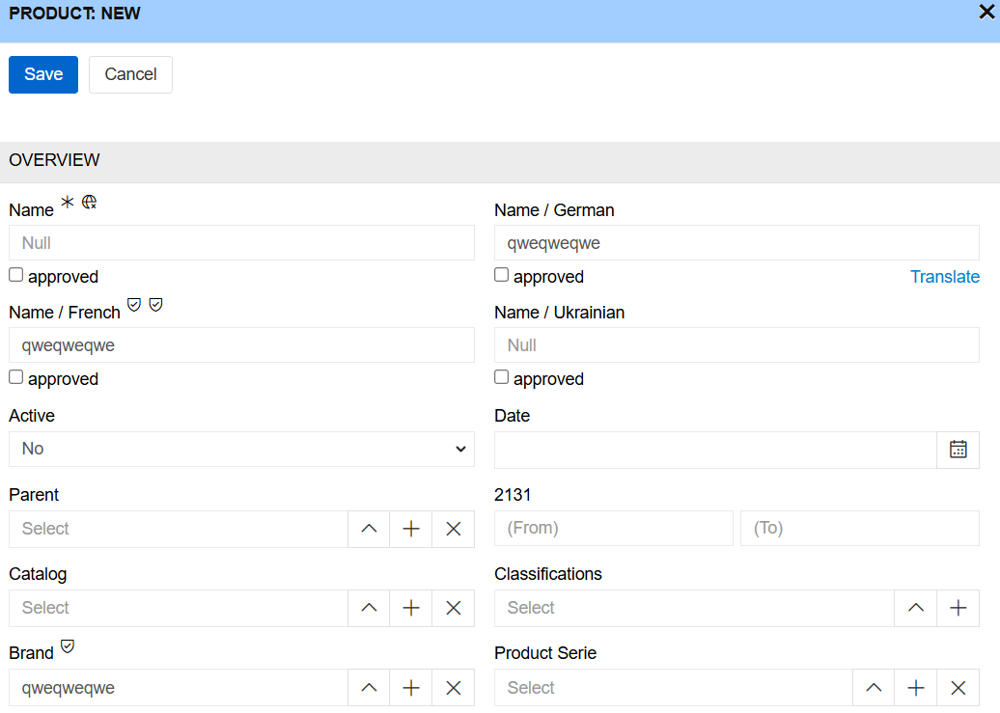{.large}

Click the `Full Form` button in the quick create pop-up to get to the [create view](#create-view) page.

### Quick Edit View

The quick edit view is shown in a pop-up window and uses the same layout as the [detail view](#detail-view) page. It is primarily used for editing related records from another record's detail view.

For example, when viewing a Classification's detail view, you can edit its related Products by clicking the three-dot menu in the Products panel and selecting 'Edit'.

> For detailed information about quick edit workflows, see the [Editing Records](../08.record-management/docs.md#editing-records) section in Record Management.

## Side View

The side view panel shows additional information and is always displayed in the main window, alongside the [Detail](#detail-view) or [List View](#list-view) panels.

The panel contains a list of tabs that depends on the current view.

### Detail View tabs

#### Insights tab

The Insights tab contains panels with information about the record. By default, it includes the **Summary** panel and the **Access Management** panel (if available for the entity). Additional panels may be added by modules or features. If you need a different set or order of panels, ask your administrator to adjust it.

{.medium}

The **Summary** panel typically shows basic record information, such as:

- **Created** – when (and by whom) the record was created.
- **Modified** – when the record was last updated.
- **Followers** – users who follow changes to the record.

> If a record is created or modified by an [action](../03.administration/06.actions/docs.md) or [import](../../02.data-exchange/01.import-feeds/docs.md), the **Created** or **Modified** field displays System < User, indicating that the operation was executed by the system on behalf of the specified user. When changes are made manually in the UI, the field displays only the user link without the System mention.

The **Access Management** panel (if available) typically shows who is responsible for the record and who can access it, such as:

- **Owner** – the person responsible for the record.
- **Assigned User** – the user expected to work on the record.
- **Teams** – teams that can access the record.

The exact set of panels and fields depends on the entity and enabled features. An administrator can configure both the Insights layout (which panels are shown and in which order) and the Summary panel contents (which fields are displayed).

If [Matching](../../01.atrocore/18.master-data-management/17.matching/docs.md) is enabled for this entity, the `Matched records` panel is added to the Insights tab.

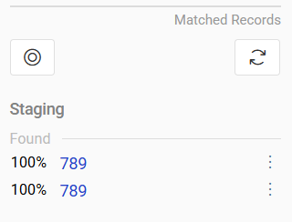{.medium}

#### Activities tab

The Activities tab is enabled or disabled by the administrator for each entity. This tab allows you to track changes to the record and/or leave and read comments.

 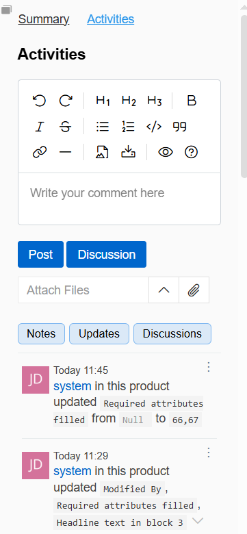{.medium}

Some functions, such as **Discussions** are added by modules. In this case by [Discussions](https://store.atrocore.com/en/discussions/20128) module.

### List View tabs

#### Filter tab

The Filter tab is used to filter the records. For more information, please refer to [Search and filtering](../11.search-and-filtering/).

 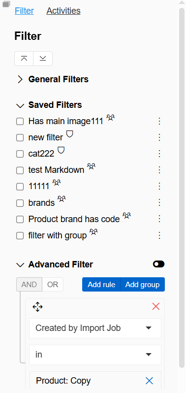{.medium}

#### Activities tab

The Activities tab allows you to track changes to the entity and leave and read comments.

 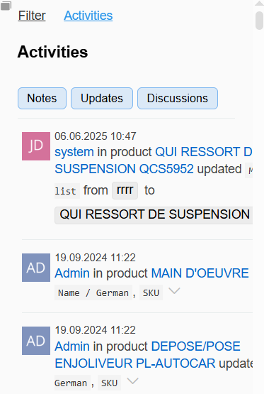{.medium}

Other modules can add more panels to the side view panel. Please, visit our [store](https://store.atrocore.com/en/) to learn more about modules available for you.

## Left sidebar

Left sidebar is used for filtering records. For more information please go to [search and filtering](../11.search-and-filtering/).

 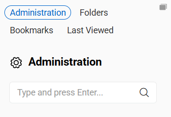{.medium}

#### Last viewed tab

The Last viewed tab displays a list of records from the currently opened entity that were most recently accessed by the user.

This tab provides quick access to records that the user has recently opened, allowing them to easily return to previously viewed items without performing an additional search or navigating through lists.

The list is automatically updated by the system and reflects the most recent viewing activity of the current user within the selected entity. Each record in the list can be opened directly by clicking its name or id.

 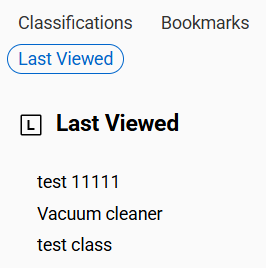{.medium}

## Breadcrumb Navigation

AtroCore comes with breadcrumb navigation on each page in the system. Breadcrumb navigation is a form of a path-style clickable navigation, which links the user back to the prior website page in the overall online route. It reveals the path the user took to arrive to the given page. The `>` symbol separates out the hierarchical search order from beginning to end and may look something like:
`Home Page > Section Page > Subsection Page`.
