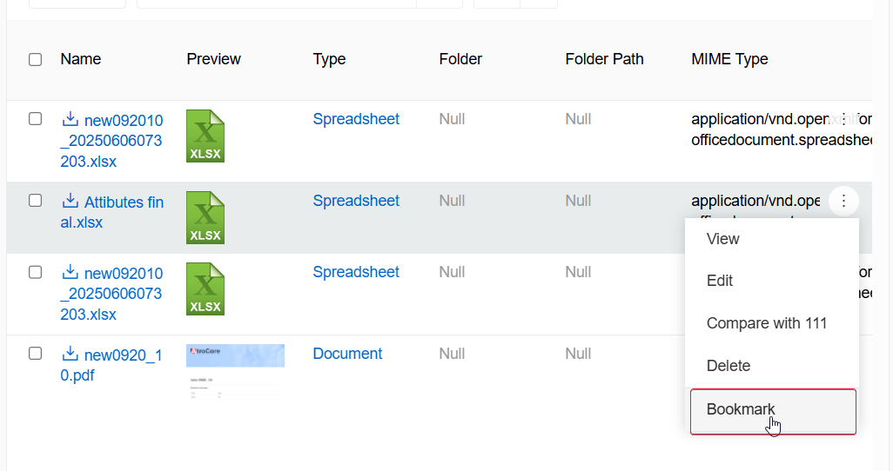
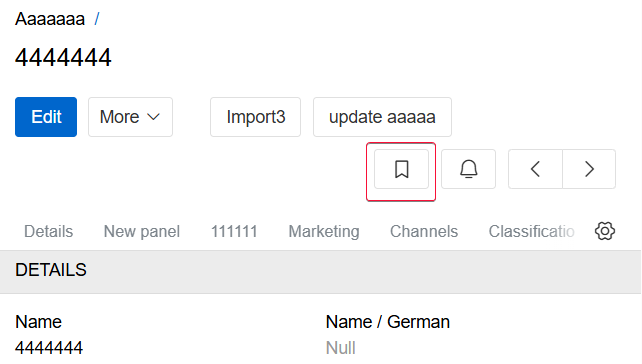
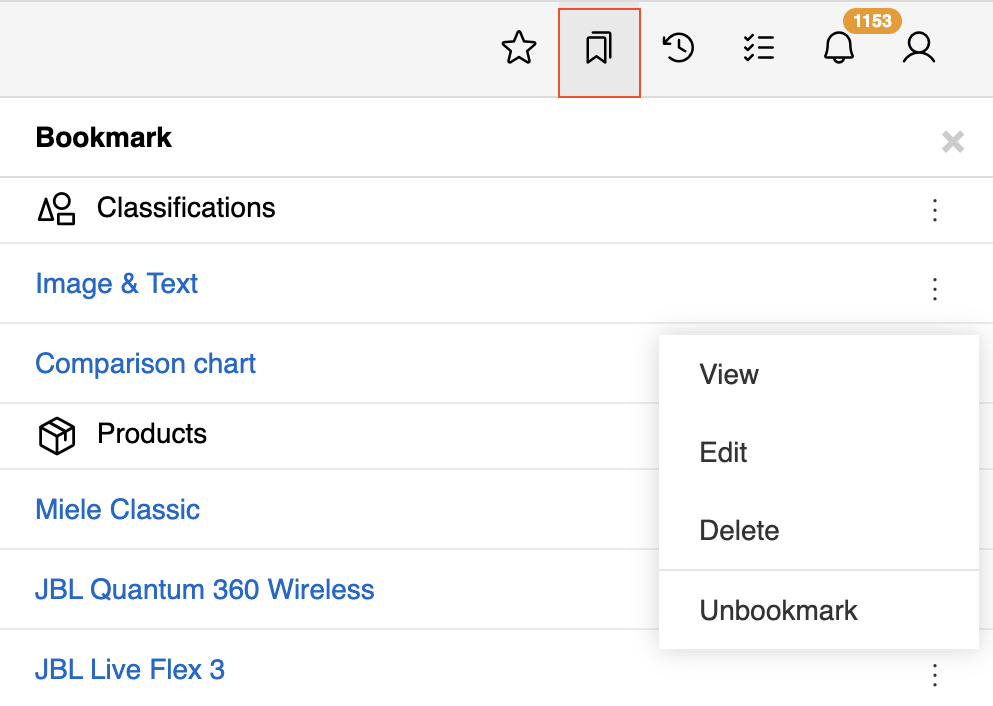
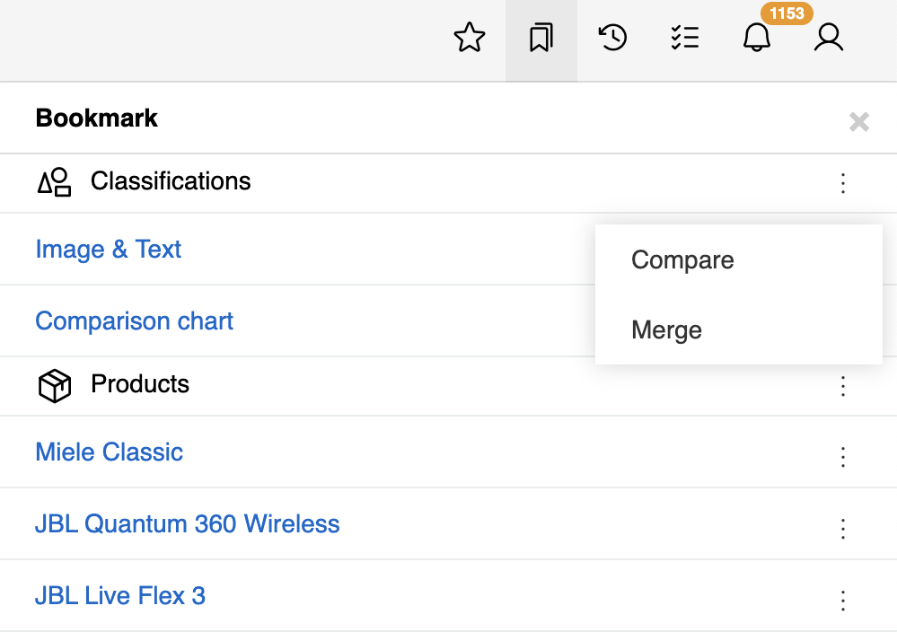
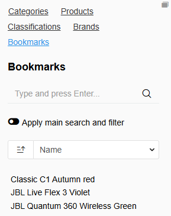

Bookmarks allow you to save favorite records for quick access from the toolbar.

## Adding Bookmarks

Add records to bookmarks from the [list view](../../04.understanding-ui/index.md#list-view) using the corresponding single record action:

{.medium}

Or from the record [detail view](../../04.understanding-ui/index.md#detail-view):

{.medium}

## Accessing Bookmarks

Bookmarks can be accessed in two ways:

### Bookmarks Panel (Toolbar)
Access from the Bookmarks panel in the [toolbar](../../05.toolbar/):

{.medium}

The panel shows all bookmarked records grouped by entity type with:
- [Single record actions](../../04.understanding-ui/index.md#single-record-actions) - accessible by a three-dot menu on a record level
- [Compare and Merge actions](../../09.comparison-and-merge/) - accessible a three-dot menu on an entity level

{.medium}

### Entity List View Sidebar
Access from the [left sidebar](../../04.understanding-ui/index.md#left-sidebar) of any entity's list view:

{.medium}

User can filter bookmarked records by [any other filter](../../11.search-and-filtering/index.md#left-sidebar-search) and sort them by any record field.

## Managing Bookmarks

Remove bookmarks using the same bookmark icon that was used to add them on the record detail view or corresponding single record action - `Unbookmark`.

> Bookmarks are saved per user and persist across sessions.