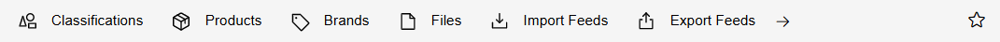
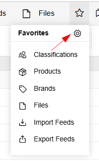
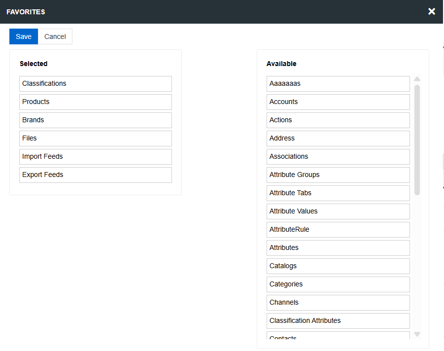
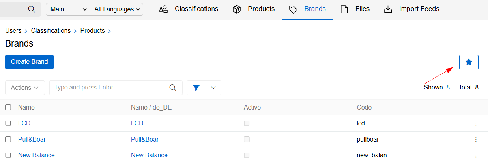
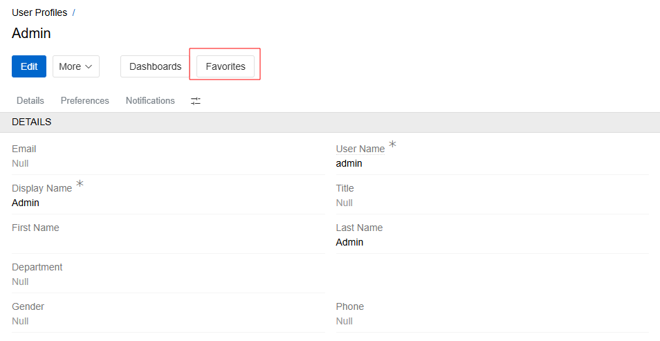
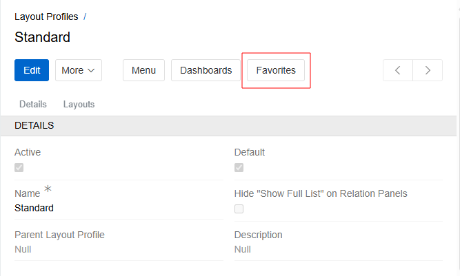

{.large}

The Favorite Entities Navigation Bar can be used to quickly access the most frequently used entities. By default, it displays Classifications, Products, Files, Import and Export Feeds. You can customize the menu content by adding or removing entities as needed.

To add an Entity to the menu, click on the star on the right side of the panel. List of Favorite Entities will open. If there are too many Entities to display in the Taskbar Menu, you can also use this drop-down list to quickly access the desired entity. Click on the configuration gear to open Favorites Layout.

{.large}

The modal window for configuring Favorites opens. Drag the entities you want to appear in the Navigation Bar to the left column and click `Save`. The changes will be applied immediately.

{.large}

You can also add an Entity to Favorites by clicking on the star icon in the List View of any Entity. Clicking on the icon again will remove the Entity from the Favorites Menu.

{.large}

You can also manage Favorites from the User Profile page. To do this, click the Menu icon on the Taskbar and select your user. On the Profile page, you will see the `Favorites` button, which will open a menu for configuring Favorite Entities.

{.large}

<!-- TODO: divide into user and administrator parts, extract administrator part to administration section -->

The configuration of Favorites can also be set in the Layout Profile settings. If the user has not configured the custom Favorites Menu in his Profile, it is inherited from the Layout Profile.

> Users cannot configure empty favorites as this equals no configuration and will be replaced with Layout Profile settings. Only admins can set empty favorites in Layout Profiles.

To configure the Favorites for a Layout Profile, go to `Administration / Layout Profiles` and open the Detail page of the required Profile. Click the `Favorites` button in the button menu.

{.large}
