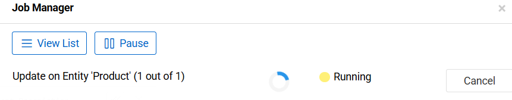
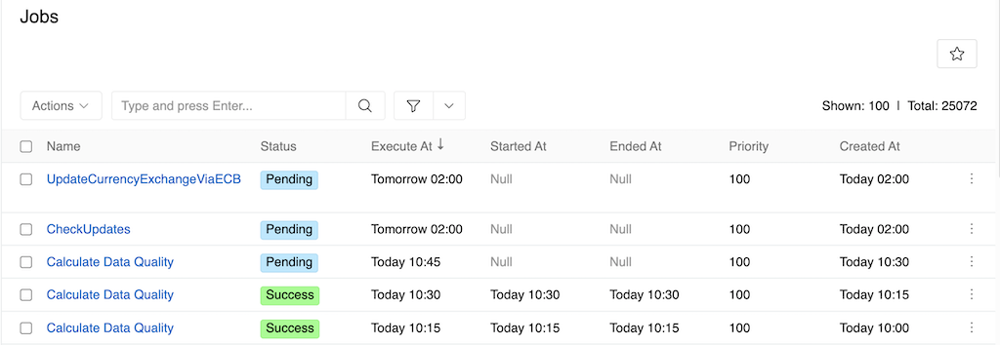

The Job Manager is AtroCore's subsystem for handling background task execution. Users interact with it through a pop-up interface that provides real-time monitoring and control over currently running operations.

{.large}

The Job Manager pop-up displays all operations executing in background mode, including:
- Import and export jobs
- Completeness calculations
- Mass update or mass delete operations
- Other long-running tasks

## Controls

- **Cancel**: Cancel the currently running operation directly from the interface
- **Pause**: Pause the Job Manager subsystem - pending jobs will not start executing until resumed, while running jobs will continue
- **View List**: Access the complete jobs list to view all system jobs regardless of their status

{.large}

For comprehensive information about job management, statuses, and operations, see the [System Jobs](../../03.administration/05.system-jobs/) article.
