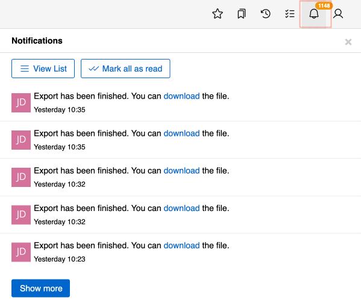
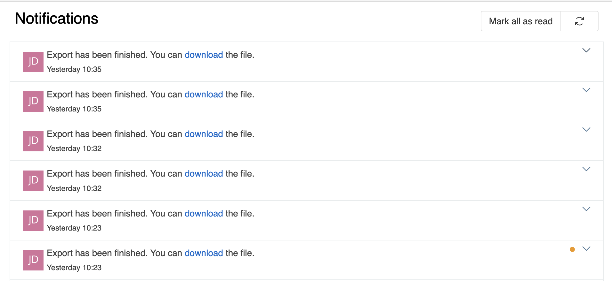
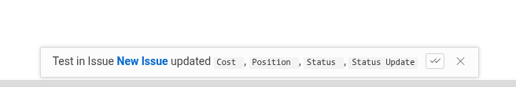
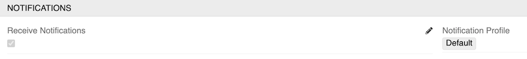

The Notifications feature provides real-time alerts for important system events through the toolbar bell icon.

## Accessing Notifications

Click the bell icon in the [toolbar](../../05.toolbar/) to view recent notifications:

{.medium}

## Notifications List

Click **View List** to access the complete notifications history:

{.medium}

## Managing Notifications

In the notifications list, you can:
- Mark individual notifications as read by scrolling to view them
- Use the **Mark all as read** button to clear all unread notifications at once
- Delete individual notifications using the arrow button menu in each notification record

## Notification Previews

When a new notification arrives, a preview appears at the bottom of the screen. You can mark it as read directly from the preview — no need to open the notifications panel.

{.small}

The preview notification disappears automatically after a few seconds. However, if the notification contains an error message, it will remain visible until it is manually closed.

## Notification Types

Notifications appear for various events including:
- Mentions in streams
- Changes to followed records
- Records addressed to you
- System updates and alerts

## User Settings

Each user can configure their personal notification preferences in their [User Profile](../../16.user-profile/). In the **Notifications** panel, you can:

- Enable or disable receiving notifications by selecting the **Receive Notifications** checkbox
- Choose which notification profile to use (by default, the system-wide default profile is used)

{.medium}

## Configuration

For detailed notification settings and management, see [Administration - Notifications](../../03.administration/10.notifications/).
