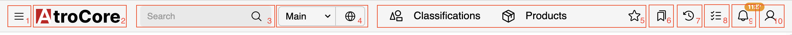
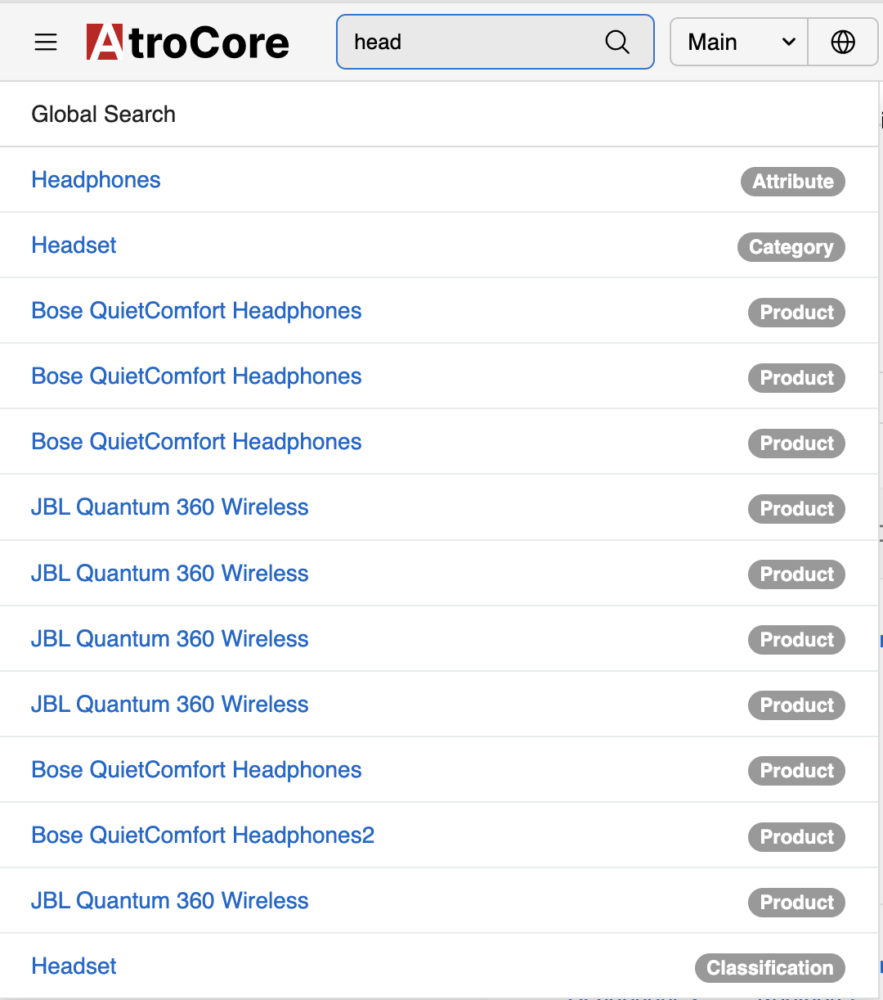
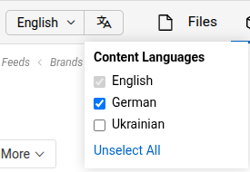
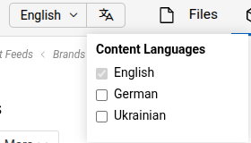
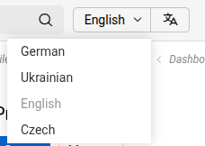
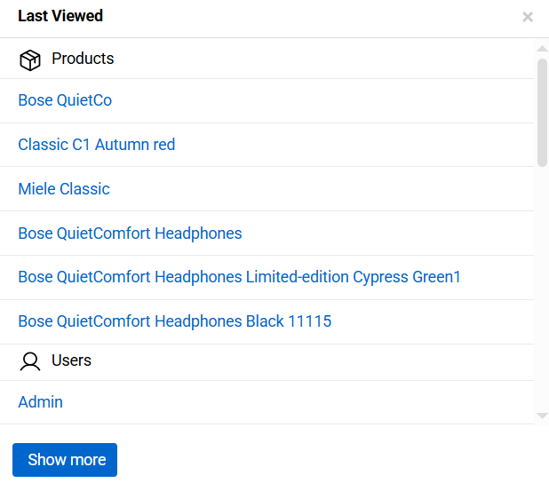
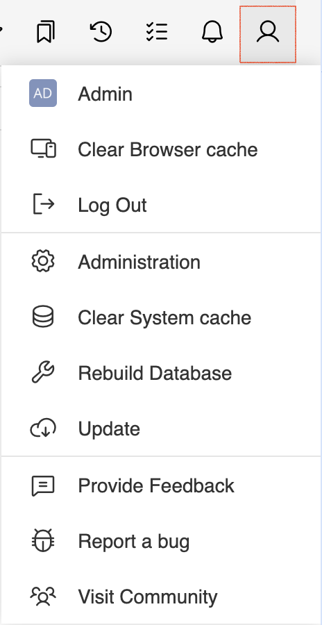

The Toolbar is a top panel of the AtroCore user interface that provides quick access to essential navigation and functionality:

{.large}

## Navigation Menu Button

The hamburger menu icon (☰) on the far left opens the main navigation menu, providing access to a set of selected entities. The entities displayed in this menu can be configured by the administrator - see [Navigation Menu](../03.administration/13.user-interface/01.navigation/).

## Header Logo

The logo serves as a home button, allowing users to quickly return to the main [dashboard](../07.dashboards/). The logo can be customized per instance - see [User Interface](../03.administration/13.user-interface/).

## Global Search

You can [search](../11.search-and-filtering/) all the records existing in the AtroCore system using the global search functionality. Use the search form on the toolbar for it:

{.medium}

> The list of entities available for search is configured by the administrator in the `Administration > System > Settings > Global Search Entity List` (see [System settings](../03.administration/01.system-settings/))

> Please consider, only the fields configured at "Text Filter Fields" for each entity will be searched through. See [Entity management](../03.administration/11.entity-management/index.md#configuration-fields).

Wildcards can be used for search, at any place in the search string, separately or in any combination.

| **Character**    | **Use**                                           |
| :--------------- | :------------------------------------------------ |
| %                | Matches any number of characters, including zero  |
| _                | Matches only one character                        |

## Locale and Language Switcher

The toolbar provides two separate controls for internationalization:

**Language Selection**: The language icon shows your current language settings:
- **Globe icon**: All languages are enabled
- **Language indicator**: Only specific languages are active (e.g., English, but not German)

Click this icon to change which languages you want to use in the system.

{.small}

{.small}

**Locale Selection (Dropdown)**: The current locale name and its dropdown arrow form a clickable button that allows users to switch between different locales. Switching locale will save it as preferred in the [User Profile](../16.user-profile/).

You can switch between locales using the Locale menu in the Toolbar:

{.small}

## Favorites

The star outline icon provides access to the most frequently used entities, allowing users to quickly navigate to commonly accessed entity types. See [Favorites](../05.toolbar/02.favorites/) for details.

## Bookmarks

The bookmark icon provides quick access to bookmarked records, helping users organize and access important information efficiently. See [Bookmarks](../05.toolbar/01.bookmarks/) for details.

## Last Viewed

The Last Viewed section provides quick access to records that were recently opened by the user. It is represented by a clock icon in the user interface.

Records in the Last Viewed list are automatically collected by the system based on the user's navigation activity. Each time a record is opened, it is added to the list and ordered according to the time of access, with the most recently viewed records displayed first.

Items in the Last Viewed section are grouped by entity, similarly to how records are organized in the Bookmarks section. This grouping allows users to quickly locate recently viewed records within a specific entity.

Users can open any record directly from the list by clicking its name or id.

{.medium}

## Job Manager

The checklist icon provides access to the Job Manager, where users can monitor and manage background tasks, scheduled jobs, and system processes. See [Job Manager](../05.toolbar/03.job-manager/) for details.

## Notifications

The bell icon displays system notifications and alerts. The orange badge shows the number of unread notifications, keeping users informed of important updates and events. See [Notifications](../05.toolbar/04.notifications/) for details.

## User Menu

The user profile icon on the far right opens the user menu, providing access to various system functions and user options:

{.small}

The menu includes the following options:

- **User name**: Your username (e.g., "Admin") display (clickable, leads to your [User Profile](../16.user-profile/))
- **Clear Browser cache**: Clear local browser cache. Use this when you experience display issues or outdated content in your browser.
- **Log Out**: End your current session
- **Administration**: Access to [administrative functions](../03.administration/) (admin users only)
- **Clear System cache**: Clear metadata cache and other system cache. Use this option if you have errors while working with the system (admin users only)
- **Rebuild Database**: [Updates the database structure](../../09.installation-and-maintenance/05.maintenance/index.md#database-rebuild) to match the current metadata configuration (admin users only).
- **Update**: [System update](../../09.installation-and-maintenance/04.modules-and-updates/index.md#module-update) functionality (admin users only)
- **Provide Feedback**: Submit feedback about the system
- **Report a bug**: Report system issues
- **Visit Community**: Access community resources
- **Read Docs**: Open the built-in documentation portal in a new tab
