`Activities` is a separate AtroCore tool, that is used to display changes of the entity records made by [user](#user-activity) and system activity.

Activities display can be enabled or disabled for each entity separately. To enable the Activities for any entity, go to Administration > Entities. Select the entity for which you want to enable Activities, then uncheck the 'Disable Activities' box if you want the Activities panel to be displayed on the Record Details page, and/or uncheck the 'Disable action logging' box if you want user actions on the records of this entity to be logged.

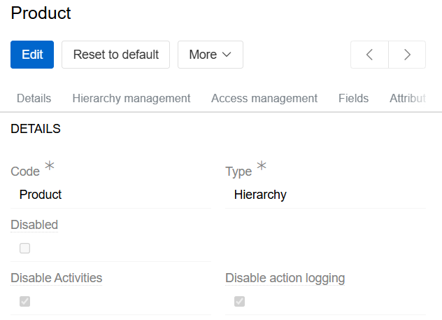{.medium}

AtroCore supports the following **types** of activities entries:

- **Notes** – messages assigned to the current user by other system users, as well as his own messages posted in the Activities, irregardless of the assignee.
- **Updates** – notifications about changes in the fields (attributes) of the user-related entries.
- **Discussions** – threads where all users can participate.

## User Activity

By default, all user- and system-related activity records are displayed in chronological order. If a post is edited, the date of the edit is added and the post moves up:

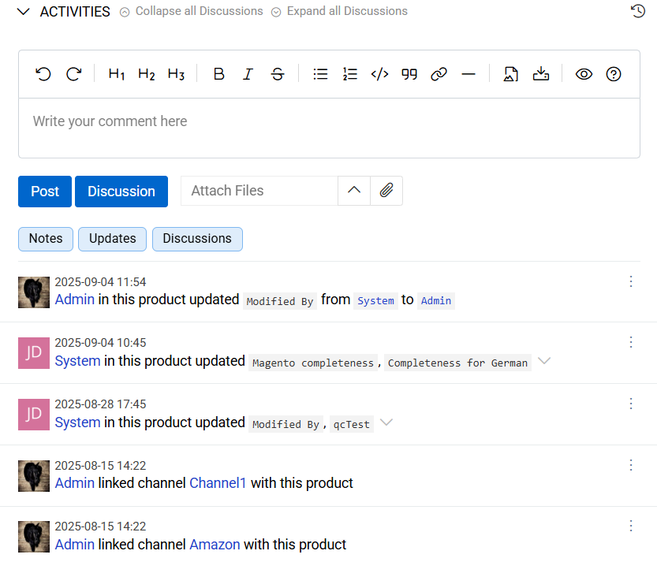{.large}

When other users make changes in your user-related entity records or address activities posts to you, you will be informed about it via the `Notifications` pop-up. If more than one value or type of a text, string, HTML field or attribute is changed, all changes are displayed in one post:

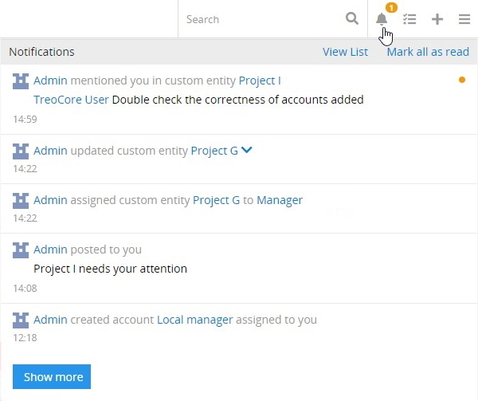{.large}

### Creating a Post

To add a new post on the activities page, place the cursor in the text box and enter the desired message:

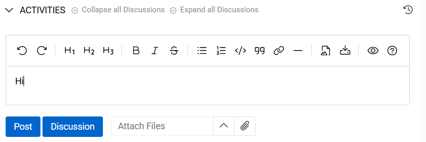{.medium}

You can also attach a file (or multiple files) to your post by clicking the attachment button and selecting the desired files. Click the `Post` button – your message will appear on top of the activities list with all its details:

{.large}

### Managing Posts

By default, posts and updates from the user activity can only be removed via the corresponding option from the pop-up menu:

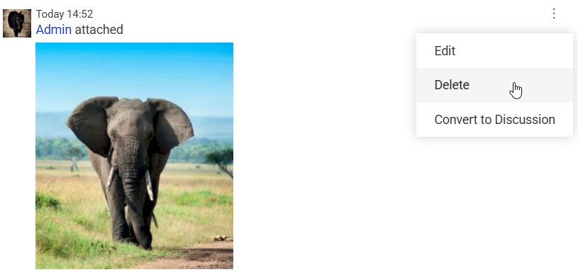{.medium}

To complete the operation, you will need to confirm your decision in the pop-up that appears:

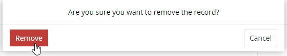{.small}

User added posts can not only be removed, but also edited. For this, click the `Edit` option in the single record actions menu and make the desired changes in the editing pop-up that appears:

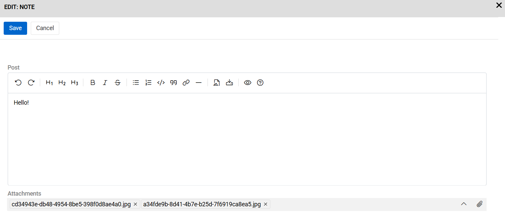{.large}

## System Activities Records

System records are displayed on the `Activities` panel on the [detail view](../04.understanding-ui/index.md#detail-view) page of the corresponding entity record:

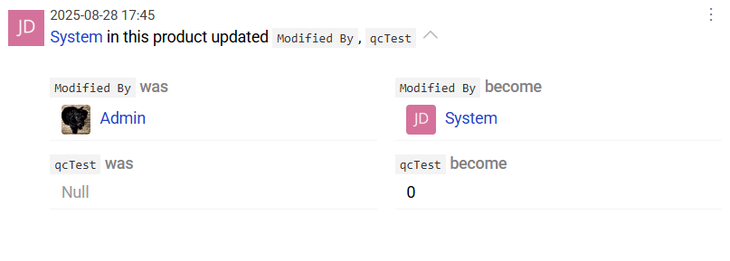{.medium}

> Tracking of fields (attributes) is enabled in almost all entities by default. To disable it, select option `Disable Activities` in the entity manager.

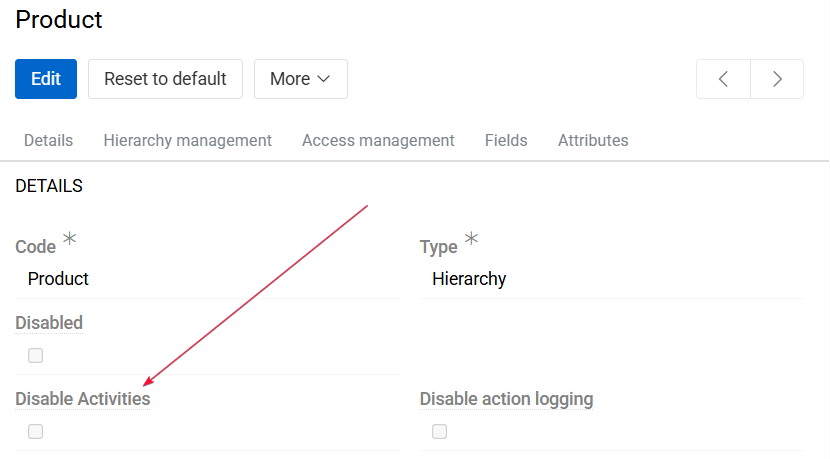{.large}

The Activities displays changes in all fields (attributes) of the entity. It contains information about who made the changes, the previous and new values of the field (attribute). If a change occurs in a field of the relationship type, it is displayed in the Activities of both entities. For example, if you add a new Category to a Product, information about this will appear in the Activities in the Product entity and in the Category entity.

Use the filter buttons to filter the activities records by their type correspondingly:

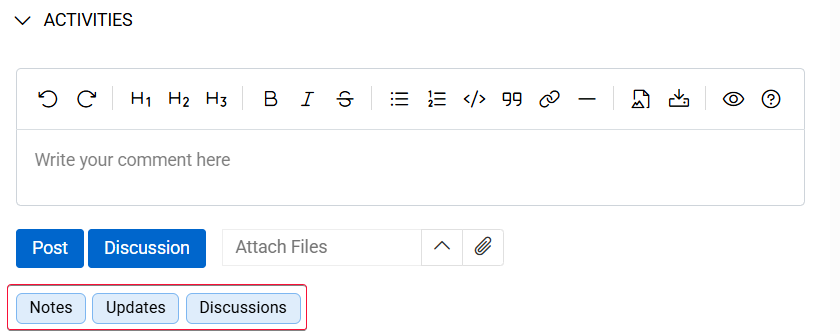{.large}

Access to the Activities is provided for each role at the entity level. To allow the user to view changes, select `Administration/Roles`, than select the role you need, click on `Edit` button and select the entity for which you want to configure permissions. To be able to edit permissions for the particular entity, access must be enabled for it.

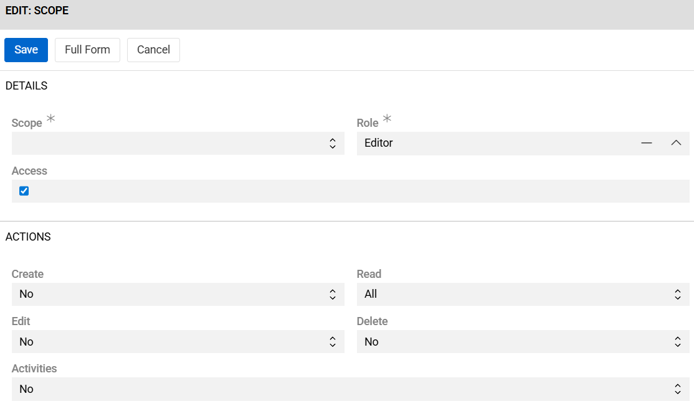{.large}

Only administrators can remove change history records from the Activities panel by selecting the desired entry and choosing the `Delete` option from its single record actions menu.

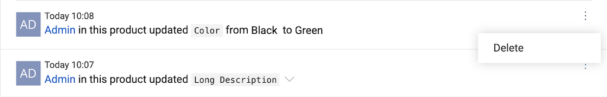{.large}

!! Beware that this action is irreversible.

! The Activities functionality can be further extended with the help of the [Revisions](https://store.atrocore.com/en/versioning/20179) module, which allows you to view the field changes history in the pop-up and restore previous values from the change history.
