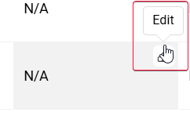
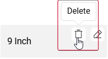
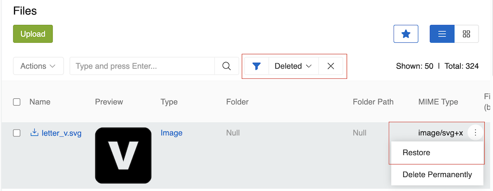

Record management in AtroCore encompasses all operations you can perform on entity records, regardless of the specific entity type. This guide covers the fundamental operations that apply to any record in the system, from basic CRUD operations to advanced relationship management.

For detailed information about the user interface elements, views, and navigation, see the [Understanding UI](../04.understanding-ui/docs.md) documentation.

## Listing Records

The list view is the primary interface for viewing and managing entity records. When you select any entity from the [navigation menu](../03.administration/13.user-interface/01.navigation/), you'll see a table displaying all records for that entity.

### Opening Records

To open a record and view its details, click on the Name field of the record. This will take you to the [detail view](../04.understanding-ui/docs.md#detail-view) where you can see all information about the record, its relationships, and related data.

Alternatively, you can use the three dots button (⋮) and select "View" [action](#single-record-actions) to open a record — for example, if the entity does not have a Name field.

### Record Presentation

Records are displayed throughout the system — in list views, tree navigation, dropdowns, link fields, and other interface elements — using a priority-based identifier:

1. **Configured identifier** — if a specific field is designated as the record identifier for an entity, it takes priority and is used everywhere.
2. **Name** — if no identifier is preset, the system falls back to the [Name](../03.administration/11.entity-management/03.fields-and-attributes/docs.md#configuration-options) field.
3. **ID** — if neither a preset identifier nor a Name field exists, the record's [ID](../03.administration/11.entity-management/02.data-types/docs.md#identifiers) is displayed as a last resort.

Common examples of preset identifiers include:

- **Code** — used in entities where a unique code is the primary identifier.
- **Number** — used in entities such as [Cluster](../18.master-data-management/19.clusters/docs.md), where an auto-increment Number field serves as the record identifier.

> For multilingual behavior of the Name field and other identifier fields, see the [Locales](../03.administration/02.locales/docs.md#data-translation-system).

### List View Features

The list view provides several key features for record management:

-   **Sortable columns** - Click any column header to sort records ascending or descending
-   **Search and filtering** - Use the search panel to find specific records
-   **Record selection** - Use checkboxes to select individual records or all records
-   **Mass actions** - Perform operations on multiple selected records
-   **Single record actions** - Actions available for individual records

For detailed information about list view interface and navigation, see the [List View](../04.understanding-ui/docs.md#list-view) section. For record selection methods, see the [Mass Actions](../12.mass-actions/docs.md) documentation.

## Creating Records

Creating new records is straightforward across all entities. There are several ways to create records depending on your current context:

### From the List View

1. Navigate to the entity's list view
2. Click the `Create` button
3. Fill in the required fields in the creation form
4. Click `Save` to create the record or `Save and Create` to create and start a new one

### From the Navigation Menu

Each entity type has a `Quick create` button in the [navigation menu](../03.administration/13.user-interface/01.navigation/) that opens the creation form in a pop-up window.

For detailed information about create views, see the [Create View](../04.understanding-ui/docs.md#create-view) section.

### From Related Records

When working with records that have link fields to other entities, you can create new records directly from those fields when they are in edit mode:

1. Open a record in edit mode (or use [in-line editing](#in-line-editing) on a target field)
2. Navigate to a link field (e.g., Classification field in a Product)
3. Click the `+` button next to the field
4. Fill in the required fields in the pop-up
5. Click `Save` to create the record

This method automatically links the newly created record to the current record. Note that you'll need to save the current record separately to persist the link.

You can also create records from Multiple Link fields using the related entity panel's `+` button, which works the same way.

For detailed information about create views, see the [Create View](../04.understanding-ui/docs.md#create-view) section.

### Required Fields

Fields marked with an asterisk (\*) are required and must be filled in before the record can be saved. By default, only the Name field is required, but administrators can configure additional required fields for each entity.

For information about configuring required fields, see the [Fields and Attributes](../03.administration/11.entity-management/03.fields-and-attributes/) documentation.

## Editing Records

Editing records allows you to modify existing data and update record properties. There are several ways to edit records in AtroCore.

### Full Edit Mode

The primary way to edit records is through the full edit mode:

1. Open the record's detail view by clicking on the record name in the list view
2. Click the `Edit` button or Press Ctrl+E to enter edit mode
3. Make your changes to the fields
4. Click `Save` button or press Ctrl+S to apply changes or `Cancel` button or press ESC to discard them

### Quick Edit Mode

You can also edit related records from another record's detail view:

1. Open a record's detail view (e.g., a Classification)
2. Navigate to a related entity panel (e.g., Products panel)
3. Click the three-dot menu next to a related record
4. Select `Edit` from the single record actions menu
5. The related record opens in edit mode in a pop-up window
6. Make your changes to the fields
7. Click `Save` to apply changes or `Cancel` to discard

This is the most common scenario for quick edit mode. You can also edit records directly from the list view using the same pop-up approach.

Both full edit mode and quick edit mode use the same layout - the only difference is that quick edit opens in a pop-up window.

For detailed information about edit view layout and navigation, see the [Edit View](../04.understanding-ui/docs.md#edit-view) section.

### In-Line Editing

For quick field updates without entering full edit mode, you can use in-line editing:

1. Open the record’s full detail or list view.
2. Either:
    - Click on an editable field, or
    - Hover over it and click the pencil icon.
3. Make your changes directly in the field.
4. To save: click Update (for detail view), press Ctrl+S, or click outside the field.
5. To discard: click Cancel or press Esc.

When you click on a field, it enters edit mode, the browser focuses on the field, and the cursor is placed at the end.

In-line editing allows you to modify individual fields without putting the entire record in edit mode.

Inline editing is also available in the record [comparison functionality](../09.comparison-and-merge/docs.md#compare-records). You can edit field and attribute values directly in the comparison table.

If an attribute is added to the layout, users can edit, add, or delete its value directly from the record view.

- If an attribute is not added to the record, the system displays **N/A**.
- If an attribute is added to the record but its value is empty, an empty value is displayed.
- Clicking the **Edit** (pencil) button allows the user to modify the attribute value. If the attribute was not previously added to the record, saving a value will automatically create (add) the attribute for that record.
- Clicking the **Delete** (box) button removes the attribute value from the record. After deletion, the attribute is no longer associated with the record and will again appear as **N/A**.

{.small}

{.small}

This behavior allows users to manage attribute presence and values directly from the layout without navigating to a separate edit form.

### Editing Restrictions

Some fields cannot be edited due to system constraints:

-   **Read-only fields** - Fields that are system-generated or protected
-   **Permission restrictions** - Fields you don't have permission to modify

The system will display appropriate error messages when editing is not allowed.

## Deleting Records

Record deletion in AtroCore follows a two-stage process to prevent accidental data loss.

### Soft Delete

When you delete a record, it's first moved to a "deleted" state:

1. Select the record(s) you want to delete
2. Choose `Delete` from the actions menu
3. Confirm the deletion in the popup dialog
4. The record is marked as deleted but remains in the database

Deleted records are hidden from normal views but can be restored if needed. The relationships with the deleted record are also preserved but hidden from normal views.

For information about where to find delete actions in the interface, see the [Single Record Actions](../04.understanding-ui/docs.md#single-record-actions) and [Mass Actions](../12.mass-actions/docs.md) sections.

> While in a soft-deleted state, these records are not accessible through the standard [record view](../04.understanding-ui/docs.md#detail-view) and their detailed information remains unavailable until the record is restored.

### Permanent Delete

To permanently remove records from the database:

1. Navigate to the entity's list view
2. Apply the "Deleted" filter to see deleted records (this is required - deleted records are hidden by default)
3. Select the deleted record(s)
4. Choose `Delete Permanently` from the actions menu (either [Single Record Actions](../04.understanding-ui/docs.md#single-record-actions) or [Mass Actions](../12.mass-actions/docs.md))
5. Confirm the permanent deletion

!!! Permanently deleted records cannot be restored. All related relationships are also permanently removed from the database.

### Automatic Deletion Settings

System administrators can configure automatic deletion settings for each entity type:

-   **Permanent deletion period** - Controls how many days after soft deletion a record is automatically permanently deleted
-   **Auto-delete period** - Controls how many days after creation a record is automatically deleted from the system. Is used only in [Archive](../../01.atrocore/03.administration/11.entity-management/01.entity-types/docs.md#archive) type entities.

These settings help manage database storage and ensure old records are cleaned up automatically. The specific settings for each entity can be configured by administrators.

For information about configuring deletion settings for specific entities, see [Entity Management](../03.administration/11.entity-management/docs.md) in the Administration section.

### Deletion Restrictions

Some records cannot be deleted due to system constraints:

-   **Records with active relationships** - Records linked to other entities may be protected
-   **System or default records** - Core system entities and records marked as default values cannot be deleted (e.g., system locale, default measure units)
-   **Admin-configured restrictions** - Administrators can configure additional deletion restrictions for specific entities or record types

The system will display appropriate error messages when deletion is not allowed.

## Restoring Records

AtroCore allows you to restore soft-deleted records back to their active state. This feature provides a safety net for recovering accidentally deleted records before they are permanently removed from the system.

To restore a deleted record:

1. Navigate to the entity's list view
2. Apply the "Deleted" filter to see deleted records (this is required - deleted records are hidden by default)
3. Select the deleted record(s)
4. Choose `Restore` from the actions menu (either [Single Record Actions](../04.understanding-ui/docs.md#single-record-actions) or [Mass Actions](../12.mass-actions/docs.md))
5. Confirm the restoration in the popup dialog

{.large}

The record will be restored to its active state and will appear in normal views again. All relationships with the restored record will also be restored and visible.

## Single Record Actions

Records can be managed through various actions available across different views. These actions allow you to perform operations on individual records:

-   **View** - Opens the record's [detail view](../04.understanding-ui/docs.md#detail-view) where you can see all information about the record, its relationships, and related data. This is useful for reviewing record details without making changes. Available from [list view](../04.understanding-ui/docs.md#list-view).

-   **Edit** - Opens the record for editing, allowing you to modify field values, update relationships, and change record properties. This is the primary way to update existing records. For detailed information about editing processes, see the [Editing Records](#editing-records) section. Available from [list view](../04.understanding-ui/docs.md#list-view), [detail view](../04.understanding-ui/docs.md#detail-view).

-   **Delete** - Removes the record from the system. Records are first soft-deleted (marked as deleted but retained in the database) and can be permanently deleted later if needed. For detailed information about the deletion process, see the [Deleting Records](#deleting-records) section. Available from [list view](../04.understanding-ui/docs.md#list-view), [detail view](../04.understanding-ui/docs.md#detail-view).

-   **Duplicate** - Creates a copy of the record with all values copied from the original. This action is available from the detail view. You'll need to modify unique fields (like Name and Code) before saving the duplicate. For information about creating records, see the [Creating Records](#creating-records) section. Available from [detail view](../04.understanding-ui/docs.md#detail-view).

-   **Bookmark/Unbookmark** - Adds or removes the record from your [bookmarks](../05.toolbar/01.bookmarks/) for quick access. Bookmarked records appear in your bookmarks panel for easy navigation. Available from [list view](../04.understanding-ui/docs.md#list-view) and from [detail view](../04.understanding-ui/docs.md#detail-view) as a separate button.

-   **Additional Actions** - Some other actions are added by modules and may be available depending on your system configuration and user permissions (e.g., [Generate PDF](https://store.atrocore.com/en/pdf-generator/20167)). Options available from [list view](../04.understanding-ui/docs.md#list-view) and [detail view](../04.understanding-ui/docs.md#detail-view) may vary.

For information about how to access these actions in the interface, see the [Single Record Actions](../04.understanding-ui/docs.md#single-record-actions) section.

## Mass Actions

AtroCore provides powerful mass actions for managing multiple records simultaneously. These operations allow you to perform actions on multiple selected records at once, significantly improving efficiency when working with large datasets.

Available mass actions include mass update, mass delete, mass export, and mass relationship management. These are particularly useful for bulk data updates, data cleanup, and relationship management. The available actions can be extended through system configuration and additional modules.

For detailed information about mass actions, step-by-step procedures, and advanced features, see the [Mass Actions](../12.mass-actions/docs.md) documentation.

## Linking and Unlinking Related Records

AtroCore uses [relationships](../03.administration/11.entity-management/07.fields-and-relations/) to connect records across different entities. Managing these relationships is a key aspect of record management.

Since relationships are two-sided, you can manage them (add, remove) from either side of the relationship. For example, if you have a Product linked to a Classification, you can unlink them from either the Product's detail view or the Classification's detail view.

### Adding Relations

You can link records in two ways depending on the field type:

#### Link Fields

For single reference fields (Link type), simply fill in the field value:

1. Open the record's detail view
2. Navigate to the Link field
3. Use the field's selection interface to choose the related record

#### Multiple Link Fields

For multiple reference fields (Multiple Link type), use the related entity panel:

1. Open the record's detail view
2. Navigate to the related entity panel
3. Click the `+` button to create a new related record
4. Or click `Select` to link existing records

For detailed information about small list views and related entity panels, see the [Small List View](../04.understanding-ui/docs.md#small-list-view) section.

### Removing Relations

#### Link Fields

To unlink a single reference:

1. Open the record's detail view
2. Navigate to the Link field
3. Clear the field value or select a different record

#### Multiple Link Fields

To unlink related records:

1. Navigate to the related entity panel in the detail view
2. Select the record you want to unlink
3. Choose `Unlink` from the single record actions menu
4. Confirm the action

> **Warning**: Unlinking records only removes the relationship, not the actual records. The unlinked records remain in the system.
